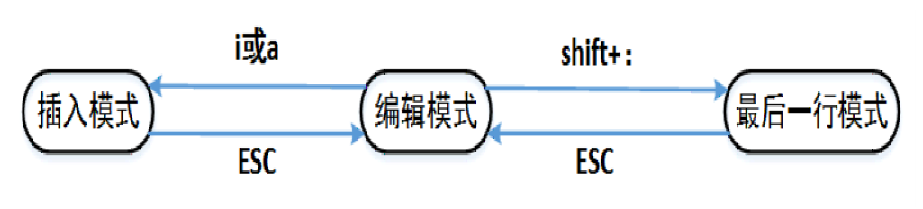

# Linux_Vim使用

本篇介绍 Vi/Vim 文本编辑器的基本情况、三种操作模式，以及各模式下常用的光标移动、插入、删除、查找与保存命令。

## 1. Vi/Vim 简介

### 1.1 是什么

Vi/Vim 是一款文本编辑器，类似于 Windows 下的记事本、notepad++。

### 1.2 用途

- 编写代码；
- 编写文档；
- 记录简短信息。

### 1.3 为什么要学习 Vi/Vim

- Vi/Vim 是 Linux 系统默认的编辑器；
- 多数时候 Linux 都不安装 GUI，作为服务器操作系统，经常需要通过修改配置文件来修改配置，因此需要掌握 vi/vim。

## 2. Vi/Vim 的三种操作模式

### 2.1 三种操作模式简介

| 模式 | 说明 |
| --- | --- |
| 编辑模式 | vi 将输入的字符作为**命令**对待，并对每个命令做出回应，但不显示这些字符 |
| 插入模式 | vi 将输入的字符作为正文内容，放进正在编辑的文件中 |
| 最后一行模式 | 所有以冒号 `:` 开始的命令都会使 vi 处于最后一行模式，光标移动到屏幕最底一行，输入的**命令**将在该行显示 |

### 2.2 三种操作模式转换

### 2.3 编辑模式下移动光标

| 命令 | 功能 |
| --- | --- |
| `[n]G` | 将光标定位到第 n 行开始处 |
| `G` | 将光标定位到文件结束处 |
| `gg` | 将光标定位到文件开始处 |
| `H` | 光标定位到屏幕顶部 |
| `M` | 光标定位到屏幕中间 |
| `L` | 光标定位到屏幕底部 |

### 2.4 编辑模式下进入插入模式

| 命令 | 功能 |
| --- | --- |
| `i` | 从光标当前位置开始插入 |
| `a` | 从光标当前位置的下一个字符开始插入 |
| `o` | 在光标位置的下行插入一个空行，再进行插入 |
| `O` | 在光标位置的上一行插入一个空行，再进行插入 |
| `I` | 从光标所在行的开头开始插入正文 |
| `A` | 从光标所在行的末尾开始插入正文 |

### 2.5 编辑模式下删除和修改文本

| 命令 | 功能 |
| --- | --- |
| `u` | 撤销前面多次修改 |
| `[n]x` | 删除光标后 n 个字符 |
| `[n]X` | 删除光标前 n 个字符 |
| `[n]dd` | 删除从当前行开始的 n 行 |
| `[n]yy` | 复制从当前行开始的 n 行 |
| `p` | 把剪切板上的内容插入到当前行 |
| `dw` | 删除单词 |
| `.` | 执行上一次操作 |
| `shift+zz` | 保存并退出当前文件 |

### 2.6 编辑模式下的查找

| 命令 | 功能 |
| --- | --- |
| `/字符串` | 从光标开始处向文件尾查找字符串 |
| `?字符串` | 从光标开始处向文件首查找字符串 |
| `n` | 同一方向重复上一次查找命令 |
| `N` | 反方向重复上一次查找命令 |

> [!TIP]
> 去除查找高亮：在最后一行模式输入 `nohl`。

### 2.7 最后一行模式常用命令

| 命令 | 功能 |
| --- | --- |
| `w` | 保存当前文件 |
| `q` | 退出 vi |
| `wq` | 保存当前文件并退出 |
| `x` | 保存当前文件并退出，同 `wq` |
| `q!` | 不保存文件并退出 |
| `set number` | 设置行号显示 |
