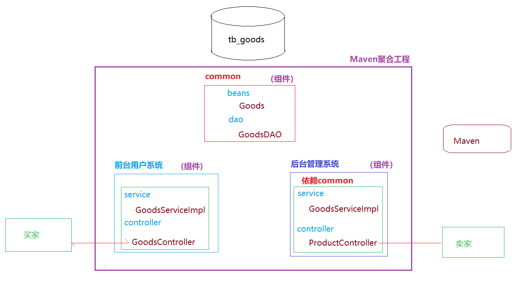
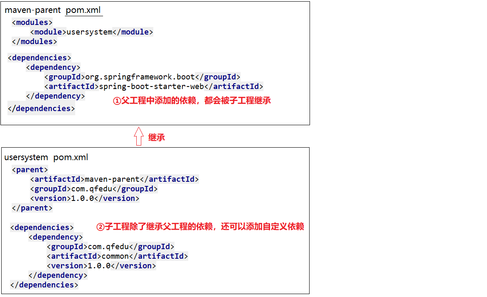

# Maven聚合工程

本篇整理 Maven 聚合工程的概念、创建父工程与 Module 的步骤，以及聚合工程中的依赖继承与依赖版本管理。

## 1. Maven 聚合工程概念

**Maven 聚合工程**：就是可以在一个 Maven 父工程中创建多个组件（模块-项目），这多个组件之间可以相互依赖，实现组件的复用。



## 2. 创建 Maven 聚合工程

### 2.1 创建 Maven 父工程

Maven 聚合工程的父工程 packaging 必须为 pom：

> [!WARNING]
> 初学者常忘记把 `<packaging>` 改为 `pom`，导致后续创建 Module 或构建时报错，创建完父工程后先确认这一步。

- 创建一个 Maven 工程；
- 修改父工程的 `pom.xml`，设置打包方式为 pom。

```xml
<?xml version="1.0" encoding="UTF-8"?>
<project xmlns="http://maven.apache.org/POM/4.0.0"
         xmlns:xsi="http://www.w3.org/2001/XMLSchema-instance"
         xsi:schemaLocation="http://maven.apache.org/POM/4.0.0 http://maven.apache.org/xsd/maven-4.0.0.xsd">
    <modelVersion>4.0.0</modelVersion>

    <groupId>com.qfedu</groupId>
    <artifactId>maven-parent</artifactId>
    <version>1.0.0</version>
    <packaging>pom</packaging>
</project>
```

> [!NOTE]
> 父工程用于管理子工程，不进行业务实现，因此 `src` 目录可以选择性删除。

### 2.2 创建 Module

- 选择父工程，右键 `New` → `Module`；
- 输入子工程名称（groupId 和 version 都从父工程继承）。

子工程的 pom 文件：

```xml
<?xml version="1.0" encoding="UTF-8"?>
<project xmlns="http://maven.apache.org/POM/4.0.0"
         xmlns:xsi="http://www.w3.org/2001/XMLSchema-instance"
         xsi:schemaLocation="http://maven.apache.org/POM/4.0.0 http://maven.apache.org/xsd/maven-4.0.0.xsd">
    <!--module的pom继承 父工程的pom-->
    <parent>
        <artifactId>maven-parent</artifactId>
        <groupId>com.qfedu</groupId>
        <version>1.0.0</version>
    </parent>

    <modelVersion>4.0.0</modelVersion>
    <artifactId>common</artifactId>

</project>
```

父工程的 pom 文件：

```xml
<?xml version="1.0" encoding="UTF-8"?>
<project xmlns="http://maven.apache.org/POM/4.0.0"
         xmlns:xsi="http://www.w3.org/2001/XMLSchema-instance"
         xsi:schemaLocation="http://maven.apache.org/POM/4.0.0 http://maven.apache.org/xsd/maven-4.0.0.xsd">
    <modelVersion>4.0.0</modelVersion>

    <groupId>com.qfedu</groupId>
    <artifactId>maven-parent</artifactId>
    <version>1.0.0</version>

    <!--  声明当前父工程的子module  -->
    <modules>
        <module>common</module>
    </modules>

    <packaging>pom</packaging>

</project>
```

## 3. Maven 聚合工程依赖继承

### 3.1 依赖继承

在父工程的 pom 文件中添加的依赖，会被子工程继承。



### 3.2 依赖版本管理

在父工程的 `pom.xml` 的 `dependencyManagement` 中添加依赖，表示定义子工程中此依赖的默认版本（此定义并不会让子工程中添加当前依赖）：

```xml
<!--  依赖管理：在dependencyManagement中添加依赖，表示定义子工程中此依赖的默认版本  -->
<dependencyManagement>
    <dependencies>
        <dependency>
            <groupId>com.google.code.gson</groupId>
            <artifactId>gson</artifactId>
            <version>2.6.1</version>
        </dependency>
    </dependencies>
</dependencyManagement>
```

## 4. 小结

- 父工程的 `packaging` 必须为 `pom`，通过 `<modules>` 声明并聚合子模块；
- 子模块通过 `<parent>` 继承父工程的 groupId、version 以及父工程中声明的依赖；
- `dependencyManagement` 只统一管理版本号，并不实际引入依赖，子模块引用对应依赖时可以省略 version。
