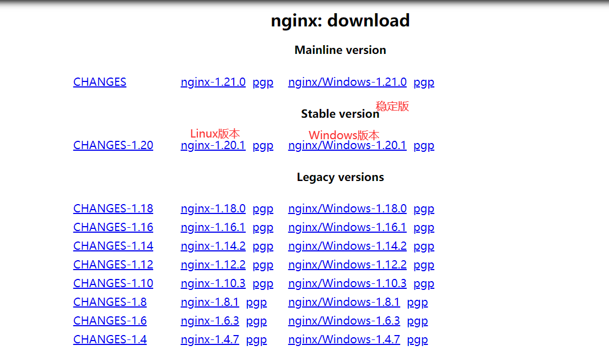
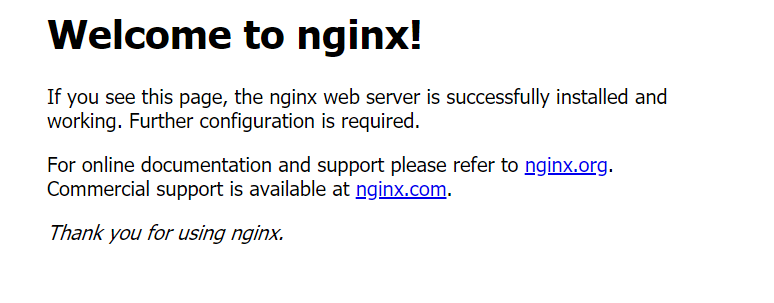
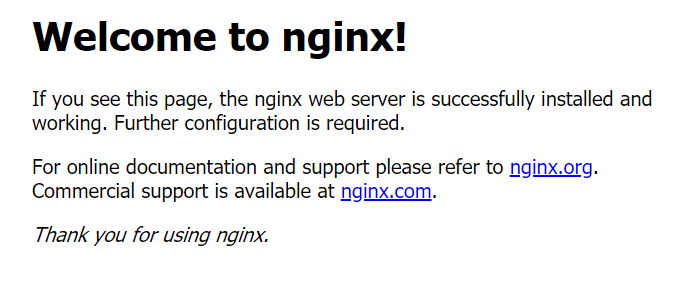
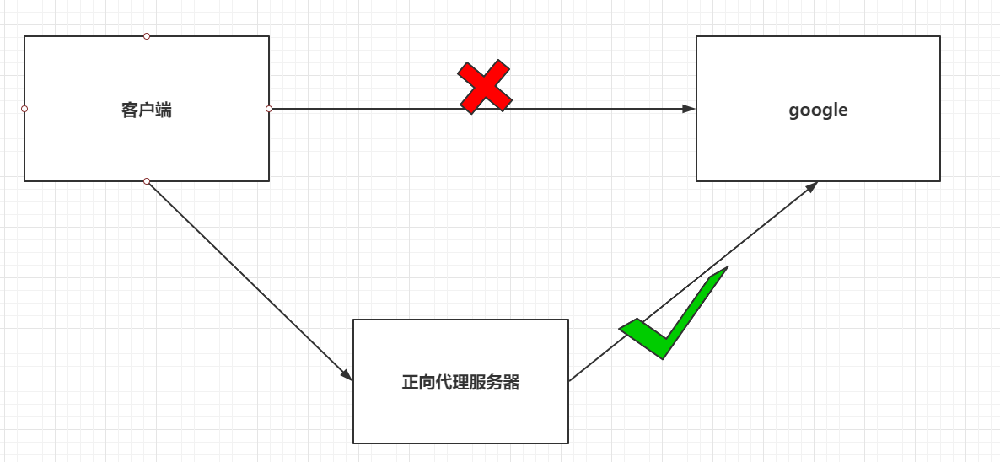
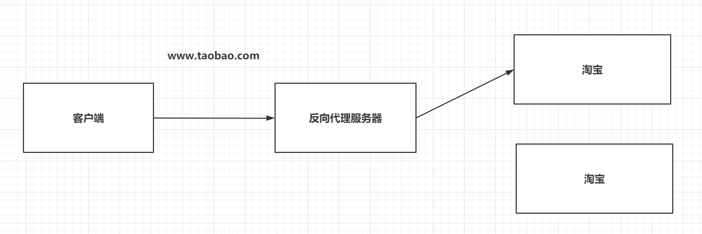
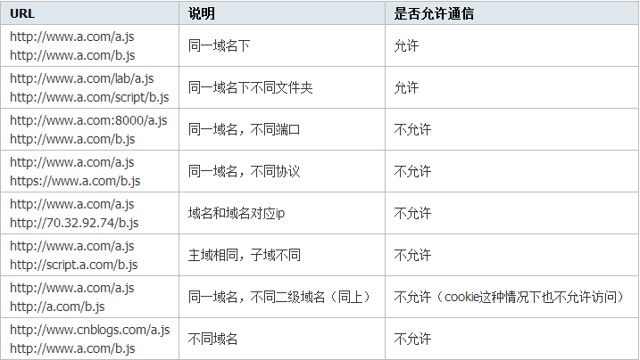

## 一、Nginx概述

> **Nginx** (engine x) 是一个高性能的HTTP和反向代理web服务器，同时也提供了IMAP/POP3/SMTP服务。Nginx是由伊戈尔·赛索耶夫为俄罗斯访问量第二的Rambler.ru站点（俄文：Рамблер）开发的，第一个公开版本0.1.0发布于2004年10月4日。
>
> 其将源代码以类BSD许可证的形式发布，因它的稳定性、丰富的功能集、简单的配置文件和低系统资源的消耗而闻名。2011年6月1日，nginx 1.0.4发布。
>
> Nginx是一款轻量级的Web服务器/反向代理服务器及电子邮件（IMAP/POP3）代理服务器，在BSD-like 协议下发行。其特点是占有内存少，并发能力强，事实上nginx的并发能力在同类型的网页服务器中表现较好，中国大陆使用nginx网站用户有：百度、京东、新浪、网易、腾讯、淘宝等。
>
> 主要功能：
>
> * 反向代理；
> * 负载均衡；
> * 动静分离。

## 二、Nginx安装

### 2.1、下载

> `http://nginx.org/en/download.html`



### 2.2、Windows下安装

> 解压nginx的压缩包。
>
> 打开cmd，切换到nginx的安装目录。

```sh
# 启动nginx
$ start nginx
```

>在浏览器中访问：`http://localhost:80`，出现如下内容证明nginx安装成功



### 2.3、Linux下安装

#### 2.3.1、准备工作

> 安装gcc，gcc是c语言编译器，后面会用到。

```sh
$ yum -y install gcc
```

> pcre、pcre-devel安装，pcre是一个perl库，包括perl兼容的正则表达式库，nginx的http模块使用pcre来解析正则表达式，所以需要安装pcre库。

```sh
$ yum install -y pcre pcre-devel
```

> zlib安装，zlib库提供了很多种压缩和解压缩方式nginx使用zlib对http包的内容进行gzip，所以需要安装。

```sh
$ yum install -y zlib zlib-devel
```

> openssl是web安全通信的基石，没有openssl，可以说我们的信息都是在裸奔。

```sh
$ yum install -y openssl openssl-devel
```

#### 2.3.2、安装Nginx

>上传从官网下载的nginx安装包到Linux，解压。

```sh
$ tar -zxvf nginx-1.20.1.tar.gz
```

> 进入解压后的目录，执行下面三个命令

```sh
$ ./configure
$ make
$ make install
```

#### 2.3.3、Linux下运行及验证

>进入nginx的安装目录的`/sbin`，经过上面的操作，nginx被安装在了`/usr/local/nginx`目录下。

```sh
$ cd /usr/local/nginx/sbin
```

> 运行nginx

```sh
$ ./nginx
```

> 在浏览器中访问：`http://linux的ip地址:80`，出现如下内容证明nginx安装成功



### 2.4、nginx常用命令

```sh
# 启动Nginx
$ ./nginx
# 重新载入配置文件
$ ./nginx -s reload
# 重启 Nginx
$ ./nginx -s reopen
# 停止 Nginx
$ ./nginx -s stop   
# 停止 Nginx
$ ./nginx -s quit 
# 测试配置文件是否正确
$ ./nginx -t
```

## 三、反向代理

### 3.1、正向代理和反向代理

>正向代理：
>
>- 正向代理服务是由客户端设立的。
>- 客户端了解代理服务器和目标服务器都是谁。
>- 帮助咱们实现突破访问权限，提高访问的速度，对目标服务器隐藏客户端的ip地址。



> 反向代理：
>
> - 反向代理服务器是配置在服务端的。
> - 客户端是不知道访问的到底是哪一台服务器。
> - 达到负载均衡，并且可以隐藏服务器真正的ip地址。



### 3.2、实现

>  按照如下方式修改nginx配置文件（conf目录下的nginx.conf文件）

```properties
server {
    listen       80;
    server_name  localhost;
	
	# 基于反向代理访问到Tomcat服务器
    location / {
    	proxy_pass http://localhost:9999/;
    }
}
```

>此时我们准备一个应用在tomcat中运行（可以是之前ssm的应用），访问`http://localhost:80/应用名`，此时可以访问到部署到tomcat中的应用。

## 四、负载均衡

>Nginx为我们默认提供了三种负载均衡的策略：
>
>- 轮询：将客户端发起的请求，平均的分配给每一台服务器。
>- 权重：会将客户端的请求，根据服务器的权重值不同，分配不同的数量。
>- ip_hash：基于发起请求的客户端的ip地址不同，他始终会将请求发送到指定的服务器上。
>
>此时我们需要在两个不同端口（9999、9900）上分别开启一个应用。

### 4.1、基于轮询的负载均衡

> 轮询方式是Nginx负载默认的方式，顾名思义，所有请求都按照时间顺序分配到不同的服务上。
>
> 基于轮询的负载均衡需要进行如下的配置：

```properties
upstream 名字 {
    server ip:port;
    server ip:port;
}
server {
    listen 80;
    server_name localhost;

    location / {
    	proxy_pass http://upstream的名字/;
    }
}

# -----------------------------------------------
# 案例
upstream mytest {
    server localhost:9999;
    server localhost:9900;
}
server {
    listen 80;
    server_name localhost;

    location / {
    	proxy_pass http://mytest/;
    }
}
```

### 4.2、基于权重的负载均衡

> 指定每个服务的权重比例，weight和访问比率成正比，通常用于后端服务机器性能不统一，将性能好的分配权重高来发挥服务器最大性能。

```properties
upstream 名字 {
	server ip:port weight=权重比例;
	server ip:port weight=权重比例;
}
server {
	listen 80;
	server_name localhost;
  
	location / {
		proxy_pass http://upstream的名字/;
	}
}

# -----------------------------------------------
# 案例
upstream mytest {
    server localhost:9999 weight=1;
    server localhost:9900 weight=3;
}
server {
    listen 80;
    server_name localhost;

    location / {
    	proxy_pass http://mytest/;
    }
}
```

### 4.3、基于ip_hash的负载均衡

> 每个请求都根据访问ip的hash结果分配，经过这样的处理，每个访客固定访问一个后端服务。

```properties
upstream 名字 {
    ip_hash;
    server ip:port;
    server ip:port;
}
server {
    listen 80;
    server_name localhost;

    location / {
    	proxy_pass http://upstream的名字/;
    }
}

# -----------------------------------------------
# 案例
upstream mytest {
	ip_hash;
    server localhost:9999;
    server localhost:9900;
}
server {
    listen 80;
    server_name localhost;

    location / {
    	proxy_pass http://mytest/;
    }
}
```

## 五、动静分离

> 在弄清动静分离之前，我们要先明白什么是动，什么是静。
>
> 在Web开发中，通常来说，**动态资源其实就是指那些后台资源(servlet、jsp...)，而静态资源就是指HTML，JavaScript，CSS，img等文件**。
>
> 一般来说，都需要将动态资源和静态资源分开，将静态资源部署在Nginx上，当一个请求来的时候，如果是静态资源的请求，就直接到nginx配置的静态资源目录下面获取资源，如果是动态资源的请求，nginx利用反向代理的原理，把请求转发给后台应用去处理，从而实现**动静分离**。
>
> 在使用前后端分离之后，可以很大程度的提升静态资源的访问速度，同时在开发过程中也可以让前后端开发并行可以有效的提高开发效率，也可以有些的减少联调时间 。

### 5.1、准备工作

> 服务端：一个基于springboot的web应用。
>
> 前端：使用vue，通过axios为服务端发送请求。

### 5.2、前端代码

> 前端代码如下：

```html
<!DOCTYPE html>
<html>
	<head>
		<meta charset="utf-8">
		<title>axios</title>
		<script type="text/javascript" src="js/vue.js"></script>
		<script type="text/javascript" src="js/axios.min.js"></script>
	</head>
	<body>
		<div id="app">
			<button type="button" @click="testGet">TestGet</button>
			<button type="button" @click="testPost">TestPost</button>
		</div>
	</body>
	<script type="text/javascript">
		var vm = new Vue({
			el: "#app",
			data: {
				
			},
			methods: {
				testGet: function() {
                    //axios请求的服务器地址是经过nginx反向代理的
					axios.get("http://localhost:80/ssm/user/queryById", {
						params: {
							id:1
						}
					}).then(function(res) {
						console.log(res);
					})
				},
				testPost: function() {
                    //axios请求的服务器地址是经过nginx反向代理的
					axios.post("http://localhost:80/ssm/user/queryAll", {
						
					}).then(function(res){
					    console.log(res);
					});
				},
			}
		}); 
	</script>
</html>

```

将前端代码放置在电脑的任意目录下。

### 5.3、nginx配置

> nginx.conf配置

```properties
upstream mytest {
    server localhost:9999;
    server localhost:9900;
}

server {
    listen       80;
    server_name  localhost;

    #拦截静态资源
    location ~ .*\.(html|htm|gif|jpg|jpeg|bmp|png|ico|js|css|map|eot|svg|ttf|woff|woff2)$ {
		root /home/pages;
		index index.html index.htm;
	}

	# 反向代理服务器资源
    location / {
    	proxy_pass http://mytest/;
    }
}
```

## 六、关于跨域

### 6.1、概念

> **跨域：**指的是浏览器不能执行其他网站的脚本。它是由浏览器的同源策略造成的，是浏览器对javascript施加的安全限制。
>
> 例如：a页面想获取b页面资源，如果a、b页面的协议、域名、端口、子域名不同，所进行的访问行动都是跨域的，而浏览器为了安全问题一般都限制了跨域访问，也就是不允许跨域请求资源。注意：跨域限制访问，其实是**浏览器的限制**。理解这一点很重要。
>
> **同源策略：是指协议，域名，端口都要相同，其中有一个不同都会产生跨域。**



> 假设有两个网站，A网站部署在：http://localhost:81 即本地ip端口81上；B网站部署在：http://localhost:82 即本地ip端口82上。现在A网站的页面想去访问B网站的信息，就会产生跨域问题。在控制台会输出如下信息：

 ```
 Access to XMLHttpRequest at 'xxxxxxxxxxxxxxxxxx' from origin 'xxxxxxxxxxx' has been blocked by CORS policy: No 'Access-Control-Allow-Origin' header is present on the requested
 ```

### 6.2、处理

> 在Controller上添加`@CrossOrigin`。

