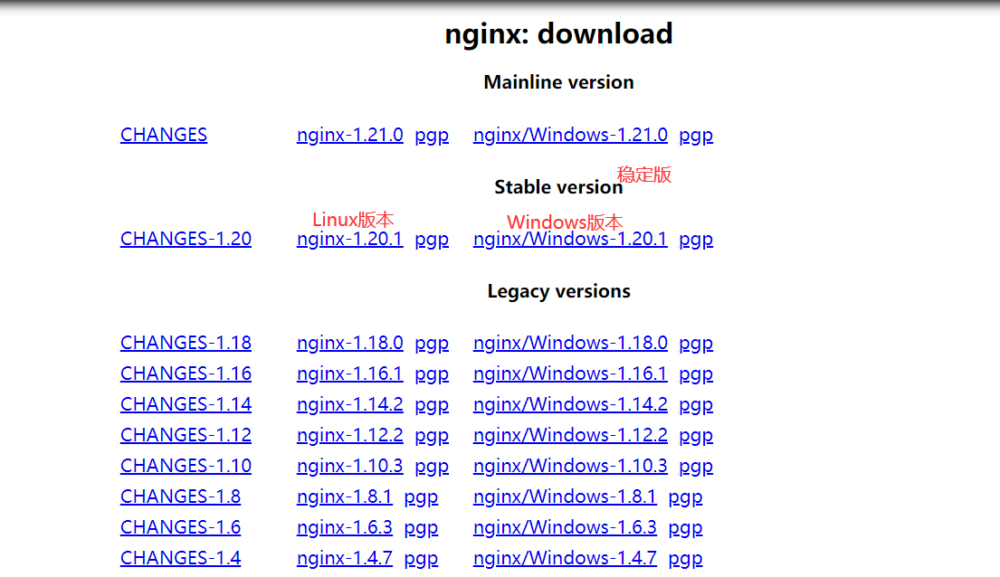
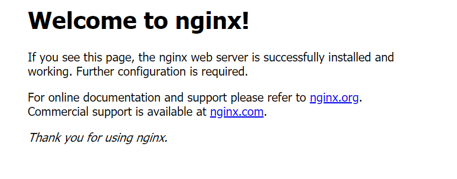
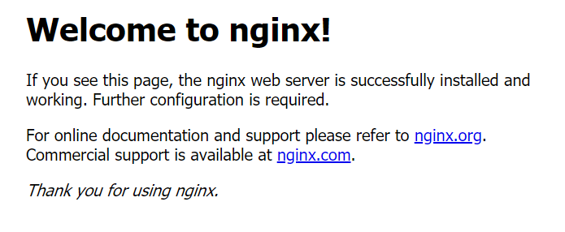
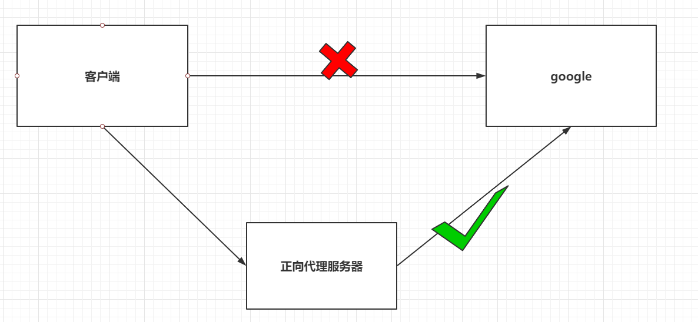
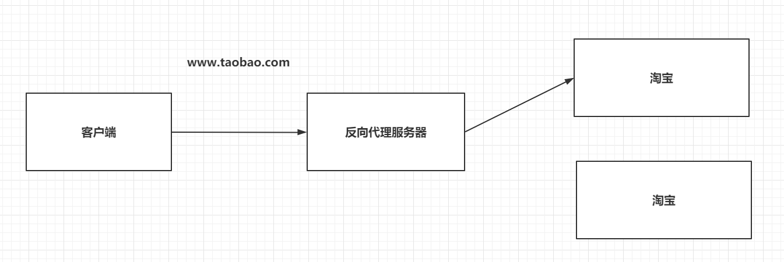
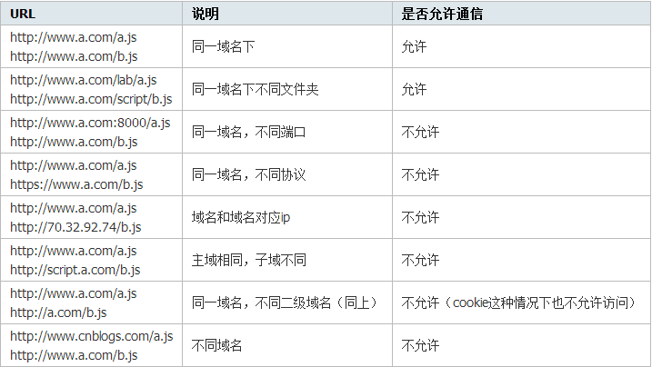

# Nginx

本篇整理 Nginx 的概述、Windows 与 Linux 下的安装及常用命令，以及反向代理、负载均衡（轮询 / 权重 / ip_hash）、动静分离三大核心应用，最后简要说明跨域问题及其处理方式。

## 1. Nginx 概述

**Nginx**（engine x）是一个高性能的 HTTP 和反向代理 web 服务器，同时也提供了 IMAP/POP3/SMTP 服务。Nginx 是由伊戈尔·赛索耶夫为俄罗斯访问量第二的 Rambler.ru 站点（俄文：Рамблер）开发的，第一个公开版本 0.1.0 发布于 2004 年 10 月 4 日。

Nginx 将源代码以类 BSD 许可证的形式发布，因其稳定性、丰富的功能集、简单的配置文件和低系统资源的消耗而闻名。2011 年 6 月 1 日，nginx 1.0.4 发布。

Nginx 是一款轻量级的 Web 服务器/反向代理服务器及电子邮件（IMAP/POP3）代理服务器，在 BSD-like 协议下发行。其特点是占有内存少、并发能力强，事实上 nginx 的并发能力在同类型的网页服务器中表现较好。中国大陆使用 nginx 的网站有：百度、京东、新浪、网易、腾讯、淘宝等。

主要功能：

- 反向代理；
- 负载均衡；
- 动静分离。

## 2. Nginx 安装

### 2.1 下载

下载地址：<http://nginx.org/en/download.html>



### 2.2 Windows 下安装

解压 nginx 的压缩包，打开 cmd，切换到 nginx 的安装目录：

```sh
# 启动nginx
$ start nginx
```

在浏览器中访问 `http://localhost:80`，出现如下内容证明 nginx 安装成功：



### 2.3 Linux 下安装

#### 2.3.1 准备工作

安装 gcc，gcc 是 c 语言编译器，后面会用到：

```sh
$ yum -y install gcc
```

安装 pcre、pcre-devel：pcre 是一个 perl 库，包括 perl 兼容的正则表达式库，nginx 的 http 模块使用 pcre 来解析正则表达式，所以需要安装 pcre 库。

```sh
$ yum install -y pcre pcre-devel
```

安装 zlib：zlib 库提供了很多种压缩和解压缩方式，nginx 使用 zlib 对 http 包的内容进行 gzip，所以需要安装。

```sh
$ yum install -y zlib zlib-devel
```

安装 openssl：openssl 是 web 安全通信的基石，没有 openssl，可以说我们的信息都是在裸奔。

```sh
$ yum install -y openssl openssl-devel
```

#### 2.3.2 安装 Nginx

上传从官网下载的 nginx 安装包到 Linux，解压：

```sh
$ tar -zxvf nginx-1.20.1.tar.gz
```

进入解压后的目录，执行下面三个命令：

```sh
$ ./configure
$ make
$ make install
```

#### 2.3.3 Linux 下运行及验证

经过上面的操作，nginx 被安装在了 `/usr/local/nginx` 目录下。进入 nginx 的安装目录的 `/sbin`：

```sh
$ cd /usr/local/nginx/sbin
```

运行 nginx：

```sh
$ ./nginx
```

在浏览器中访问 `http://linux的ip地址:80`，出现如下内容证明 nginx 安装成功：



### 2.4 nginx 常用命令

```sh
# 启动Nginx
$ ./nginx
# 重新载入配置文件
$ ./nginx -s reload
# 重启 Nginx
$ ./nginx -s reopen
# 停止 Nginx
$ ./nginx -s stop   
# 停止 Nginx
$ ./nginx -s quit 
# 测试配置文件是否正确
$ ./nginx -t
```

> [!NOTE]
> `stop` 是快速停止（不等待请求处理完成），`quit` 是优雅停止（处理完当前请求后再退出），二者都能停止 Nginx，按场景选用。

## 3. 反向代理

### 3.1 正向代理和反向代理

**正向代理**：

- 正向代理服务是由客户端设立的；
- 客户端了解代理服务器和目标服务器都是谁；
- 帮助我们实现突破访问权限、提高访问的速度，对目标服务器隐藏客户端的 ip 地址。



**反向代理**：

- 反向代理服务器是配置在服务端的；
- 客户端不知道访问的到底是哪一台服务器；
- 达到负载均衡，并且可以隐藏服务器真正的 ip 地址。



### 3.2 实现

按照如下方式修改 nginx 配置文件（conf 目录下的 nginx.conf 文件）：

```nginx
server {
    listen       80;
    server_name  localhost;
	
	# 基于反向代理访问到Tomcat服务器
    location / {
    	proxy_pass http://localhost:9999/;
    }
}
```

此时准备一个应用在 tomcat 中运行（可以是之前 ssm 的应用），访问 `http://localhost:80/应用名`，即可访问到部署在 tomcat 中的应用。

## 4. 负载均衡

Nginx 为我们默认提供了三种负载均衡的策略：

| 策略 | 说明 |
| --- | --- |
| 轮询 | 将客户端发起的请求，平均地分配给每一台服务器 |
| 权重 | 会将客户端的请求，根据服务器的权重值不同，分配不同的数量 |
| ip_hash | 基于发起请求的客户端的 ip 地址不同，始终将请求发送到指定的服务器上 |

示例环境：在两个不同端口（9999、9900）上分别开启一个应用。

### 4.1 基于轮询的负载均衡

轮询方式是 Nginx 负载默认的方式，顾名思义，所有请求都按照时间顺序分配到不同的服务上。配置如下：

```nginx
upstream 名字 {
    server ip:port;
    server ip:port;
}
server {
    listen 80;
    server_name localhost;

    location / {
    	proxy_pass http://upstream的名字/;
    }
}

# -----------------------------------------------
# 案例
upstream mytest {
    server localhost:9999;
    server localhost:9900;
}
server {
    listen 80;
    server_name localhost;

    location / {
    	proxy_pass http://mytest/;
    }
}
```

### 4.2 基于权重的负载均衡

指定每个服务的权重比例，weight 和访问比率成正比，通常用于后端服务机器性能不统一的场景：将性能好的分配更高权重，以发挥服务器最大性能。

```nginx
upstream 名字 {
	server ip:port weight=权重比例;
	server ip:port weight=权重比例;
}
server {
	listen 80;
	server_name localhost;
  
	location / {
		proxy_pass http://upstream的名字/;
	}
}

# -----------------------------------------------
# 案例
upstream mytest {
    server localhost:9999 weight=1;
    server localhost:9900 weight=3;
}
server {
    listen 80;
    server_name localhost;

    location / {
    	proxy_pass http://mytest/;
    }
}
```

### 4.3 基于 ip_hash 的负载均衡

每个请求都根据访问 ip 的 hash 结果分配，经过这样的处理，每个访客固定访问一个后端服务。

```nginx
upstream 名字 {
    ip_hash;
    server ip:port;
    server ip:port;
}
server {
    listen 80;
    server_name localhost;

    location / {
    	proxy_pass http://upstream的名字/;
    }
}

# -----------------------------------------------
# 案例
upstream mytest {
	ip_hash;
    server localhost:9999;
    server localhost:9900;
}
server {
    listen 80;
    server_name localhost;

    location / {
    	proxy_pass http://mytest/;
    }
}
```

## 5. 动静分离

在弄清动静分离之前，要先明白什么是动、什么是静。

在 Web 开发中，通常来说，**动态资源指后台资源（servlet、jsp 等），而静态资源指 HTML、JavaScript、CSS、img 等文件**。

一般来说，都需要将动态资源和静态资源分开：将静态资源部署在 Nginx 上，当一个请求来的时候，如果是静态资源的请求，就直接到 nginx 配置的静态资源目录下面获取资源；如果是动态资源的请求，nginx 利用反向代理的原理，把请求转发给后台应用去处理，从而实现**动静分离**。

使用前后端分离之后，可以很大程度地提升静态资源的访问速度；同时在开发过程中可以让前后端开发并行，有效提高开发效率，也可以有效地减少联调时间。

### 5.1 准备工作

- 服务端：一个基于 springboot 的 web 应用；
- 前端：使用 vue，通过 axios 向服务端发送请求。

### 5.2 前端代码

前端代码如下：

```html
<!DOCTYPE html>
<html>
	<head>
		<meta charset="utf-8">
		<title>axios</title>
		<script type="text/javascript" src="js/vue.js"></script>
		<script type="text/javascript" src="js/axios.min.js"></script>
	</head>
	<body>
		<div id="app">
			<button type="button" @click="testGet">TestGet</button>
			<button type="button" @click="testPost">TestPost</button>
		</div>
	</body>
	<script type="text/javascript">
		var vm = new Vue({
			el: "#app",
			data: {
				
			},
			methods: {
				testGet: function() {
                    //axios请求的服务器地址是经过nginx反向代理的
					axios.get("http://localhost:80/ssm/user/queryById", {
						params: {
							id:1
						}
					}).then(function(res) {
						console.log(res);
					})
				},
				testPost: function() {
                    //axios请求的服务器地址是经过nginx反向代理的
					axios.post("http://localhost:80/ssm/user/queryAll", {
						
					}).then(function(res){
					    console.log(res);
					});
				},
			}
		}); 
	</script>
</html>

```

将前端代码放置在电脑的任意目录下。

### 5.3 nginx 配置

nginx.conf 配置如下：

```nginx
upstream mytest {
    server localhost:9999;
    server localhost:9900;
}

server {
    listen       80;
    server_name  localhost;

    #拦截静态资源
    location ~ .*\.(html|htm|gif|jpg|jpeg|bmp|png|ico|js|css|map|eot|svg|ttf|woff|woff2)$ {
		root /home/pages;
		index index.html index.htm;
	}

	# 反向代理服务器资源
    location / {
    	proxy_pass http://mytest/;
    }
}
```

## 6. 关于跨域

### 6.1 概念

**跨域**指的是浏览器不能执行其他网站的脚本。它是由浏览器的同源策略造成的，是浏览器对 javascript 施加的安全限制。

例如：a 页面想获取 b 页面资源，如果 a、b 页面的协议、域名、端口、子域名不同，所进行的访问行动都是跨域的。浏览器为了安全问题一般都限制了跨域访问，也就是不允许跨域请求资源。

> [!IMPORTANT]
> 跨域限制访问，其实是**浏览器的限制**。理解这一点很重要。

**同源策略**是指协议、域名、端口都要相同，其中有一个不同都会产生跨域。



假设有两个网站：A 网站部署在 `http://localhost:81`（本地 81 端口）上，B 网站部署在 `http://localhost:82`（本地 82 端口）上。现在 A 网站的页面想去访问 B 网站的信息，就会产生跨域问题，控制台会输出如下信息：

```text
Access to XMLHttpRequest at 'xxxxxxxxxxxxxxxxxx' from origin 'xxxxxxxxxxx' has been blocked by CORS policy: No 'Access-Control-Allow-Origin' header is present on the requested
```

### 6.2 处理

最简单的处理方式是在 Controller 上添加 `@CrossOrigin` 注解，允许该接口接受跨域请求；此外也可以在 nginx 层统一为响应添加 CORS 相关响应头，本文不展开。
