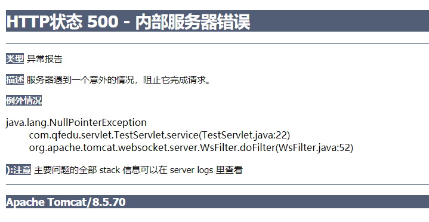
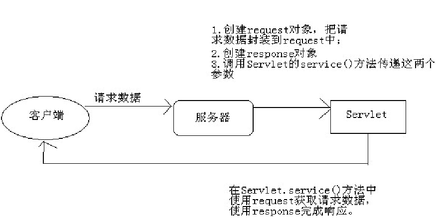
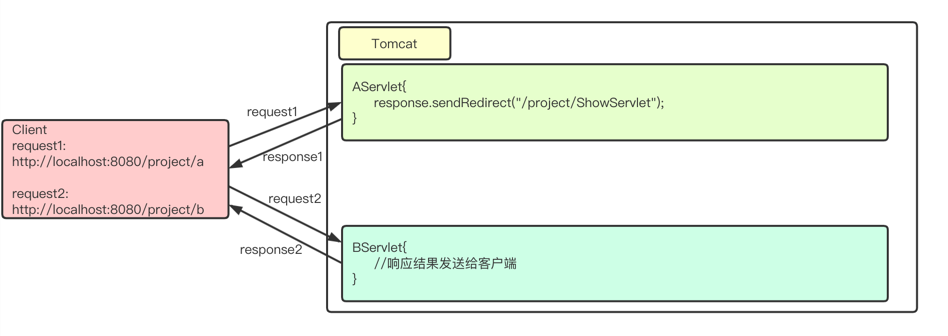
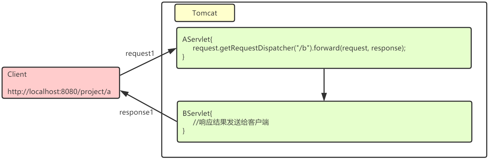

# Servlet

本篇整理 Servlet 的核心内容：Servlet 简介、入门案例、三种实现方式与两种配置方式、request 和 response 对象、请求转发与重定向、登录案例，以及ServletContext 的作用。

## 1. 简介

**Servlet**（Server Applet，服务器小程序）是由服务器端调用和执行的、按照 Servlet 自身规范编写的 Java 类。它是 JavaWeb 的三大组件（Servlet、Filter、Listener）之一，属于动态资源。

Servlet 的作用可以概括为三点：

- 接收请求；
- 处理数据；
- 完成响应。

> [!TIP]
> 后续学习 Servlet 的内容也集中在这三点上，学习时可以始终带着"请求从哪来、数据怎么处理、响应怎么回去"这条主线。

## 2. Servlet 入门案例

### 2.1 编写 Servlet

编写一个 Servlet 的基本步骤：

1. 实现 `javax.servlet.Servlet` 接口；
2. 重写其中的 5 个主要方法；
3. 在核心的 `service()` 方法中编写输出语句，打印访问结果。

```java
package com.qfedu.servlet;

import javax.servlet.*;
import java.io.IOException;

public class TestServlet implements Servlet {
    @Override
    public void init(ServletConfig config) throws ServletException {

    }

    @Override
    public void service(ServletRequest request, ServletResponse response) throws ServletException, IOException {
        System.out.println("My First Servlet!");
    }

    @Override
    public void destroy() {

    }

    @Override
    public ServletConfig getServletConfig() {
        return null;
    }

    @Override
    public String getServletInfo() {
        return null;
    }
}
```

### 2.2 配置 Servlet

在 `web.xml` 中配置 Servlet：

```xml
<?xml version="1.0" encoding="UTF-8"?>
<web-app xmlns="http://xmlns.jcp.org/xml/ns/javaee"
         xmlns:xsi="http://www.w3.org/2001/XMLSchema-instance"
         xsi:schemaLocation="http://xmlns.jcp.org/xml/ns/javaee http://xmlns.jcp.org/xml/ns/javaee/web-app_3_1.xsd"
         version="3.1">
    <!-- 1、添加 servlet 节点 -->
    <servlet>
        <!-- Servlet 的名字，和 servlet-mapping 中的名字必须一致 -->
        <servlet-name>aServlet</servlet-name>
        <!-- Servlet 的全类名 -->
        <servlet-class>com.qfedu.servlet.AServlet</servlet-class>
    </servlet>
    <!-- 2、添加 servlet-mapping 节点 -->
    <servlet-mapping>
        <!-- Servlet 的名字，和 servlet 中的名字必须一致 -->
        <servlet-name>aServlet</servlet-name>
        <!-- Servlet 的访问路径，浏览器通过该路径即可访问到这个 Servlet -->
        <url-pattern>/aServlet</url-pattern>
    </servlet-mapping>
</web-app>
```

`url-pattern` 配置的内容，就是浏览器地址栏输入的 URL 中项目名称之后的那段资源路径。

### 2.3 访问 Servlet

在 Tomcat 中部署该项目，访问 `http://localhost:8080/项目名/aServlet`，控制台及浏览器有输出即证明 Servlet 部署及访问成功。

### 2.4 常见错误

500 错误表示**服务器内部出现了错误**。把 TestServlet 的代码修改如下，在 `service()` 方法中人为制造一个空指针异常：

```java
package com.qfedu.servlet;

import javax.servlet.*;
import java.io.IOException;

public class AServlet implements Servlet {

    @Override
    public void init(ServletConfig servletConfig) throws ServletException {

    }

    @Override
    public ServletConfig getServletConfig() {
        return null;
    }

    @Override
    public void service(ServletRequest servletRequest, ServletResponse servletResponse) throws ServletException, IOException {
        System.out.println("My First Servlet!");
        String str = null;
        System.out.println(str.length());
    }

    @Override
    public String getServletInfo() {
        return null;
    }

    @Override
    public void destroy() {

    }
}
```

运行 JavaWeb 项目，访问 AServlet，页面显示如下：



> [!NOTE]
> 500 错误说明请求已经到达服务器并进入了 Servlet，问题出在服务器端代码本身，应根据异常信息定位代码问题；这与 404（资源找不到）有本质区别。

## 3. Servlet 详解

**Servlet 是单例的**：一个类型的 Servlet 在容器中只有一个实例对象，因此可能出现一个 Servlet 实例同时处理多个请求的情况。也就是说，**Servlet 不是线程安全的**：不应该在 Servlet 中创建可写的成员变量，否则可能存在一个线程对该成员变量进行写操作、另一个线程进行读操作的情况。

编写 Servlet 时应注意：

- 不要在 Servlet 中创建成员变量，需要变量时创建局部变量即可；
- 可以创建无状态成员；
- 可以创建有状态的成员，但状态必须为只读的。

### 3.1 实现 Servlet 的三种方式

#### 3.1.1 实现 Servlet 接口

`javax.servlet.Servlet` 接口的源码如下：

```java
public interface Servlet {
    void init(ServletConfig var1) throws ServletException;
    ServletConfig getServletConfig();
    void service(ServletRequest var1, ServletResponse var2) throws ServletException, IOException;
    String getServletInfo();
    void destroy();
}
```

需要特别注意：Servlet 中的大多数方法不由我们调用，而是由 Tomcat 调用；Servlet 的对象也不由我们创建，而是由 Tomcat 创建。

其中三个方法构成了 Servlet 的**生命周期方法**：

| 生命周期方法 | 调用时机 | 调用次数 |
| --- | --- | --- |
| `init()` | Servlet 第一次被访问时，服务器创建 Servlet 对象并马上调用 `init(ServletConfig)` 方法 | 整个生命周期只调用一次 |
| `service()` | 服务器每次接收到请求时，都会调用 `service()` 方法处理请求 | 每次处理请求都会被调用 |
| `destroy()` | 服务器关闭、销毁 Servlet 之前调用 | 整个生命周期只调用一次 |

编写 BServlet 演示生命周期方法：

```java
package com.qfedu.servlet;

import javax.servlet.*;
import java.io.IOException;

public class BServlet implements Servlet {

    @Override
    public void init(ServletConfig servletConfig) throws ServletException {
        System.out.println("init...");
    }

    @Override
    public ServletConfig getServletConfig() {
        return null;
    }

    @Override
    public void service(ServletRequest servletRequest, ServletResponse servletResponse) throws ServletException, IOException {
        System.out.println("service...");
    }

    @Override
    public String getServletInfo() {
        return null;
    }

    @Override
    public void destroy() {
        System.out.println("destroy...");
    }
}
```

在 `web.xml` 中配置 Servlet：

```xml
<servlet>
    <servlet-name>bServlet</servlet-name>
    <servlet-class>com.qfedu.servlet.BServlet</servlet-class>
</servlet>
<servlet-mapping>
    <servlet-name>bServlet</servlet-name>
    <url-pattern>/bServlet</url-pattern>
</servlet-mapping>
```

依次执行"启动 Tomcat -> 访问 BServlet -> 关闭 Tomcat"，观察控制台的打印即可验证：启动后第一次访问打印 `init...` 和 `service...`，之后每次访问只打印 `service...`，关闭 Tomcat 时打印 `destroy...`。

关于 **ServletConfig**：

- 一个 ServletConfig 对象对应 `web.xml` 中一段 Servlet 的配置信息；
- ServletConfig 是一个接口，其实现类的对象由 Tomcat 提供；
- 常用方法：

| 方法 | 说明 |
| --- | --- |
| `getInitParameter(String name)` | 获取 Servlet 的初始化参数 |
| `getInitParameterNames()` | 获取所有初始化参数名的枚举 |
| `getServletContext()` | 获取 ServletContext 对象 |
| `getServletName()` | 获取当前 Servlet 的名字 |

修改 BServlet 代码，在 `init()` 中读取初始化参数：

```java
package com.qfedu.servlet;

import javax.servlet.*;
import java.io.IOException;

public class BServlet implements Servlet {

    @Override
    public void init(ServletConfig servletConfig) throws ServletException {
        System.out.println("init...");
        System.out.println(servletConfig.getInitParameter("name"));
    }

    @Override
    public ServletConfig getServletConfig() {
        return null;
    }

    @Override
    public void service(ServletRequest servletRequest, ServletResponse servletResponse) throws ServletException, IOException {
        System.out.println("service...");
    }

    @Override
    public String getServletInfo() {
        return null;
    }

    @Override
    public void destroy() {
        System.out.println("destroy...");
    }
}
```

修改 `web.xml` 中关于 BServlet 的配置：

```xml
<servlet>
    <servlet-name>bServlet</servlet-name>
    <servlet-class>com.qfedu.servlet.BServlet</servlet-class>
    <!-- BServlet 的初始化参数 -->
    <init-param>
        <param-name>name</param-name>
        <param-value>zhangsan</param-value>
    </init-param>
</servlet>
<servlet-mapping>
    <servlet-name>bServlet</servlet-name>
    <url-pattern>/bServlet</url-pattern>
</servlet-mapping>
```

#### 3.1.2 继承 GenericServlet 类

GenericServlet 让编写 Servlet 变得更容易：它提供了生命周期方法 `init()` 和 `destroy()` 的简单实现，要编写一般的 Servlet，只需重写抽象的 `service()` 方法即可：

```java
package com.qfedu.servlet;

import javax.servlet.GenericServlet;
import javax.servlet.ServletException;
import javax.servlet.ServletRequest;
import javax.servlet.ServletResponse;
import java.io.IOException;

public class CServlet extends GenericServlet {

    @Override
    public void service(ServletRequest servletRequest, ServletResponse servletResponse) throws ServletException, IOException {
        System.out.println("CServlet....");
    }
}
```

在 `web.xml` 中配置 CServlet：

```xml
<servlet>
    <servlet-name>cServlet</servlet-name>
    <servlet-class>com.qfedu.servlet.CServlet</servlet-class>
</servlet>
<servlet-mapping>
    <servlet-name>cServlet</servlet-name>
    <url-pattern>/cServlet</url-pattern>
</servlet-mapping>
```

#### 3.1.3 继承 HttpServlet 类

HttpServlet 类是 GenericServlet 的子类，提供了对 HTTP 请求的特殊支持，所以通常我们都通过继承 HttpServlet 来完成自定义 Servlet。

HttpServlet 的 `service(HttpServletRequest, HttpServletResponse)` 方法会判断当前请求是 GET 还是 POST：如果是 GET 请求，就去调用本类的 `doGet()` 方法；如果是 POST 请求，就去调用 `doPost()` 方法。因此在子类中只需覆盖 `doGet()` 或 `doPost()` 方法即可：

```java
package com.qfedu.servlet;

import javax.servlet.ServletException;
import javax.servlet.http.HttpServlet;
import javax.servlet.http.HttpServletRequest;
import javax.servlet.http.HttpServletResponse;
import java.io.IOException;

public class DServlet extends HttpServlet {
    @Override
    protected void doGet(HttpServletRequest request, HttpServletResponse response) throws ServletException, IOException {
        System.out.println("doGet.......");
    }

    @Override
    protected void doPost(HttpServletRequest request, HttpServletResponse response) throws ServletException, IOException {
        System.out.println("doPost........");
    }
}
```

在 `web.xml` 中配置 DServlet：

```xml
<servlet>
    <servlet-name>dServlet</servlet-name>
    <servlet-class>com.qfedu.servlet.DServlet</servlet-class>
</servlet>
<servlet-mapping>
    <servlet-name>dServlet</servlet-name>
    <url-pattern>/dServlet</url-pattern>
</servlet-mapping>
```

三种实现方式的对比如下：

| 实现方式 | 特点 | 适用场景 |
| --- | --- | --- |
| 实现 Servlet 接口 | 需要重写全部 5 个方法，最底层 | 理解 Servlet 原理 |
| 继承 GenericServlet | 与协议无关，只需重写 `service()` | 通用型 Servlet |
| 继承 HttpServlet | 针对 HTTP 协议封装，只需重写 `doGet()`/`doPost()` | 实际开发中最常用 |

### 3.2 配置 Servlet 的两种方式

#### 3.2.1 web.xml 方式

Servlet 2.5 及之前的版本使用该方式：

```xml
<!-- 1、添加 servlet 节点 -->
<servlet>
    <!-- Servlet 的名字，和 servlet-mapping 中的名字必须一致 -->
    <servlet-name>aServlet</servlet-name>
    <!-- Servlet 的全类名 -->
    <servlet-class>com.qfedu.servlet.AServlet</servlet-class>
    <!-- 配置启动加载 -->
    <load-on-startup>1</load-on-startup>
</servlet>
<!-- 2、添加 servlet-mapping 节点 -->
<servlet-mapping>
    <!-- Servlet 的名字，和 servlet 中的名字必须一致 -->
    <servlet-name>aServlet</servlet-name>
    <!-- Servlet 的访问路径 -->
    <url-pattern>/aServlet</url-pattern>
</servlet-mapping>
```

`url-pattern` 定义匹配规则，取值说明如下：

| 取值 | 匹配规则 |
| --- | --- |
| `/具体的名称` | 精确匹配，只有 URL 路径是这个具体名称时才触发 Servlet |
| `*.xxx` | 后缀匹配，只要是以 xxx 结尾的请求就匹配触发 Servlet |
| `/*` | 通配符匹配，匹配所有请求，包含服务器的所有资源 |
| `/` | 通配符匹配，匹配所有请求，包含服务器的所有资源，但不包括 jsp |

`load-on-startup` 元素说明：

- 标记容器是否应该在 Web 应用启动时就加载这个 Servlet；
- 它的值必须是一个整数，表示 Servlet 被加载的先后顺序；
- 如果值为负数或者没有设置，容器会在 Servlet 被请求时再加载；
- 如果值为正整数或 0，表示容器在应用启动时就加载并初始化这个 Servlet；值越小优先级越高，越先被加载；值相同时，容器自行选择加载顺序。

#### 3.2.2 注解方式

注解方式是 Servlet 3.0 新增的特性，也是现在推荐使用的方式。

`@WebServlet` 常用属性：

| 属性 | 说明 |
| --- | --- |
| `name` | Servlet 名字，可选 |
| `value` | 配置 url 路径，可以配置多个 |
| `urlPatterns` | 配置 url 路径，和 value 作用一样，不能与 value 同时使用 |
| `loadOnStartup` | 配置 Servlet 创建的时机：0 或正数表示启动程序时创建，负数表示访问时创建；数字越小优先级越高 |

```java
package com.qfedu.servlet;

import javax.servlet.ServletException;
import javax.servlet.annotation.WebServlet;
import javax.servlet.http.HttpServlet;
import javax.servlet.http.HttpServletRequest;
import javax.servlet.http.HttpServletResponse;
import java.io.IOException;

@WebServlet(name = "EServlet", value = "/eServlet", loadOnStartup = 1)
public class EServlet extends HttpServlet {
    @Override
    protected void doGet(HttpServletRequest request, HttpServletResponse response) throws ServletException, IOException {
        System.out.println("doGet...");
    }

    @Override
    protected void doPost(HttpServletRequest request, HttpServletResponse response) throws ServletException, IOException {
        System.out.println("doPost...");
    }
}
```

### 3.3 常见问题

1. **HTTP Status 404**：资源找不到
   - 第一种情况：地址书写错误；
   - 第二种情况：地址没有问题，此时把 IDEA 项目中的 out 目录删除，然后重新运行。
2. **Servlet 地址配置重复**：多个 Servlet 的 url-pattern 使用了相同的值。
3. **Servlet 地址配置错误**：例如 url-pattern 没有以 `/` 开头。

## 4. request 和 response

### 4.1 请求响应流程



### 4.2 response 对象

response 对象的类型为 `javax.servlet.http.HttpServletResponse`。客户端发出每个请求时，服务器都会创建一个 response 对象，并传入 `Servlet.service()` 方法。response 对象是用来对客户端进行响应的，在 service() 方法中使用 response 对象即可完成响应工作。

response 的主要功能：

- **设置响应正文**；
- 设置响应头信息；
- 发送状态码；
- **重定向**。

#### 4.2.1 设置响应正文

向客户端输出响应正文（响应体）需要使用 response 的响应流，常用方法有两个：

| 方法 | 说明 |
| --- | --- |
| `PrintWriter out = response.getWriter()` | 获取字符流（一次输出一个字符） |
| `ServletOutputStream out = response.getOutputStream()` | 获取字节流（一次输出一个字节） |

如果响应正文内容为字符，使用 `response.getWriter()`；如果响应内容是字节（例如文件下载），使用 `response.getOutputStream()`。

> [!WARNING]
> 在一个请求中，不能同时使用这两个流：要么使用 `response.getWriter()`，要么使用 `response.getOutputStream()`，否则会抛出 `IllegalStateException` 异常。

例：在页面打印文字，字体颜色为红色：

```java
package com.qfedu.servlet;

import javax.servlet.ServletException;
import javax.servlet.annotation.WebServlet;
import javax.servlet.http.HttpServlet;
import javax.servlet.http.HttpServletRequest;
import javax.servlet.http.HttpServletResponse;
import java.io.IOException;
import java.io.PrintWriter;

@WebServlet(name = "FServlet", value = "/FServlet")
public class FServlet extends HttpServlet {
    @Override
    protected void doGet(HttpServletRequest request, HttpServletResponse response) throws ServletException, IOException {
        PrintWriter out = response.getWriter();
        out.println("<p style='color:red;'>Hello World</p>");
        out.println("<p style='color:red;'>你好世界</p>");
    }

    @Override
    protected void doPost(HttpServletRequest request, HttpServletResponse response) throws ServletException, IOException {

    }
}
```

#### 4.2.2 响应乱码问题处理

问题分析：

1. 使用 `response.getWriter()` 时默认字符编码为 `ISO-8859-1`，不支持中文；
2. 可以使用 `response.setCharacterEncoding("utf-8")` 把字符流的字符编码设置为 UTF-8，保证输出给客户端的字符都使用 UTF-8 编码；
3. 但客户端浏览器并不知道响应数据是什么编码，浏览器解析之后依然可能出现乱码。

解决方案是使用 `response.setContentType("text/html;charset=utf-8")`，并且**一定要在获取输出流之前进行设置**。它的优势在于：

- 设置了 content-type 响应头，客户端浏览器会使用 content-type 头来解读响应数据；
- 这个方法内部还会调用 `setCharacterEncoding("utf-8")`，保证输出给客户端的字符都使用 UTF-8 编码。

上述案例修改如下：

```java
package com.qfedu.servlet;

import javax.servlet.ServletException;
import javax.servlet.annotation.WebServlet;
import javax.servlet.http.HttpServlet;
import javax.servlet.http.HttpServletRequest;
import javax.servlet.http.HttpServletResponse;
import java.io.IOException;
import java.io.PrintWriter;

@WebServlet(name = "FServlet", value = "/FServlet")
public class FServlet extends HttpServlet {
    @Override
    protected void doGet(HttpServletRequest request, HttpServletResponse response) throws ServletException, IOException {
        // 设置响应头，同时解决服务端输出编码与浏览器解析编码两个问题
        response.setContentType("text/html;charset=utf-8");

        PrintWriter out = response.getWriter();
        out.println("<p style='color:red;'>Hello World</p>");
        out.println("<p style='color:red;'>你好世界</p>");
    }

    @Override
    protected void doPost(HttpServletRequest request, HttpServletResponse response) throws ServletException, IOException {

    }
}
```

#### 4.2.3 重定向

**现象**：当访问 `http://baidu.com` 时，会发现地址栏变成 `https://www.baidu.com`，这就是重定向。

**概念**：重定向是服务器通知浏览器去访问另一个地址，即浏览器再发出另一个请求。



实现方式有两种：

1. **两步实现**：
   1. 设置响应码 `response.setStatus(302);`
   2. 设置重定向的位置 `response.setHeader("Location", "/项目名/bServlet");`
2. **一步实现**：`response.sendRedirect("/项目名/bServlet");`

```java
package com.qfedu.servlet;

import javax.servlet.ServletException;
import javax.servlet.annotation.WebServlet;
import javax.servlet.http.HttpServlet;
import javax.servlet.http.HttpServletRequest;
import javax.servlet.http.HttpServletResponse;
import java.io.IOException;

@WebServlet(name = "GServlet", value = "/GServlet")
public class GServlet extends HttpServlet {
    @Override
    protected void doGet(HttpServletRequest request, HttpServletResponse response) throws ServletException, IOException {
        System.out.println("GServlet............................");
        // 实现方式1
        // response.setStatus(302);
        // response.setHeader("Location", "/JavaWebTest_war_exploded/bServlet");
        // 实现方式2
        response.sendRedirect("/JavaWebTest_war_exploded/bServlet");
    }

    @Override
    protected void doPost(HttpServletRequest request, HttpServletResponse response) throws ServletException, IOException {

    }
}
```

关于重定向的总结：

- 重定向是两次请求；
- 重定向的 URL 可以是其他应用，不局限于当前应用，例如重定向到百度；
- 重定向的响应状态码为 302，并且必须带有 Location 响应头；
- 重定向之后就不要再使用 `response.getWriter()` 或 `response.getOutputStream()` 输出数据了。

### 4.3 request 对象

request 是 `Servlet.service()` 方法的一个参数，类型为 `javax.servlet.http.HttpServletRequest`。客户端发出每个请求时，服务器都会创建一个 request 对象，把请求数据封装到 request 中，然后在调用 `Servlet.service()` 方法时传递进来。因此在 service() 方法中可以通过 request 对象获取请求数据。

request 的主要功能：

- 获取请求头；
- 获取请求参数；
- 域对象功能；
- 请求转发和请求包含。

#### 4.3.1 获取请求头（了解）

| 方法 | 说明 |
| --- | --- |
| `String getMethod()` | 返回请求方法，例如 GET |
| `String getRemoteAddr()` | 返回当前客户端的 IP 地址 |
| `String getRemoteHost()` | 返回当前客户端的主机名，但该方法的实现实际返回的还是 IP 地址 |
| `String getServerName()` | 返回主机名，例如 localhost |
| `int getServerPort()` | 返回服务器端口号，例如 8080 |

```java
package com.qfedu.servlet;

import javax.servlet.ServletException;
import javax.servlet.annotation.WebServlet;
import javax.servlet.http.HttpServlet;
import javax.servlet.http.HttpServletRequest;
import javax.servlet.http.HttpServletResponse;
import java.io.IOException;

@WebServlet(name = "HServlet", value = "/HServlet")
public class HServlet extends HttpServlet {
    @Override
    protected void doGet(HttpServletRequest request, HttpServletResponse response) throws ServletException, IOException {
        System.out.println("请求方法：" + request.getMethod());
        System.out.println("客户端IP：" + request.getRemoteAddr());
        System.out.println("客户端主机名：" + request.getRemoteHost());
        System.out.println("主机名：" + request.getServerName());
        System.out.println("服务器端口号：" + request.getServerPort());
        System.out.println("客户端端口号：" + request.getRemotePort());
    }

    @Override
    protected void doPost(HttpServletRequest request, HttpServletResponse response) throws ServletException, IOException {

    }
}
```

#### 4.3.2 获取请求参数

客户端传递参数的方式与请求类型的关系：

| 请求来源 | 请求类型 |
| --- | --- |
| 浏览器地址栏直接输入 | 一定是 GET 请求 |
| 超链接 | 一定是 GET 请求 |
| 表单 | 可以是 GET，也可以是 POST，取决于 form 的 method 属性值 |

GET 请求和 POST 请求的区别：

| 对比项 | GET | POST |
| --- | --- | --- |
| 参数位置 | 在 URL 地址后以 `?` 携带数据，多个数据之间以 `&` 分隔 | 数据在请求体内，不会显示在地址栏 |
| 数据容量 | URL 后附带的参数容量有限，通常不能超过 1K | 传送的数据量没有限制 |
| 请求体 | 没有请求体 | 有请求体 |
| 安全性 | 相对不安全 | 相对安全 |

request 获取请求参数的 API：

| 方法 | 说明 |
| --- | --- |
| `String getParameter(String name)` | 通过指定名称获取参数值（必须掌握） |
| `String[] getParameterValues(String name)` | 当多个参数名称相同时（如复选框），使用该方法获取 |
| `Enumeration<String> getParameterNames()` | 获取所有参数的名字 |
| `Map<String, String[]> getParameterMap()` | 获取所有参数并封装到 Map 中，key 为参数名；因为一个参数名可能有多个值，所以 value 是 `String[]` 而不是 `String` |

Servlet 代码如下：

```java
package com.qfedu.servlet;

import javax.servlet.ServletException;
import javax.servlet.annotation.WebServlet;
import javax.servlet.http.HttpServlet;
import javax.servlet.http.HttpServletRequest;
import javax.servlet.http.HttpServletResponse;
import java.io.IOException;
import java.util.Arrays;

@WebServlet(name = "IServlet", value = "/IServlet")
public class IServlet extends HttpServlet {
    @Override
    protected void doGet(HttpServletRequest request, HttpServletResponse response) throws ServletException, IOException {
        // 获取请求参数
        String username = request.getParameter("username");
        System.out.println(username);

        // 当多个参数名称相同时，可以使用该方法获取
        String[] hobbies = request.getParameterValues("hobby");
        System.out.println(Arrays.toString(hobbies));
    }

    @Override
    protected void doPost(HttpServletRequest request, HttpServletResponse response) throws ServletException, IOException {
        doGet(request, response);
    }
}
```

GET 方式提交：

```text
http://localhost:8080/JavaWebTest_war_exploded/IServlet?username=zs&hobby=game&hobby=sleep
```

POST 方式提交需要借助表单页面：

```html
<!DOCTYPE html>
<html lang="en">
<head>
    <meta charset="UTF-8">
    <title>Title</title>
</head>
<body>
    <form action="/JavaWebTest_war_exploded/IServlet" method="post">
        用户名<input type="text" name="username" /><br/>
        爱好<input type="checkbox" name="hobby" value="睡觉1">睡觉1
        <input type="checkbox" name="hobby" value="睡觉2">睡觉2
        <input type="checkbox" name="hobby" value="睡觉3">睡觉3
        <button type="submit">提交</button>
    </form>
</body>
</html>
```

#### 4.3.3 请求乱码问题处理

**GET 请求乱码**：Tomcat 8 及以上版本中 GET 方式不会出现乱码，因为服务器对 URL 的编码格式可以自动转换。

**POST 请求乱码**：客户端以 UTF-8 字符编码把表单数据传输到服务器端，因此服务器也需要设置以 UTF-8 字符编码进行接收。解决方案是使用从 ServletRequest 接口继承而来的 `setCharacterEncoding(charset)` 方法统一设置编码。

修改 IServlet 代码如下：

```java
package com.qfedu.servlet;

import javax.servlet.ServletException;
import javax.servlet.annotation.WebServlet;
import javax.servlet.http.HttpServlet;
import javax.servlet.http.HttpServletRequest;
import javax.servlet.http.HttpServletResponse;
import java.io.IOException;
import java.util.Arrays;

@WebServlet(name = "IServlet", value = "/IServlet")
public class IServlet extends HttpServlet {
    @Override
    protected void doGet(HttpServletRequest request, HttpServletResponse response) throws ServletException, IOException {
        // 设置请求编码，必须在获取参数之前调用
        request.setCharacterEncoding("utf-8");

        // 获取请求参数
        String username = request.getParameter("username");
        System.out.println(username);
        // 当多个参数名称相同时，可以使用该方法获取
        String[] hobbies = request.getParameterValues("hobby");
        System.out.println(Arrays.toString(hobbies));
    }

    @Override
    protected void doPost(HttpServletRequest request, HttpServletResponse response) throws ServletException, IOException {
        doGet(request, response);
    }
}
```

> [!NOTE]
> `setCharacterEncoding()` 只对请求体生效，因此它解决的是 POST 请求乱码；GET 请求的参数在 URL 中，Tomcat 8+ 已自动处理。

#### 4.3.4 域对象功能

域对象的作用是在多个 Servlet 之间传递数据。request 可以在一个请求范围内共享数据：一个请求会创建一个 request 对象，如果一个请求经历了多个 Servlet，那么这些 Servlet 就可以使用 request 共享数据。

域方法有三个：

| 操作 | 方法 |
| --- | --- |
| 存 | `void setAttribute(String name, Object value)` |
| 取 | `Object getAttribute(String name)` |
| 删除 | `void removeAttribute(String name)` |

一个请求可以通过转发、包含跨越多个 Servlet，在这个请求链之上的 Servlet 都可以通过 request 共享数据。

#### 4.3.5 请求转发

转发的作用发生在服务器端：将请求发送给服务器上的其他资源，以共同完成一次请求的处理，即由多个 Servlet 或 JSP 共同处理一个请求。



实现步骤：

1. 创建调度器：`RequestDispatcher rd = request.getRequestDispatcher("/BServlet");`
2. 转发：`rd.forward(request, response);`

以下代码实现转发，并通过 request 域传递数据：

```java
package com.qfedu.servlet;

import javax.servlet.RequestDispatcher;
import javax.servlet.ServletException;
import javax.servlet.annotation.WebServlet;
import javax.servlet.http.HttpServlet;
import javax.servlet.http.HttpServletRequest;
import javax.servlet.http.HttpServletResponse;
import java.io.IOException;

@WebServlet(name = "JServlet", value = "/JServlet")
public class JServlet extends HttpServlet {
    @Override
    protected void doGet(HttpServletRequest request, HttpServletResponse response) throws ServletException, IOException {
        // 在 request 域中存放数据
        request.setAttribute("name", "zs");

        // 转发
        // 创建调度器
        RequestDispatcher dispatcher = request.getRequestDispatcher("/KServlet");
        // 转发
        dispatcher.forward(request, response);
    }

    @Override
    protected void doPost(HttpServletRequest request, HttpServletResponse response) throws ServletException, IOException {
        doGet(request, response);
    }
}

@WebServlet(name = "KServlet", value = "/KServlet")
public class KServlet extends HttpServlet {
    @Override
    protected void doGet(HttpServletRequest request, HttpServletResponse response) throws ServletException, IOException {
        // 从 request 域中获取数据
        String name = (String) request.getAttribute("name");
        System.out.println(name);

        // 从 request 域中删除数据
        request.removeAttribute("name");

        // 转发
        request.getRequestDispatcher("/LServlet").forward(request, response);
    }

    @Override
    protected void doPost(HttpServletRequest request, HttpServletResponse response) throws ServletException, IOException {
        doGet(request, response);
    }
}

@WebServlet(name = "LServlet", value = "/LServlet")
public class LServlet extends HttpServlet {
    @Override
    protected void doGet(HttpServletRequest request, HttpServletResponse response) throws ServletException, IOException {
        // 从 request 域中获取数据
        String name = (String) request.getAttribute("name");
        // 由于 KServlet 删除了域中的数据，所以这里输出为 null
        System.out.println("LServlet:" + name);
    }

    @Override
    protected void doPost(HttpServletRequest request, HttpServletResponse response) throws ServletException, IOException {

    }
}
```

请求转发和重定向的区别是本节的重点：

| 对比项 | 请求转发 | 重定向 |
| --- | --- | --- |
| 请求次数 | 一个请求 | 两个请求 |
| 浏览器地址栏 | 不会有变化 | 会有变化 |
| 目标资源 | 只能是本应用中的资源 | 可以是其他应用 |
| 请求方法 | 转发前后请求方法相同，要么都是 GET，要么都是 POST | 第二个请求一定是 GET |

### 4.4 关于路径写法

#### 4.4.1 浏览器路径

超链接、表单、重定向都是客户端路径（假设当前主机是 `http://localhost:8080`，应用名称为 Test）：

| 路径写法 | 说明 |
| --- | --- |
| 绝对路径 `http://www.baidu.com` | 完整的 URL 地址 |
| 以 `/` 开头的相对路径 | 相对于当前主机地址（`http://localhost:8080`）；在超链接、表单、重定向中，以 `/` 开头的路径实际是 `/Test/...`，参考重定向中路径的写法 |
| 不以 `/` 开头的相对路径 | 相对于当前访问路径 |

> [!TIP]
> 强烈建议使用以 `/` 开头的相对路径，后面跟当前应用的名称，再是访问路径。

#### 4.4.2 服务器路径

服务器路径指的是以 `/` 开头的相对路径，它表示相对于当前应用（`http://localhost:8080/Test`），参考请求转发中路径的写法。

> [!NOTE]
> 记忆方法：给浏览器用的路径（超链接、表单、重定向）中，`/` 表示主机地址；给服务器用的路径（转发）中，`/` 表示当前应用。

## 5. 登录案例

使用 Servlet 完成登录功能，不需要连接数据库，需求如下：

- 输入用户名 admin、密码 admin，页面显示"登录成功"；
- 输入其他用户名密码，页面显示"登录失败"。

登录页代码如下：

```html
<!DOCTYPE html>
<html>
    <head>
        <meta charset="utf-8" />
        <title>登录</title>
    </head>
    <body>
        <form action="http://localhost:8080/JavaWebTest_war_exploded/LoginServlet" method="post">
            <fieldset style="width: 300px;">
                <legend>用户登录</legend>
                <p>
                    <label>账号</label>
                    <input type="text" name="username" placeholder="请输入用户名" />
                </p>
                <p>
                    <label>密码</label>
                    <input type="password" name="password" placeholder="请输入密码" />
                </p>
                <p>
                    <button type="submit">登录</button>
                    <button type="reset">重置</button>
                </p>
            </fieldset>
        </form>
    </body>
</html>
```

登录成功页：

```html
<!DOCTYPE html>
<html lang="en">
<head>
    <meta charset="UTF-8">
    <title>success</title>
</head>
<body>
    <p>登录成功</p>
</body>
</html>
```

登录失败页：

```html
<!DOCTYPE html>
<html lang="en">
<head>
    <meta charset="UTF-8">
    <title>error</title>
</head>
<body>
    <p>登录失败</p>
</body>
</html>
```

Servlet 代码：

```java
package com.qfedu.servlet;

import javax.servlet.ServletException;
import javax.servlet.annotation.WebServlet;
import javax.servlet.http.HttpServlet;
import javax.servlet.http.HttpServletRequest;
import javax.servlet.http.HttpServletResponse;
import java.io.IOException;

@WebServlet(name = "LoginServlet", value = "/LoginServlet")
public class LoginServlet extends HttpServlet {
    @Override
    protected void doGet(HttpServletRequest request, HttpServletResponse response) throws ServletException, IOException {
        // 获取请求参数
        String username = request.getParameter("username");
        String password = request.getParameter("password");

        // 把常量放在前面调用 equals，可以避免参数缺失时空指针异常
        if ("admin".equals(username) && "admin".equals(password)) {
            request.getRequestDispatcher("/success.html").forward(request, response);
        } else {
            request.getRequestDispatcher("/error.html").forward(request, response);
        }
    }

    @Override
    protected void doPost(HttpServletRequest request, HttpServletResponse response) throws ServletException, IOException {
        doGet(request, response);
    }
}
```

> [!NOTE]
> 判断用户名密码时，把字符串常量写在 `equals()` 的前面（`"admin".equals(username)`）是一个良好习惯：即使请求中没有携带对应参数，也不会抛出空指针异常。

## 6. ServletContext

### 6.1 概述

一个项目只有一个 ServletContext 对象，使用它可以在多个 Servlet 之间传递数据。这个对象在 Tomcat 启动时就创建，在 Tomcat 关闭时才销毁，其生命周期覆盖整个应用的运行期。

特点：

- **唯一性**：一个应用对应一个 ServletContext；
- **生命周期**：只要容器不关闭或者应用不卸载，ServletContext 就一直存在。

### 6.2 获取 ServletContext

- GenericServlet 提供了 `getServletContext()` 方法；
- HttpServletRequest 提供了 `getServletContext()` 方法；
- HttpSession 提供了 `getServletContext()` 方法。

### 6.3 作用

#### 6.3.1 获取项目在服务器上发布的真实路径

```java
// 获取项目在服务器上的真实路径
String realpath = servletContext.getRealPath("/");
```

#### 6.3.2 获取项目的上下文路径

上下文路径指的是应用名称：

```java
// 获取项目的上下文路径（应用名称）
System.out.println(servletContext.getContextPath());
System.out.println(request.getContextPath());
```

完整案例：

```java
package com.qfedu.servlet;

import javax.servlet.ServletException;
import javax.servlet.annotation.WebServlet;
import javax.servlet.http.HttpServlet;
import javax.servlet.http.HttpServletRequest;
import javax.servlet.http.HttpServletResponse;
import java.io.IOException;

@WebServlet(name = "MServlet", value = "/MServlet")
public class MServlet extends HttpServlet {
    @Override
    protected void doGet(HttpServletRequest request, HttpServletResponse response) throws ServletException, IOException {
        // 获取 ServletContext
        ServletContext servletContext = this.getServletContext();
        // 获取项目真实路径
        System.out.println(servletContext.getRealPath("/"));
        // 获取项目上下文路径
        System.out.println(servletContext.getContextPath());
        System.out.println(request.getContextPath());
    }

    @Override
    protected void doPost(HttpServletRequest request, HttpServletResponse response) throws ServletException, IOException {

    }
}
```

#### 6.3.3 域对象功能

ServletContext 拥有作用域，可以把数据存储到全局容器中：

- 存储数据：`servletContext.setAttribute("name", value);`
- 获取数据：`servletContext.getAttribute("name");`
- 移除数据：`servletContext.removeAttribute("name");`

案例：统计网站访问人数。

```java
package com.qfedu.servlet;

import javax.servlet.ServletContext;
import javax.servlet.ServletException;
import javax.servlet.annotation.WebServlet;
import javax.servlet.http.HttpServlet;
import javax.servlet.http.HttpServletRequest;
import javax.servlet.http.HttpServletResponse;
import java.io.IOException;
import java.io.PrintWriter;

@WebServlet(name = "NServlet", value = "/NServlet")
public class NServlet extends HttpServlet {
    @Override
    protected void doGet(HttpServletRequest request, HttpServletResponse response) throws ServletException, IOException {
        ServletContext sctx = this.getServletContext();

        Integer count = (Integer) sctx.getAttribute("count");

        if (count == null) {
            count = 1; // 自动装箱
        } else {
            count++;
        }
        sctx.setAttribute("count", count);
        PrintWriter out = response.getWriter();
        out.println("<h1>" + count + "</h1>");
    }

    @Override
    protected void doPost(HttpServletRequest request, HttpServletResponse response) throws ServletException, IOException {

    }
}
```

> [!NOTE]
> 三个域对象的范围从大到小依次是：ServletContext（整个应用）> request（一次请求）>（后续的）HttpSession（一次会话）。数据只在对应范围内共享，选择域对象时按"能用小范围就不用大范围"的原则取舍。

## 7. 本章小结

- Servlet 是运行在服务器端、由容器调用的 Java 类，负责接收请求、处理数据、完成响应；
- 实现 Servlet 有三种方式：实现 Servlet 接口、继承 GenericServlet、继承 HttpServlet，实际开发中最常用的是继承 HttpServlet 并重写 `doGet()`/`doPost()`；
- Servlet 可通过 web.xml 或 `@WebServlet` 注解配置访问路径，注解方式是 Servlet 3.0 之后的推荐做法；
- response 用于设置响应正文、响应头和重定向，request 用于获取请求头、请求参数、共享数据并完成转发；
- 转发是一个请求范围内的行为，重定向是两次请求，两者在地址栏变化、目标资源和请求方法上都有差异；
- ServletContext 是应用级唯一的域对象，生命周期与容器一致，可用于全局数据共享（如访问量统计）。
