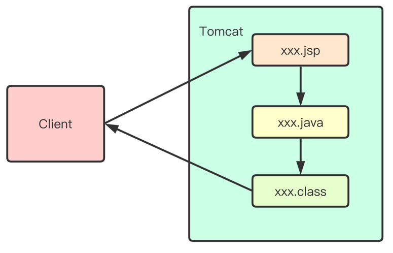
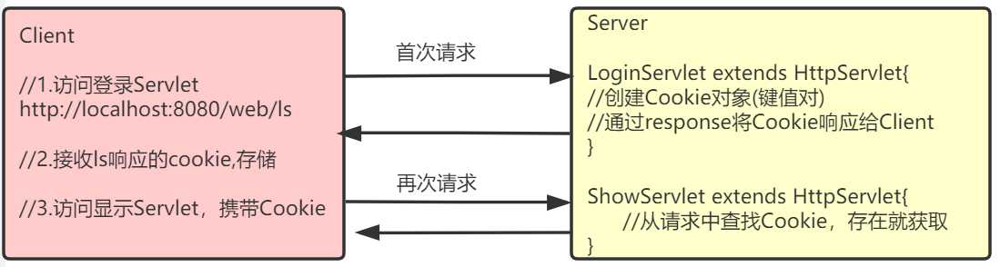

# JSP入门_Cookie_Session

本篇整理三部分内容：JSP 的脚本、原理与注释，Cookie 的概念与常用操作，以及 Session（会话）的概念、原理与登录案例实战。

## 1. JSP 入门

### 1.1 概述

#### 1.1.1 什么是 JSP

**JSP**（Java Server Pages）是 JavaWeb 服务器端的**动态资源**。它与 HTML 页面的作用是相同的：显示数据和获取数据。

#### 1.1.2 JSP 组成

JSP = HTML + Java 脚本 + JSP 动态标签（包含 EL 表达式）。

### 1.2 JSP 脚本

JSP 脚本本质上就是嵌在页面中的 Java 代码片段，按写法分为三类：

| 写法 | 作用 |
| --- | --- |
| `<%...%>` | Java 语句 |
| `<%=…%>` | Java 表达式，等价于 `out.print(...);` |
| `<%!...%>` | 定义类成员（成员变量、方法） |

JSP 中还有无需创建就可以直接使用的**内置对象**，例如 `out` 对象：它的作用是向客户端输出。`<%=…%>` 与 `out.print()` 的功能是相同的，都是向客户端输出。

```html
<%@ page contentType="text/html;charset=UTF-8" language="java" %>
<html>
<head>
    <title>jsptest</title>
</head>
<body>
<h1>JSP演示</h1>
    <%
        // Java 语句
        String s1 = "hello jsp";
        // 不会输出到客户端，而是在服务器端的控制台打印
        System.out.println(s1);
    %>
    <!-- 输出到客户端浏览器上 -->
    输出变量：<%=s1 %><br/>
    输出int类型常量：<%=100 %><br/>
    输出String类型常量：<%="你好" %><br/>
    使用HTML直接输出常量<span>100</span>
</body>
</html>
```

在一个 JSP 中，多个 `<%...%>` 脚本块可以一起使用，例如用脚本把循环拆开、与 HTML 标签交错输出表格：

```html
<%@ page contentType="text/html;charset=UTF-8" language="java" %>
<html>
<head>
    <title>jsp表格</title>
</head>
<body>
    <h1>表格</h1>
    <table border="1" width="50%">
        <tr>
            <th>序号</th>
            <th>用户名</th>
            <th>密码</th>
        </tr>
        <%
            for(int i = 0; i < 5; i++) {
        %>
            <tr>
                <td><%=i+1 %></td>
                <td>user<%=i %></td>
                <td><%=100+1 %></td>
            </tr>
        <%
            }
        %>
    </table>
</body>
</html>
```

### 1.3 JSP 原理

JSP 是特殊的 Servlet：当 JSP 页面首次被访问时，容器（Tomcat）会先把 JSP 编译成 Servlet，然后再执行这个 Servlet。所以 JSP 本质上就是一个 Servlet。



JSP 生成的 Servlet 存放在 Tomcat 的 work 目录下，它是 JSP 的"真身"。打开看看其中的内容，可以更好地理解 JSP 的工作方式：JSP 中的静态信息（例如 `<html>` 等标签）在"真身"中都是使用 `out.write()` 完成打印的，即这些静态信息都作为字符串输出给了客户端。

### 1.4 JSP 注释

JSP 注释的写法是 `<%-- ... --%>`，在 JSP 编译成 `.java` 文件时会被忽略。

也可以在 JSP 页面中使用 HTML 注释 `<!-- … -->`，但要注意：这个注释会保留在 JSP 编译成的 `.java` 文件中，不会被忽略，而且会被原样发送到客户端浏览器。

> [!NOTE]
> 如果注释内容不想暴露给客户端（例如包含敏感信息或业务逻辑说明），一定要使用 JSP 注释 `<%-- --%>`，而不是 HTML 注释。

## 2. Cookie

### 2.1 什么是 Cookie

Cookie 翻译成中文是"小甜点、小饼干"的意思，在 HTTP 中它表示服务器送给客户端浏览器的一小段数据。

具体来说：浏览器访问 Web 服务器的某个资源时，Web 服务器可以在 HTTP 响应消息头中附带一小段数据传送给浏览器；一旦浏览器保存了某个 Cookie，那么它以后每次访问该 Web 服务器时，都会在 HTTP 请求头中把这个 Cookie 回传给服务器。一个 Cookie 主要由标识该信息的名称（name）和值（value）组成。



### 2.2 Cookie 规范

| 规范项 | 限制 |
| --- | --- |
| 单个 Cookie 大小 | 上限 4KB |
| 一个服务器在客户端浏览器上保存的 Cookie 数量 | 最多 20 个 |
| 一个浏览器保存的 Cookie 总数 | 最多 300 个 |

以上数据只是 HTTP 对 Cookie 的规范。在浏览器大战的年代，一些浏览器为了展现自己的能力，对规范做了一些"扩展"，例如单个 Cookie 大小为 8KB、最多可保存 500 个 Cookie 等，但也不会出现把硬盘占满的情况。

> [!NOTE]
> 不同浏览器之间是不共享 Cookie 的：使用 IE 访问服务器时，服务器把 Cookie 发给 IE 并由 IE 保存；之后使用 Firefox 访问服务器时，不可能把 IE 保存的 Cookie 发送给服务器。

### 2.3 Cookie 的常用操作

#### 2.3.1 创建 Cookie

```java
// 创建 Cookie
Cookie ck = new Cookie("name", "zs");
// 设置有效期：>0 有效期（单位秒）；=0 删除该 Cookie；<0 内存存储（默认 -1）
ck.setMaxAge(-1);
// 添加到 response 对象中，响应时发送给客户端
response.addCookie(ck);
```

#### 2.3.2 获取 Cookie

```java
// 获取所有的 Cookie
Cookie[] cks = request.getCookies();
// 遍历 Cookie，检索出自己的 Cookie
String code = null;
if (cks != null) {
    for (Cookie ck : cks) {
        if (ck.getName().equals("name")) {
            // 记录 Cookie 的值
            code = ck.getValue();
            break;
        }
    }
}
```

#### 2.3.3 修改 Cookie

只需要保证 Cookie 的名和路径一致即可修改：

```java
// 同名的 Cookie 会覆盖原来的值
Cookie ck = new Cookie("name", "ls");
ck.setMaxAge(-1);
response.addCookie(ck);
```

#### 2.3.4 Cookie 的生命

Cookie 不只有 name 和 value，还有"生命"，即 Cookie 在客户端的有效时间，可以通过 `setMaxAge(int)` 来设置：

| 取值 | 含义 |
| --- | --- |
| `cookie.setMaxAge(-1)` | maxAge 属性的默认值，表示只在浏览器内存中存活，一旦关闭浏览器窗口，Cookie 就会消失 |
| `cookie.setMaxAge(60*60)` | Cookie 可存活 1 小时；生命大于 0 时，浏览器会把 Cookie 保存到硬盘上，即使关闭浏览器、重启电脑，Cookie 也会存活 1 小时 |
| `cookie.setMaxAge(0)` | 特殊值，表示 Cookie 被作废：如果浏览器已经保存了这个 Cookie，可以用它来删除该 Cookie，无论其保存在内存中还是硬盘上 |

案例：设置并获取 Cookie。

```java
// 设置 Cookie
@WebServlet(name = "AServlet", value = "/AServlet")
public class AServlet extends HttpServlet {
    @Override
    protected void doGet(HttpServletRequest request, HttpServletResponse response) throws ServletException, IOException {
        // 设置 Cookie
        Cookie cookie = new Cookie("name", "zs");
        // maxAge 为 -1 表示一旦关闭浏览器窗口，Cookie 就会消失
        cookie.setMaxAge(-1);
        response.addCookie(cookie);
    }

    @Override
    protected void doPost(HttpServletRequest request, HttpServletResponse response) throws ServletException, IOException {

    }
}

// 获取 Cookie
@WebServlet(name = "BServlet", value = "/BServlet")
public class BServlet extends HttpServlet {
    @Override
    protected void doGet(HttpServletRequest request, HttpServletResponse response) throws ServletException, IOException {
        Cookie[] cks = request.getCookies();
        if (cks != null) {
            for (Cookie ck : cks) {
                if (ck.getName().equals("name")) {
                    // 获取 Cookie 的值
                    System.out.println(ck.getValue());
                    break;
                }
            }
        }
    }

    @Override
    protected void doPost(HttpServletRequest request, HttpServletResponse response) throws ServletException, IOException {

    }
}
```

## 3. Session

### 3.1 什么是 Session

关于**会话**：

- 会话范围是从某个用户首次访问服务器开始，到该用户关闭浏览器结束；
- 会话对应一个用户对服务器的多次连贯性请求，所谓连贯性请求，就是该用户多次请求中间没有关闭浏览器；
- 可以类比为生活中的一次对话：开始对话、多轮交流、结束对话。

`javax.servlet.http.HttpSession` 接口表示一个会话，是 JavaWeb 提供的。Session 是服务器端对象，保存在服务器端。

### 3.2 获取 Session

在 Servlet 中通过 `HttpSession session = request.getSession()` 获取：如果当前会话已经有了 session 对象则直接返回；如果当前会话还不存在，则先创建 session 再返回。

在 JSP 中，session 是内置对象之一，不用创建就可以直接使用。

### 3.3 HttpSession 域对象功能

一个会话创建一个 HttpSession 对象，同一会话中的多个请求之间可以共享 session 中的数据。

到目前为止已经学习了三个域对象：request、session、servletContext，它们都有共同的方法：

| 操作 | 方法 |
| --- | --- |
| 存 | `void setAttribute(String name, Object value)` |
| 取 | `Object getAttribute(String name)` |
| 删除 | `void removeAttribute(String name)` |

如果需要在会话范围内共享数据，应该把数据保存在 session 中。

案例：演示 session 在同一会话的多次请求中共享数据。

```java
@WebServlet(name = "CServlet", value = "/CServlet")
public class CServlet extends HttpServlet {
    @Override
    protected void doGet(HttpServletRequest request, HttpServletResponse response) throws ServletException, IOException {
        // 获取 Session
        HttpSession session = request.getSession();
        // 在 Session 域中存放数据
        session.setAttribute("name", "zs");
    }

    @Override
    protected void doPost(HttpServletRequest request, HttpServletResponse response) throws ServletException, IOException {

    }
}

@WebServlet(name = "DServlet", value = "/DServlet")
public class DServlet extends HttpServlet {
    @Override
    protected void doGet(HttpServletRequest request, HttpServletResponse response) throws ServletException, IOException {
        // 获取 Session
        HttpSession session = request.getSession();
        // 从 Session 域中获取数据
        String name = (String) session.getAttribute("name");
        System.out.println(name);
    }

    @Override
    protected void doPost(HttpServletRequest request, HttpServletResponse response) throws ServletException, IOException {

    }
}
```

先访问 CServlet 再访问 DServlet，控制台会打印 `zs`，说明数据在同一会话的两个请求之间共享成功。

### 3.4 登录案例

案例包含三个页面与一个 Servlet，职责划分如下：

| 组件 | 职责 |
| --- | --- |
| login.jsp | 提供登录表单，提交表单请求到 LoginServlet |
| LoginServlet | 获取请求参数，校验用户是否登录成功：失败则跳回登录页并显示错误信息；成功则跳转到成功页，显示"欢迎 xxx" |
| success.jsp | 登录成功页面，显示欢迎信息；未登录直接访问时提示先登录 |

LoginServlet 代码如下：

```java
@WebServlet(name = "LoginServlet", value = "/LoginServlet")
public class LoginServlet extends HttpServlet {
    @Override
    protected void doGet(HttpServletRequest request, HttpServletResponse response) throws ServletException, IOException {
        // 获取请求参数
        String username = request.getParameter("username");
        String password = request.getParameter("password");

        if ("admin".equals(username) && "admin".equals(password)) {
            // 登录成功，保存数据到 Session
            HttpSession session = request.getSession();
            session.setAttribute("username", username);
            request.getRequestDispatcher("/success.jsp").forward(request, response);
        } else {
            // 登录失败信息
            String msg = "用户名或密码错误";
            request.setAttribute("msg", msg);
            request.getRequestDispatcher("/login.jsp").forward(request, response);
        }
    }

    @Override
    protected void doPost(HttpServletRequest request, HttpServletResponse response) throws ServletException, IOException {
        doGet(request, response);
    }
}
```

login.jsp 代码：

```html
<%@ page contentType="text/html;charset=UTF-8" language="java" %>
<html>
<head>
    <title>Login</title>
</head>
<body>
<%
    String msg = (String)request.getAttribute("msg");
    if(msg != null) {
%>
    <p style="color: red;"><%=msg %></p>
<%
    }
%>
<form action="<%=request.getContextPath() %>/LoginServlet" method="post">
    <fieldset style="width: 300px;">
        <legend>用户登录</legend>
        <p>
            <label>账号</label>
            <input type="text" name="username" placeholder="请输入用户名" />
        </p>
        <p>
            <label>密码</label>
            <input type="password" name="password" placeholder="请输入密码" />
        </p>
        <p>
            <button type="submit">登录</button>
            <button type="reset">重置</button>
        </p>
    </fieldset>
</form>
</body>
</html>
```

success.jsp 代码：

```html
<%@ page contentType="text/html;charset=UTF-8" language="java" %>
<html>
<head>
    <title>success</title>
</head>
<body>
<%
    String username = (String) session.getAttribute("username");
    if(username != null) {
%>
        <p>欢迎<%=username %></p>
<%
    } else {
%>
        <p>请先登录</p>
<%
    }
%>
</body>
</html>
```

### 3.5 Session 原理

Session 底层依赖 Cookie，其工作过程如下：

1. 用户第一次使用 session 时（第一次请求服务器），服务器会创建 session，并创建一个 Cookie，在 Cookie 中保存 session 的 id 发送给客户端，这样客户端就有了自己 session 的 id。但这个 Cookie 只保存在浏览器内存中，关闭浏览器窗口后 Cookie 就会丢失，也就丢失了 sessionId；
2. 用户第二次访问服务器时，会在请求中把保存了 sessionId 的 Cookie 发送给服务器，服务器通过 sessionId 查找对应的 session 对象来使用。也就是说，只要浏览器不关闭，无论访问服务器多少次，使用的都是同一个 session 对象，这也就可以让多个请求共享同一个 session；
3. 用户关闭浏览器窗口后再打开浏览器访问服务器，这时请求中没有 sessionId，服务器会创建一个新 session，并把新的 sessionId 通过 Cookie 保存到浏览器中，一个新的会话开始了。原来的 session 会因为长时间无法访问而失效；
4. 用户打开某个服务器页面长时间没有动作时，session 会超时失效；用户再有活动时，服务器通过 sessionId 已经找不到原来的 session 对象，会创建一个新的 session 对象，并把新的 sessionId 保存到客户端，这同样是一个新会话的开始。

### 3.6 Session 其他 API

| 方法 | 说明 |
| --- | --- |
| `String getId()` | 获取 sessionId |
| `int getMaxInactiveInterval()` | 获取 session 允许的最大不活动时间（秒），默认为 30 分钟；30 分钟内没有使用，Tomcat 会在 session 池中移除这个 session |
| `void setMaxInactiveInterval(int interval)` | 设置 session 允许的最大不活动时间（秒）；如果设置为 1 秒，那么只要 session 在 1 秒内不被使用就会被移除 |
| `long getCreationTime()` | 返回 session 的创建时间，值为毫秒时间戳 |
| `long getLastAccessedTime()` | 返回 session 的最后活动时间，值为毫秒时间戳 |
| `void invalidate()` | 让 session 失效；session 失效后客户端再次请求时，服务器会创建一个新的 session，并在响应中给客户端新 session 的 sessionId |
| `boolean isNew()` | 查看 session 是否为新；客户端第一次请求时服务器创建了 session，但还没把 sessionId 响应给客户端之前，session 的状态为新 |

修改 LoginServlet，体会 Session 超时时间及 Session 失效：

```java
import javax.servlet.ServletException;
import javax.servlet.annotation.WebServlet;
import javax.servlet.http.HttpServlet;
import javax.servlet.http.HttpServletRequest;
import javax.servlet.http.HttpServletResponse;
import javax.servlet.http.HttpSession;
import java.io.IOException;

@WebServlet(name = "LoginServlet", value = "/LoginServlet")
public class LoginServlet extends HttpServlet {
    @Override
    protected void doGet(HttpServletRequest request, HttpServletResponse response) throws ServletException, IOException {
        // 获取请求参数
        String username = request.getParameter("username");
        String password = request.getParameter("password");

        if ("admin".equals(username) && "admin".equals(password)) {
            // 登录成功，保存数据到 Session
            HttpSession session = request.getSession();
            session.setAttribute("username", username);
            // 设置 Session 超时时间为 1 秒
            session.setMaxInactiveInterval(1);
            // 延时 2000ms，模拟 Session 超时
            try {
                Thread.sleep(2000);
            } catch (InterruptedException e) {
                e.printStackTrace();
            }
            // 设置 Session 失效
            // session.invalidate();
            request.getRequestDispatcher("/success.jsp").forward(request, response);
        } else {
            // 登录失败信息
            String msg = "用户名或密码错误";
            request.setAttribute("msg", msg);
            request.getRequestDispatcher("/login.jsp").forward(request, response);
        }
    }

    @Override
    protected void doPost(HttpServletRequest request, HttpServletResponse response) throws ServletException, IOException {
        doGet(request, response);
    }
}
```

继续修改登录案例，增加退出功能。用于退出登录的 Servlet：

```java
import javax.servlet.ServletException;
import javax.servlet.annotation.WebServlet;
import javax.servlet.http.HttpServlet;
import javax.servlet.http.HttpServletRequest;
import javax.servlet.http.HttpServletResponse;
import java.io.IOException;

@WebServlet(name = "LogoutServlet", value = "/LogoutServlet")
public class LogoutServlet extends HttpServlet {
    @Override
    protected void doGet(HttpServletRequest request, HttpServletResponse response) throws ServletException, IOException {
        // 设置 Session 失效
        request.getSession().invalidate();
        // 跳转到登录页
        request.getRequestDispatcher("/login.jsp").forward(request, response);
    }

    @Override
    protected void doPost(HttpServletRequest request, HttpServletResponse response) throws ServletException, IOException {

    }
}
```

修改 success.jsp，增加退出链接：

```html
<%@ page contentType="text/html;charset=UTF-8" language="java" %>
<html>
<head>
    <title>success</title>
</head>
<body>
<%
    String username = (String) session.getAttribute("username");
    if(username != null) {
%>
        <p>欢迎<%=username %></p>
        <p><a href="<%=request.getContextPath()%>/LogoutServlet">退出</a></p>
<%
    } else {
%>
        <p>请先登录</p>
<%
    }
%>
</body>
</html>
```

### 3.7 Session 实战：保存验证码

注册时如果没有验证码，就可以使用 URLConnection 写一段代码循环发出注册请求，甚至用 `while(true)` 不停注册，服务器就废了。验证码的作用是识别发出请求的是人还是程序。当然，程序也可以尝试分析验证码图片，但这并不容易——一般验证码图片都带有干扰线，连人都看不清，程序更分析不出来。

#### 3.7.1 测试生成验证码

在项目中导入 ValidateCode.jar：

```java
import cn.dsna.util.images.ValidateCode;

import java.io.FileOutputStream;
import java.io.IOException;

public class MyTest {
    public static void main(String[] args) throws IOException {
        // 生成验证码：宽 200、高 30、4 个字符、10 条干扰线
        ValidateCode vc = new ValidateCode(200, 30, 4, 10);
        // 获取验证码对应的文字
        String code = vc.getCode();
        System.out.println(code);
        // 保存图片
        FileOutputStream out = new FileOutputStream("D:/code_img.jpg");
        vc.write(out);
    }
}
```

运行完成后，可以在 D 盘下看到生成的验证码图片。

#### 3.7.2 修改登录案例

增加生成验证码的 Servlet，把验证码文字存入 Session，并把图片响应给用户：

```java
import cn.dsna.util.images.ValidateCode;

import javax.servlet.ServletException;
import javax.servlet.annotation.WebServlet;
import javax.servlet.http.HttpServlet;
import javax.servlet.http.HttpServletRequest;
import javax.servlet.http.HttpServletResponse;
import java.io.IOException;

@WebServlet(name = "CodeServlet", value = "/CodeServlet")
public class CodeServlet extends HttpServlet {
    @Override
    protected void doGet(HttpServletRequest request, HttpServletResponse response) throws ServletException, IOException {
        // 生成验证码：宽 150、高 30、4 个字符、5 条干扰线
        ValidateCode vc = new ValidateCode(150, 30, 4, 5);
        String sysCode = vc.getCode();
        System.out.println(sysCode);

        // 在 Session 中存储验证码
        request.getSession().setAttribute("sysCode", sysCode);
        // 将验证码图片响应给用户
        vc.write(response.getOutputStream());
    }

    @Override
    protected void doPost(HttpServletRequest request, HttpServletResponse response) throws ServletException, IOException {
        doGet(request, response);
    }
}
```

修改登录页面，增加验证码输入框和验证码图片：

```html
<%@ page contentType="text/html;charset=UTF-8" language="java" %>
<html>
<head>
    <title>Login</title>
</head>
<body>
<%
    String msg = (String)request.getAttribute("msg");
    if(msg != null) {
%>
    <p style="color: red;"><%=msg %></p>
<%
    }
%>
<form action="<%=request.getContextPath() %>/LoginServlet" method="post">
    <fieldset style="width: 300px;">
        <legend>用户登录</legend>
        <p>
            <label>账号</label>
            <input type="text" name="username" placeholder="请输入用户名" />
        </p>
        <p>
            <label>密码</label>
            <input type="password" name="password" placeholder="请输入密码" />
        </p>
        <p>
            <label>验证码</label>
            <input type="text" name="code" placeholder="请输入验证码" />
            /CodeServlet" alt="验证码">
        </p>
        <p>
            <button type="submit">登录</button>
            <button type="reset">重置</button>
        </p>
    </fieldset>
</form>
</body>
</html>
```

修改 LoginServlet，登录前先校验验证码：

```java
import javax.servlet.ServletException;
import javax.servlet.annotation.WebServlet;
import javax.servlet.http.HttpServlet;
import javax.servlet.http.HttpServletRequest;
import javax.servlet.http.HttpServletResponse;
import javax.servlet.http.HttpSession;
import java.io.IOException;

@WebServlet(name = "LoginServlet", value = "/LoginServlet")
public class LoginServlet extends HttpServlet {
    @Override
    protected void doGet(HttpServletRequest request, HttpServletResponse response) throws ServletException, IOException {
        // 获取请求参数
        String username = request.getParameter("username");
        String password = request.getParameter("password");
        String code = request.getParameter("code");

        // 获取 Session 中的验证码
        HttpSession session = request.getSession();
        String sysCode = (String) session.getAttribute("sysCode");
        if (sysCode.equalsIgnoreCase(code)) {
            if ("admin".equals(username) && "admin".equals(password)) {
                session.setAttribute("username", username);
                request.getRequestDispatcher("/success.jsp").forward(request, response);
            } else {
                // 登录失败信息
                String msg = "用户名或密码错误";
                request.setAttribute("msg", msg);
                request.getRequestDispatcher("/login.jsp").forward(request, response);
            }
        } else {
            String msg = "验证码输入错误";
            request.setAttribute("msg", msg);
            request.getRequestDispatcher("/login.jsp").forward(request, response);
        }
    }

    @Override
    protected void doPost(HttpServletRequest request, HttpServletResponse response) throws ServletException, IOException {
        doGet(request, response);
    }
}
```

#### 3.7.3 单击刷新验证码

在项目中引入 jQuery，修改登录页面：点击验证码图片时，给请求追加一个时间戳参数，强制浏览器重新向 CodeServlet 发起请求，从而更换验证码图片：

```html
<%@ page contentType="text/html;charset=UTF-8" language="java" %>
<html>
<head>
    <title>登录</title>
    <script src="<%=request.getContextPath() %>/js/jquery-3.4.1.min.js"></script>
    <script>
        $(function () {
            $("#codeImg").click(function () {
                var date = new Date();
                $("#codeImg").prop("src", "<%=request.getContextPath() %>/CodeServlet?timeStamp=" + date.getTime());
            });
        });
    </script>
</head>
<body>
<%
    String msg = (String)request.getAttribute("msg");
    if(msg != null) {
%>
    <p style="color: red;"><%=msg %></p>
<%
    }
%>
<form action="<%=request.getContextPath() %>/LoginServlet" method="post">
    <fieldset style="width: 300px;">
        <legend>用户登录</legend>
        <p>
            <label>账号</label>
            <input type="text" name="username" placeholder="请输入用户名" />
        </p>
        <p>
            <label>密码</label>
            <input type="password" name="password" placeholder="请输入密码" />
        </p>
        <p>
            <label>验证码</label>
            <input type="text" name="code" placeholder="请输入验证码" />
            /CodeServlet" alt="验证码" />
        </p>
        <p>
            <button type="submit">登录</button>
            <button type="reset">重置</button>
        </p>
    </fieldset>
</form>
</body>
</html>
```

## 4. 本章小结

- JSP 本质是 Servlet：首次访问时由容器编译成 `.java` 再执行；脚本分为 `<% %>`（语句）、`<%= %>`（表达式输出）、`<%! %>`（定义成员）三类；
- JSP 注释 `<%-- --%>` 不会发送到客户端，HTML 注释会被原样发送，敏感内容应使用 JSP 注释；
- Cookie 是服务器发给浏览器、由浏览器回传的小段数据，`setMaxAge()` 决定其存活策略：负数存内存、正数存硬盘、0 表示删除；
- Session 是服务器端的会话对象，底层依赖 Cookie 传递 sessionId，同一会话的多次请求之间共享数据；
- 三个域对象的共享范围从大到小为：ServletContext（应用）> session（会话）> request（请求），按需选择最小够用的域；
- 验证码案例综合运用了 Session 保存验证码、图片流响应与 jQuery 刷新验证码，是 Session 的典型应用场景。
