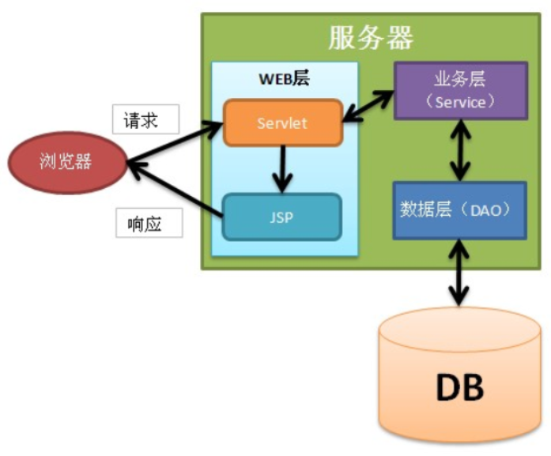

# JSP进阶_EL_JSTL

本篇整理 JSP 进阶内容：三大指令、九大内置对象、JSP 动作标签、EL 表达式、JSTL 核心标签，以及 MVC 设计模式与 JavaWeb 三层架构的登录案例升级。

## 1. JSP 指令

JSP 指令用来设置与整个 JSP 页面相关的属性，语法格式为 `<%@指令名 attr1="" attr2="" %>`。一般会把 JSP 指令放到 JSP 文件的最上方，但这不是必须的。

常用指令有三个：

| 指令 | 作用 |
| --- | --- |
| `page` | 定义页面的依赖属性，比如脚本语言、error 页面、缓存需求等 |
| `include` | 包含其他文件 |
| `taglib` | 引入标签库的定义，可以是自定义标签 |

### 1.1 page 指令

page 指令是最常用的指令，也是属性最多的指令。page 指令没有必须属性，都是可选属性，例如 `<%@page %>` 不给出任何属性也是可以的。

关于 pageEncoding 和 contentType：

- **pageEncoding**
  - 指定当前 JSP 页面的编码；
  - 这个编码是给服务器看的：服务器需要知道当前 JSP 使用的编码，否则无法正确把 JSP 编译成 java 文件；
  - 这个编码只需要与真实的页面编码一致即可。
- **contentType**
  - 设置响应字符流的编码；
  - 设置 content-type 响应头。

无论是 pageEncoding 还是 contentType，它们的默认值都是 ISO-8859-1，而 ISO-8859-1 无法显示中文，所以 JSP 页面中存在中文时一定要设置这两个属性。两者的关系：

- 当 pageEncoding 和 contentType 只出现一个时，另一个的值与出现的值相同；
- 如果两个都不出现，两个属性的值都是 ISO-8859-1。

`import` 属性对应 Java 代码中的 import 语句，用来导入包。

### 1.2 include 指令

- include 指令表示**静态包含**，目的是把多个 JSP 合并成一个 JSP 文件；
- include 指令只有一个属性 `file`，指定要包含的页面；
- 如果 a.jsp 使用 include 指令包含了 b.jsp，那么在编译 a.jsp 时，会把两个文件合并成一个文件再编译成 `.java`。

### 1.3 taglib 指令

taglib 指令用于引入标签库，学习 JSTL 标签时会使用到，后面再讲。

## 2. JSP 九大内置对象

### 2.1 简要说明

JSP 内置对象是指在 JSP 中无需创建就可以直接使用的 9 个对象：

| 内置对象（类型） | 说明 |
| --- | --- |
| `out`（JspWriter） | 等同于 `response.getWriter()`，用来向客户端发送文本数据 |
| `config`（ServletConfig） | 对应"真身"中的 ServletConfig |
| `page`（当前 JSP 的真身类型） | 当前 JSP 页面的 `this`，即当前对象 |
| `pageContext`（PageContext） | 页面上下文对象，它是最后一个要讲的域对象 |
| `exception`（Throwable） | 只有在错误页面中才可以使用这个对象 |
| `request`（HttpServletRequest） | 即 HttpServletRequest 类的对象 |
| `response`（HttpServletResponse） | 即 HttpServletResponse 类的对象 |
| `application`（ServletContext） | 即 ServletContext 类的对象 |
| `session`（HttpSession） | 即 HttpSession 类的对象；不是每个 JSP 页面都可以使用，如果在某个 JSP 页面中设置 `<%@ page session="false" %>`，说明这个页面不能使用 session |

使用情况：

- 极少使用：config、page、exception；
- 不是每个 JSP 页面都可以使用：exception、session。

### 2.2 pageContext

pageContext 的主要功能：

- 域对象功能；
- 代理其他域对象功能；
- 获取其他内置对象。

#### 2.2.1 域对象功能

pageContext 表示当前页面范围。和其他域对象一样，它有共同的三个方法：

| 操作 | 方法 |
| --- | --- |
| 存 | `void setAttribute(String name, Object value)` |
| 取 | `Object getAttribute(String name)` |
| 删除 | `void removeAttribute(String name)` |

```html
<%@ page contentType="text/html;charset=UTF-8" language="java" %>
<html>
<head>
    <title>测试Page域对象</title>
</head>
<body>
    <%
        // 在 page 域中存放数据
        pageContext.setAttribute("name", "zhangsan");
    %>

    <%
        // 从 page 域中获取数据
        System.out.println(pageContext.getAttribute("name"));
    %>
</body>
</html>
```

#### 2.2.2 代理其他域对象

可以使用 pageContext 向 request、session、application 对象中存取数据，"一个顶四个"：

| 方法 | 说明 |
| --- | --- |
| `void setAttribute(String name, Object value, int scope)` | 在指定范围中添加数据 |
| `Object getAttribute(String name, int scope)` | 获取指定范围的数据 |
| `void removeAttribute(String name, int scope)` | 移除指定范围的数据 |

```java
pageContext.setAttribute("x", "X");
pageContext.setAttribute("x", "XX", PageContext.REQUEST_SCOPE);
pageContext.setAttribute("x", "XXX", PageContext.SESSION_SCOPE);
pageContext.setAttribute("x", "XXXX", PageContext.APPLICATION_SCOPE);
```

创建一个向 Session 域存放数据的 Servlet：

```java
import javax.servlet.ServletException;
import javax.servlet.annotation.WebServlet;
import javax.servlet.http.HttpServlet;
import javax.servlet.http.HttpServletRequest;
import javax.servlet.http.HttpServletResponse;
import javax.servlet.http.HttpSession;
import java.io.IOException;

@WebServlet(name = "MServlet", value = "/MServlet")
public class MServlet extends HttpServlet {
    @Override
    protected void doGet(HttpServletRequest request, HttpServletResponse response) throws ServletException, IOException {
        // 获取 Session
        HttpSession session = request.getSession();
        // 在 Session 域中存放数据
        session.setAttribute("name", "lisi");
    }

    @Override
    protected void doPost(HttpServletRequest request, HttpServletResponse response) throws ServletException, IOException {
        doGet(request, response);
    }
}
```

创建测试用的 JSP，通过 pageContext 从 session 域中获取数据：

```html
<%@ page contentType="text/html;charset=UTF-8" language="java" %>
<html>
<head>
    <title>Title</title>
</head>
<body>
    <%
        // 通过 pageContext 从 session 域中获取数据
        Object name = pageContext.getAttribute("name", PageContext.SESSION_SCOPE);
        System.out.println(name);
    %>
</body>
</html>
```

`Object findAttribute(String name)`：依次在 page、request、session、application 四个范围查找名称为 name 的数据，找到就停止查找。这说明如果这些范围中存在相同名称的数据，page 范围的优先级最高：

```html
<%@ page language="java" contentType="text/html; charset=UTF-8" pageEncoding="UTF-8"%>
<html>
<head>
<title>Insert title here</title>
</head>
<body>
    <%
        pageContext.setAttribute("key", "page_value");
        request.setAttribute("key", "request_value");
        session.setAttribute("key", "session_value");
        application.setAttribute("key", "app_value");
    %>

    <%
        // 全域查找，按 page -> request -> session -> application 的顺序，最终取到 page_value
        String value = (String) pageContext.findAttribute("key");
        out.print(value);
    %>
</body>
</html>
```

#### 2.2.3 获取其他内置对象

一个 pageContext 对象可以当所有内置对象用，即"1 个当 9 个"，因为可以使用它获取其他 8 个内置对象：

| 方法 | 说明 |
| --- | --- |
| `JspWriter getOut()` | 获取 out 内置对象 |
| `ServletConfig getServletConfig()` | 获取 config 内置对象 |
| `Object getPage()` | 获取 page 内置对象 |
| `ServletRequest getRequest()` | 获取 request 内置对象 |
| `ServletResponse getResponse()` | 获取 response 内置对象 |
| `HttpSession getSession()` | 获取 session 内置对象 |
| `ServletContext getServletContext()` | 获取 application 内置对象 |
| `Exception getException()` | 获取 exception 内置对象 |

```html
<%@ page contentType="text/html;charset=UTF-8" language="java" %>
<html>
<head>
    <title>Title</title>
</head>
<body>
    <%
        // 通过 pageContext 获取 application 对象
        System.out.println(pageContext.getServletContext().getContextPath());
    %>
</body>
</html>
```

## 3. JSP 动作标签（了解）

动作标签的作用是简化 Java 脚本。JSP 动作标签是 JavaWeb 内置的动作标签，它们是已经定义好的标签，可以直接使用。

### 3.1 include 标签

- 语法：`<jsp:include page="相对URL地址" />`；
- 作用：包含其他 JSP 页面。

与 include 指令的区别：

| 方式 | 包含级别 | 原理 |
| --- | --- | --- |
| include 指令 | 编译级别 | 把当前 JSP 和被包含的 JSP 合并成一个 JSP，再编译成一个 Servlet |
| include 动作标签 | 运行级别 | 当前 JSP 和被包含的 JSP 各自生成 Servlet，执行当前 JSP 的 Servlet 时再去执行被包含 JSP 的 Servlet；与 RequestDispatcher 的 include() 方法相同 |

被包含的 JSP：a.jsp：

```html
<%@ page contentType="text/html;charset=UTF-8" language="java" %>
<html>
<head>
    <title>Title</title>
</head>
<body>
    <p>11111111111</p>
</body>
</html>
```

b.jsp 通过动作标签包含 a.jsp：

```html
<%@ page contentType="text/html;charset=UTF-8" language="java" %>
<html>
<head>
    <title>Title</title>
</head>
<body>
    <jsp:include page="a.jsp" />
    <p>222222222222</p>
</body>
</html>
```

### 3.2 forward 标签

forward 标签的作用是请求转发，其效果与 `RequestDispatcher.forward()` 方法相同。

## 4. EL 表达式

### 4.1 概述

**EL**（Expression Language）即表达式语言，在 JSP 页面中可以直接使用。从 JSP 2.0 开始，EL 用于代替 JSP 脚本做输出，非 Java 开发人员也可以使用。

### 4.2 EL 表达式使用

EL 的基本用途：

- 用于替换作用域对象的 `getAttribute("name")`，并把从域中获取的数据进行显示；
- EL 用来代替 `<%=...%>`，`<%=...%>` 代表输出。

两种常用写法：

- `${scope.name}`：获取具体某个作用域中的数据；
- `${name}`：获取作用域中的数据，逐级查找（pageContext、request、session、application）。

EL 与 JSP 脚本的区别：

| 写法 | 找不到数据时的返回 |
| --- | --- |
| `<%=request.getAttribute("name") %>` | 返回 null |
| `${requestScope.name}` | 返回空字符串 `""` |

#### 4.2.1 EL 表达式应用（获取基本类型、字符串）

```html
<%@ page contentType="text/html;charset=UTF-8" language="java" %>
<html>
<head>
    <title>el初步</title>
</head>
<body>
    <%
        // 在各域中存放数据（String 与 Integer）
        pageContext.setAttribute("name", "Bob");
        request.setAttribute("name", "Zhangsan");
        request.setAttribute("age", 10);
        session.setAttribute("name", "Jim");
        application.setAttribute("name", "Lucy");
    %>

    <%-- 使用 EL 表达式获取某个域中的数据并在网页上显示，作用域前缀为 xxxScope --%>
    <p>${requestScope.name}</p>
    <p>${requestScope.age}</p>
    <hr/>
    <%--
        全域查找：
        如果没有限定 xxxScope，会按照 pageContext、request、session、application 的顺序进行查找，
        最终取到 pageContext 域中的 Bob
    --%>
    <p>${name}</p>
    <hr/>
    <%-- JSP 脚本和 EL 表达式在找不到数据时的区别：null 与 "" --%>
    <p><%=request.getAttribute("abc")%></p>
    <p>${requestScope.abc}</p>
    <hr/>
</body>
</html>
```

#### 4.2.2 EL 表达式应用（获取引用类型）

使用 EL 获取作用域中的对象并调用其属性时，只能访问对象的 get 方法，因此实体类必须遵守命名规范来定义属性。

创建实体类：

```java
/**
 * 表示 Person 的实体类
 */
public class Person {
    private Integer id;
    private String name;
    private Integer age;

    // set、get 方法
    // toString 方法
}
```

EL 表达式演示：获取对象属性、数组元素、List 元素和 Map 键值：

```html
<%@ page import="com.qf.entity.Person" %>
<%@ page import="java.util.List" %>
<%@ page import="java.util.ArrayList" %>
<%@ page import="java.util.Map" %>
<%@ page import="java.util.HashMap" %>
<%@ page contentType="text/html;charset=UTF-8" language="java" %>
<html>
<head>
    <title>el表达式处理复杂类型</title>
</head>
<body>
    <%
        Person p = new Person();
        p.setId(100);
        p.setName("Tom");
        p.setAge(20);

        Person p1 = new Person();
        p1.setId(200);
        p1.setName("zs");
        p1.setAge(21);
        // 将 Person 对象存放在域当中
        request.setAttribute("person", p);

        int[] arr = {1, 2, 100, 50};
        request.setAttribute("arr", arr);

        List<String> names = new ArrayList<>();
        names.add("zs");
        names.add("ls");
        names.add("ww");
        request.setAttribute("names", names);

        List<Person> persons = new ArrayList<>();
        persons.add(p);
        persons.add(p1);
        request.setAttribute("persons", persons);

        Map<String, Object> map = new HashMap<>();
        map.put("name", "zs");
        map.put("addr", "qd");
        request.setAttribute("map", map);
    %>
    <%--
        通过 EL 表达式在页面上显示对象中的属性
        前提：属性要有对应的 set 和 get 方法
    --%>
    <p>${requestScope.person.id}</p>
    <p>${requestScope.person.name}</p>
    <p>${requestScope.person.age}</p>
    <hr/>
    <%-- 通过 EL 表达式显示数组中的元素 --%>
    <p>${requestScope.arr[3]}</p>
    <hr/>
    <%-- 显示集合中的元素，集合中存放的是简单类型（基本数据类型 + String） --%>
    <p>${names[2]}</p>
    <hr/>
    <%-- 显示 List、Map 中的元素，集合中存放的是复杂类型 --%>
    <p>${persons[0].id}</p>
    <p>${persons[0].name}</p>
    <p>${persons[0].age}</p>
    <hr/>
    <p>${map.name}</p>
    <p>${map.addr}</p>
    <p>${map["addr"]}</p>
    <hr/>
</body>
</html>
```

### 4.3 EL 表达式运算符

| 操作符 | 描述 |
| :--- | :--- |
| `.` | 访问一个 Bean 属性或者一个映射条目 |
| `[]` | 访问一个数组或者集合的元素 |
| `+` | 加 |
| `-` | 减或负 |
| `*` | 乘 |
| `/` 或 `div` | 除 |
| `%` 或 `mod` | 取模 |
| `==` 或 `eq` | 测试是否相等 |
| `!=` 或 `ne` | 测试是否不等 |
| `<` 或 `lt` | 测试是否小于 |
| `>` 或 `gt` | 测试是否大于 |
| `<=` 或 `le` | 测试是否小于等于 |
| `>=` 或 `ge` | 测试是否大于等于 |
| `&&` 或 `and` | 测试逻辑与 |
| `\|\|` 或 `or` | 测试逻辑或 |
| `!` 或 `not` | 测试取反 |
| `empty` | 测试是否为空值 |

```html
<%@ page contentType="text/html;charset=UTF-8" language="java" %>
<html>
<head>
    <title>el_运算符</title>
</head>
<body>
    <%
        request.setAttribute("num", 15);
        request.setAttribute("name", "");
    %>

    <%-- EL 算术运算符 --%>
    <p>${num + 1}</p>
    <p>${num - 1}</p>
    <p>${num * 10}</p>
    <p>${num / 10}</p>
    <p>${num div 10}</p>
    <p>${num % 3}</p>
    <p>${num mod 3}</p>
    <hr/>
    <%-- EL 关系运算符 --%>
    <p>${num == 15}</p>
    <p>${num eq 15}</p><%-- eq 即 equals --%>
    <p>${num != 15}</p>
    <p>${num ne 15}</p><%-- ne 即 not equals --%>
    <p>${num lt 20}</p><%-- lt 即 less than --%>
    <p>${num gt 20}</p><%-- gt 即 greater than --%>
    <hr/>
    <%-- EL 逻辑运算符 --%>
    <p>${true or false}</p>
    <hr/>
    <%-- empty 运算符 --%>
    <p>${empty name}</p>
</body>
</html>
```

关于 `empty` 关键字：

```html
<%
    String s1 = "";
    pageContext.setAttribute("s1", s1);
    String s2 = null;
    pageContext.setAttribute("s2", s2);
    String s3 = "abcdefg";
    pageContext.setAttribute("s3", s3);
    List list1 = new ArrayList();
    pageContext.setAttribute("list1", list1);
%>
<%-- empty 关键字：只要内容是"空"就返回 true --%>
${empty s1}<br>
${empty s2}<br>
${empty s3}<br>
${empty list1}<br>
```

上述输出的结果依次为 `true`、`true`、`false`、`true`：空字符串、null、空集合都算"空"，有内容的字符串不算。

### 4.4 EL 的隐式对象

EL 表达式语言定义了 11 个隐式对象：

| 隐含对象 | 描述 |
| :--- | :--- |
| pageScope | page 作用域 |
| requestScope | request 作用域 |
| sessionScope | session 作用域 |
| applicationScope | application 作用域 |
| param | request 对象的参数，字符串 |
| paramValues | request 对象的参数，字符串集合 |
| header | HTTP 信息头，字符串 |
| headerValues | HTTP 信息头，字符串集合 |
| initParam | 上下文初始化参数 |
| cookie | Cookie 值 |
| pageContext | 当前页面的 pageContext 域对象 |

其中最常用的是通过 `pageContext` 拿到 request 再取 contextPath，避免把项目名写死：

```html
<%@ page contentType="text/html;charset=UTF-8" language="java" %>
<html>
<head>
    <title>Title</title>
</head>
<body>
    <%--
        访问服务器某个资源的路径组成：
        协议://主机名:端口    http://localhost:8080
        项目名：在实际开发中不能写死，要"动"起来
        资源的位置
    --%>
    <%--<a href="/el_jstl/loginServlet?username=bob">登录</a>--%>
    <a href="${pageContext.request.contextPath}/loginServlet?username=bob">登录</a>
</body>
</html>
```

使用 EL 表达式修改登录案例。login.jsp：

```html
<%@ page contentType="text/html;charset=UTF-8" language="java" %>
<html>
<head>
    <title>登录</title>
</head>
<body>
<%
    String errorMsg = (String)request.getAttribute("errorMsg");
    if(errorMsg != null) {
%>
    <p style="color: red;">${errorMsg}</p>
<%
    }
%>
<form action="${pageContext.request.contextPath}/LoginServlet" method="post">
    <fieldset style="width: 300px;">
        <legend>用户登录</legend>
        <p>
            <label>账号</label>
            <input type="text" name="username" placeholder="请输入用户名" />
        </p>
        <p>
            <label>密码</label>
            <input type="password" name="password" placeholder="请输入密码" />
        </p>
        <p>
            <label>验证码</label>
            <input type="text" name="code" placeholder="请输入验证码" />
            
        </p>
        <p>
            <button type="submit">登录</button>
            <button type="reset">重置</button>
        </p>
    </fieldset>
</form>
</body>
</html>
```

success.jsp：

```html
<%@ page contentType="text/html;charset=UTF-8" language="java" %>
<html>
<head>
    <title>success</title>
</head>
<body>
    <%
        String username = (String) session.getAttribute("username");
        if(username != null) {
    %>
    <p>欢迎${username}</p>
    <p><a href="${pageContext.request.contextPath}/LogoutServlet">注销</a></p>
    <%
        } else {
    %>
    <p>您还没有登录，请先<a href="${pageContext.request.contextPath}/login.jsp">登录</a></p>
    <%
        }
    %>
</body>
</html>
```

## 5. JSTL

### 5.1 目前存在的问题

- EL 主要用于从作用域获取数据，虽然可以做运算判断，但得到的是一个结果，只能做展示；
- EL 不存在流程控制，比如 if 判断；
- EL 对于集合只能做单点访问，不能实现遍历操作，比如循环。

### 5.2 什么是 JSTL

JSTL 是 Apache 对 EL 表达式的扩展（也就是说 JSTL 依赖 EL），它是一种标签语言。JSTL 不是 JSP 的内置标签，使用时需要导包。

### 5.3 JSTL 的作用

- 可对 EL 获取到的数据进行逻辑操作；
- 与 EL 合作完成数据的展示。

### 5.4 如何使用 JSTL

1. 导入 jar 包：standard.jar 和 jstl.jar；
2. 在 JSP 页面引入标签库：`<%@ taglib uri="http://java.sun.com/jsp/jstl/core" prefix="c" %>`。

### 5.5 JSTL 核心标签

#### 5.5.1 输入输出

**out 标签**：

- `value`：可以是字符串常量，也可以是 EL 表达式；
- `default`：当要输出的内容为 null 时，会输出 default 指定的值。

```html
<!-- 输出字符串 aaa -->
<c:out value="aaa"/>
<!-- 输出域属性 aaa，与 ${aaa} 相同 -->
<c:out value="${aaa}"/>
<!-- 如果 ${aaa} 不存在，那么输出 xxx 字符串 -->
<c:out value="${aaa}" default="xxx"/>
```

**set 标签**：

```html
<!-- 创建名为 a、值为 hello 的域属性，默认范围为 pageContext -->
<c:set var="a" value="hello"/>
<!-- 通过 scope 指定范围为 session -->
<c:set var="a" value="hello" scope="session"/>
```

**remove 标签**：

```html
<!-- 删除名为 a 的域属性，默认从 page 域删除 -->
<c:remove var="a"/>
<!-- 删除 page 域中名为 a 的域属性 -->
<c:remove var="a" scope="page"/>
```

案例：

```html
<%@ page contentType="text/html;charset=UTF-8" language="java" %>
<%@ taglib prefix="c" uri="http://java.sun.com/jsp/jstl/core" %>
<html>
<head>
    <title>jstl输入输出</title>
</head>
<body>
    <%--
        JSTL：增强 EL 表达式的功能，实现复杂的逻辑操作
    --%>
    <%-- 输出 --%>
    <p><c:out value="hello world"/></p>
    <p>hello world</p>
    <hr/>
    <%--
        定义变量，相当于 int age = 10;
        c:set 是在域对象中存放数据，默认存放在 page 域中
        scope：指定数据存放在哪个域中
    --%>
    <c:set var="name" value="Zhangsan" />
    <p>${pageScope.name}</p>

    <c:set var="age" value="10" scope="application" />
    <p>${age}</p>
</body>
</html>
```

#### 5.5.2 分支结构

**if 标签**：

```html
<!-- 当条件为 true 时执行标签体内容 -->
<c:if test="${条件}">
    hello
</c:if>
```

**choose 标签**：

```html
<!--
    等同于：
        if() {
        } else if() {
        } else if() {
        } else if() {
        } else {
        }
-->
<c:choose>
    <c:when test="${条件1}">a</c:when>
    <c:when test="${条件2}">b</c:when>
    <c:when test="${条件3}">c</c:when>
    <c:otherwise>d</c:otherwise>
</c:choose>
```

案例：

```html
<%@ page contentType="text/html;charset=UTF-8" language="java" %>
<%@ taglib prefix="c" uri="http://java.sun.com/jsp/jstl/core" %>
<html>
<head>
    <title>jstl分支结构</title>
</head>
<body>
    <%--
        Java 中的分支结构：
            if() { }
            if() { } else { }
            if() { } else if() { } else if() { } else { }
        使用 JSTL 实现分支结构
    --%>
    <c:set var="num" value="10" />
    <c:if test="${num gt 2}">
        ${num}大于2是成立的
    </c:if>
    <hr/>

    <%-- 判断是否及格 --%>
    <c:set var="score" value="80" />
    <c:choose>
        <c:when test="${score >= 60}">
            <p>及格</p>
        </c:when>
        <c:otherwise>
            <p>不及格</p>
        </c:otherwise>
    </c:choose>
    <hr/>
    <c:choose>
        <c:when test="${score >= 80}">
            <p>优秀</p>
        </c:when>
        <c:when test="${score >= 70}">
            <p>良好</p>
        </c:when>
        <c:when test="${score >= 60}">
            <p>及格</p>
        </c:when>
        <c:otherwise>
            <p>不及格</p>
        </c:otherwise>
    </c:choose>
</body>
</html>
```

#### 5.5.3 循环结构

**forEach 标签**，既可以做计数循环，也可以遍历数组和集合：

```html
<!--
    计数循环：
    var：循环变量
    begin：设置循环变量从几开始
    end：设置循环变量到几结束
    step：设置步长，等同于 Java 中的 i++ 或 i+=2，默认为 1
-->
<c:forEach var="i" begin="1" end="10" step="1">
    ${i}
</c:forEach>

<!--
    遍历数组、集合：
    items：指定要循环的对象，它可以是一个数组或一个集合
    var：把数组或集合中的每个元素赋值给 var 指定的变量

    可以使用 varStatus 来创建循环状态变量：
        count：循环元素的个数
        index：循环元素的下标
        first：是否为第一个元素
        last：是否为最后一个元素
        current：当前元素
-->
<c:forEach items="${strs}" var="str">
    ${str}<br/>
</c:forEach>
```

案例：

```html
<%@ page import="java.util.List" %>
<%@ page import="java.util.ArrayList" %>
<%@ page import="com.qf.entity.Person" %>
<%@ page contentType="text/html;charset=UTF-8" language="java" %>
<%@ taglib prefix="c" uri="http://java.sun.com/jsp/jstl/core" %>
<html>
<head>
    <title>JSTL循环结构</title>
</head>
<body>
    <%--
        循环：反复做某件事情
        1. 输出 1 2 3 ... 5，相当于
            for(int i = 1; i <= 5; i++) {
                System.out.println(i);
            }
    --%>
    <c:forEach var="i" begin="1" end="5" step="1">
        <p>${i}</p>
    </c:forEach>
    <hr/>

    <%--
        计算 2+4+6+...+100，相当于
            int sum = 0;
            for(int i = 2; i <= 100; i += 2) {
                sum = sum + i;
            }
    --%>
    <c:set var="sum" value="0" />
    <c:forEach var="i" begin="2" end="100" step="2">
        <c:set var="sum" value="${sum + i}" />
    </c:forEach>
    <p>${sum}</p>
    <hr/>

    <%--
        通过 JSTL 遍历一个集合，在 h1 标题中显示
        假设集合从 Servlet 中保存到 request 域中，然后转发到该页面
    --%>
    <%
        List<String> list = new ArrayList<>();
        list.add("1111");
        list.add("2222");
        list.add("333");
        list.add("******");

        request.setAttribute("list", list);
    %>
    <%--
        items：表示被遍历的集合
        var：每一次被遍历到的元素
        相当于 for(String item : list) { }
    --%>
    <c:forEach items="${list}" var="item">
        <h1>${item}</h1>
    </c:forEach>

    <hr/>
    <%
        // 模拟从数据库中查询到的 Person 集合
        List<Person> persons = new ArrayList<>();
        Person p = new Person();
        p.setId(100);
        p.setName("Tom");
        p.setAge(20);

        Person p1 = new Person();
        p1.setId(200);
        p1.setName("zs");
        p1.setAge(21);

        persons.add(p);
        persons.add(p1);

        request.setAttribute("persons", persons);
    %>

    <table border="1">
        <tr>
            <th>id</th>
            <th>name</th>
            <th>age</th>
            <th colspan="2">opt</th>
        </tr>
        <c:forEach items="${persons}" var="p">
            <tr>
                <td>${p.id}</td>
                <td>${p.name}</td>
                <td>${p.age}</td>
                <td><a href="${pageContext.request.contextPath}/xxxServlet?id=${p.id}">修改</a></td>
                <td><a href="${pageContext.request.contextPath}/aaaServlet?id=${p.id}">删除</a></td>
            </tr>
        </c:forEach>
    </table>
</body>
</html>
```

### 5.6 登录案例升级

使用 EL 和 JSTL 重写登录相关页面，去掉页面中的 Java 脚本判断。修改 login.jsp：

```html
<%@ page contentType="text/html;charset=UTF-8" language="java" %>
<%@ taglib prefix="c" uri="http://java.sun.com/jsp/jstl/core" %>
<html>
<head>
    <title>登录</title>
</head>
<body>
<p style="color: red;">${errorMsg}</p>
<form action="${pageContext.request.contextPath}/LoginServlet" method="post">
    <fieldset style="width: 300px;">
        <legend>用户登录</legend>
        <p>
            <label>账号</label>
            <input type="text" name="username" placeholder="请输入用户名" />
        </p>
        <p>
            <label>密码</label>
            <input type="password" name="password" placeholder="请输入密码" />
        </p>
        <p>
            <label>验证码</label>
            <input type="text" name="code" placeholder="请输入验证码" />
            
        </p>
        <p>
            <button type="submit">登录</button>
            <button type="reset">重置</button>
        </p>
    </fieldset>
</form>
</body>
</html>
```

修改 success.jsp，用 `c:choose` 替代脚本判断：

```html
<%@ page contentType="text/html;charset=UTF-8" language="java" %>
<%@ taglib prefix="c" uri="http://java.sun.com/jsp/jstl/core" %>
<html>
<head>
    <title>success</title>
</head>
<body>
    <c:choose>
        <c:when test="${not empty username}">
            <p>欢迎${username}</p>
            <p><a href="${pageContext.request.contextPath}/LogoutServlet">注销</a></p>
        </c:when>
        <c:otherwise>
            <p>您还没有登录，请先<a href="${pageContext.request.contextPath}/login.jsp">登录</a></p>
        </c:otherwise>
    </c:choose>
</body>
</html>
```

## 6. MVC 设计模式

### 6.1 经典的 MVC

MVC 是软件工程中的一种架构模式，是一种软件设计思想：将数据操作、页面展示、业务逻辑分为三个层级（模块），独立完成、相互调用。MVC 并不是 Java 独有的，现在几乎所有的 B/S 架构都采用了 MVC 模式。三个层级如下：

| 层级 | 职责 |
| --- | --- |
| 视图 View | 用户看到并与之交互的界面，比如 HTML（静态资源）、JSP（动态资源）等 |
| 控制器 Controller | 控制请求的处理逻辑，对请求进行处理，负责流程跳转（转发和重定向） |
| 模型 Model | 对客观世界的一种代表和模拟（业务模拟、对象模拟） |

MVC 的优点：

- **低耦合性**：模块与模块之间的关联性不强，不与某一种具体实现产生密不可分的关联性；
- **高维护性**：基于低耦合性，可做到不同层级的功能模块灵活更换、插拔；
- **高重用性**：相同的数据库操作可以服务于不同的业务处理，将数据作为独立模块，提高重用性。

### 6.2 JavaWeb 经典三层框架

| 层 | 职责 |
| --- | --- |
| Web 层 | 包含 JSP 和 Servlet 等与 Web 相关的内容 |
| 业务层（Service） | 不包含 JavaWeb API，只关心业务逻辑 |
| 数据层（Dao） | 封装了对数据库的访问细节，进行最细粒度的增删改查操作 |



调用关系为：Web 层 -> 业务层（Service）-> 数据层（Dao）-> DB。

- 业务处理从前到后，开发时要从后向前进行；
- 关于业务：例如转账，业务层就是对 DAO 层方法的组合。

注意事项：

- 业务层（Service）不要出现 JavaWeb API：业务层代码是可重用的，甚至可以应用到非 Web 环境中；
- 业务层不要出现 JDBC 相关的 API；
- JavaBean 作为实体类贯穿 Web 层、业务层、数据层，各层之间通过 JavaBean 或者 JavaBean 的组合进行数据交互。

### 6.3 基于 JavaWeb 三层架构升级登录案例

准备工作：

- 建库建表；
- 新建项目；
- 拷贝 jar 包到项目的 WEB-INF 下 lib 目录；
- 准备 jdbc 配置文件，放置在 src 下；
- JdbcUtils 工具类放在 utils 包下。

#### 6.3.1 建库建表

SQL 语句如下：

```sql
CREATE DATABASE webtest;
USE webtest;

DROP TABLE IF EXISTS `user`;
CREATE TABLE `user`  (
  id int(11) NOT NULL AUTO_INCREMENT,
  username varchar(20),
  password varchar(20),
  PRIMARY KEY (id)
);

INSERT INTO `user` VALUES (1, 'zhangsan', '123456');
INSERT INTO `user` VALUES (2, 'lisi', '123456');
```

对应的实体类 User：

```java
public class User {
    private Integer id;
    private String username;
    private String password;

    // set 和 get 方法
    // toString 方法
}
```

#### 6.3.2 Dao 层

Dao 层接口：

```java
import com.qfedu.entity.User;

import java.sql.SQLException;

public interface UserDao {
    User findByUsernameAndPassword(String username, String password) throws SQLException;
}
```

Dao 层接口实现类：

```java
import com.qfedu.dao.UserDao;
import com.qfedu.entity.User;
import com.qfedu.utils.JdbcUtils;
import org.apache.commons.dbutils.QueryRunner;
import org.apache.commons.dbutils.handlers.BeanHandler;

import java.sql.SQLException;

public class UserDaoImpl implements UserDao {
    @Override
    public User findByUsernameAndPassword(String username, String password) throws SQLException {
        String sql = "select * from user where username=? and password=?";
        Object[] params = {username, password};

        QueryRunner qr = new QueryRunner(JdbcUtils.getDataSource());
        User user = qr.query(sql, new BeanHandler<User>(User.class), params);
        return user;
    }
}
```

#### 6.3.3 Service 层

Service 层接口：

```java
import com.qfedu.entity.User;

public interface UserService {
    User login(String username, String password);
}
```

Service 层实现类：

```java
import com.qfedu.dao.UserDao;
import com.qfedu.dao.impl.UserDaoImpl;
import com.qfedu.entity.User;
import com.qfedu.service.UserService;

import java.sql.SQLException;

public class UserServiceImpl implements UserService {
    private UserDao userDao = new UserDaoImpl();

    @Override
    public User login(String username, String password) {
        User user = null;
        try {
            user = userDao.findByUsernameAndPassword(username, password);
        } catch (SQLException e) {
            e.printStackTrace();
        }

        return user;
    }
}
```

#### 6.3.4 Servlet

用于登录验证的 Servlet：

```java
import com.qfedu.entity.User;
import com.qfedu.service.UserService;
import com.qfedu.service.impl.UserServiceImpl;

import javax.servlet.ServletException;
import javax.servlet.annotation.WebServlet;
import javax.servlet.http.HttpServlet;
import javax.servlet.http.HttpServletRequest;
import javax.servlet.http.HttpServletResponse;
import javax.servlet.http.HttpSession;
import java.io.IOException;

@WebServlet(name = "LoginServlet", value = "/LoginServlet")
public class LoginServlet extends HttpServlet {
    private UserService userService = new UserServiceImpl();

    @Override
    protected void doGet(HttpServletRequest request, HttpServletResponse response) throws ServletException, IOException {
        // 获取登录信息
        String username = request.getParameter("username");
        String password = request.getParameter("password");
        String code = request.getParameter("code");

        HttpSession session = request.getSession();
        // 使用用户输入的验证码和生成的验证码进行比较
        String generateCode = (String) session.getAttribute("generateCode");
        // 忽略大小写比较
        if (generateCode.equalsIgnoreCase(code)) {
            // 登录验证
            User user = userService.login(username, password);

            if (user != null) {
                // 将成功登录的用户信息放在 Session 中
                session.setAttribute("user", user);
                request.getRequestDispatcher("/success.jsp").forward(request, response);
            } else {
                request.setAttribute("errorMsg", "用户名或密码错误，请重新登录");
                request.getRequestDispatcher("/login.jsp").forward(request, response);
            }
        } else {
            request.setAttribute("errorMsg", "验证码错误，请重新登录...");
            request.getRequestDispatcher("/login.jsp").forward(request, response);
        }
    }

    @Override
    protected void doPost(HttpServletRequest request, HttpServletResponse response) throws ServletException, IOException {
        doGet(request, response);
    }
}
```

用于生成验证码的 Servlet：

```java
import cn.dsna.util.images.ValidateCode;

import javax.servlet.ServletException;
import javax.servlet.annotation.WebServlet;
import javax.servlet.http.HttpServlet;
import javax.servlet.http.HttpServletRequest;
import javax.servlet.http.HttpServletResponse;
import java.io.IOException;

@WebServlet(name = "CodeServlet", value = "/CodeServlet")
public class CodeServlet extends HttpServlet {
    @Override
    protected void doGet(HttpServletRequest request, HttpServletResponse response) throws ServletException, IOException {
        // 生成验证码
        ValidateCode codeImg = new ValidateCode(200, 30, 4, 5);
        String code = codeImg.getCode();
        System.out.println(code);

        // 将生成的验证码存放在 session 中
        request.getSession().setAttribute("generateCode", code);

        // 发送给浏览器
        codeImg.write(response.getOutputStream());
    }

    @Override
    protected void doPost(HttpServletRequest request, HttpServletResponse response) throws ServletException, IOException {
        doGet(request, response);
    }
}
```

用于退出登录的 Servlet：

```java
import javax.servlet.ServletException;
import javax.servlet.annotation.WebServlet;
import javax.servlet.http.HttpServlet;
import javax.servlet.http.HttpServletRequest;
import javax.servlet.http.HttpServletResponse;
import java.io.IOException;

@WebServlet(name = "LogoutServlet", value = "/LogoutServlet")
public class LogoutServlet extends HttpServlet {
    @Override
    protected void doGet(HttpServletRequest request, HttpServletResponse response) throws ServletException, IOException {
        // 让 session 失效
        request.getSession().invalidate();
        // 重定向到 login.jsp
        response.sendRedirect(request.getContextPath() + "/login.jsp");
    }

    @Override
    protected void doPost(HttpServletRequest request, HttpServletResponse response) throws ServletException, IOException {
        doGet(request, response);
    }
}
```

#### 6.3.5 相关页面

登录页面 login.jsp。注意这个页面中引入了 jQuery 用于实现单击刷新验证码，如果 jQuery 加载不能运行成功，删除 out 目录后重试：

```html
<%@ page contentType="text/html;charset=UTF-8" language="java" %>
<%@ taglib prefix="c" uri="http://java.sun.com/jsp/jstl/core" %>
<head>
    <title>登录</title>
    <script src="${pageContext.request.contextPath}/js/jquery-3.4.1.min.js"></script>
    <script>
        $(function () {
            // 单击验证码图片，刷新验证码
            $("#codeImg").click(function () {
                var date = new Date();
                $("#codeImg").prop("src", "${pageContext.request.contextPath}/CodeServlet?timeStamp=" + date.getTime());
            });
        });
    </script>
</head>
<body>
<p style="color: red;">${errorMsg}</p>
<form action="${pageContext.request.contextPath}/LoginServlet" method="post">
    <fieldset style="width: 300px;">
        <legend>用户登录</legend>
        <p>
            <label>账号</label>
            <input type="text" name="username" placeholder="请输入用户名" />
        </p>
        <p>
            <label>密码</label>
            <input type="password" name="password" placeholder="请输入密码" />
        </p>
        <p>
            <label>验证码</label>
            <input type="text" name="code" placeholder="请输入验证码" />
            
        </p>
        <p>
            <button type="submit">登录</button>
            <button type="reset">重置</button>
        </p>
    </fieldset>
</form>
</body>
</html>
```

成功页面 success.jsp：

```html
<%@ page contentType="text/html;charset=UTF-8" language="java" %>
<%@ taglib prefix="c" uri="http://java.sun.com/jsp/jstl/core" %>
<html>
<head>
    <title>success</title>
</head>
<body>
    <c:choose>
        <c:when test="${not empty user}">
            <p>欢迎${user.username}</p>
            <p><a href="${pageContext.request.contextPath}/LogoutServlet">注销</a></p>
        </c:when>
        <c:otherwise>
            <p>您还没有登录，请先<a href="${pageContext.request.contextPath}/login.jsp">登录</a></p>
        </c:otherwise>
    </c:choose>
</body>
</html>
```

## 7. 本章小结

- JSP 三大指令中，page 控制页面属性（重点注意 pageEncoding 与 contentType 的关系），include 是编译期静态包含，taglib 引入标签库；
- 九大内置对象中，pageContext"一个顶四个"（代理其他域对象），又能获取其他内置对象（1 个当 9 个），是理解 JSP 的关键；
- EL 表达式替代 `<%= %>` 做输出，`xxxScope` 限定域、不加前缀则全域查找，找不到时返回 `""` 而非 null；
- EL 只能取值和运算，流程控制与集合遍历由 JSTL 完成：`c:if`/`c:choose` 做分支，`c:forEach` 做循环；
- MVC 把展示、控制、模型分层，JavaWeb 三层架构对应 Web 层（Servlet/JSP）、业务层（Service）、数据层（Dao），开发顺序从数据层向上，JavaBean 贯穿各层。
