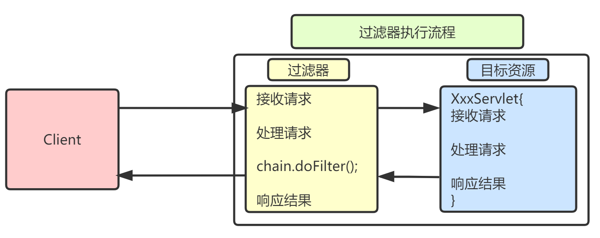
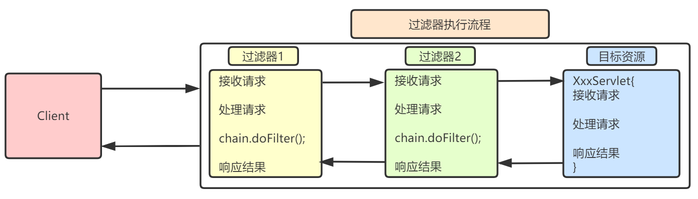

# Filter

本篇整理 JavaWeb 三大组件之一的 Filter：过滤器的作用、入门案例、生命周期、配置方式、过滤器链与优先级，以及权限验证和统一编码两个典型应用。

## 1. 什么是 Filter

Filter（过滤器）是 JavaWeb 三大组件（Servlet、Filter、Listener）之一。

它与 Servlet 类似，都是实现某个接口的 Java 类，但作用不同：Filter 用来**拦截请求**，而不是处理请求。



Filter 的执行地位在 Servlet 之前：客户端发送请求时，会先经过 Filter，再到达目标 Servlet；响应时，会根据执行流程再次反向执行 Filter。利用这一特性，可以解决多个 Servlet 共性代码的冗余问题（例如乱码处理、登录验证）。

## 2. Filter 入门

### 2.1 编写 Filter

Servlet API 中提供了一个 `Filter` 接口，开发人员编写一个 Java 类实现这个接口即可，这个 Java 类就称为过滤器：

```java
import javax.servlet.*;
import java.io.IOException;

public class TestFilter implements Filter {
    public void init(FilterConfig config) throws ServletException {
    }

    public void destroy() {
    }

    @Override
    public void doFilter(ServletRequest request, ServletResponse response, FilterChain chain) throws ServletException, IOException {
        System.out.println("filter....");
        chain.doFilter(request, response);
    }
}
```

再编写一个 Servlet 用来验证 Filter 的拦截效果：

```java
import javax.servlet.ServletException;
import javax.servlet.annotation.WebServlet;
import javax.servlet.http.HttpServlet;
import javax.servlet.http.HttpServletRequest;
import javax.servlet.http.HttpServletResponse;
import java.io.IOException;

@WebServlet(name = "TestServlet", value = "/TestServlet")
public class TestServlet extends HttpServlet {
    @Override
    protected void doGet(HttpServletRequest request, HttpServletResponse response) throws ServletException, IOException {
        System.out.println("servlet...");
    }

    @Override
    protected void doPost(HttpServletRequest request, HttpServletResponse response) throws ServletException, IOException {
        doGet(request, response);
    }
}
```

### 2.2 配置 Filter

在 `web.xml` 中配置 Filter，方式类似在 web.xml 中配置 Servlet：

```xml
<?xml version="1.0" encoding="UTF-8"?>
<web-app xmlns="http://xmlns.jcp.org/xml/ns/javaee"
         xmlns:xsi="http://www.w3.org/2001/XMLSchema-instance"
         xsi:schemaLocation="http://xmlns.jcp.org/xml/ns/javaee http://xmlns.jcp.org/xml/ns/javaee/web-app_3_1.xsd"
         version="3.1">
    <filter>
        <!-- filter 的名字，必须和 filter-mapping 中的名字一致 -->
        <filter-name>TestFilter</filter-name>
        <!-- filter 的全类名 -->
        <filter-class>com.qfedu.filter.TestFilter</filter-class>
    </filter>
    <filter-mapping>
        <!-- filter 的名字，必须和 filter 中的名字一致 -->
        <filter-name>TestFilter</filter-name>
        <!-- 被 filter 拦截的资源 -->
        <url-pattern>/TestServlet</url-pattern>
    </filter-mapping>
</web-app>
```

启动项目，访问 TestServlet，会发现控制台先输出 `filter....` 再输出 `servlet...`，即先运行 TestFilter 再运行 TestServlet。

## 3. Filter 的生命周期

| 生命周期方法 | 调用时机 | 调用次数 |
| --- | --- | --- |
| `init` | **在服务器启动时**创建 Filter 实例（每个类型的 Filter 只创建一个实例），创建完后马上调用 init() 完成初始化工作 | 只执行一次 |
| `doFilter` | 用户每次访问目标资源（即 web.xml 中配置的 url-pattern 路径）时执行；需要"放行"时调用 FilterChain 的 `doFilter(ServletRequest, ServletResponse)` 方法；如果不调用，目标资源将无法执行 | 每次访问都会执行 |
| `destroy` | 服务器通常把 Filter 放在缓存中一直使用，一般会在服务器关闭时销毁 Filter 对象，销毁之前会先调用 destroy() 方法 | 只执行一次 |

修改 TestFilter 的代码进行测试：

```java
import javax.servlet.*;
import java.io.IOException;

public class TestFilter implements Filter {
    public void init(FilterConfig config) throws ServletException {
        System.out.println("init...");
    }

    public void destroy() {
        System.out.println("destroy...");
    }

    @Override
    public void doFilter(ServletRequest request, ServletResponse response, FilterChain chain) throws ServletException, IOException {
        System.out.println("filter....");
        chain.doFilter(request, response);
    }
}
```

启动服务器时打印 `init...`，每次访问目标资源打印 `filter....`，关闭服务器时打印 `destroy...`。

## 4. Filter 的配置

Filter 的配置和 Servlet 的配置类似，分为 xml 和注解两种配置方式。

### 4.1 xml 配置

```xml
<?xml version="1.0" encoding="UTF-8"?>
<web-app xmlns="http://xmlns.jcp.org/xml/ns/javaee"
         xmlns:xsi="http://www.w3.org/2001/XMLSchema-instance"
         xsi:schemaLocation="http://xmlns.jcp.org/xml/ns/javaee http://xmlns.jcp.org/xml/ns/javaee/web-app_3_1.xsd"
         version="3.1">
    <filter>
        <!-- filter 的名字，必须和 filter-mapping 中的名字一致 -->
        <filter-name>TestFilter</filter-name>
        <!-- filter 的全类名 -->
        <filter-class>com.qfedu.filter.TestFilter</filter-class>
    </filter>
    <filter-mapping>
        <!-- filter 的名字，必须和 filter 中的名字一致 -->
        <filter-name>TestFilter</filter-name>
        <!-- 被 filter 拦截的资源 -->
        <url-pattern>/TestServlet</url-pattern>
    </filter-mapping>
</web-app>
```

### 4.2 注解配置

在自定义的 Filter 类上使用注解 `@WebFilter`，常用属性：

| 属性 | 说明 |
| --- | --- |
| `filterName` | filter 的名字 |
| `value` | 过滤的目标资源的地址 |

如果 `@WebFilter` 只写了一个字符串，这个字符串就是 filter 过滤目标资源的地址：

```java
import javax.servlet.*;
import javax.servlet.annotation.*;
import java.io.IOException;

@WebFilter(filterName = "AFilter", value = "/AServlet")
public class AFilter implements Filter {
    public void init(FilterConfig config) throws ServletException {
    }

    public void destroy() {
    }

    @Override
    public void doFilter(ServletRequest request, ServletResponse response, FilterChain chain) throws ServletException, IOException {
        System.out.println("AFilter...");
        chain.doFilter(request, response);
    }
}
```

对应的 Servlet：

```java
import javax.servlet.ServletException;
import javax.servlet.annotation.WebServlet;
import javax.servlet.http.HttpServlet;
import javax.servlet.http.HttpServletRequest;
import javax.servlet.http.HttpServletResponse;
import java.io.IOException;

@WebServlet(name = "AServlet", value = "/AServlet")
public class AServlet extends HttpServlet {
    @Override
    protected void doGet(HttpServletRequest request, HttpServletResponse response) throws ServletException, IOException {
        System.out.println("AServlet...");
    }

    @Override
    protected void doPost(HttpServletRequest request, HttpServletResponse response) throws ServletException, IOException {
        doGet(request, response);
    }
}
```

### 4.3 过滤器路径

过滤器的过滤路径通常有三种形式：

| 形式 | 示例 |
| --- | --- |
| 精确匹配 | `/index.jsp`、`/myservlet1` |
| 后缀匹配 | `*.jsp`、`*.html`、`*.jpg` |
| 通配符匹配 | `/*`，表示拦截所有 |

> [!WARNING]
> 过滤器不能单独使用 `/` 匹配（这一点与 Servlet 不同），但 `/aaa/bbb/*` 这种形式是允许的。

### 4.4 过滤器链和优先级

#### 4.4.1 过滤器链

客户端对服务器请求之后、服务器调用 Servlet 之前会执行一组过滤器（多个过滤器），这组过滤器就称为一条**过滤器链**。

每个过滤器实现某个特定的功能。当第一个 Filter 的 doFilter 方法被调用时，Web 服务器会创建一个代表 Filter 链的 FilterChain 对象传递给该方法。在 doFilter 方法中，如果开发人员调用了 FilterChain 对象的 doFilter 方法，Web 服务器会检查 FilterChain 中是否还有 filter：有则调用下一个 filter，没有则调用目标资源。



创建 BServlet：

```java
import javax.servlet.ServletException;
import javax.servlet.annotation.WebServlet;
import javax.servlet.http.HttpServlet;
import javax.servlet.http.HttpServletRequest;
import javax.servlet.http.HttpServletResponse;
import java.io.IOException;

@WebServlet(name = "BServlet", value = "/BServlet")
public class BServlet extends HttpServlet {
    @Override
    protected void doGet(HttpServletRequest request, HttpServletResponse response) throws ServletException, IOException {
        System.out.println("BServlet...");
    }

    @Override
    protected void doPost(HttpServletRequest request, HttpServletResponse response) throws ServletException, IOException {
        doGet(request, response);
    }
}
```

创建 BFilter1 和 BFilter2：

```java
// BFilter1
public class BFilter1 implements Filter {
    public void init(FilterConfig config) throws ServletException {
    }

    public void destroy() {
    }

    @Override
    public void doFilter(ServletRequest request, ServletResponse response, FilterChain chain) throws ServletException, IOException {
        System.out.println("BFilter1...");
        // 放行：如果有后续 Filter，继续调用后续 Filter 执行过滤
        chain.doFilter(request, response);
    }
}

// BFilter2
public class BFilter2 implements Filter {
    public void init(FilterConfig config) throws ServletException {
    }

    public void destroy() {
    }

    @Override
    public void doFilter(ServletRequest request, ServletResponse response, FilterChain chain) throws ServletException, IOException {
        System.out.println("BFilter2...");
        // 放行：如果有后续 Filter，继续调用后续 Filter 执行过滤
        chain.doFilter(request, response);
    }
}
```

在 web.xml 中分别配置两个 Filter：

```xml
<!--
    使用 XML 方式配置两个 Filter，此处注意两个的配置顺序
-->
<filter>
    <filter-name>BFilter1</filter-name>
    <filter-class>com.qfedu.filter.BFilter1</filter-class>
</filter>
<filter-mapping>
    <filter-name>BFilter1</filter-name>
    <url-pattern>/BServlet</url-pattern>
</filter-mapping>

<filter>
    <filter-name>BFilter2</filter-name>
    <filter-class>com.qfedu.filter.BFilter2</filter-class>
</filter>
<filter-mapping>
    <filter-name>BFilter2</filter-name>
    <url-pattern>/BServlet</url-pattern>
</filter-mapping>
```

访问 BServlet 测试，控制台依次输出 `BFilter1...`、`BFilter2...`、`BServlet...`。

#### 4.4.2 过滤器优先级

在一个 Web 应用中可以编写多个 Filter，这些 Filter 组合起来称为一个 Filter 链。优先级规则如下：

- 如果是注解配置，按照类的**全类名字符串顺序**决定作用顺序；
- 如果是 web.xml 配置，按照 filter-mapping 的注册顺序，**从上往下**；
- web.xml 配置的优先级高于注解方式；
- 如果注解和 web.xml 同时配置，会创建多个过滤器对象，造成过滤多次。

关于"注解和 web.xml 同时配置会创建多个过滤器对象"，见下面的代码（注意注释中的内容）：

```java
/**
 * 修改 BFilter2 代码，开启其注解配置。
 * 注意：注解的 filterName 要和 web.xml 中的 filter-name 值不同
 */
@WebFilter(filterName = "BFilter2x", value = "/BServlet")
public class BFilter2 implements Filter {
    public void init(FilterConfig config) throws ServletException {
    }

    public void destroy() {
    }

    @Override
    public void doFilter(ServletRequest request, ServletResponse response, FilterChain chain) throws ServletException, IOException {
        // 过滤时打印 BFilter2 实例的 hashCode
        System.out.println("BFilter2...." + this.hashCode());
        chain.doFilter(request, response);
    }
}
```

测试，访问 BServlet，打印如下。两次输出的 hashCode 不同，说明注解和 web.xml 同时配置时创建了两个过滤器对象，同一个请求被过滤了两次：

```text
BFilter1...
BFilter2....768904998
BFilter2....703274564
BServlet...
```

### 4.5 Filter 应用

#### 4.5.1 权限验证

修改登录案例，使用 Filter 进行权限验证，需求如下：

- 登录成功，直接进入 success.jsp；
- 登录失败，跳转到 login.jsp，并显示提示信息；
- 未登录强行访问 success.jsp，跳转到 login.jsp，并显示提示信息，提示未登录。

用于登录验证的 Filter 代码如下：

```java
import javax.servlet.*;
import javax.servlet.annotation.WebFilter;
import javax.servlet.http.HttpServletRequest;
import javax.servlet.http.HttpServletResponse;
import javax.servlet.http.HttpSession;
import java.io.IOException;

/**
 * 用于登录验证的 Filter
 */
@WebFilter(filterName = "LoginFilter", value = {"/success.jsp"})
public class LoginFilter implements Filter {
    public void init(FilterConfig config) throws ServletException {
    }

    public void destroy() {
    }

    @Override
    public void doFilter(ServletRequest request, ServletResponse response, FilterChain chain) throws ServletException, IOException {
        HttpServletRequest req = (HttpServletRequest) request;
        HttpServletResponse resp = (HttpServletResponse) response;

        // 获取 Session
        HttpSession session = req.getSession();
        User user = (User) session.getAttribute("user");
        if (user == null) {
            request.setAttribute("errorMsg", "您还未登录,请先登录");
            request.getRequestDispatcher("/login.jsp").forward(request, response);
            // 未登录时已经转发到登录页，必须结束当前方法，不能再放行
            return;
        }

        chain.doFilter(request, response);
    }
}
```

success.jsp：

```html
<%@ page contentType="text/html;charset=UTF-8" language="java" %>
<html>
<head>
    <title>success</title>
</head>
<body>
    <p>欢迎${user.username}</p>
    <p><a href="${pageContext.request.contextPath}/LogoutServlet">注销</a></p>
</body>
</html>
```

> [!WARNING]
> 在未登录的分支中调用 `forward()` 之后一定要 `return`，否则方法会继续执行到 `chain.doFilter()`，导致目标页面被再次响应，出现 `IllegalStateException` 等错误。

#### 4.5.2 过滤器解决编码

把请求与响应的编码设置统一放到过滤器中，所有 Servlet 和 JSP 都不必再重复编写乱码处理代码：

```java
import javax.servlet.*;
import javax.servlet.annotation.WebFilter;
import java.io.IOException;

@WebFilter(filterName = "EncodingFilter", value = "/*")
public class EncodingFilter implements Filter {
    public void init(FilterConfig config) throws ServletException {
    }

    public void destroy() {
    }

    @Override
    public void doFilter(ServletRequest request, ServletResponse response, FilterChain chain) throws ServletException, IOException {
        // 统一处理请求和响应的乱码
        request.setCharacterEncoding("UTF-8");
        response.setContentType("text/html;charset=utf-8");
        chain.doFilter(request, response);
    }
}
```

## 5. 本章小结

- Filter 用于拦截请求，在 Servlet 之前执行，响应时反向再执行一次，适合抽取多个资源的共性处理；
- 生命周期与 Servlet 类似：服务器启动时创建并调用 `init()`，每次匹配的请求都执行 `doFilter()`，服务器关闭时调用 `destroy()`；
- 配置方式有 web.xml 和 `@WebFilter` 注解两种；过滤路径支持精确、后缀和 `/*` 通配符，但不能单独使用 `/`；
- 多个过滤器组成过滤器链，`chain.doFilter()` 负责放行；不调用它则目标资源不会执行；注解与 web.xml 同时配置会创建多个过滤器实例；
- 典型应用：登录权限验证（未登录转发后要 `return`）和统一字符编码。
