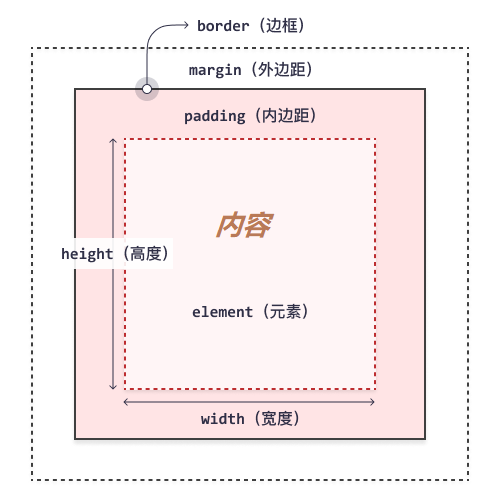
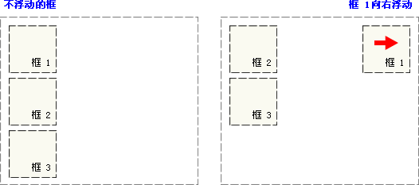
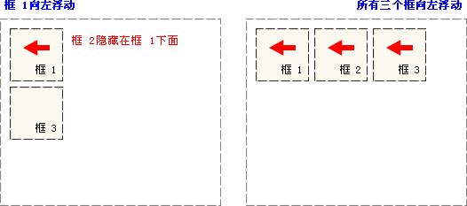
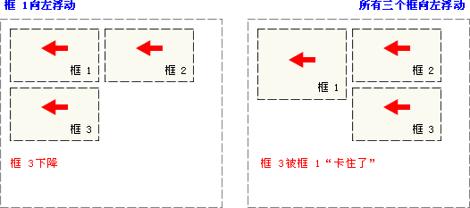

# CSS

本篇整理 CSS 基础内容：CSS 简介、三种使用方式、常用选择器、常用属性，以及基于 DIV+CSS 的布局知识（元素分类、盒模型、浮动与定位）。

## 1. CSS 简介

### 1.1 CSS 是什么

**CSS**（Cascading Style Sheets）即层叠样式表。CSS 可以用来为网页创建样式表，通过样式表对网页进行装饰。所谓层叠，可以将整个网页想象成一层一层的结构，层次高的会覆盖层次低的，CSS 可以分别为网页的各个层次设置样式。

### 1.2 CSS 能做什么

- 修饰美化 HTML 网页；
- 外部样式表可以提高代码复用性，从而提高工作效率；
- HTML 内容与样式表现分离，便于后期维护。

#### 1.2.1 为什么需要 CSS

对比 HTML 标签属性与 CSS 样式：

| 对比项 | HTML 标签属性 | CSS 样式 |
| --- | --- | --- |
| 外观能力 | 有些外观做不到，如链接样式、行距等 | 能实现 HTML 标签属性的所有功能 |
| 内容与样式分离 | 不能实现代码和设计的分离 | 能实现代码和设计的分离，方便团队开发 |
| 整体风格 | 网站整体风格设计会出现代码冗余 | 适用于网站的整体风格设计 |

### 1.3 基础语法

CSS 不能独立使用，必须结合 HTML 使用。CSS 规则由两个主要部分构成：**选择器**，以及一条或多条**声明**：

- 选择器通常用来选择需要改变样式的 HTML 元素；
- 每条声明由一个属性和一个值组成。

```css
/* 这是注释 */
选择器 {
    样式名称1: 样式值1;
    样式名称2: 样式值2;
}
```

注意事项：

- 请使用花括号包围声明；
- 如果值为若干单词，则要给值加引号；
- 多个声明之间使用分号 `;` 分开；
- CSS 本身对大小写不敏感，但当与 HTML 文档一起使用时，class 与 id 名称对大小写敏感。

## 2. CSS 使用方式

### 2.1 行内样式

把 CSS 样式嵌入到 HTML 标签当中，类似属性的用法：

```html
<p style="color:blue; font-size:50px">This is my HTML page.</p>
```

### 2.2 内嵌样式

在 head 标签中使用 style 标签引入 CSS：

```html
<!-- type 告诉浏览器使用 CSS 解析器去解析 -->
<style type="text/css">
    p {
        color: red;
        font-size: 50px;
    }
</style>
```

### 2.3 外联样式

将内嵌样式单独放到一个 `.css` 文件中，HTML 页面通过 `<link>` 标签将 css 文件引入到当前页面中。

link 格式：`<link href="xxx.css文件路径" rel="stylesheet" type="text/css"/>`，用法与内嵌样式相同。

css 文件内容：

```css
/* css 文件 */
p {
    color: blue;
}

#p2 {
    color: yellow;
}
```

html 页面如下：

```html
<!DOCTYPE html>
<html>
    <head>
        <meta charset="UTF-8">
        <title>外联样式</title>
        <!--
            rel：代表当前页面与 href 所指定文档的关系
            type：文件类型，告诉浏览器使用 CSS 解析器去解析
            href：css 文件地址
        -->
        <link rel="stylesheet" type="text/css" href="../css/test.css" />
    </head>
    <body>
        <p>外联样式演示1</p>
        <p id="p2">外联样式演示2</p>
    </body>
</html>
```

> [!TIP]
> 实际开发中优先使用外联样式：样式与结构分离，多个页面可以复用同一份样式文件。

## 3. CSS 选择器

### 3.1 id 选择器

给需要修改样式的 HTML 元素添加 id 属性标识，在 head 中使用 style 标签声明 id 选择器。

格式：`#id值 {属性: 属性值}`。

```html
<style type="text/css">
    #s1 {color: red; font-size: 100px}
    #s2 {color: green; font-size: 100px}
    #s3 {color: blue; font-size: 100px}
</style>

<div id="s1">hello,everyone!</div>
<div id="s2">hello,everyone!</div>
<div id="s3">hello,everyone!</div>
```

每一个 HTML 标签都有一个 id 属性，按照规范一个 id 只能对应一个标签。

### 3.2 class 选择器

给需要修改样式的 HTML 元素添加 class 属性标识，在 head 中使用 style 标签声明 class 选择器。

格式：`.class名 {属性: 属性值}`。

```html
<style type="text/css">
    .s1 {color: purple; font-size: 100px}
    .s2 {color: pink; font-size: 100px}
    .s3 {color: yellow; font-size: 100px}
</style>

<div class="s1">hello,everyone!</div>
<div class="s1">hello,everyone!</div>
<div class="s2">hello,everyone!</div>
<div class="s3">hello,everyone!</div>
```

每一个 HTML 标签都有一个 class 属性，同一类的标签可以设置成相同的 class。

### 3.3 元素选择器

在 head 中使用 style 标签声明元素选择器。

格式：`html标签 {属性: 属性值}`。

```html
<style type="text/css">
    p {color: red; border: 1px solid blue;}
</style>

<p>11111111111</p>
<p>22222222222</p>
```

以上选择器的优先级从高到低：**id 选择器 > class 选择器 > 元素选择器**。

### 3.4 属性选择器

根据元素的属性及属性值来选择元素。在 head 中使用 style 标签声明，格式为：

- `html标签[属性='属性值'] {css属性: css属性值;}`；
- `html标签[属性] {css属性: css属性值;}`。

```html
<style type="text/css">
    input[type='text'] {
        background-color: pink;
    }
    input[type='password'] {
        background-color: yellow;
    }
    font[size] {
        color: green;
    }
    a[href] {
        color: blue;
    }
</style>

<a href="a.html">超链接</a>
<form name="login" action="#" method="get">
    <font size="3">用户名：</font>
    <input type="text" name="username" value="zhangsan"><br>
    <font size="3">密码：</font>
    <input type="password" name="password" value="123456"><br/>
    <input type="submit" value="登录">
</form>
```

### 3.5 伪类选择器

伪类选择器主要针对 a 标签，语法如下：

| 状态 | 语法 | 说明 |
| --- | --- | --- |
| 未访问状态 | `a:link {css属性}` | 超链接未被点击过 |
| 悬浮状态 | `a:hover {css属性}` | 鼠标悬停在上面 |
| 触发状态 | `a:active {css属性}` | 正在被点击 |
| 完成状态 | `a:visited {css属性}` | 已被点击访问过 |

```html
<style>
    a {
        text-decoration: none; /* 删除超链接的下划线 */
    }
    /* 原始状态 */
    a:link {
        color: yellow;
    }
    /* 点击之后的状态 */
    a:visited {
        color: red;
    }
    /* 鼠标悬停上去的状态 */
    a:hover {
        color: blue;
        border: 1px solid black;
    }
    /* 点击的状态 */
    a:active {
        color: black;
    }
</style>

<a href="https://www.sina.com.cn/">新浪</a>
```

> [!NOTE]
> 书写顺序有要求：`a:hover` 必须在 `a:link` 和 `a:visited` 之后才能生效；`a:active` 必须在 `a:hover` 之后才能生效。

### 3.6 后代选择器

后代选择器用于选择一个标签内部包含的另一个标签：

```html
<style>
    .pclass a {
        text-decoration: none;
        color: chocolate;
    }
</style>

<p class="pclass">
    <a href="https://www.sina.com.cn">新浪</a>
</p>
<a href="https://www.baidu.com">百度</a>
```

上面只有 p 内部的新浪链接会生效，p 外面的百度链接不受影响。

### 3.7 选择器分组

可以将不同选择器放在同一组，用逗号分隔，统一设置样式：

```html
<style>
    #p1, a {
        color: red;
    }
</style>

<p id="p1">这是一个段落</p>
<a href="">这是一个超链接</a>
```

### 3.8 通用选择器

通用选择器 `*` 选择页面上的所有 HTML 元素：

```html
<style>
    * {
        color: red;
    }
</style>
```

## 4. CSS 属性

### 4.1 字体属性

用于设置字体的属性，常见属性如下：

| 属性 | 说明 |
| --- | --- |
| font-size | 设置文本的大小 |
| font-family | 设置字体，如宋体、楷体等 |
| font-style | 指定斜体文本 |
| font-weight | 字体粗细，取值可为 100~900 数值、normal、bold、bolder |

```html
<style>
    #p1 {
        font-size: 30px;      /* 设置文本的大小 */
        font-family: "Courier New"; /* 设置字体：宋体、楷体等 */
        font-style: italic;   /* 指定斜体文本：normal 正常显示，italic 斜体显示 */
        font-weight: 100;     /* 指定字体的粗细：normal、bold 等 */
    }
</style>

<p id="p1">hello world</p>
```

为了缩短代码，也可以在一个属性中指定所有单个字体属性。font 属性是以下属性的简写属性：

- font-style
- font-variant
- font-weight
- font-size
- font-family

其中 **font-size** 和 **font-family** 的值是必需的，如果缺少其他值之一，则会使用其默认值：

```html
<style>
    #p2 {
        font: italic bold 20px "Consolas";
    }
</style>

<p id="p2">hello world</p>
```

### 4.2 文本属性

用于对文本进行设置，常见属性如下：

| 属性 | 说明 |
| --- | --- |
| color | 设置文本颜色，可用十六进制或表示颜色的英文单词 |
| text-indent | 缩进元素中文本的首行，如 5px 缩进 5 像素、20% 缩进父容器宽度的百分之二十 |
| text-decoration | 文本的装饰线：none 无、underline 下划线、overline 上划线、line-through 删除线 |
| text-align | 文本水平对齐方式：left、right、center |
| word-spacing | 单词之间的间隔 |
| line-height | 设置文本的行高 |
| text-shadow | 设置阴影及模糊效果，四个取值依次是：水平偏移、垂直偏移、模糊值、阴影颜色 |

```html
<style>
    #p1 {
        color: blue;
        text-decoration: underline;
        text-align: center;
        text-shadow: 20px 2px 2px red;
    }
</style>

<p id="p1">这是一个段落</p>
```

### 4.3 背景属性

用于对背景进行设置，常见属性如下：

| 属性 | 说明 |
| --- | --- |
| background-color | 设置背景色，可用十六进制或表示颜色的英文单词 |
| background-image | 设置背景图片，`url('图片路径')` |
| background-repeat | 设置背景图的平铺方向：repeat-y、repeat-x、repeat、no-repeat |
| background-size | 规定背景图像的尺寸 |
| background-position | 改变图像在背景中的位置：top、bottom、left、right、center |

```html
<style>
    body {
        background-color: red;
        background-image: url("./img/pic1.jpg");
        background-repeat: no-repeat;
        background-size: 100px 100px;
        background-attachment: fixed;
        background-position: bottom center;
    }
</style>
```

### 4.4 列表属性

用于对列表进行设置，常见属性如下：

| 属性 | 说明 |
| --- | --- |
| list-style-type | 改变列表的标识类型：none、disc（默认值）、circle、square、decimal（数字）、lower-latin（小写字母） |
| list-style-image | 用图像表示标识，`url("图片地址")` |
| list-style-position | 标识出现在列表项内容之外还是内部：inside、outside |

```html
<style>
    #ul1 {
        list-style: lower-latin;
    }

    #ul2 {
        list-style-image: url("img/eg_arrow.gif");
    }

    #ul3 {
        list-style-position: inside;
    }

    #ul4 {
        list-style-position: outside;
    }
</style>

<ul id="ul1">
    <li>JavaSE</li>
    <li>JavaWeb</li>
    <li>SSM</li>
</ul>

<ul id="ul2">
    <li>JavaSE</li>
    <li>JavaWeb</li>
    <li>SSM</li>
</ul>

<ul id="ul3">
    <li>JavaSE</li>
    <li>JavaWeb</li>
    <li>SSM</li>
</ul>
<ul id="ul4">
    <li>JavaSE</li>
    <li>JavaWeb</li>
    <li>SSM</li>
</ul>
```

## 5. DIV+CSS 布局

### 5.1 HTML 中元素的分类

HTML 中根据元素显示状态分为**块级（block）元素**和**内联（inline）元素**：

| 分类 | 特点 | 常见元素 |
| --- | --- | --- |
| 块级（block）元素 | 独占一行，默认宽度为容器的 100% | p、h1~h6、table、div（div 本身没有任何含义，可以当成一个盒子，用来包裹其他元素） |
| 内联（inline）元素 | 多个内联元素共处一行 | a、img、input、select、span（span 本身没有任何含义，可以当成一个盒子，用来包裹其他元素） |

CSS 中存在 display 属性，可以改变元素的显示状态：

| 取值 | 说明 |
| --- | --- |
| block | 按块显示 |
| inline | 同行显示 |
| none | 隐藏 |

```html
<style>
    #p1 {
        border: 1px solid blue;
        /* 将段落设置为内联元素 */
        display: inline;
    }

    #p2 {
        border: 1px solid red;
        /* 将段落设置为内联元素 */
        display: inline;
    }

    #a1 {
        border: 1px solid yellowgreen;
        /* 将超链接设置为块级元素 */
        display: block;
    }

    #a2 {
        border: 1px solid brown;
        /* 将超链接设置为块级元素 */
        display: block;
    }

    #p3 {
        /* 隐藏 p3 */
        display: none;
    }
</style>

<body>
    <p id="p1">Java是最好的语言</p>
    <p id="p2">Java No.1</p>
    <a id="a1" href="https://www.baidu.com">百度</a>
    <a id="a2" href="https://www.sina.com.cn">新浪</a>
    <p id="p3">隐藏</p>
</body>
```

### 5.2 盒模型

#### 5.2.1 盒模型简介

所有 HTML 元素都可以视为方框。在 CSS 中，谈论设计和布局时会使用术语"盒模型"（框模型）。CSS 盒模型实质上是一个包围每个 HTML 元素的框，它包括：外边距、边框、内边距以及实际的内容。下图展示了盒模型：



对各部分的说明：

- **内容（content）**：框的内容，其中显示文本和图像；
- **内边距（padding）**：清除内容周围的区域，内边距是透明的；
- **边框（border）**：围绕内边距和内容的边框；
- **外边距（margin）**：清除边界外的区域，外边距是透明的；
- **宽度（width）**：内容区域的宽度；
- **高度（height）**：内容区域的高度。

元素框的最内部分是实际的内容，直接包围内容的是内边距。内边距呈现了元素的背景，内边距的边缘是边框。**背景应用于由内容和内边距、边框组成的区域。**

边框以外是外边距，外边距默认是透明的，因此不会遮挡其后的任何元素。

增加内边距、边框和外边距不会影响内容区域的尺寸，但会增加元素框的总尺寸。使用 CSS 设置元素的 width 和 height 属性时，只需设置内容区域的宽度和高度；要计算元素的完整大小，还必须把内边距、边框和外边距加起来。

#### 5.2.2 与盒模型相关的 CSS 属性

##### 5.2.2.1 宽度和高度

- `width`：设置元素的宽度；
- `height`：设置元素的高度。

##### 5.2.2.2 边框

`border` 用于设置元素的边框，语法：`border: 宽度 样式 颜色`。

边框样式：

| 样式 | 说明 |
| --- | --- |
| none | 无边框 |
| dotted | 点状边框 |
| dashed | 虚线边框 |
| solid | 实线边框 |

`border-radius` 用于创建圆角，语法：`border-radius: 圆角半径`。

##### 5.2.2.3 内边距

`padding` 表示内容与边框之间的距离，其取值规则如下：

| 参数个数 | 作用范围 |
| --- | --- |
| 四个参数 | 按上、右、下、左的顺序作用于四边 |
| 一个参数 | 用于全部的四边 |
| 两个参数 | 第一个用于上、下，第二个用于左、右 |
| 三个参数 | 第一个用于上，第二个用于左、右，第三个用于下 |

除此之外，还有另外四个属性分别设置内边距：`padding-top`、`padding-right`、`padding-bottom`、`padding-left`。

##### 5.2.2.4 外边距

`margin` 表示边框与其他元素之间的距离（围绕在元素周围的空白区域），取值规则与 padding 相同。对应的单边属性为：`margin-top`、`margin-right`、`margin-bottom`、`margin-left`。

##### 5.2.2.5 案例

```html
<style>
    * {
        margin: 0px;
        padding: 0px;
    }

    #div1 {
        border: 1px solid blue;
        height: 50px;
        width: 200px;
        background-color: red;
        margin: 20px 20px;
        padding: 20px 20px;
        border-radius: 5px;
    }
</style>

<body>
    <div id="div1">hello world</div>
</body>
```

### 5.3 浮动属性 float

**普通流定位**：页面元素按照 HTML 元素默认的盒子模型，自上而下（block 元素）或从左到右（inline 元素）的排列次序。

**浮动**：浮动的框可以向左或向右移动，**直到它的外边缘碰到包含框或另一个浮动框的边框为止**。由于浮动框不在文档的普通流中，所以文档的普通流中的块框表现得就像浮动框不存在一样。

如下图所示，当把框 1 向右浮动时，它脱离文档流并且向右移动，直到它的右边缘碰到包含框的右边缘：



当框 1 向左浮动时，它脱离文档流并且向左移动，直到它的左边缘碰到包含框的左边缘。因为它不再处于文档流中，所以它不占据空间，实际上覆盖住了框 2，使框 2 从视图中消失。如果把所有三个框都向左移动，那么框 1 向左浮动直到碰到包含框，另外两个框向左浮动直到碰到前一个浮动框：



如果包含框太窄，无法容纳水平排列的三个浮动元素，那么其它浮动块向下移动，直到有足够的空间。如果浮动元素的高度不同，那么当它们向下移动时可能被其它浮动元素"卡住"：



```html
<style>
    .dd {width: 100px; height: 100px;}
    .d1 {background-color: #f00; height: 120px; float: left;}
    .d2 {background-color: #0f0; float: left;}
    .d3 {background-color: #00f; float: left;}
</style>
<body>
    <div style="width: 299px;">
        <div class="dd d1"></div>
        <div class="dd d2"></div>
        <div class="dd d3"></div>
    </div>
</body>
```

### 5.4 定位属性

**相对定位（relative）**：元素框偏移某个距离，元素仍保持其未定位前的形状，它原本所占的空间仍保留。

```html
<style type="text/css">
    h2.pos_left {
        position: relative;
        left: -20px;
    }
    h2.pos_right {
        position: relative;
        left: 20px;
    }
</style>

<body>
    <h2>这是位于正常位置的标题</h2>
    <h2 class="pos_left">这个标题相对于其正常位置向左移动</h2>
    <h2 class="pos_right">这个标题相对于其正常位置向右移动</h2>
    <p>相对定位会按照元素的原始位置对该元素进行移动。</p>
    <p>样式 "left:-20px" 从元素的原始左侧位置减去 20 像素。</p>
    <p>样式 "left:20px" 向元素的原始左侧位置增加 20 像素。</p>
</body>
```

**绝对定位（absolute）**：元素框从文档流完全删除，并相对于其包含块进行定位。包含块可能是文档中的另一个元素或者初始包含块。元素原先在正常文档流中所占的空间会关闭，就好像元素原来不存在一样。元素定位后生成一个块级框。

```html
<style type="text/css">
    h2.pos_abs {
        position: absolute;
        left: 100px;
        top: 150px;
    }
</style>

<body>
    <h2 class="pos_abs">这是带有绝对定位的标题</h2>
    <p>通过绝对定位，元素可以放置到页面上的任何位置。下面的标题距离页面左侧 100px，距离页面顶部 150px。</p>
</body>
```

**固定定位（fixed）**：元素框的表现类似于将 position 设置为 absolute，不过其包含块是视窗本身。

```html
<style>
    #left {
        width: 200px;
        height: 200px;
        background-color: red;
        position: fixed;
        left: 0px;
        bottom: 0px;
    }
    #right {
        width: 200px;
        height: 200px;
        background-color: green;
        position: fixed;
        right: 0px;
        bottom: 0px;
    }
    #middle {
        width: 200px;
        height: 200px;
        background-color: blue;
        position: fixed;
        left: 50%;
        bottom: 50%;
    }
</style>

<body>
    <div id="left">左下</div>
    <div id="right">右下</div>
    <div id="middle">中间</div>
</body>
```

三种定位方式的对比：

| 定位方式 | 是否脱离文档流 | 定位基准 |
| --- | --- | --- |
| relative | 否，原空间保留 | 元素自身的原始位置 |
| absolute | 是 | 其包含块（最近的已定位祖先元素或初始包含块） |
| fixed | 是 | 浏览器视窗本身 |

### 5.5 注册案例

综合运用盒模型、浮动、选择器等知识完成的注册页面：

```html
<!DOCTYPE html>
<html lang="en">
<head>
    <meta charset="UTF-8">
    <title>注册</title>
    <style>
        * {
            margin: 0px;
            padding: 0px;
            box-sizing: border-box;
        }

        body {
            background-image: url("./img/bg.jpeg");
            background-repeat: no-repeat;
            background-attachment: fixed;
            background-position: top center;
            padding-top: 25px;
        }

        .rg_layout {
            width: 900px;
            height: 500px;
            border: 6px solid darkgray;
            margin: auto;
            background-color: honeydew;
        }

        .rg_left {
            margin: 20px;
            float: left;
        }

        .rg_left p:first-child {
            font-size: 20px;
            color: yellowgreen;
        }

        .rg_left p:last-child {
            font-size: 20px;
            color: lightslategray;
        }

        .rg_center {
            float: left;
        }

        .rg_right {
            margin: 20px;
            float: right;
        }

        .rg_right p a {
            color: lightslategray;
        }

        .td_left {
            width: 100px;
            text-align: right;
            height: 45px;
        }

        .td_right {
            padding-left: 50px;
        }

        #username, #password, #email, #name, #birthday, #tel, #code {
            width: 251px;
            height: 32px;
            border: 1px solid darkgray;
            border-radius: 5px;
            padding-left: 10px;
        }

        #code {
            width: 150px;
        }

        #img_code {
            height: 32px;
            vertical-align: middle;
        }

        #reg_btn {
            width: 150px;
            height: 40px;
            background-color: #0000FF;
        }
    </style>
</head>
<body>
    <div class="rg_layout">
        <div class="rg_left">
            <p>新用户注册</p>
            <p>USER REGISTER</p>
        </div>
        <div class="rg_center">
            <div class="rg_form">
                <form action="#" method="post">
                    <table>
                        <tr>
                            <td class="td_left"><label for="username">用户名</label></td>
                            <td class="td_right"><input type="text" name="username" id="username" placeholder="请输入用户名"></td>
                        </tr>
                        <tr>
                            <td class="td_left"><label for="password">密码</label></td>
                            <td class="td_right"><input type="password" name="password" id="password"></td>
                        </tr>
                        <tr>
                            <td class="td_left"><label for="email">电子邮箱</label></td>
                            <td class="td_right"><input type="email" name="email" id="email"></td>
                        </tr>
                        <tr>
                            <td class="td_left"><label for="name">姓名</label></td>
                            <td class="td_right"><input type="text" name="name" id="name"></td>
                        </tr>
                        <tr>
                            <td class="td_left"><label for="tel">手机号</label></td>
                            <td class="td_right"><input type="text" name="tel" id="tel"></td>
                        </tr>
                        <tr>
                            <td class="td_left"><label>性别</label></td>
                            <td class="td_right">
                                <input type="radio" name="gender" value="male">男
                                <input type="radio" name="gender" value="female">女
                            </td>
                        </tr>
                        <tr>
                            <td class="td_left"><label for="birthday">出生年月</label></td>
                            <td class="td_right"><input type="date" name="birthday" id="birthday"></td>
                        </tr>
                        <tr>
                            <td class="td_left"><label for="code">验证码</label></td>
                            <td class="td_right"><input type="text" name="code" id="code"></td>
                        </tr>
                        <tr>
                            <td align="center" colspan="2"><button id="reg_btn" type="submit">注册</button></td>
                        </tr>
                    </table>
                </form>
            </div>
        </div>
        <div class="rg_right">
            <p>已有帐号?<a href="#">立即登录</a></p>
        </div>
    </div>
</body>
</html>
```

## 6. 本章小结

- CSS 的三种使用方式：行内样式、内嵌样式、外联样式，实际开发优先使用外联样式实现结构与样式分离；
- 常用选择器中，优先级为 id 选择器 > class 选择器 > 元素选择器；属性选择器、伪类选择器、后代选择器、分组与通用选择器可以组合使用；
- 常用属性分四类：字体属性（font 系列）、文本属性（color、text 系列）、背景属性（background 系列）、列表属性（list-style 系列）；
- 块级元素独占一行、内联元素共处一行，display 属性可以改变元素的显示状态；
- 盒模型由内容、内边距、边框、外边距组成，width/height 只设置内容区域大小；
- 浮动使元素脱离文档流并向左/右移动，定位分为相对定位、绝对定位和固定定位三种，定位基准各不相同。
