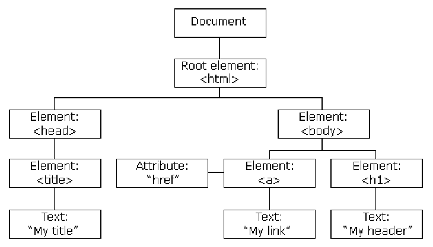
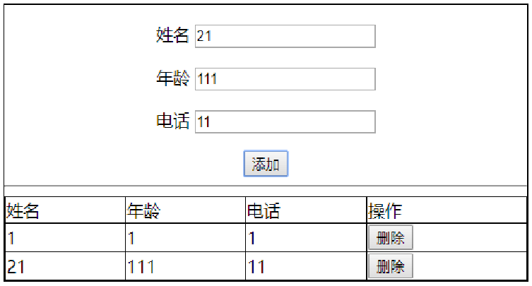
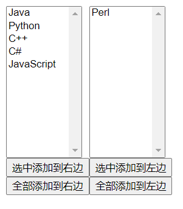
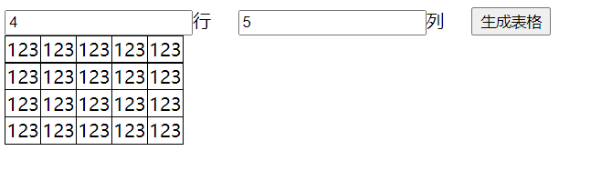

# JavaScript

本篇整理 JavaScript 基础内容：语言概述与组成、使用位置、基础语法（变量、运算符、流程控制、数组、函数、对象）、DOM 操作、表单验证与正则表达式，以及 BOM 常用对象与定时器。

## 1. 概述

### 1.1 JavaScript 简介

JavaScript 是一种**解释性脚本语言**，是一种动态类型、弱类型、基于原型继承的语言，内置支持类型。

它的解释器被称为 JavaScript 引擎，作为浏览器的一部分，广泛用于客户端的脚本语言，用来给 HTML 网页增加动态功能。

脚本语言是为了缩短传统的编写-编译-链接-运行（edit-compile-link-run）过程而创建的计算机编程语言，一个脚本通常是解释执行而非编译。

### 1.2 JavaScript 组成部分

| 组成部分 | 说明 |
| --- | --- |
| ECMAScript | 也叫解释器，充当翻译角色，是 JavaScript 的核心部分 |
| DOM | 文档对象模型（Document Object Model），赋予 JavaScript 操作 HTML 的能力，即 Document 操作 |
| BOM | 浏览器对象模型（Browser Object Model），赋予 JavaScript 操作浏览器的能力，即 Window 操作 |

### 1.3 为什么要学习 JavaScript

HTML 定义了网页的内容，CSS 描述了网页的布局，JavaScript 为网页添加行为，让网页具有"动"的效果，能够增加网页的功能、提升用户体验。它是 Web 开发人员必须学习的 3 门前端语言中的一门。

### 1.4 学习的目的

用于创建具有交互性较强的页面：

- **动态更改内容**；
- **数据验证**。

### 1.5 JavaScript 与 Java 的关系

雷锋和雷峰塔的关系——除了名字相近，两者是完全不同的语言。

## 2. 使用位置及运行说明

### 2.1 使用位置

**写在 head 中**：

```html
<!DOCTYPE html>
<html>
    <head>
        <meta charset="UTF-8">
        <title>JS在Head中使用</title>
        <script>
            // JavaScript 在 Head 中运行
            // 弹框
            alert("hello world");
            // 在浏览器的控制台打印信息
            console.log("在console打印。。。。");
        </script>
    </head>
    <body>
    </body>
</html>
```

**写在 body 中**：

```html
<!DOCTYPE html>
<html>
    <head>
        <meta charset="UTF-8">
        <title>JS在body中使用</title>
    </head>
    <body>
        <script>
            alert("hello world");
        </script>
    </body>
</html>
```

**写在单独的 JavaScript 文件中**：将 JavaScript 代码单独放到一个 `.js` 文件中，HTML 文件引用。

test.js 文件内容：

```javascript
/* 弹出 hello world */
alert("hello world");
```

HTML 文件引用：

```html
<!DOCTYPE html>
<html>
    <head>
        <meta charset="UTF-8">
        <title>在外部JS文件中使用</title>
        <script type="text/javascript" src="../js/test.js">
            /*
             * 如果引入了外部 JS 文件，引入文件的 script 标签内部的代码不起作用。
             * 如果需要运行其他的 JS 代码，重新写一组 script 标签
             */
        </script>
        <script>
            alert("*****");
        </script>
    </head>
    <body>
    </body>
</html>
```

**嵌入 HTML 标签的事件中**：

```html
<!DOCTYPE html>
<html>
    <head>
        <meta charset="UTF-8">
        <title>结合事件使用</title>
    </head>
    <body>
        <!--
            button 按钮
            onclick：鼠标单击事件
        -->
        <input type="button" onclick="alert('hello world');" />
    </body>
</html>
```

### 2.2 如何运行

1. 自动执行型；
2. 事件驱动型：通过 HTML 元素事件触发执行，如按钮的 onclick 事件。

## 3. JavaScript 基础语法

### 3.1 变量

在 JavaScript 中，任何变量都用 `var` 关键字来声明，var 是 variable 的缩写。

```javascript
var a;
```

var 是声明关键字，a 是变量名，语句以分号结尾。值得注意的是，JavaScript 中的关键字不可以作为变量名，就像在 Java 中不可以写 `int int = 1;` 一样。

JavaScript 的部分关键字：

```text
abstract、else、instanceof、super、boolean、enum、int、switch、break、export、interface、synchronized、byte、extends、let、this、case、false、long、throw、catch、final、native、throws、char、finally、new、transient、class、float、null、true、const、for、package、try、continue、function、private、typeof、debugger、goto、protected、var、default、if、public、void、delete、implements、return、volatile、do、import、short、while、double、in、static、with
```

变量的数据类型有六种：number、string、boolean、undefined（未定义）、null（空值）、object。在 JavaScript 中，当一个变量未被初始化时，它的值为 undefined。

判断变量是哪种数据类型：使用 `typeof` 运算符。

```html
<!DOCTYPE html>
<html>
    <head>
        <meta charset="UTF-8">
        <title>变量</title>
        <script>
            /*
                1. Java 定义变量：数据类型 变量名 = 初始值;
                2. JavaScript 的数据类型：
                    string 字符串
                    number 数字
                    boolean 布尔 true false
                    object 对象
                    null 空值
                    undefined 未定义
                3. JavaScript 变量定义（弱类型的编程语言）：
                    1) var 变量名 = 初始值;
                    2) var 变量名;
                4. typeof 确认变量是什么类型
                5. 变量命名规则：
                    1) 字母、数字、_、$
                    2) 不能以数字开头
                    3) 区分大小写
            */
            // 定义字符串类型变量 string
            var name = "张三";
            console.log(typeof name);
            // 定义数字类型变量 number
            var age = 10;
            console.log(typeof age);
            // 未初始化的变量，值为 undefined
            var a;
            console.log(a);
        </script>
    </head>
    <body>
    </body>
</html>
```

### 3.2 运算符

算术运算：

| 名称 | 运算符 |
| --- | --- |
| 加 | + |
| 减 | - |
| 乘 | * |
| 除 | / |
| 求余 | % |
| 赋值 | = |
| 加等 | += |
| 减等 | -= |
| 除等 | /= |
| 乘等 | *= |
| 求余等 | %= |
| 自增 | ++ |
| 自减 | -- |

逻辑运算：

| 名称 | 运算符 | 描述 |
| :---: | :---: | --- |
| 与 | && | 要求表达式左右两边的表达式同为 true，整体结果才为 true |
| 或 | \|\| | 要求表达式左右两边的表达式只要有一个为 true，整体结果就为 true |
| 非 | ! | 将布尔值取反操作 |

关系运算：

| 名称 | 运算符 |
| :---: | :---: |
| 等于 | == |
| 小于 | < |
| 小于或等于 | <= |
| 大于 | > |
| 大于或等于 | >= |
| 不等于 | != |
| 值和类型相同 | === |

三目运算符：`?:`。

数据类型转换：从网页获取的数据都是字符串，如果要进行运算，需要转换成相应的 number 类型，常用 `parseInt` 和 `parseFloat`。

```html
<!DOCTYPE html>
<html>
    <head>
        <meta charset="UTF-8">
        <title>运算符</title>
        <script>
            /*
             * 几乎和 Java 一致
             * ==    比较"值"
             * ===   比较"值"和"类型"
             */
            var a = 10;
            var b = "10";
            console.log(a == b);   // true，只比较值
            console.log(a === b);  // false，值相同但类型不同
            /*
             * +
             *     1) 加法运算
             *     2) 如果和字符串进行 + 运算，就变成了字符串拼接
             * string ----> number
             *     1) parseInt()
             *     2) parseFloat()
             */
            var m = 100;
            console.log(a + m);
            console.log(a + b);
            // string ----> number
            console.log(a + parseInt(b));
            console.log(a + parseFloat("10.5"));
        </script>
    </head>
    <body>
    </body>
</html>
```

### 3.3 控制流程

#### 3.3.1 分支结构

**if-else 分支**：

```javascript
var a = 1;
var b = 1;
if (a == b) {
    document.write("相等");
} else {
    document.write("不相等");
}
// 运行结果是"相等"。
// 这就是 if-else 的结构，和 Java 语言是一样的。
```

**switch 分支**：

```javascript
var a = 2;
switch (a) {
    case 1:
        document.write("值为1");
        break;
    case 2:
        document.write("值为2");
        break;
    case 3:
        document.write("值为3");
        break;
    default:
        document.write("值不是3也不是2也不是1");
}
```

三种程序结构综合示例：

```javascript
/*
    三种程序结构
        1) 顺序结构
        2) 分支结构：if、switch
        3) 循环结构
*/
var score = 80;
/* 分支结构 if */
if (score >= 60) {
    console.log("及格");
} else {
    console.log("不及格");
}

/* 分支结构 switch，score 取值范围 0~100 */
switch (parseInt(score / 60)) {
    case 1:
        console.log("及格");
        break;
    case 0:
        console.log("不及格");
        break;
}
```

#### 3.3.2 循环结构

**for 循环**：

```javascript
var a = 0;
for (var i = 1; i <= 100; i++) {
    a += i;
}
document.write(a);
// 上述代码是对 1~100 求和。
```

**while 循环**：

```javascript
var a = 0;
var i = 1;
while (i <= 100) {
    a += i;
    i++;
}
document.write(a);
// 上述代码是对 1~100 求和。
```

**do-while 循环**：

```javascript
var a = 0;
var i = 1;
do {
    a += i;
    i++;
} while (i <= 100);
document.write(a);
// 上述代码是对 1~100 求和。
```

**break 与 continue 关键字**：

- break 用于结束整个循环；
- continue 用于结束本次循环。

打印 99 乘法表：

```javascript
/*
    打印 99 乘法表
*/
for (var i = 1; i <= 9; i++) {
    for (var j = 1; j <= i; j++) {
        /* 在网页当中输出内容 */
        document.write(j + "X" + i + "=" + j * i + "&nbsp;&nbsp;&nbsp;");
    }
    document.write("<br/>");
}
```

### 3.4 数组

数组的定义：

```javascript
// 方式1：字面量
var arr = ["123", 1, "111"];
// 方式2：指定长度
var arr = new Array(数组的长度);
// 方式3：指定元素
var arr = new Array(1, "2", "aaa");
```

通过下标访问数组的元素，下标范围为 0 ~ length-1。

数组的常用方法：

| 方法 | 说明 |
| --- | --- |
| concat | 数组合并 |
| reverse | 数组逆序 |
| push() | 数组末尾添加新元素 |
| pop() | 删除数组最后的元素 |

```html
<!DOCTYPE html>
<html>
    <head>
        <meta charset="UTF-8">
        <title>数组</title>
        <script>
            /* 数组的定义 方式1 */
            var arr = ["123", 5, "100", false];
            /* 数组的定义 方式2 */
            var arr1 = new Array(4);
            /* 访问数组元素 */
            arr1[0] = 10;
            arr1[1] = 100;
            arr1[2] = 1000;
            arr1[3] = 10000;
            /* 数组的定义 方式3 */
            var arr2 = new Array("555", 100, false);
            /* 访问越界的元素，返回 undefined */
            console.log(arr[8]);
            /* 数组的遍历 */
            for (var i = 0; i < arr.length; i++) {
                console.log(arr[i]);
            }
            /* 数组的合并：两个数组合并 */
            var arr3 = arr.concat(arr1);
            console.log(arr3);
            arr.reverse();
            console.log(arr);
            /* 数组末尾添加元素 */
            arr2.push("****");
            console.log(arr2);
            /* 数组末尾删除元素 */
            arr2.pop();
            console.log(arr2);
        </script>
    </head>
    <body>
    </body>
</html>
```

### 3.5 自定义函数

**函数定义方式1**（参数列表不用写参数类型）：

```javascript
function 函数名(参数列表) {
    函数体
    return 返回值;
}
```

**函数定义方式2**：

```javascript
var 函数名 = function(参数列表) {
    函数体
    return 返回值;
}
```

```html
<!DOCTYPE html>
<html>
    <head>
        <meta charset="UTF-8">
        <title>自定义函数</title>
        <script>
            /* 求和1 */
            function sum1(a, b) {
                return a + b;
            }
            /* 求和2 */
            var sum2 = function(a, b) {
                return a + b;
            }

            /* 函数调用 */
            var result1 = sum1(1, 5);
            console.log(result1);
            var result2 = sum2(1, 5);
            console.log(result2);
        </script>
    </head>
    <body>
    </body>
</html>
```

### 3.6 常见弹窗函数

**alert 弹框**：这是一个只能点击确定按钮的弹窗。alert 方法没有返回值，也就是说如果用一个变量去接收返回值，将会得到 undefined，无论点击"确定"还是右上角的"X"关闭。

```javascript
alert("你好");
```

**confirm 弹框**：这是一个可以点击确定或者取消的弹窗。confirm 方法与 alert 不同，它的返回值是 boolean：点击"确定"时返回 true；点击"取消"或右上角的"X"关闭，都返回 false。

```javascript
confirm("你好");
```

**prompt 弹框**：这是一个可以输入文本内容的弹窗。

- 第一个参数是提示信息，第二个参数是用户输入的默认值；
- 点击确定时返回用户输入的内容；点击取消或者关闭时返回 null。

```javascript
prompt("你爱学习吗？", "爱");
```

### 3.7 对象

JavaScript 对象是拥有属性和方法的数据：

- **属性**是与对象相关的值；
- **方法**是能够在对象上执行的动作。

定义属性：`属性名: 属性值`；访问属性：`对象名.属性名` 或 `对象名[属性名]`。

定义方法：

```javascript
方法名: function(参数列表) {
    // 方法体
}
```

调用方法：`对象名.方法名()`。

```html
<!DOCTYPE html>
<html>
    <head>
        <meta charset="UTF-8">
        <title>对象</title>
        <script>
            /*
                定义一个表示人的对象
                    属性：  "属性名": 属性值
                    方法：  "方法名": function(参数列表) {
                                方法体
                            }
            */
            var person = {
                "name": "zhangsan",
                "age": 10,
                "gender": "male",
                "addr": "dxy",
                "walk": function() {
                    console.log("person walk.....");
                }
            };

            /*
             * 1. 访问对象当中的属性
             *        对象名.属性名
             *        对象名[属性名]
             * 2. 访问对象当中的方法
             *        对象名.方法名()
             */
            console.log(person["age"]);
            person.walk();
        </script>
    </head>
    <body>
    </body>
</html>
```

## 4. DOM

### 4.1 DOM 简介

当网页被加载时，浏览器会创建页面的文档对象模型（Document Object Model），DOM 模型被构造为对象的树。



通过可编程的对象模型，JavaScript 获得了足够的能力来创建动态的 HTML：

- JavaScript 能够改变页面中的所有 HTML 属性；
- JavaScript 能够对页面中的所有事件做出反应；
- JavaScript 能够改变页面中的所有 CSS 样式。

### 4.2 操作元素

document 对象表示整个 HTML 文档，通过 document 对象可以获取到 HTML 文档中的所有内容。

#### 4.2.1 向页面输出内容

`write(输出的内容);`

> [!WARNING]
> 绝对不要在文档（DOM）加载完成之后使用 document.write()，这会覆盖整个文档。

```html
<!DOCTYPE html>
<html>
    <head>
        <meta charset="UTF-8">
        <title>向页面输出内容</title>
        <script>
            // 通过 document 对象向页面输出内容
            document.write("hello world");
        </script>
    </head>
    <body>
    </body>
</html>
```

#### 4.2.2 获取 HTML 元素

| 方法 | 说明 |
| --- | --- |
| `document.getElementById('元素ID值')` | 返回与给定 id 属性值对应的元素对象；**用的最多，必须记住** |
| `document.getElementsByClassName("类名")` | 返回一个对象数组，每个对象对应着文档中拥有给定 class 的一个元素 |
| `document.getElementsByName('元素name值')` | 返回拥有给定 name 属性的元素集合 |
| `document.getElementsByTagName('标签名称')` | 返回拥有给定标签名的元素集合，只有一个参数，参数是标签的名字 |

```html
<!DOCTYPE html>
<html>
    <head>
        <meta charset="UTF-8">
        <title>获取HTML元素</title>
        <script>
            /*
                获取 HTML 元素的方式
                    1) document.getElementById("元素的id值");    最重要
                    2) document.getElementsByClassName("元素的类名")
                    3) document.getElementsByName("元素属性name的值")
                    4) document.getElementsByTagName("元素的标签名称")
            */
            // document.getElementById("元素的id值") 获取 html 元素
            var p1 = document.getElementById("p1");
            console.log(p1);
            /*
                目前存在的问题：getElementById("p1") 返回 null，没有按照预期获取到 html 元素。
                原因：浏览器解析 html 文件按照从上到下的方式解析，还没解析到想要操作的元素就运行了 JS 代码。
                如何解决：
                    1) 将 JavaScript 代码放到网页的最下面，待整个网页元素都被加载后再运行 JavaScript 代码
                    2) 借助事件，待整个网页元素都被加载后再运行 JavaScript 代码。
                        |---- 为 body 添加 onload 事件：当文档加载完成时运行脚本
                              |---- 在 body 中添加 onload 事件，为 onload 事件绑定函数，
                                    这样整个 body 加载完成时就会触发 onload 事件
                        |---- 为 window 对象添加 onload 事件
            */
            // window.onload = function test1() {
            //     p1 = document.getElementById("p1");
            //     console.log(p1);
            // }
            function test() {
                // document.getElementById("元素的id值") 获取 html 元素
                p1 = document.getElementById("p1");
                console.log(p1);
                // document.getElementsByClassName("元素的类名") 获取 html 元素
                var pclass = document.getElementsByClassName("pclass");
                // 获取数组长度
                console.log(pclass.length);
                // 遍历数组
                for (var index = 0; index < pclass.length; index++) {
                    console.log(pclass[index]);
                }
                // document.getElementsByName("元素的name值")
                var hname = document.getElementsByName("hname");
                console.log(hname.length);
                for (var index = 0; index < hname.length; index++) {
                    console.log(hname[index]);
                }
                // document.getElementsByTagName("元素的标签名称")
                var pall = document.getElementsByTagName("p");
                console.log(pall.length);
                for (var index = 0; index < pall.length; index++) {
                    console.log(pall[index]);
                }
            }
        </script>
    </head>
    <body onload="test()">
        <p id="p1">段落1</p>
        <p class="pclass">段落2</p>
        <p class="pclass">段落3</p>
        <h3 class="pclass">三级标题</h3>
        <h3 name="hname">三级标题</h3>
        <h3 name="hname">三级标题</h3>
        <p>段落4</p>
    </body>
</html>
```

#### 4.2.3 普通元素内容操作

获取值：

```javascript
var strValue = document.getElementById('元素ID值').innerText;
var strValue = document.getElementById('元素ID值').innerHTML;
```

赋值（显示动态值）：

```javascript
document.getElementById('元素ID值').innerText = 动态值;
document.getElementById('元素ID值').innerHTML = 动态值;
```

innerText 和 innerHTML 的区别：

| 属性 | 区别 |
| --- | --- |
| innerText | 只对文本处理 |
| innerHTML | 可以解析 HTML 标签 |

```html
<!DOCTYPE html>
<html>
    <head>
        <meta charset="UTF-8">
        <title>普通元素内容操作</title>
        <script>
            /*
                普通元素内容操作
                1) 获取元素里面的内容
                    |---元素对象.innerText     获取元素当中的文本信息
                    |---元素对象.innerHTML     获取元素当中的 HTML 标签及标签中的内容
                2) 设置元素里面的内容
                    |---元素对象.innerText = "内容"
                    |---元素对象.innerHTML = "内容"
            */
            // body 加载完成之后运行的方法
            function init() {
                // 获取元素当中的文本信息
                var txtp1 = document.getElementById("p1").innerText;
                console.log(txtp1);
                var txtdiv1 = document.getElementById("div1").innerText;
                console.log(txtdiv1);
                var htmldiv1 = document.getElementById("div1").innerHTML;
                console.log(htmldiv1);

                // 设置元素当中的内容
                document.getElementById("p1").innerText = "**********************";
                document.getElementById("div1").innerHTML = "<h1>这是一个一级标题</h1>";
            }
        </script>
    </head>
    <body onload="init()">
        <p id="p1">这是一个段落1</p>
        <div id="div1">
            <p>这是一个段落2</p>
        </div>
    </body>
</html>
```

#### 4.2.4 表单元素内容操作

从元素获取值：`var strValue = document.getElementById('表单元素id值').value;`

给元素赋值（显示动态值）：`document.getElementById('表单元素id值').value = 动态值;`

> [!NOTE]
> 从表单元素中获取的值都是字符串类型，如需数值计算需要进行数据类型转换：`parseInt`、`parseFloat`。

```html
<!DOCTYPE html>
<html>
    <head>
        <meta charset="UTF-8">
        <title>表单元素内容操作</title>
        <script>
            /*
                表单元素内容操作
                1) 获取元素的内容：元素对象.value
                2) 设置元素的内容：元素对象.value = "内容"
            */
            function init() {
                var val = document.getElementById("username").value;
                console.log(val);
                document.getElementById("username").value = "Tom";
            }

            function clickFun() {
                alert(document.getElementById("username").value);
            }
        </script>
    </head>
    <body onload="init()">
        <input id="username" type="text" value="****"  />
        <input id="btn" type="button" onclick="clickFun()" value="按钮" />
    </body>
</html>
```

#### 4.2.5 属性操作

- 获取属性：`getAttribute("属性名");`
- 设置属性：`setAttribute("属性名", "属性值");`

```html
<!DOCTYPE html>
<html>
    <head>
        <meta charset="UTF-8">
        <title>元素属性操作</title>
        <style>
            .pclass {
                border: 1px solid black;
                color: yellow;
                text-align: center;
            }
        </style>
        <script>
            /*
                元素属性操作
                1) 获取元素的属性的值：元素对象.getAttribute("属性名");
                2) 设置元素的属性：元素对象.setAttribute("属性名", "属性值");
            */
            function init() {
                // 获取所有 p 元素的 id 属性的值并打印
                var allp = document.getElementsByTagName("p");
                for (var index = 0; index < allp.length; index++) {
                    // 获取元素的属性的值
                    console.log(allp[index].getAttribute("id"));
                    // 设置元素的属性
                    allp[index].setAttribute("class", "pclass");
                }
            }
        </script>
    </head>
    <body onload="init()">
        <p id="p1">这是一个段落1</p>
        <p id="p2">这是一个段落2</p>
    </body>
</html>
```

#### 4.2.6 元素操作

| 方法 | 说明 |
| --- | --- |
| `createElement()` | 创建元素节点 |
| `appendChild()` | 把新的子节点添加到指定节点。如需向 HTML DOM 添加新元素，首先必须创建该元素，然后把它追加到已有的元素上；新元素作为父元素的最后一个子元素进行添加 |
| `removeChild()` | 删除子节点 |
| `replaceChild()` | 替换子节点 |
| `insertBefore()` | 在指定的子节点前面插入新的子节点 |
| `createTextNode()` | 创建文本节点 |



案例：向表格中动态添加行、删除行：

```html
<!DOCTYPE html>
<html>
    <head>
        <meta charset="UTF-8">
        <title>元素操作</title>
        <style>
            #main {
                margin: 0 auto; /* 设置整个盒子居中，一定要设置宽度 */
                width: 500px;
            }

            p {
                text-align: center; /* 设置段落中的内容居中 */
            }

            table {
                width: 500px;
                border-collapse: collapse; /* 去除边框中间的空白区域 */
            }

            table, tr, td {
                border: 1px solid black;
            }
        </style>
        <script>
            // 在表格中添加信息
            function addItem() {
                /*
                    如何为表格添加信息？
                        1. 在表格中添加信息，就是添加行；
                        2. 行当中要添加单元格；
                        3. 单元格中添加信息、按钮。

                    主要操作：
                        1. 获取表单中的信息    document.getElementById("id").value    createTextNode()
                        2. 创建按钮    createElement()
                        3. 创建单元格，在单元格中添加相关内容    createElement() appendChild()
                        4. 创建行，在行中添加单元格    createElement() appendChild()
                        5. 将行添加到表格中    appendChild()
                */
                // 创建行
                var line = document.createElement("tr");

                // 创建存放姓名的单元格
                var tdName = document.createElement("td");
                // 创建一个表示姓名的文本节点
                var txtName = document.createTextNode(document.getElementById("username").value);
                // 将表示姓名的文本节点添加到存放姓名的单元格中
                tdName.appendChild(txtName);

                // 创建存放年龄的单元格
                var tdAge = document.createElement("td");
                // 创建一个表示年龄的文本节点
                var txtAge = document.createTextNode(document.getElementById("age").value);
                // 将表示年龄的文本节点添加到存放年龄的单元格中
                tdAge.appendChild(txtAge);

                // 创建存放电话的单元格
                var tdTel = document.createElement("td");
                // 创建一个表示电话的文本节点
                var txtTel = document.createTextNode(document.getElementById("tel").value);
                // 将表示电话的文本节点添加到存放电话的单元格中
                tdTel.appendChild(txtTel);

                // 创建存放删除按钮的单元格
                var tdDel = document.createElement("td");
                // 创建删除按钮
                var btnDel = document.createElement("input");
                // 设置按钮的属性
                btnDel.setAttribute("type", "button");
                btnDel.setAttribute("value", "删除");
                // 为删除按钮绑定单击事件
                btnDel.onclick = delTem;
                // 将删除按钮添加到存放删除按钮的单元格中
                tdDel.appendChild(btnDel);

                // 将单元格添加到行中
                line.appendChild(tdName);
                line.appendChild(tdAge);
                line.appendChild(tdTel);
                line.appendChild(tdDel);

                // 将行添加到表格中
                var tb = document.getElementById("tb1");
                tb.appendChild(line);
            }

            function delTem() {
                /*
                    如何删除按钮所在的行？
                        父元素.removeChild(子元素);
                        table.removeChild(行)
                        如何获取 table？如何获取按钮所在的行？
                        this 表示调用当前方法的对象（即被点击的删除按钮）
                */
                var line = this.parentNode.parentNode;
                var tb = this.parentNode.parentNode.parentNode;
                tb.removeChild(line);
            }
        </script>
    </head>
    <body>
        <div id="main">
            <div id="divform">
                <form>
                    <p>
                        <label>姓名</label>
                        <input type="text" id="username" />
                    </p>
                    <p>
                        <label>年龄</label>
                        <input type="text" id="age" />
                    </p>
                    <p>
                        <label>电话</label>
                        <input type="text" id="tel"/>
                    </p>
                    <p>
                        <button type="button" onclick="addItem()">添加</button>
                    </p>
                </form>
            </div>
            <hr/>
            <div id="divtable">
                <table id="tb1">
                    <tr>
                        <td>姓名</td>
                        <td>年龄</td>
                        <td>电话</td>
                        <td>操作</td>
                    </tr>
                </table>
            </div>
        </div>
    </body>
</html>
```

案例：移动列表元素：



```html
<!DOCTYPE html>
<html lang="en">
<head>
    <meta charset="UTF-8">
    <title>Title</title>
    <script>
        function allToLeft() {
            var selectLeft = document.getElementById("selectLeft");
            var selectRight = document.getElementById("selectRight");

            var optsRight = selectRight.getElementsByTagName("option");
            for (let i = 0; i < optsRight.length; i++) {
                selectLeft.appendChild(optsRight[i]);
                i--;
            }
        }

        function allToRight() {
            var selectLeft = document.getElementById("selectLeft");
            var selectRight = document.getElementById("selectRight");

            var optsLeft = selectLeft.getElementsByTagName("option");
            for (let i = 0; i < optsLeft.length; i++) {
                selectRight.appendChild(optsLeft[i]);
                i--;
            }
        }

        function selectedToLeft() {
            var selectLeft = document.getElementById("selectLeft");
            var selectRight = document.getElementById("selectRight");

            var optsRight = selectRight.getElementsByTagName("option");
            for (let i = 0; i < optsRight.length; i++) {
                if (optsRight[i].selected == true) {
                    selectLeft.appendChild(optsRight[i]);
                    i--;
                }
            }
        }

        function selectedToRight() {
            var selectLeft = document.getElementById("selectLeft");
            var selectRight = document.getElementById("selectRight");

            var optsLeft = selectLeft.getElementsByTagName("option");
            for (let i = 0; i < optsLeft.length; i++) {
                if (optsLeft[i].selected == true) {
                    selectRight.appendChild(optsLeft[i]);
                    i--;
                }
            }
        }
    </script>
</head>
<body>
    <div id="s1" style="float:left;">
        <div>
            <select id="selectLeft" multiple="multiple" style="width:100px;height:200px;">
                <option>Java</option>
                <option>Python</option>
                <option>C++</option>
                <option>C#</option>
                <option>JavaScript</option>
            </select>
        </div>

        <div>
            <input type="button" value="选中添加到右边" onclick="selectedToRight()"/><br/>
            <input type="button" value="全部添加到右边" onclick="allToRight()"/>
        </div>
    </div>

    <div id="s2" style="float: left;">
        <div>
            <select id="selectRight" multiple="multiple" style="width:100px;height:200px;">
                <option>Perl</option>
            </select>
        </div>

        <div>
            <input type="button" value="选中添加到左边" onclick="selectedToLeft()"/><br/>
            <input type="button" value="全部添加到左边" onclick="allToLeft()"/>
        </div>
    </div>
</body>
</html>
```

> [!TIP]
> `appendChild()` 会把元素从原来的父节点"搬走"再追加到新父节点，所以每次 append 后集合长度会减一，循环中执行 `i--` 就是配合这一特性实现的。

案例：动态生成表格：



```html
<!DOCTYPE html>
<html lang="en">
<head>
    <meta charset="UTF-8">
    <title>元素操作</title>
    <style>
        #tb, tr, td {
            border: 1px solid black;
        }

        #tb {
            border-collapse: collapse;
        }
    </style>
    <script>
        function generateTable(rows, cols) {
            var tb = document.getElementById("tb");
            for (var i = 0; i < rows; i++) {
                var line = document.createElement("tr");
                for (var j = 0; j < cols; j++) {
                    var txt = document.createTextNode("123");
                    var col = document.createElement("td");
                    col.appendChild(txt);
                    line.appendChild(col);
                }
                tb.appendChild(line);
            }
        }
    </script>
</head>
<body>
    <div>
        <div>
            <input type="number" id="rows" />行&nbsp;&nbsp;&nbsp;&nbsp;
            <input type="number" id="cols" />列&nbsp;&nbsp;&nbsp;&nbsp;
            <button type="button" onclick="generateTable(document.getElementById('rows').value, document.getElementById('cols').value)">生成表格</button>
        </div>
        <div>
            <table id="tb">

            </table>
        </div>
    </div>
</body>
</html>
```

### 4.3 操作 CSS

HTML DOM 允许 JavaScript 改变 HTML 元素的样式，语法为：

```javascript
document.getElementById(id).style.property = 新样式;
// 例如
document.getElementById('元素的id').style.color = "red";
```

```html
<!DOCTYPE html>
<html>
    <head>
        <meta charset="UTF-8">
        <title>CSS操作</title>
        <style>
            #p1 {
                color: black;
                border: 1px solid black;
                background-color: blue;
            }
        </style>
        <script>
            function test() {
                // 设置元素的 CSS
                document.getElementById("p1").style.color = "red";
            }
        </script>
    </head>
    <body onload="test()">
        <p id="p1">这是一个段落</p>
    </body>
</html>
```

另一个案例：变色、隐藏/显示、悬停展开菜单：

```html
<!DOCTYPE html>
<html lang="en">
<head>
    <meta charset="UTF-8">
    <title>操作CSS</title>
    <style>
        * {
            margin: 0px;
            padding: 0px;
        }

        ul {
            display: none;
            list-style-type: none;
        }

        p, li {
            border: 1px solid black;
            width: 80px;
            height: 25px;
            text-align: center;
        }

        p {
            background-color: blanchedalmond;
        }

        li {
            background-color: lightslategray;
        }

        li:hover {
            background-color: gold;
        }
    </style>
    <script>
        function chgColor() {
            document.getElementById("p1").style.color = 'blue';
        }

        function hideOrShow() {
            // 判断当前状态，如果隐藏就显示，如果显示就隐藏
            if (document.getElementById("p1").style.display == 'none') {
                document.getElementById("p1").style.display = 'block';
            } else {
                document.getElementById("p1").style.display = 'none';
            }
        }

        function showUl() {
            document.getElementById("ul1").style.display = "block";
        }

        function hideUl() {
            document.getElementById("ul1").style.display = "none";
        }
    </script>
</head>
<body>
    <p id="p1" style="color: red;">11111</p>
    <button onclick="chgColor()">变色</button>
    <button onclick="hideOrShow()">隐藏/显示</button>

    <div style="width: 80px;" onmouseenter="showUl()" onmouseleave="hideUl()">
        <p>菜单</p>
        <ul id="ul1">
            <li>Java</li>
            <li>C++</li>
            <li>Python</li>
        </ul>
    </div>
</body>
</html>
```

### 4.4 事件驱动

**事件**：发生在 HTML 元素上的事情。

常见 HTML 事件列表：

| 事件 | 说明 |
| --- | --- |
| onclick | 鼠标点击某个对象 |
| ondblclick | 鼠标双击某个对象 |
| onblur | 元素失去焦点 |
| onfocus | 元素获得焦点 |
| onchange | 元素内容或选中状态发生改变 |
| onload | 文档或图像加载完成 |
| onabort | 图像加载被中断 |
| onkeydown | 某个键盘的键被按下 |
| onkeypress | 某个键盘的键被按下或按住 |
| onkeyup | 某个键盘的键被松开 |
| onmousedown | 某个鼠标按键被按下 |
| onmouseup | 某个鼠标按键被松开 |
| onmousemove | 鼠标被移动 |
| onmouseout | 鼠标从某元素移开 |
| onmouseover | 鼠标被移到某元素之上 |

在事件发生时，可以执行一些 JS 代码：

```html
<!DOCTYPE html>
<html>
    <head>
        <meta charset="UTF-8">
        <title>事件</title>
        <script>
            /*
                事件：在 html 上发生的事情
                    onclick：鼠标单击事件
                    onfocus：获得焦点事件
                    onblur：失去焦点事件
                    onload：文档加载完成事件
                为事件绑定函数
                注意：
                    1. 事件绑定的函数可以传递参数
                    2. 一个 dom 元素可以绑定多个事件
            */
            function btnClk(txt) {
                alert(txt);
            }

            // onblur 触发的事件：非空校验
            function blr() {
                var name = document.getElementById("username").value;
                if (name == "") {
                    alert("用户名不能为空...");
                }
            }

            // onfocus 触发的事件：清空用户名
            function fcs() {
                document.getElementById("username").value = "";
            }
        </script>
    </head>
    <body>
        <input type="text" id="username" onblur="blr()" onfocus="fcs()"/>
        <input type="button" value="按钮" onclick="btnClk(document.getElementById('username').value)" />
    </body>
</html>
```

全选案例：

```html
<!DOCTYPE html>
<html>
    <head>
        <meta charset="UTF-8">
        <title>全选案例</title>
        <script>
            /*
                1. 实现页面；
                2. 确定复选框选中和没有选中如何确定：
                    dom 对象当中的 checked 属性
                        |----true    选中
                        |----false   没有选中
                3. 分析
                    全选----将所有 checkbox 的 checked 属性设置为 true
                    全不选--将所有 checkbox 的 checked 属性设置为 false
                    反选----对 checkbox 当前的 checked 属性取反
            */
            // 全选
            function checkAllFun() {
                // 找出表示爱好的四个 checkbox
                var hobbys = document.getElementsByClassName("hobby");
                // 设置每个 checkbox 的 checked 为 true
                for (var index = 0; index < hobbys.length; index++) {
                    hobbys[index].checked = true;
                }
            }
            // 全不选
            function checkNoFun() {
                // 找出表示爱好的四个 checkbox
                var hobbys = document.getElementsByClassName("hobby");
                // 设置每个 checkbox 的 checked 为 false
                for (var index = 0; index < hobbys.length; index++) {
                    hobbys[index].checked = false;
                }
            }
            // 反选
            function checkOptFun() {
                // 找出表示爱好的四个 checkbox
                var hobbys = document.getElementsByClassName("hobby");
                // 设置每个 checkbox 的 checked 为当前 checked 属性取反之后的值
                for (var index = 0; index < hobbys.length; index++) {
                    hobbys[index].checked = !hobbys[index].checked;
                }
            }
            /*
                类比 Java 中遍历集合：
                    int len = list.size();
                    for(int index = 0; index < len; index++) {
                        list.get(index);
                    }
            */
            // 全选/全不选
            function checkAllOrNot() {
                // 找出表示爱好的四个 checkbox
                var hobbys = document.getElementsByClassName("hobby");
                // 设置每个 checkbox 的 checked 为"全选/全不选"这个复选框的状态
                for (var index = 0; index < hobbys.length; index++) {
                    hobbys[index].checked = document.getElementById("allOrNot").checked;
                }
            }
        </script>
    </head>
    <body>
        <form>
            <p>
                你喜欢的运动是?<input id="allOrNot" type="checkbox" onchange="checkAllOrNot()" />全选/全不选
            </p>
            <p>
                <input type="checkbox" class="hobby" />足球
                <input type="checkbox" class="hobby" />篮球
                <input type="checkbox" class="hobby" />乒乓球
                <input type="checkbox" class="hobby" />拳击
            </p>
            <p>
                <button type="button" onclick="checkAllFun()">全选</button>
                <button type="button" onclick="checkNoFun()">全不选</button>
                <button type="button" onclick="checkOptFun()">反选</button>
                <button type="submit">提交</button>
            </p>
        </form>
    </body>
</html>
```

### 4.5 使用 DOM 操作进行表单验证

#### 4.5.1 表单验证

**概念**：在数据被送往服务器前，对 HTML 表单中的输入数据进行验证。

常见验证类型：

- 非空验证；
- 内容验证：
  - 长度验证；
  - 内容格式验证（正则表达式）。

非空验证案例：

```html
<!DOCTYPE html>
<html>
    <head>
        <meta charset="UTF-8">
        <title>登录</title>
        <script>
            // 用户名非空校验
            function judgeUserName() {
                var username = document.getElementById("username").value;
                if (username == "") {
                    document.getElementById("usernameInfo").innerText = "用户名不能为空";
                    return false;
                }
                return true;
            }
            // 密码非空校验
            function judgePassword() {
                var password = document.getElementById("password").value;
                if (password == "") {
                    document.getElementById("passwordInfo").innerText = "密码不能为空";
                    return false;
                }
                return true;
            }
            // 清除信息
            function clearInfo(id) {
                document.getElementById(id).innerText = "";
            }
            // 校验所有表单元素的内容
            function checkAll() {
                if (!judgeUserName()) {
                    return false;
                }
                if (!judgePassword()) {
                    return false;
                }
                return true;
            }
        </script>
    </head>
    <body>
        <!-- onsubmit：当表单提交时运行脚本 -->
        <form action="http://www.baidu.com" method="post" onsubmit="return checkAll();">
            <table>
                <tr>
                    <td>
                        <label>账号</label>
                    </td>
                    <td>
                        <input type="text" id="username" placeholder="请输入账号" onblur="judgeUserName()" onfocus="clearInfo('usernameInfo')" />
                    </td>
                    <td>
                        <span id="usernameInfo"></span>
                    </td>
                </tr>
                <tr>
                    <td>
                        <label>密码</label>
                    </td>
                    <td>
                        <input type="password" id="password" placeholder="请输入密码" onblur="judgePassword()" onfocus="clearInfo('passwordInfo')" />
                    </td>
                    <td>
                        <span id="passwordInfo"></span>
                    </td>
                </tr>
                <tr>
                    <td colspan="3">
                        <button type="submit">登录</button>
                    </td>
                </tr>
            </table>
        </form>
    </body>
</html>
```

#### 4.5.2 正则表达式

**概念**：使用单个字符串来描述、匹配一系列符合某个句法规则的字符串。

语法格式——元字符：

| 元字符 | 说明 |
| --- | --- |
| `.` | 匹配除换行符以外的任意字符 |
| `\w` | 匹配字母或数字或下划线 |
| `\s` | 匹配任意的空白符 |
| `\d` | 匹配数字 |
| `\b` | 匹配单词的开始或结束 |
| `^` | 匹配字符串的开始 |
| `$` | 匹配字符串的结束 |

重复次数：

| 语法 | 说明 |
| --- | --- |
| `*` | 重复零次或更多次 |
| `+` | 重复一次或更多次 |
| `?` | 重复零次或一次 |
| `{n}` | 重复 n 次 |
| `{n,}` | 重复 n 次或更多次 |
| `{n,m}` | 重复 n 到 m 次 |

**字符转义**：如果想查找元字符本身，比如查找 `.` 或者 `*`，就出现了问题，因为它们会被解释成别的意思。这时需要使用 `\` 来取消这些字符的特殊意义。因此，应该使用 `\.` 和 `\*`。当然，要查找 `\` 本身，就得用 `\\`。

在 JavaScript 中使用正则表达式：

```javascript
var reg = 正则表达式;
reg.test(相关变量); // 返回 true 表示校验通过
```

```html
<!DOCTYPE html>
<html>
    <head>
        <meta charset="UTF-8">
        <title>正则表达式</title>
        <script>
            /*
                目前校验存在的问题（不用正则时需要逐条判断）：
                    用户名：6~10 位字母、数字，第一个字符必须是字母
                        1) 判断长度
                        2) 判断第一个字符是否为字母
                        3) 判断每个字符是否都是字母或者数字
                    密码：6~10 位数字
                正则表达式：使用单个字符串来描述、匹配一系列符合某个句法规则的字符串
                    |----理解为一个特殊字符串
                    |----描述了一系列的规则
                    |----正则表达式不是 JavaScript 特有的
                如何使用正则表达式：
                    var reg = 正则表达式;
                    reg.test("被判断的字符串");
                        |----true：被判断的字符串通过了校验
                        |----false：被判断的字符串没有通过校验
            */
            var reg1 = /^[0-9]$/; // 0-9 单个字符
            console.log(reg1.test("a"));    // false
            console.log(reg1.test("1"));    // true
            console.log(reg1.test("1111")); // false
            var reg2 = /^[0-9]{6}$/; // 6 位数字
            console.log(reg2.test("123456777")); // false，超长
            var reg3 = /^[0-9]*$/; // 0 次或多次
            console.log(reg3.test("h")); // false
            var reg4 = /^[0-9]+$/; // 1 次或多次
            console.log(reg4.test("1111")); // true
            var reg5 = /^[0-9]?$/; // 0 次或 1 次
            console.log(reg5.test("11")); // false
            var reg6 = /^[0-9a-zA-Z]{6,10}$/;
            console.log(reg6.test("a12345")); // false，只有 6 位中的字母开头但长度不足
            var reg7 = /^[\w]{6,10}$/; // 6~10 位字母数字下划线
            console.log(reg7.test("abcd_1")); // true
            var reg8 = /^[\d]{6,10}$/; // 6~10 位数字
            console.log(reg8.test("88888")); // false，只有 5 位
        </script>
    </head>
    <body>
    </body>
</html>
```

使用正则表达式进行登录验证：

```html
<!DOCTYPE html>
<html>
    <head>
        <meta charset="UTF-8">
        <title>登录</title>
        <script>
            /*
                账号：6~10 位字母、数字、下划线，第一个字符必须是字母
                    /^[a-zA-Z][\w]{5,9}$/
                密码：6~10 位数字
                    /^[\d]{6,10}$/
            */
            // 验证用户名
            function judgeUsername() {
                var reg = /^[a-zA-Z][\w]{5,9}$/;
                if (!reg.test(document.getElementById("username").value)) {
                    document.getElementById("usernameInfo").innerText = "账号必须为6~10位字母、数字、下划线，第一个字符必须是字母";
                    return false;
                }
                return true;
            }
            // 验证密码
            function judgePassword() {
                var reg = /^[\d]{6,10}$/;
                if (!reg.test(document.getElementById("password").value)) {
                    document.getElementById("passwordInfo").innerText = "密码必须为6~10位数字";
                    return false;
                }
                return true;
            }
            // 清除信息
            function clearInfo(id) {
                document.getElementById(id).innerText = "";
            }
            // 校验所有表单元素的内容
            function checkAll() {
                if (!judgeUsername()) {
                    return false;
                }
                if (!judgePassword()) {
                    return false;
                }
                return true;
            }
        </script>
    </head>
    <body>
        <form action="http://www.baidu.com" method="post" onsubmit="return checkAll();">
            <table>
                <tr>
                    <td>
                        <label>账号</label>
                    </td>
                    <td>
                        <input type="text" id="username" placeholder="请输入账号"  onblur="judgeUsername()" onfocus="clearInfo('usernameInfo')"  />
                    </td>
                    <td>
                        <span id="usernameInfo"></span>
                    </td>
                </tr>
                <tr>
                    <td>
                        <label>密码</label>
                    </td>
                    <td>
                        <input type="password" id="password" placeholder="请输入密码" onblur="judgePassword()" onfocus="clearInfo('passwordInfo')" />
                    </td>
                    <td>
                        <span id="passwordInfo"></span>
                    </td>
                </tr>
                <tr>
                    <td colspan="3">
                        <button type="submit">登录</button>
                    </td>
                </tr>
            </table>
        </form>
    </body>
</html>
```

用户注册（多个字段综合校验）：

```html
<!DOCTYPE html>
<html>
    <head>
        <meta charset="UTF-8">
        <title>用户注册</title>
        <style>
            span {
                color: red;
            }
        </style>
        <script>
            // 验证用户名：6~10 位字母、数字，第一位必须是字母
            function checkUsername(id, infoId) {
                var reg = /^[a-zA-Z][0-9a-zA-Z]{5,9}$/;
                var txtUsername = document.getElementById(id).value;
                if (!reg.test(txtUsername)) {
                    setInfo(infoId, '用户名必须是6~10位字母、数字，第一位必须是字母');
                    return false;
                }
                return true;
            }
            // 验证密码：6~10 位数字
            function checkPassword(id, infoId) {
                var reg = /^[0-9]{6,10}$/;
                var txtPassword = document.getElementById(id).value;
                if (!reg.test(txtPassword)) {
                    setInfo(infoId, '密码必须为6~10位数字');
                    return false;
                }
                return true;
            }
            // 重复密码
            function checkPasswordAgain(pwd1, pwd2, infoId) {
                var txtPwd1 = document.getElementById(pwd1).value;
                var txtPwd2 = document.getElementById(pwd2).value;
                if (txtPwd1 != txtPwd2) {
                    setInfo(infoId, "两次输入的密码要完全一致");
                    return false;
                }
                var reg = /^[0-9]{6,10}$/;
                if (!reg.test(txtPwd2)) {
                    setInfo(infoId, '重复密码必须为6~10位数字');
                    return false;
                }
                return true;
            }
            // 电子邮箱
            function checkEmail(id, infoId) {
                var reg = /^[\w!#$%&'*+/=?^_`{|}~-]+(?:\.[\w!#$%&'*+/=?^_`{|}~-]+)*@(?:[\w](?:[\w-]*[\w])?\.)+[\w](?:[\w-]*[\w])?$/;
                var txtEmail = document.getElementById(id).value;
                if (!reg.test(txtEmail)) {
                    setInfo(infoId, "请输入正确的电子邮箱地址");
                    return false;
                }
                return true;
            }
            // 手机号
            function checkTel(id, infoId) {
                var reg = /^[0-9]{11}$/;
                var txtTel = document.getElementById(id).value;
                if (!reg.test(txtTel)) {
                    setInfo(infoId, "请输入正确的手机号");
                    return false;
                }
                return true;
            }
            // QQ
            function checkQq(id, infoId) {
                var reg = /^[1-9][0-9]{4,}$/;
                var txtQq = document.getElementById(id).value;
                if (!reg.test(txtQq)) {
                    setInfo(infoId, "请输入正确的QQ");
                    return false;
                }
                return true;
            }
            // 验证所有。此处使用 &（不短路）而不是 &&，目的是让所有字段的校验都执行，
            // 一次性把所有错误提示都显示出来
            function checkAll() {
                if (checkUsername('username', 'usernameInfo') & checkPassword('password', 'passwordInfo') & checkPasswordAgain('password', 'passwordAgain', 'passwordAgainInfo')
                    & checkEmail('email', 'emailInfo') & checkTel('tel', 'telInfo') & checkQq('qq', 'qqInfo')) {
                    return true;
                }
                return false;
            }
            // 设置提示信息
            function setInfo(id, info) {
                document.getElementById(id).innerText = info;
            }
            // 清空信息
            function clearInfo(id) {
                document.getElementById(id).innerText = "";
            }
        </script>
    </head>
    <body>
        <form action="http://www.baidu.com" method="post" onsubmit="return checkAll();">
            <table>
                <tr>
                    <td>
                        <label>账号</label>
                    </td>
                    <td>
                        <input type="text" id="username" placeholder="请输入账号" autofocus="autofocus"  onblur="checkUsername('username', 'usernameInfo')" onfocus="clearInfo('usernameInfo')" />
                    </td>
                    <td>
                        <span id="usernameInfo"></span>
                    </td>
                </tr>
                <tr>
                    <td>
                        <label>密码</label>
                    </td>
                    <td>
                        <input type="password" id="password" placeholder="请输入密码" onblur="checkPassword('password', 'passwordInfo')" onfocus="clearInfo('passwordInfo')" />
                    </td>
                    <td>
                        <span id="passwordInfo"></span>
                    </td>
                </tr>
                <tr>
                    <td>
                        <label>重复密码</label>
                    </td>
                    <td>
                        <input type="password" id="passwordAgain" placeholder="请重复输入密码" onblur="checkPasswordAgain('password', 'passwordAgain', 'passwordAgainInfo')" onfocus="clearInfo('passwordAgainInfo')" />
                    </td>
                    <td>
                        <span id="passwordAgainInfo"></span>
                    </td>
                </tr>
                <tr>
                    <td>
                        <label>邮箱</label>
                    </td>
                    <td>
                        <input type="text" id="email" placeholder="请输入电子邮箱" onblur="checkEmail('email', 'emailInfo')" onfocus="clearInfo('emailInfo')" />
                    </td>
                    <td>
                        <span id="emailInfo"></span>
                    </td>
                </tr>
                <tr>
                    <td>
                        <label>手机号</label>
                    </td>
                    <td>
                        <input type="text" id="tel" placeholder="请输入手机号" onblur="checkTel('tel', 'telInfo')" onfocus="clearInfo('telInfo')"/>
                    </td>
                    <td>
                        <span id="telInfo"></span>
                    </td>
                </tr>
                <tr>
                    <td>
                        <label>qq</label>
                    </td>
                    <td>
                        <input type="text" id="qq" placeholder="请输入qq" onblur="checkQq('qq', 'qqInfo')" onfocus="clearInfo('qqInfo')"/>
                    </td>
                    <td>
                        <span id="qqInfo"></span>
                    </td>
                </tr>
                <tr>
                    <td colspan="3">
                        <button type="submit">注册</button>
                    </td>
                </tr>
            </table>
        </form>
    </body>
</html>
```

#### 4.5.3 JavaScript 提交表单

表单提交可以通过 `onsubmit` 事件控制：`onsubmit="return checkAll();"` 中校验函数返回 false 时，表单不会提交；返回 true 时才会真正提交到 action 指定的服务器地址。此外，也可以在 JS 代码中直接调用表单对象的 `submit()` 方法来提交表单（这种方式会绕过 onsubmit 校验，使用时需要自行先完成校验）。

## 5. BOM

### 5.1 window

**window 对象**：

- 所有浏览器都支持 window 对象，它表示浏览器窗口；
- 所有 JavaScript 全局对象、函数以及变量均自动成为 window 对象的成员；
- 全局变量是 window 对象的属性；
- 全局函数是 window 对象的方法；
- 甚至 HTML DOM 的 document 也是 window 对象的属性之一。

**window 的尺寸**：

- 对于 Internet Explorer、Chrome、Firefox、Opera 以及 Safari：
  - `window.innerHeight`：浏览器窗口的内部高度（包括滚动条）；
  - `window.innerWidth`：浏览器窗口的内部宽度（包括滚动条）；
- 对于 Internet Explorer 8、7、6、5：
  - `document.documentElement.clientHeight` 或 `document.body.clientHeight`；
  - `document.documentElement.clientWidth` 或 `document.body.clientWidth`。

```javascript
var w = window.innerWidth || document.documentElement.clientWidth || document.body.clientWidth;
var h = window.innerHeight || document.documentElement.clientHeight || document.body.clientHeight;
```

**Window Screen**：

- 可用宽度：`screen.availWidth` 属性返回访问者屏幕的宽度，以像素计，减去界面特性（比如窗口任务栏）；
- 可用高度：`screen.availHeight` 属性返回访问者屏幕的高度，以像素计，减去界面特性（比如窗口任务栏）。

```javascript
document.write("可用宽度: " + screen.availWidth);
document.write("可用高度: " + screen.availHeight);
```

**Window Location**：

- `window.location` 对象用于获得当前页面的地址（URL），并把浏览器重定向到新的页面；
- `window.location` 对象在编写时可不使用 window 这个前缀。

| 属性/方法 | 说明 |
| --- | --- |
| `location.hostname` | 返回 web 主机的域名 |
| `location.pathname` | 返回当前页面的路径和文件名 |
| `location.port` | 返回 web 主机的端口（80 或 443） |
| `location.protocol` | 返回所使用的 web 协议（http: 或 https:） |
| `location.href` | 返回当前页面的 URL |
| `location.assign()` | 方法加载新的文档 |

```html
<html>
<head>
<script>
function newDoc() {
    window.location.assign("http://www.baidu.com/");
}
</script>
</head>
<body>
<input type="button" value="Load new document" onclick="newDoc()">
</body>
</html>
```

**Window History**：

- `window.history` 对象包含浏览器的历史；
- `window.history` 对象在编写时可不使用 window 这个前缀；
- `history.back()`：与在浏览器点击后退按钮相同；
- `history.forward()`：与在浏览器中点击前进按钮相同。

```html
<html>
<head>
<script>
function goBack() {
    window.history.back();
}
</script>
</head>
<body>
<input type="button" value="Back" onclick="goBack()">
</body>
</html>
```

```html
<html>
<head>
<script>
function goForward() {
    window.history.forward();
}
</script>
</head>
<body>
<input type="button" value="Forward" onclick="goForward()">
</body>
</html>
```

**Window Navigator**：`window.navigator` 对象包含有关访问者的浏览器信息，编写时可不使用 window 这个前缀。

```html
<div id="example"></div>
<script>
    txt = "<p>浏览器代号: " + navigator.appCodeName + "</p>";
    txt += "<p>浏览器名称: " + navigator.appName + "</p>";
    txt += "<p>浏览器版本: " + navigator.appVersion + "</p>";
    txt += "<p>启用Cookies: " + navigator.cookieEnabled + "</p>";
    txt += "<p>硬件平台: " + navigator.platform + "</p>";
    txt += "<p>用户代理: " + navigator.userAgent + "</p>";
    txt += "<p>用户代理语言: " + navigator.systemLanguage + "</p>";
    document.getElementById("example").innerHTML = txt;
</script>
```

### 5.2 JavaScript 定时器

定时器的定义与关闭：

| 分类 | 方法 | 说明 |
| --- | --- | --- |
| 定义定时器 | `setInterval('调用函数', 毫秒时间)` | 每间隔固定毫秒值就执行一次函数 |
| 定义定时器 | `setTimeout('调用函数', 毫秒时间)` | 在固定时间之后执行一次调用函数 |
| 关闭定时器 | `clearInterval(定时器名称)` | 关闭 setInterval 创建的定时器 |
| 关闭定时器 | `clearTimeout(定时器名称)` | 关闭 setTimeout 创建的定时器 |

```html
<!DOCTYPE html>
<html lang="en">
<head>
    <meta charset="UTF-8">
    <title>定时器</title>
    <script>
        var timeout = setTimeout(function () {
            console.log("***************");
        }, 2000);
    </script>
</head>
<body>
    <button type="button" onclick="clearTimeout(timeout)">click</button>
</body>
</html>
```

显示时间案例：使用定时器每一秒刷新一次页面上的时间：

```html
<html>
    <head>
        <title>HTML示例</title>
    </head>
    <body>
        <div id="times">

        </div>
        <script type="text/javascript">
            function getD1() {
                // 当前时间
                var date = new Date();
                // 格式化
                var d1 = date.toLocaleString();
                // 获取 div
                var div1 = document.getElementById("times");
                div1.innerHTML = d1;
            }

            // 使用定时器实现每一秒写一次时间
            setInterval("getD1();", 1000);
        </script>
    </body>
</html>
```

## 6. 本章小结

- JavaScript 由 ECMAScript、DOM、BOM 三部分组成，是弱类型解释性脚本语言，与 Java 没有直接关系；
- 变量统一用 `var` 声明，六种数据类型可用 `typeof` 判断；`==` 只比较值，`===` 同时比较值和类型；
- JS 代码可以写在 head、body、外部文件或标签事件中；操作尚未加载的元素会得到 null，解决办法是把脚本放到页面底部或借助 onload 事件；
- DOM 操作的核心 API：获取元素（getElementById 最常用）、innerText/innerHTML 与 value 的读写、getAttribute/setAttribute、createElement/appendChild/removeChild；
- 表单验证在提交前进行，配合 onsubmit 事件返回 false 阻止提交；格式验证使用正则表达式的 `test()` 方法；
- BOM 的 window 是全局对象，location 控制页面跳转，history 控制前进后退，定时器分为 setInterval（周期执行）和 setTimeout（延时执行）两类。
