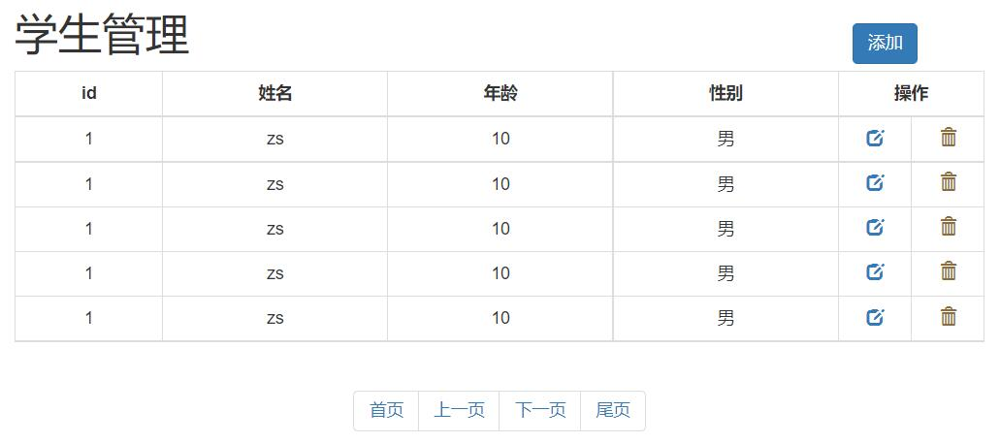

# BootStrap

本篇整理前端框架 BootStrap 的基础用法：jQuery 的 validate 表单校验插件，以及 Bootstrap 的栅格系统、排版、表格、表单、按钮、图像、图标和模态框等常用组件。

## 1. validate 插件

### 1.1 validate 插件概述

为了更好地实现人机交互，可以使用 jQuery 生态中的 validate 插件：在用户填写表单时，快速地对用户填写的数据进行验证，并做出反馈。

Validation 拥有如下特点：

- **内置验证规则**：拥有必填、数字、Email、URL 和信用卡号码等 19 类内置验证规则；
- **自定义验证规则**：可以很方便地自定义验证规则；
- **简单强大的验证信息提示**：默认了验证信息提示，并提供自定义覆盖默认提示信息的功能；
- **实时验证**：可以通过 keyup 或 blur 事件触发验证，而不仅仅在表单提交的时候验证。

### 1.2 validate 插件入门

使用步骤：

1. 导入 jQuery 文件；
2. 导入 validate.js；
3. 导入 messages_zh.js，用于显示中文提示；
4. 使用 `$("选择器").validate()` 进行校验；
5. 在 validate 中编写校验规则。

```html
<!DOCTYPE html>
<html lang="en">
<head>
    <meta charset="UTF-8">
    <title>登录校验</title>
    <style>
        label[class='error'] {
            color: #ff0000;
        }
    </style>
    <script src="js/jquery-3.4.1.min.js"></script>
    <script src="js/jquery.validate.min.js"></script>
    <script src="js/messages_zh.min.js"></script>
    <script>
        $(function () {
            $('#fm').validate({
                rules: {
                    username: {
                        required: true
                    },
                    password: {
                        required: true
                    }
                },
                messages: {
                    username: '请输入用户名',
                    password: '请输入密码'
                }
            });
        })
    </script>
</head>
<body>
    <form id="fm" action="https://www.baidu.com">
        <p>
            <label>账号</label>
            <input type="text" name="username"/>
        </p>
        <p>
            <label>密码</label>
            <input type="password" name="password"/>
        </p>
        <p>
            <button type="submit">登录</button>
        </p>
    </form>
</body>
</html>
```

### 1.3 validate 插件校验规则

| 属性 | 描述 |
| --- | --- |
| `required: true` | 必输字段 |
| `remote: "test.action"` | 使用 ajax 方法调用 check.action 验证输入值 |
| `email: true` | 必须输入正确格式的电子邮件 |
| `url: true` | 必须输入正确格式的网址 |
| `date: true` | 必须输入正确格式的日期。日期校验在 IE6 下会出错，慎用 |
| `dateISO: true` | 必须输入正确格式的日期（ISO），例如 2009-06-23、1998/01/22；只验证格式，不验证有效性 |
| `number: true` | 必须输入合法的数字（负数、小数） |
| `digits: true` | 必须输入整数 |
| `equalTo: "#field"` | 输入值必须和 `#field` 相同 |
| `maxlength: 5` | 输入长度最多是 5 的字符串（汉字算一个字符） |
| `minlength: 10` | 输入长度最小是 10 的字符串（汉字算一个字符） |
| `rangelength: [5,10]` | 输入长度必须介于 5 和 10 之间的字符串（汉字算一个字符） |
| `range: [5,10]` | 输入值必须介于 5 和 10 之间 |
| `max: 5` | 输入值不能大于 5 |
| `min: 10` | 输入值不能小于 10 |

综合使用校验规则的注册表单示例：

```html
<!DOCTYPE html>
<html lang="en">
<head>
    <meta charset="UTF-8">
    <title>登录校验</title>
    <style>
        label[class='error'] {
            color: #ff0000;
        }
    </style>
    <script src="js/jquery-3.4.1.min.js"></script>
    <script src="js/jquery.validate.min.js"></script>
    <script src="js/messages_zh.min.js"></script>
    <script>
        $(function () {
            $('#fm').validate({
                rules: {
                    username: {
                        required: true,
                        rangelength: [6, 10]
                    },
                    password: {
                        required: true,
                        rangelength: [6, 10]
                    },
                    password1: {
                        required: true,
                        equalTo: "[name='password']"
                    }
                },
                messages: {
                    username: '用户名长度必须是6~10位的字符',
                    password: '密码长度必须是6~10位的字符',
                    password1: '两次输入的密码必须相同'
                }
            });
        })
    </script>
</head>
<body>
    <form id="fm" action="https://www.baidu.com">
        <p>
            <label>账号</label>
            <input type="text" name="username"/>
        </p>
        <p>
            <label>密码</label>
            <input type="password" name="password"/>
        </p>
        <p>
            <label>重复密码</label>
            <input type="password" name="password1"/>
        </p>
        <p>
            <button type="submit">注册</button>
        </p>
    </form>
</body>
</html>
```

## 2. Bootstrap

### 2.1 Bootstrap 概述

**Bootstrap** 是一个用于快速开发 Web 应用程序和网站的前端框架，基于 HTML、CSS、JavaScript 构建，由 Twitter 的 Mark Otto 和 Jacob Thornton 开发，2011 年 8 月在 GitHub 上发布的开源产品。

Bootstrap 的特点：

| 特点 | 说明 |
| --- | --- |
| 移动设备优先 | 自 Bootstrap 3 起，框架包含了贯穿于整个库的移动设备优先的样式 |
| 浏览器支持 | 所有主流浏览器都支持 Bootstrap |
| 容易上手 | 只要具备 HTML 和 CSS 的基础知识，就可以开始学习 Bootstrap |
| 响应式设计 | Bootstrap 的响应式 CSS 能够自适应台式机、平板电脑和手机 |

### 2.2 入门案例

环境搭建：在网页中引入 Bootstrap 的 css、jQuery、Bootstrap 的 js 三类资源即可使用，其中 jQuery 必须在 Bootstrap js 文件之前引入。中文官网：<https://v3.bootcss.com/>：

```html
<!DOCTYPE html>
<html lang="en">
<head>
    <meta charset="UTF-8">
    <title>bootstrap起步</title>
    <link rel="stylesheet" href="css/bootstrap.css" />
    <!-- jQuery 必须在 bootstrap 的 js 文件之前 -->
    <script src="js/jquery-3.4.1.min.js"></script>
    <script src="js/bootstrap.js"></script>
</head>
<body>
    <h1>标题1 hello BootStrap</h1>
</body>
</html>
```

> [!NOTE]
> 框架可以理解为"软件的半成品"。Bootstrap 就是前端的 UI 框架，它已经把常用的页面组件（栅格、表格、按钮、模态框等）封装成了现成的 CSS 类，我们只需要按约定写 class 就能得到统一美观的样式。

### 2.3 栅格系统

布局就是在什么位置放特定的内容。如何实现布局？使用 div+css 的栅格系统。

在 Bootstrap 中布局需要 container 容器，其他元素都要放在这个容器中：

| 容器 | 效果 |
| --- | --- |
| `<div class="container"></div>` | 有宽度，居中，两侧留白 |
| `<div class="container-fluid"></div>` | 占据整个页面宽度 |

栅格系统把每行（`row`）分为 12 列（`col-md-N` 表示占 N 列）：

```html
<!DOCTYPE html>
<html lang="en">
<head>
    <meta charset="UTF-8">
    <title>栅格系统</title>
    <link rel="stylesheet" href="css/bootstrap.css" />
    <!-- jQuery 必须在 bootstrap 的 js 文件之前 -->
    <script src="js/jquery-3.4.1.min.js"></script>
    <script src="js/bootstrap.js"></script>
    <style>
        div[class^='col-md-'] {
            border: 1px solid black;
        }
    </style>
</head>
<body>
    <div class="container">
        <div class="row text-center">
            <div class="col-md-1">1</div>
            <div class="col-md-1">1</div>
            <div class="col-md-1">1</div>
            <div class="col-md-1">1</div>
            <div class="col-md-1">1</div>
            <div class="col-md-1">1</div>
            <div class="col-md-6 text-center">6</div>
        </div>
    </div>
</body>
</html>
```

栅格系统案例：典型的"头部 + 左侧栏 + 内容区 + 底部"布局：

```html
<!DOCTYPE html>
<html lang="en">
<head>
    <meta charset="UTF-8">
    <title>栅格系统</title>
    <link rel="stylesheet" href="css/bootstrap.css" />
    <!-- jQuery 必须在 bootstrap 的 js 文件之前 -->
    <script src="js/jquery-3.4.1.min.js"></script>
    <script src="js/bootstrap.js"></script>
    <style>
        div[class^='col-md-'] {
            border: 1px solid black;
        }
    </style>
</head>
<body>
    <div class="container-fluid">
        <div class="row">
            <div class="col-md-12" style="height: 100px; background-color: yellow">111</div>
        </div>
        <div class="row">
            <div class="col-md-3" style="height: 500px;">222</div>
            <div class="col-md-9" style="height: 500px;">333</div>
        </div>
        <div class="row">
            <div class="col-md-12" style="height: 100px; background-color: greenyellow;">444</div>
        </div>
    </div>
</body>
</html>
```

### 2.4 排版

Bootstrap 提供了对齐类与列表类，直接加在标签的 class 上即可：

```html
<!DOCTYPE html>
<html lang="en">
<head>
    <meta charset="UTF-8">
    <title>排版</title>
    <link rel="stylesheet" href="css/bootstrap.css" />
    <!-- jQuery 必须在 bootstrap 的 js 文件之前 -->
    <script src="js/jquery-3.4.1.min.js"></script>
    <script src="js/bootstrap.js"></script>
</head>
<body>
    <!-- 对齐 -->
    <p class="text-left">hello html</p>
    <p class="text-center">hello css</p>
    <p class="text-right">hello js</p>
    <!-- 列表：list-inline 让列表项水平排列 -->
    <ul class="list-inline">
        <li><a href="">百度</a></li>
        <li><a href="">新浪</a></li>
        <li><a href="">搜狐</a></li>
    </ul>
</body>
</html>
```

### 2.5 表格

给 table 加上 `table` 及修饰类即可获得 Bootstrap 风格的表格，行上还可以加 `danger` 等状态类：

```html
<!DOCTYPE html>
<html lang="en">
<head>
    <meta charset="UTF-8">
    <title>表格</title>
    <link rel="stylesheet" href="css/bootstrap.css" />
    <!-- jQuery 必须在 bootstrap 的 js 文件之前 -->
    <script src="js/jquery-3.4.1.min.js"></script>
    <script src="js/bootstrap.js"></script>
</head>
<body>
    <table class="table table-striped table-bordered table-hover table-condensed">
        <tr>
            <th>id</th>
            <th>name</th>
            <th>addr</th>
        </tr>
        <tr>
            <td>1</td>
            <td>zs</td>
            <td>qd</td>
        </tr>
        <tr>
            <td>1</td>
            <td>zs</td>
            <td>qd</td>
        </tr>
        <tr class="danger">
            <td>1</td>
            <td>zs</td>
            <td>qd</td>
        </tr>
    </table>
</body>
</html>
```

### 2.6 表单

使用 `form-horizontal` 水平表单配合栅格，可以让标签与输入框在同一行对齐：

```html
<!DOCTYPE html>
<html lang="en">
<head>
    <meta charset="UTF-8">
    <title>表单</title>
    <link rel="stylesheet" href="css/bootstrap.css" />
    <!-- jQuery 必须在 bootstrap 的 js 文件之前 -->
    <script src="js/jquery-3.4.1.min.js"></script>
    <script src="js/bootstrap.js"></script>
</head>
<body>
    <form class="form-horizontal">
        <div class="form-group">
            <label for="inputEmail3" class="col-sm-2 control-label">Email</label>
            <div class="col-sm-10">
                <input type="email" class="form-control" id="inputEmail3" placeholder="Email" disabled />
            </div>
        </div>
        <div class="form-group">
            <label for="inputPassword3" class="col-sm-2 control-label">Password</label>
            <div class="col-sm-10">
                <input type="password" class="form-control" id="inputPassword3" placeholder="Password">
            </div>
        </div>
        <div class="form-group">
            <div class="col-sm-offset-2 col-sm-10">
                <div class="checkbox">
                    <label>
                        <input type="checkbox"> Remember me
                    </label>
                </div>
            </div>
        </div>
        <div class="form-group">
            <div class="col-sm-offset-2 col-sm-10">
                <button type="submit" class="btn btn-default">Sign in</button>
            </div>
        </div>
    </form>
</body>
</html>
```

### 2.7 按钮

按钮通过 `btn` 基础类加上 `btn-default`、`btn-danger`、`btn-primary` 等样式类控制颜色，通过 `btn-xs`、`btn-lg` 等控制大小，超链接也可以做成按钮的外观：

```html
<!DOCTYPE html>
<html lang="en">
<head>
    <meta charset="UTF-8">
    <title>按钮</title>
    <link rel="stylesheet" href="css/bootstrap.css" />
    <!-- jQuery 必须在 bootstrap 的 js 文件之前 -->
    <script src="js/jquery-3.4.1.min.js"></script>
    <script src="js/bootstrap.js"></script>
</head>
<body>
    <button type="button" class="btn btn-default">click</button>
    <button type="button" class="btn btn-danger">删除</button>
    <button type="button" class="btn btn-primary btn-xs">添加</button>
    <br/>
    <a href="https://www.baidu.com" class="btn btn-primary btn-lg">修改</a>
</body>
</html>
```

### 2.8 图像

图像通过 `img-circle`、`img-thumbnail`、`img-rounded` 类控制形状：

```html
<!DOCTYPE html>
<html lang="en">
<head>
    <meta charset="UTF-8">
    <title>图像</title>
    <link rel="stylesheet" href="css/bootstrap.css" />
    <!-- jQuery 必须在 bootstrap 的 js 文件之前 -->
    <script src="js/jquery-3.4.1.min.js"></script>
    <script src="js/bootstrap.js"></script>
</head>
<body>
    
    
    
</body>
</html>
```

### 2.9 图标

Bootstrap 内置了 glyphicon 图标库，通过 span 标签加 `glyphicon glyphicon-xxx` 类使用：

```html
<!DOCTYPE html>
<html lang="en">
<head>
    <meta charset="UTF-8">
    <title>图标</title>
    <link rel="stylesheet" href="css/bootstrap.css" />
    <!-- jQuery 必须在 bootstrap 的 js 文件之前 -->
    <script src="js/jquery-3.4.1.min.js"></script>
    <script src="js/bootstrap.js"></script>
</head>
<body>
    <button type="button" class="btn btn-default"><span class="glyphicon glyphicon-search" aria-hidden="true"></span></button>
    <button type="button" class="btn btn-danger"><span style="margin-right: 5px;">删除</span><span class="glyphicon glyphicon-trash"></span></button>
    <button type="button" class="btn btn-primary btn-xs">添加</button>
</body>
</html>
```

### 2.10 模态框

模态框（Modal）是覆盖在父窗体上的子窗体，通过 `data-toggle="modal"`、`data-target="#myModal"` 触发显示，`data-dismiss="modal"` 控制关闭：

```html
<!DOCTYPE html>
<html lang="en">
<head>
    <meta charset="UTF-8">
    <title>模态框</title>
    <link rel="stylesheet" href="css/bootstrap.css" />
    <!-- jQuery 必须在 bootstrap 的 js 文件之前 -->
    <script src="js/jquery-3.4.1.min.js"></script>
    <script src="js/bootstrap.js"></script>
</head>
<body>
    <!-- 触发模态框的按钮 -->
    <button type="button" class="btn btn-primary btn-lg" data-toggle="modal" data-target="#myModal">
        Launch demo modal
    </button>

    <!-- 模态框本体 -->
    <div class="modal fade" id="myModal" tabindex="-1" role="dialog" aria-labelledby="myModalLabel">
        <div class="modal-dialog modal-lg" role="document">
            <div class="modal-content">
                <div class="modal-header">
                    <button type="button" class="close" data-dismiss="modal" aria-label="Close"><span aria-hidden="true">&times;</span></button>
                    <h4 class="modal-title" id="myModalLabel">添加</h4>
                </div>
                <div class="modal-body">
                    <form class="form-horizontal">
                        <div class="form-group">
                            <label for="inputEmail3" class="col-sm-2 control-label">Email</label>
                            <div class="col-sm-10">
                                <input type="email" class="form-control" id="inputEmail3" placeholder="Email" disabled />
                            </div>
                        </div>
                        <div class="form-group">
                            <label for="inputPassword3" class="col-sm-2 control-label">Password</label>
                            <div class="col-sm-10">
                                <input type="password" class="form-control" id="inputPassword3" placeholder="Password">
                            </div>
                        </div>
                        <div class="form-group">
                            <div class="col-sm-offset-2 col-sm-10">
                                <div class="checkbox">
                                    <label>
                                        <input type="checkbox"> Remember me
                                    </label>
                                </div>
                            </div>
                        </div>
                        <div class="form-group">
                            <div class="col-sm-offset-2 col-sm-10">
                                <button type="submit" class="btn btn-default">Sign in</button>
                            </div>
                        </div>
                    </form>
                </div>
                <div class="modal-footer">
                    <button type="button" class="btn btn-default" data-dismiss="modal">取消</button>
                    <button type="button" class="btn btn-primary">保存</button>
                </div>
            </div>
        </div>
    </div>
</body>
</html>
```

### 2.11 案例

综合运用栅格、表格、按钮、图标、模态框和分页组件完成的学生管理页面：



```html
<!DOCTYPE html>
<html lang="en">
<head>
    <meta charset="UTF-8">
    <title>test</title>
    <script src="js/jquery-3.4.1.min.js"></script>
    <script src="js/bootstrap.js"></script>
    <link rel="stylesheet" href="css/bootstrap.css" />
    <style>
        .container {
            width: 800px;
        }

        th {
            text-align: center;
        }

        .opt {
            width: 60px;
        }
    </style>
</head>
<body>
    <div class="container">
        <!-- 添加学生的模态框 -->
        <div class="modal fade" id="myModal" tabindex="-1" role="dialog" aria-labelledby="myModalLabel">
            <div class="modal-dialog" role="document">
                <div class="modal-content">
                    <div class="modal-header">
                        <button type="button" class="close" data-dismiss="modal" aria-label="Close"><span aria-hidden="true">&times;</span></button>
                        <h4 class="modal-title" id="myModalLabel">添加学生</h4>
                    </div>
                    <div class="modal-body">
                        <form class="form-horizontal">
                            <div class="form-group">
                                <label for="inputName" class="col-sm-2 control-label">姓名</label>
                                <div class="col-sm-10">
                                    <input type="text" class="form-control" id="inputName" placeholder="请输入姓名">
                                </div>
                            </div>
                            <div class="form-group">
                                <label for="inputAge" class="col-sm-2 control-label">年龄</label>
                                <div class="col-sm-10">
                                    <input type="number" class="form-control" id="inputAge" placeholder="请输入年龄">
                                </div>
                            </div>
                            <div class="form-group">
                                <label class="col-sm-2 control-label">性别</label>
                                <div class="col-sm-10">
                                    <label>
                                        <input type="radio" name="gender" value="male" /> 男
                                        <input type="radio" name="gender" value="female" /> 女
                                    </label>
                                </div>
                            </div>
                        </form>
                    </div>
                    <div class="modal-footer">
                        <button type="button" class="btn btn-default" data-dismiss="modal">关闭</button>
                        <button type="button" class="btn btn-primary">保存</button>
                    </div>
                </div>
            </div>
        </div>

        <div class="row">
            <h1 class="pull-left">学生管理</h1>
            <button class="btn btn-primary pull-right" style="margin-top: 30px;" data-toggle="modal" data-target="#myModal">添加学生</button>
        </div>
        <div class="row">
            <table class="table table-bordered table-hover">
                <tr>
                    <th>id</th>
                    <th>姓名</th>
                    <th>年龄</th>
                    <th>性别</th>
                    <th colspan="2">操作</th>
                </tr>
                <tr>
                    <td>1</td>
                    <td>zs</td>
                    <td>20</td>
                    <td>male</td>
                    <td class="opt text-center">
                        <a><span class="glyphicon glyphicon-edit" aria-hidden="true"></span></a>
                    </td>
                    <td class="opt text-center" >
                        <a><span class="glyphicon glyphicon-trash" aria-hidden="true"></span></a>
                    </td>
                </tr>
                <tr>
                    <td>2</td>
                    <td>ls</td>
                    <td>20</td>
                    <td>male</td>
                    <td class="opt text-center">
                        <a><span class="glyphicon glyphicon-edit" aria-hidden="true"></span></a>
                    </td>
                    <td class="opt text-center" >
                        <a><span class="glyphicon glyphicon-trash" aria-hidden="true"></span></a>
                    </td>
                </tr>
                <tr>
                    <td>3</td>
                    <td>ww</td>
                    <td>20</td>
                    <td>male</td>
                    <td class="opt text-center">
                        <a><span class="glyphicon glyphicon-edit" aria-hidden="true"></span></a>
                    </td>
                    <td class="opt text-center" >
                        <a><span class="glyphicon glyphicon-trash" aria-hidden="true"></span></a>
                    </td>
                </tr>
                <tr>
                    <td>4</td>
                    <td>zl</td>
                    <td>20</td>
                    <td>male</td>
                    <td class="opt text-center">
                        <a><span class="glyphicon glyphicon-edit" aria-hidden="true"></span></a>
                    </td>
                    <td class="opt text-center" >
                        <a><span class="glyphicon glyphicon-trash" aria-hidden="true"></span></a>
                    </td>
                </tr>
                <tr>
                    <td>5</td>
                    <td>tom</td>
                    <td>20</td>
                    <td>male</td>
                    <td class="opt text-center">
                        <a><span class="glyphicon glyphicon-edit" aria-hidden="true"></span></a>
                    </td>
                    <td class="opt text-center" >
                        <a><span class="glyphicon glyphicon-trash" aria-hidden="true"></span></a>
                    </td>
                </tr>
            </table>
        </div>
        <div class="row">
            <nav aria-label="Page navigation" class="text-center" style="margin-top: 0px;">
                <ul class="pagination">
                    <li>
                        <a href="#" aria-label="Previous">
                            <span aria-hidden="true">&laquo;</span>
                        </a>
                    </li>
                    <li><a href="#">1</a></li>
                    <li><a href="#">2</a></li>
                    <li><a href="#">3</a></li>
                    <li><a href="#">4</a></li>
                    <li><a href="#">5</a></li>
                    <li>
                        <a href="#" aria-label="Next">
                            <span aria-hidden="true">&raquo;</span>
                        </a>
                    </li>
                </ul>
            </nav>
        </div>
    </div>
</body>
</html>
```

## 3. 本章小结

- validate 是 jQuery 的表单校验插件：引入 jQuery、validate.js、messages_zh.js 三个文件后，用 `$("选择器").validate({rules, messages})` 配置校验规则与提示；
- validate 内置了 required、email、number、equalTo、rangelength 等常用规则，支持 keyup/blur 实时校验；
- Bootstrap 是基于 HTML、CSS、JavaScript 的前端 UI 框架，使用前必须先引入 Bootstrap 的 css、jQuery（在前）、Bootstrap 的 js；
- 布局靠栅格系统：`container`/`container-fluid` 容器内用 `row` 分行，`col-md-N` 指定占据 12 列中的 N 列；
- 常用组件都是"加 class 即生效"：排版对齐类、`table` 系列表格类、`btn` 系列按钮类、`img-*` 图像类、glyphicon 图标类；
- 模态框通过 `data-toggle`/`data-target` 打开、`data-dismiss` 关闭，配合表单组件可实现后台管理系统的增删改查交互。
