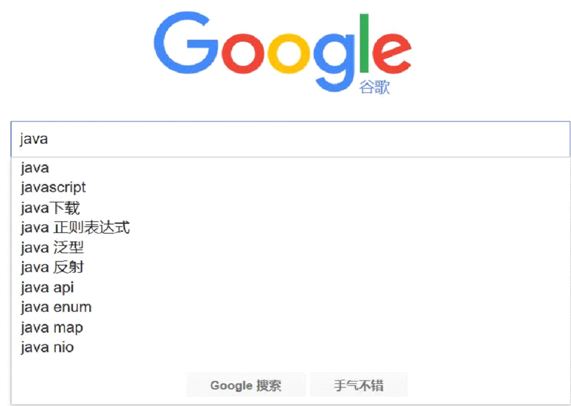
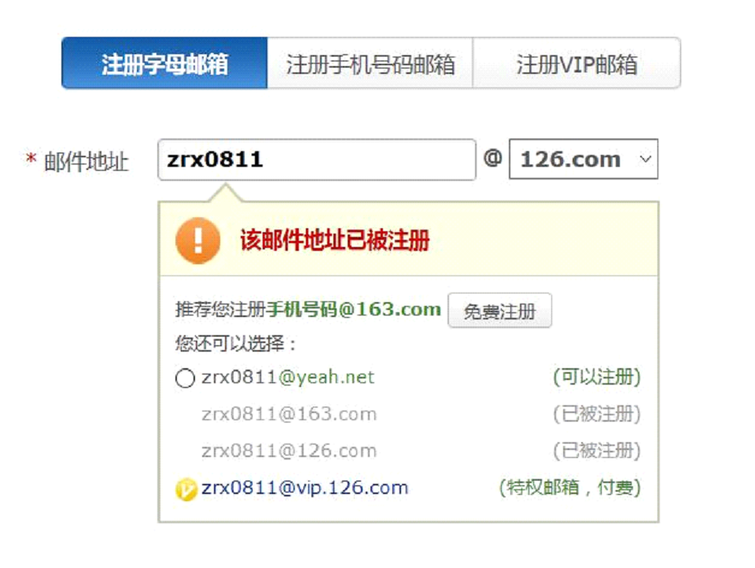

# Ajax_JSON

本篇整理 Ajax 与 JSON 两部分内容：Ajax 的概念、原生 JS 与 jQuery 两种实现方式、JSON 语法及与 Java 对象的相互转换，最后通过"校验用户是否存在"和 Ajax 文件上传两个案例串联运用。

## 1. Ajax

### 1.1 Ajax 概念

**AJAX** = Asynchronous（异步）JavaScript and XML，即**异步**的 JavaScript 和 XML：

- **同步**：客户端必须等待服务器端的响应，在等待期间客户端不能做其他操作；
- **异步**：客户端不需要等待服务器端的响应，在服务器处理请求的过程中，客户端可以进行其他操作。

AJAX 是一种在无需重新加载整个网页的情况下，能够更新部分网页的技术：

- 通过在后台与服务器进行少量数据交换，AJAX 可以使网页实现异步更新。这意味着可以在不重新加载整个网页的情况下，对网页的某部分进行更新；
- 传统的网页（不使用 AJAX）如果需要更新内容，必须重载整个网页；
- 提升用户体验。

#### 1.1.1 应用场景





### 1.2 原生 JS 方式（了解）

需求：页面包含一个按钮，单击按钮发送 Ajax 请求，并将服务器返回的数据以弹框的形式在页面显示。

#### 1.2.1 前端部分

##### 1.2.1.1 步骤

1. 创建 XMLHttpRequest 对象；
2. 建立连接；
3. 发送请求；
4. 接收并处理来自服务器的响应结果。

##### 1.2.1.2 代码

html 部分：

```html
<button onclick="ajaxTest()">发送ajax请求</button>
```

javascript 部分（参考 `https://www.w3school.com.cn/ajax/index.asp`）：

```javascript
// 发送 ajax 请求：原生 ajax
function ajaxTest() {
    // 1. 创建 XMLHttpRequest 对象
    var xmlhttp;
    if (window.XMLHttpRequest) {
        // code for IE7+, Firefox, Chrome, Opera, Safari
        xmlhttp = new XMLHttpRequest();
    } else {
        // code for IE6, IE5
        xmlhttp = new ActiveXObject("Microsoft.XMLHTTP");
    }

    /* 2. 建立连接
       参数：
          1. 请求方式：GET、POST
          2. 请求路径：一般写一个服务器资源的地址（Servlet 的地址）
          3. 同步或异步请求：true（异步）或 false（同步）
    */
    xmlhttp.open("GET", "${pageContext.request.contextPath}/ajaxServlet?name=Zhangsan", true);
    // 3. 发送请求
    xmlhttp.send();

    // 如果需要像 HTML 表单那样 POST 数据，请使用 setRequestHeader() 来添加 HTTP 头，
    // 然后在 send() 方法中规定希望发送的数据：
    // xmlhttp.open("POST", "${pageContext.request.contextPath}/ajaxServlet", true);
    // xmlhttp.setRequestHeader("Content-type", "application/x-www-form-urlencoded");
    // xmlhttp.send("name=Zhangsan");

    // 4. 接收并处理来自服务器的响应结果
    xmlhttp.onreadystatechange = function () {
        /**
         * readyState：XMLHttpRequest 的状态
         *  0: 请求未初始化
         *  1: 服务器连接已建立
         *  2: 请求已接收
         *  3: 请求处理中
         *  4: 请求已完成，且响应已就绪
         *
         * status：响应状态码
         */
        if (xmlhttp.readyState == 4 && xmlhttp.status == 200) {
            alert(xmlhttp.responseText);
        }
    }
}
```

#### 1.2.2 服务端代码

##### 1.2.2.1 步骤

1. 创建 JavaWeb 工程；
2. 创建 Servlet；
3. 接收请求参数；
4. 响应数据。

##### 1.2.2.2 代码

```java
@WebServlet("/ajaxServlet")
public class AjaxServlet extends HttpServlet {
    protected void doPost(HttpServletRequest request, HttpServletResponse response) throws ServletException, IOException {
        // 获取请求参数
        String name = request.getParameter("name");
        System.out.println(name + "-----------------------------");
        // 可以通过延时模拟服务器处理耗时，体会异步效果
        // try {
        //     Thread.sleep(1500);
        // } catch (InterruptedException e) {
        //     e.printStackTrace();
        // }

        // 向浏览器响应数据
        response.getWriter().println("hello:" + name);
    }

    protected void doGet(HttpServletRequest request, HttpServletResponse response) throws ServletException, IOException {
        doPost(request, response);
    }
}
```

### 1.3 jQuery 方式（重点）

#### 1.3.1 常用函数

##### 1.3.1.1 $.ajax()

语法：`$.ajax({键值对})`，常用参数如下：

| 参数 | 说明 |
| --- | --- |
| url | 请求路径 |
| type | 请求方式（"POST" 或 "GET"），默认为 "GET" |
| data | 请求参数，可以是 "key=value" 格式的字符串，也可以是 JSON |
| dataType | 预期服务器返回的数据类型，默认为 text |
| success | 请求成功后的回调函数 |
| error | 请求失败后的回调函数 |

##### 1.3.1.2 $.get()

语法：`$.get(url, [data], [callback], [type])`：

- url：请求路径；
- data：请求参数；
- callback：回调函数；
- type：响应结果的类型。

##### 1.3.1.3 $.post()

语法：`$.post(url, [data], [callback], [type])`，参数含义与 `$.get()` 相同。

#### 1.3.2 代码

`$.ajax()` 方式：

```javascript
function ajaxTest() {
    $.ajax({
        url: "${pageContext.request.contextPath}/ajaxServlet", // 请求地址
        type: "GET",                 // 请求方式
        data: "name=ZhangSan",       // 发送的数据
        success: function (data) {   // 成功之后的回调函数
            alert(data);
        },
        error: function (err) {      // 失败之后的回调函数
            console.log(err);
        }
    });
}
```

`$.get()` 方式：

```javascript
function ajaxTest() {
    /**
     * 四个参数：请求地址、请求数据、成功回调函数、预计的服务器响应的数据类型。
     */
    $.get("${pageContext.request.contextPath}/ajaxServlet", "name=Tom", function (data) {
        alert(data);
    }, "text");
}
```

`$.post()` 方式：

```javascript
function ajaxTest() {
    $.post("${pageContext.request.contextPath}/ajaxServlet", {name: "Tom"}, function (data) {
        alert(data);
    }, "text");
}
```

## 2. JSON

### 2.1 JSON 概念

**JSON**（JavaScript Object Notation，JS 对象标记，JavaScript 对象表示法）是一种轻量级的**数据交换格式**。它基于 ECMAScript（W3C 制定的 JS 规范）的一个子集，采用完全**独立于编程语言**的文本格式来**存储和表示**数据。简洁和清晰的层次结构使得 JSON 成为理想的**数据交换语言**：易于人阅读和编写，同时也易于机器解析和生成，并有效地提升网络传输效率。

### 2.2 JSON 语法

数据在名称/值对中：JSON 数据是由**键值对**构成的。

- 键用引号（单双都行）引起来，也可以不使用引号；
- 值的取值类型：
  - 数字（整数或浮点数）；
  - 字符串（在双引号中）；
  - 逻辑值（true 或 false）；
  - 数组（在方括号中），如 `{"persons":[{},{}]}`；
  - 对象（在花括号中），如 `{"address":{"province":"山东",...}}`；
  - null；
- 数据由逗号分隔：多个键值对由逗号分隔；
- 花括号保存对象：使用 `{}` 定义 JSON 对象；
- 方括号保存数组：`[]`。

```javascript
// JSON 对象：基本格式
var student = {id: 10, name: "Tom", age: 10};

// 嵌套格式：{} 包含 []
// 班级
var cls = {
    students: [ // 所有学生
        {id: 10, name: "Tom", age: 10},
        {id: 20, name: "Bob", age: 12},
        {id: 30, name: "Jim", age: 20},
        {id: 31, name: "Smith", age: 20}
    ],
    addr: "qd" // 地址
};

// 嵌套格式：[] 包含 {}
var stus = [{id: 10, name: "Tom", age: 10},
            {id: 20, name: "Bob", age: 12},
            {id: 30, name: "Jim", age: 20},
            {id: 31, name: "Smith", age: 20}];
```

### 2.3 JSON 值的获取

- `json对象.键名`；
- `json对象["键名"]`；
- `数组对象[索引]`；
- 遍历。

```javascript
console.log(student.name);
console.log(student['name']);

// 获取 student 对象中所有的键和值
for (var key in student) {
    console.log(key, student[key]);
}

console.log("--------------------------------------------")

// 获取数组中的所有值
for (var i = 0; i < stus.length; i++) {
    var stu = stus[i];
    for (var key in stu) {
        console.log(key + ":" + stu[key]);
    }
}
```

### 2.4 JSON 数据和 Java 对象的转换（重点）

在日常实践中通常会对 JSON 数据和 Java 对象进行**相互转换**，转换需要用到 JSON 解析器，常见的解析器如下：

| 解析器 | 出品方 |
| --- | --- |
| Jsonlib | JSON 官方 |
| Gson | Google |
| **Jackson** | Spring 官方 |
| Fastjson | Alibaba |

它们本质上就是一些工具类。下面以 Jackson 为例。

#### 2.4.1 Java 对象转 JSON

步骤：

1. 导入 Jackson 的相关 jar 包；
2. 创建 Jackson 核心对象 ObjectMapper；
3. 调用 ObjectMapper 的相关方法进行转换：
   - `writeValueAsString(Object obj)`：Java 对象 ---> JSON 字符串；
   - `writeValue(参数1, Object obj)`：参数1 可以为：
     - File：将 obj 对象转换为 JSON 字符串，并保存到指定的文件中；
     - Writer：将 obj 对象转换为 JSON 字符串，并将 JSON 数据填充到字符输出流中；
     - OutputStream：将 obj 对象转换为 JSON 字符串，并将 JSON 数据填充到字节输出流中。

Person 类：

```java
public class Person {
    private Integer id;
    private String name;
    private Integer age;
    private String addr;
    // set 和 get 方法
    // toString 方法
}
```

测试方法：

```java
@Test
public void test1() throws IOException {
    // 创建对象
    Person person = new Person();
    person.setId(10);
    person.setName("Tom");
    person.setAge(22);
    person.setAddr("QD");

    // 创建 Jackson 的核心对象
    ObjectMapper objectMapper = new ObjectMapper();

    // 转换：Java 对象 ---> JSON 字符串
    String pStr = objectMapper.writeValueAsString(person);
    System.out.println(pStr);

    // 转换：Java 对象 ---> JSON 字符串保存到文件中
    objectMapper.writeValue(new File("D:/a.txt"), person);
    objectMapper.writeValue(new FileWriter("D:/b.txt"), person);
}
```

##### 2.4.1.1 Java 对象转 JSON 相关注解

- `@JsonIgnore`：排除属性，该属性不参与 JSON 转换；
- `@JsonFormat`：属性值的格式化，如 `@JsonFormat(pattern = "yyyy-MM-dd")`。

修改 Person 类：

```java
public class Person {
    private Integer id;
    private String name;
    private Integer age;
    private String addr;
    //@JsonIgnore
    @JsonFormat(pattern = "yyyy-MM-dd HH:mm:ss")
    private Date birthday;
    // set 和 get 方法
    // toString 方法
}
```

测试方法：

```java
@Test
public void test2() throws Exception {
    Person person = new Person();
    person.setId(20);
    person.setName("Tom");
    person.setAge(23);
    person.setAddr("QD");
    person.setBirthday(new Date());

    ObjectMapper objectMapper = new ObjectMapper();
    String s = objectMapper.writeValueAsString(person);

    System.out.println(s);
}
```

##### 2.4.1.2 复杂类型对象转 JSON

List 集合转 JSON（结果是 JSON 数组）、Map 转 JSON（结果是 JSON 对象）：

```java
@Test
public void test3() throws JsonProcessingException {
    Person p1 = new Person();
    p1.setId(20);
    p1.setName("Tom");
    p1.setAge(23);
    p1.setAddr("QD");
    p1.setBirthday(new Date());

    Person p2 = new Person();
    p2.setId(20);
    p2.setName("Bob");
    p2.setAge(13);
    p2.setAddr("QD");
    p2.setBirthday(new Date());

    List<Person> list = new ArrayList<Person>();
    list.add(p1);
    list.add(p2);

    ObjectMapper objectMapper = new ObjectMapper();
    String s = objectMapper.writeValueAsString(list);

    System.out.println(s);
}

@Test
public void test4() throws JsonProcessingException {
    Map<String, Object> map = new HashMap<String, Object>();
    map.put("id", 10);
    map.put("name", "Tom");
    map.put("age", 20);
    map.put("addr", "QD");

    ObjectMapper objectMapper = new ObjectMapper();
    String s = objectMapper.writeValueAsString(map);

    System.out.println(s);
}
```

#### 2.4.2 JSON 转 Java 对象

步骤：

1. 导入 Jackson 的相关 jar 包；
2. 创建 Jackson 核心对象 ObjectMapper；
3. 调用 ObjectMapper 的相关方法进行转换：`readValue(json字符串数据, Class)`。

```java
@Test
public void test5() throws IOException {
    String person = "{\"id\":20,\"name\":\"Tom\",\"age\":23,\"addr\":\"QD\"}";
    ObjectMapper objectMapper = new ObjectMapper();

    Person p = objectMapper.readValue(person, Person.class);
    System.out.println(p);
}
```

#### 2.4.3 Fastjson 使用（Alibaba）

Fastjson 的使用和 Jackson 类似，这里不再详细说明。测试方法：

```java
@Test
public void test6() {
    Person person = new Person();
    person.setId(20);
    person.setName("Tom");
    person.setAge(23);
    person.setAddr("QD");
    person.setBirthday(new Date());

    // Java 对象转 JSON 字符串
    String json = JSON.toJSONString(person);
    System.out.println(json);
}

@Test
public void test7() {
    String person = "{\"id\":20,\"name\":\"Tom\",\"age\":23,\"addr\":\"QD\"}";

    // JSON 字符串转 Java 对象
    Person p = JSON.parseObject(person, Person.class);
    System.out.println(p);
}
```

### 2.5 浏览器处理 JSON 字符串

#### 2.5.1 JSON 对象转 JSON 字符串

`JSON.stringify()`。

#### 2.5.2 JSON 字符串转 JSON 对象

`JSON.parse()`。

```javascript
var json = {name: 'zs', age: 34};
var str = JSON.stringify(json);
console.log(typeof json); // object
console.log(typeof str);  // string

var obj = JSON.parse(str);
console.log(typeof obj);  // object
```

## 3. 校验用户是否存在（重点）

需求：注册页输入用户名后，光标离开输入框时异步请求服务器，校验该用户名是否已经存在，并把结果以颜色和文字提示的方式显示在页面上。

reg.jsp 中的前端代码：

```html
<script src="${pageContext.request.contextPath}/js/jquery-3.4.1.min.js"></script>
<script>
    $(function () {
        $("#username").blur(function () {
            var username = $(this).val();

            $.get("${pageContext.request.contextPath}/findUserServlet", {username: username}, function (data) {
                console.log(typeof data);
                // 若后端返回的是字符串，需要先转成 JSON 对象
                // var response = JSON.parse(data);
                var response = data;
                if (response.exist) {
                    $("#info").css("color", "red");
                    $("#info").text(response.msg);
                } else {
                    $("#info").css("color", "green");
                    $("#info").text(response.msg);
                }
            }, "json");
        });

        $("#username").focus(function () {
            $("#info").text("");
        });
    });
</script>
```

FindUserServlet.java 服务端代码：

```java
import com.fasterxml.jackson.databind.ObjectMapper;

import javax.servlet.ServletException;
import javax.servlet.annotation.WebServlet;
import javax.servlet.http.HttpServlet;
import javax.servlet.http.HttpServletRequest;
import javax.servlet.http.HttpServletResponse;
import java.io.IOException;
import java.io.PrintWriter;
import java.util.HashMap;
import java.util.Map;

@WebServlet("/findUserServlet")
public class FindUserServlet extends HttpServlet {
    protected void doPost(HttpServletRequest request, HttpServletResponse response) throws ServletException, IOException {
        String username = request.getParameter("username");

        Map<String, Object> map = new HashMap<String, Object>();
        if ("tom".equals(username)) {
            // 用户名已存在
            map.put("exist", true);
            map.put("msg", "用户名不可用");
        } else {
            // 用户名可用
            map.put("exist", false);
            map.put("msg", "用户名可用");
        }

        response.setContentType("text/html;charset=UTF-8");
        PrintWriter out = response.getWriter();

        ObjectMapper mapper = new ObjectMapper();
        // 将 Map 转为 JSON 并写入响应流，配合前端的 "json" 类型自动解析
        mapper.writeValue(out, map);
    }

    protected void doGet(HttpServletRequest request, HttpServletResponse response) throws ServletException, IOException {
        doPost(request, response);
    }
}
```

> [!NOTE]
> 这个案例体现了 Ajax 最典型的用法：只在需要时与服务器交换一小段 JSON 数据，页面不刷新就完成校验反馈。`$.get()` 的最后一个参数指定 `"json"`，jQuery 会自动把响应解析成 JSON 对象，无需手动调用 `JSON.parse()`。

## 4. 使用 Ajax 实现文件上传

### 4.1 前端代码

使用 `FormData` 封装表单数据，并在 `$.ajax()` 中设置 `contentType: false`、`processData: false`，让浏览器自动处理 multipart 编码：

```html
<%@ page contentType="text/html;charset=UTF-8" language="java" %>
<html>
  <head>
    <title>文件上传</title>
    <script src="${pageContext.request.contextPath}/js/jquery-3.4.1.min.js"></script>
    <script>
        function onUpload() {
          // FormData 用于构造 multipart/form-data 格式的表单数据
          var formData = new FormData();
          var fileData = $("#file").prop('files')[0];
          formData.append('pic', fileData);
          formData.append('username', $("#username").val());

          $.ajax({
                url: "${pageContext.request.contextPath}/UploadServlet",
                type: "post",
                async: false,
                data: formData,
                cache: false,
                contentType: false,  // 不设置 Content-Type，由浏览器按 multipart 处理
                processData: false,  // 不对 data 进行 URL 编码处理
                success: function (data) {
                      console.log(data)
                }
          })
        }
    </script>
  </head>
  <body>
    <div>
      <input id="username" type="text" name="username" placeholder="请输入用户名" />
      <input id="file" type="file" name="file" />
      <input type="button" value="上传" onclick="onUpload()">
    </div>
  </body>
</html>
```

### 4.2 服务端代码

服务端使用 commons-fileupload 解析 multipart 请求，处理普通表单项与文件项，并用 UUID 重命名保存文件：

```java
package com.qfedu.servlet;

import org.apache.commons.fileupload.FileItem;
import org.apache.commons.fileupload.FileUploadException;
import org.apache.commons.fileupload.disk.DiskFileItemFactory;
import org.apache.commons.fileupload.servlet.ServletFileUpload;

import javax.servlet.ServletContext;
import javax.servlet.ServletException;
import javax.servlet.annotation.WebServlet;
import javax.servlet.http.HttpServlet;
import javax.servlet.http.HttpServletRequest;
import javax.servlet.http.HttpServletResponse;
import java.io.File;
import java.io.IOException;
import java.util.List;
import java.util.UUID;

@WebServlet(name = "UploadServlet", value = "/UploadServlet")
public class UploadServlet extends HttpServlet {
    @Override
    protected void doGet(HttpServletRequest request, HttpServletResponse response) throws ServletException, IOException {
        // 对上传的普通表单项和文件进行处理
        // System.out.println(request.getParameter("username"));
        // 创建工厂
        DiskFileItemFactory factory = new DiskFileItemFactory();
        // 创建解析器
        ServletFileUpload sfu = new ServletFileUpload(factory);
        // 处理请求
        try {
            // FileItem 对应一个表单项
            List<FileItem> fileItems = sfu.parseRequest(request);
            for (FileItem item : fileItems) {
                // 判断当前的 FileItem 是否是普通表单项
                if (item.isFormField()) { // 是普通表单项
                    // 获取 key
                    String name = item.getFieldName();
                    String value = item.getString();
                    System.out.println(name + ":" + value);
                } else { // 是文件
                    String fileName = item.getName(); // 原始文件名
                    System.out.println("文件名:" + fileName);
                    long size = item.getSize();
                    System.out.println("文件大小：" + size);

                    // 将文件保存到项目下的 img 目录：先获取 img 的真实路径
                    ServletContext servletContext = request.getServletContext();
                    String imgPath = servletContext.getRealPath("/img");

                    // 使用 UUID 重命名，避免同名文件覆盖
                    fileName = UUID.randomUUID().toString().replace("-", "") + "_" + fileName;

                    // 保存文件
                    item.write(new File(imgPath + "/" + fileName));
                }
            }
        } catch (FileUploadException e) {
            e.printStackTrace();
        } catch (Exception e) {
            e.printStackTrace();
        }
    }

    @Override
    protected void doPost(HttpServletRequest request, HttpServletResponse response) throws ServletException, IOException {
        doGet(request, response);
    }
}
```

## 5. 本章小结

- Ajax 的核心价值是**异步局部更新**：不重载整个页面，只与服务器交换少量数据；同步等待、异步并行是二者的本质区别；
- 原生 Ajax 四步：创建 XMLHttpRequest、`open()` 建立连接、`send()` 发送请求、在 `onreadystatechange` 中根据 readyState 与 status 处理响应；
- jQuery 提供三个封装函数：`$.ajax()` 功能最全，`$.get()`/`$.post()` 是针对 GET/POST 的简化版；
- JSON 是轻量级的数据交换格式，键值对构成对象 `{}`、有序数据构成数组 `[]`，取值用 `对象.键` 或 `对象["键"]`；
- Java 端用 Jackson 完成 JSON 与 Java 对象互转：`writeValueAsString()` / `writeValue()` 序列化，`readValue()` 反序列化，`@JsonIgnore`、`@JsonFormat` 控制转换细节；Fastjson 用法类似；
- 典型应用：异步校验用户名是否存在（响应 JSON）和使用 FormData 实现 Ajax 文件上传。
