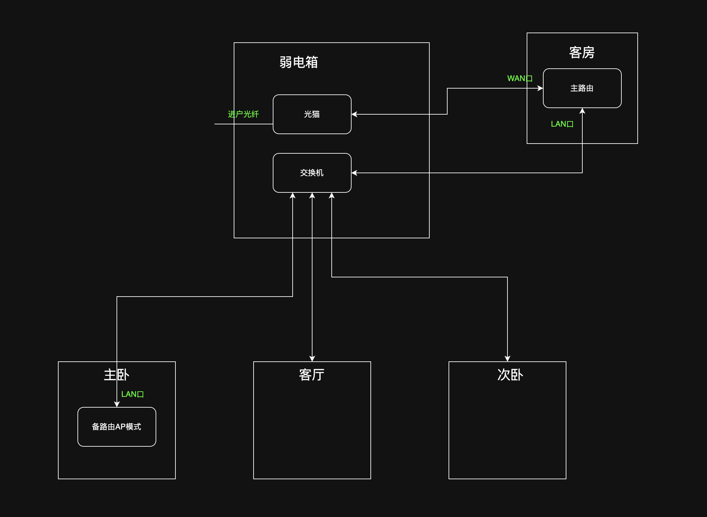

# 🏠 家庭组网方案：极客实用主义版

### 1. 核心设计思想

- **中心外置：**  弱电箱仅作为“中转站”，将路由器的“大脑”置于客房桌面，方便操作与散热。
- **物理双路：**  客房与弱电箱之间通过​**双线回传**，解决光猫拨号与全屋交换的逻辑闭环。
- **先基后备：**  装修时一次性把最难换的“线”和“交换机”买到位，路由器暂时沿用旧设备。

---

### 2. 空间布局与逻辑拓扑

<table>
<colgroup><col /><col /><col /><col /><col /><col /></colgroup><thead><tr>
<th><strong>位置</strong></th>
<th><strong>设备部署</strong></th>
<th colspan="4" rowspan="1"><strong>功能描述</strong></th>
</tr>
</thead><tbody>
<tr>
<td><strong>弱电箱</strong></td>
<td>光猫（桥接模式）+<strong>2.5G 交换机</strong></td>
<td colspan="4" rowspan="1">全屋流量的“大动脉枢纽”。</td>
</tr>
<tr>
<td><strong>客房(核心)</strong></td>
<td>主路由/拨号</td>
<td colspan="4" rowspan="1">负责全屋拨号、DHCP、防火墙及游戏加速。</td>
</tr>
<tr>
<td><strong>主卧</strong></td>
<td>旧路由/备用 AP</td>
<td colspan="4" rowspan="1">负责休息区无线覆盖（可设独立 SSID 手动切换最好是MESH组网）。</td>
</tr>
<tr>
<td><strong>其他房间</strong></td>
<td>墙面网口面板</td>
<td colspan="4" rowspan="1">电视、游戏机、PC 物理直连。</td>
</tr>
</tbody>
</table>

---

### 3. 物理链路连接图（施工重点）

1. **互联网输入：**  光猫 (千兆口) $\rightarrow$ **客房线 A** $\rightarrow$ 主路由（WAN口)。
2. **满血回传：**  主路由(LAN口) $\rightarrow$ **客房线 B** $\rightarrow$ **2.5G 交换机**。
3. **全屋分发：**  交换机 $\rightarrow$ 各房间预埋线（客厅、主卧、次卧） $\rightarrow$ 终端设备。
4. 第二路由作为AP：可根据实际情况调整部署位置力求全屋无线网覆盖。

---

### 4. 硬件采购清单（总预算约 ¥1000 内）

|**类别**|**推荐规格**|**建议品牌**|**备注**|
| --| -----------------------| ---------------------| -----------------------------------|
|**网线**|**CAT6A (超六类) 非屏蔽**|大唐、普天、海康|必须是**无氧铜**，拒绝铜包铝。|
|**交换机**|**5口 2.5G 网络交换机**|中兴、TP-LINK、水星|选全金属外壳，利于弱电箱散热。|
|**弱电箱**|**400x500 带风扇规格**|任意正品|必须带温控风扇和 PDU 专用插排。|
|**面板模块**|超六类屏蔽/非屏蔽模块|施耐德、公牛|建议买空面板+独立模块，方便维护。|

---

### 5. 施工避坑指南（写给电工）

- **管径要求：**  客房至弱电箱主干道使用 ​**25mm (或20mm) PVC 管**。
- **拉线工艺：**  严禁 90 度死弯，必须走​**大弧度“月亮弯”** 。
- **强弱电分离：**  网线管与电线管保持至少 **20cm** 间距，交叉处包裹锡纸。
- **底盒预留：**  客房核心位使用 ​**60mm 加深底盒**，预留两根网线，长度建议留出 20cm 余量。

---

### 6. 未来升级路径（无痛迁移）

这套方案最优雅的地方在于，当你未来手头宽裕想升级时：

- **升级 WiFi 7：**  仅需在客房拔下小米，插上​**中兴 BE5100 Pro+** 。
- **升级万兆：**  弱电箱更换万兆交换机，线材无需更换（超六类短距离支持 10G）。
- **解决信号死角：**  在信号弱的房间墙面网口接入新的 AP，实现全屋覆盖。
