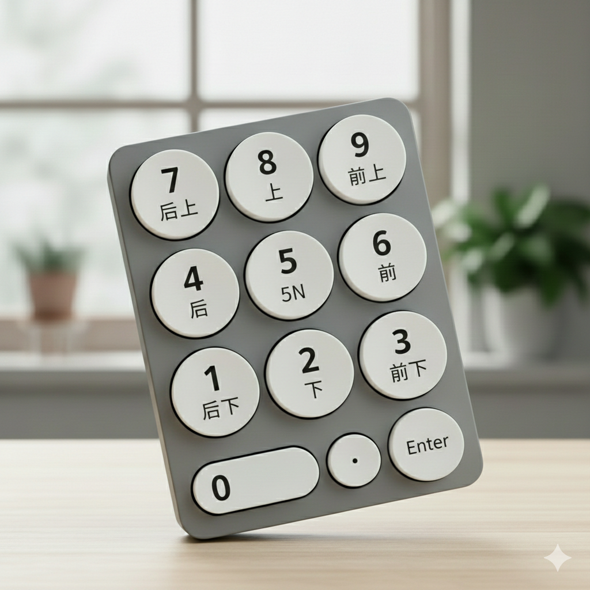

# 从基础到实战：《街霸6》角色与连招进阶指南

在掌握了《街霸6》的基础概念和核心系统后，下一步自然就是深入了解各个角色的特性，并学习如何将这些系统知识转化为实战中的连招技巧。本文将作为你之前《街霸6基础概念解析》的延续，重点解析街霸社区中常用的连招表示法，并为你搭建通往角色精通的学习路径。

## 1. 社区连招表示法解析：读懂“黑话”的钥匙

在街霸社区中，玩家们使用一套高度简化的符号系统来描述连招，这些“黑话”对于新手来说往往如同天书。掌握这套表示法是学习高级连招的第一步。

### 1.1 核心符号与缩写

**1. 方向表示法（数字小键盘系统）**

- `6`​\= 前，`4`​\= 后，`2`​\= 下，`8`​\= 上
- `1`​\= 后下，`3`​\= 前下，`7`​\= 后上，`9`​\= 前上
- `N`​\= 摇杆回中（不输入方向）

**2. 攻击按键缩写**

- `LP`​/`LK`​\= 轻拳/轻脚（Light Punch/Light Kick），`MP`​/`MK`​\= 中拳/中脚（Medium Punck/Medium Kick），`HP`​/`HK`​\= 重拳/重脚（Heavy Punch/Heavy Kick）
- 组合表示：`2LP`​\= 蹲轻拳，`5MP`​\= 站中拳（5表示站立状态），214HK=⬇️↙️⬅️重腿

**3. 系统术语缩写快速总览**

|缩写|全称|中文译名/俗称|核心作用|
| ------| -------------------| -----------------| --------------------------------------------------------------|
|**DI**|Drive Impact|斗气迸放|霸体反击，版边撞墙|
|**DR**|Drive Rush|斗气前冲/绿冲|快速突进，创造连招机会|
|**DRC**|Drive Rush Cancel|绿冲取消|取消招式后摇发动绿冲，核心连招扩展手段|
|**OD**|OverDrive|斗气必杀/EX技|消耗斗气强化必杀技性能|
|**Parry**|Drive Parry|斗气招架/蓝防|格挡攻击，完美招架可创造反击时机|
|**CH**|Counter Hit|打康/反击命中|打断对手出招，伤害与有利帧增加|
|**PC**|Punish Counter|确反康/惩罚反击|对手收招时命中，获得极大优势|
|**SA**|Super Art|超必杀技|消耗气槽的终极招式|
|**CA**|Critical Art|临界艺术|本作最强单发超杀|
|>|Cancel|取消|使用优先级更高的招式覆盖上一个招式的后摇|
|,|Link|目押|需要人眼判断上一个招式的后摇结束然后接下一个招式|
|~|Target Combo|派生|游戏系统内部预设的特定普通技序列，按顺序输入即可形成简易连段|

### 1.2 关键概念详解

#### 1.2.1 DRC（Drive Rush Cancel）绿冲取消

**DRC**是《街霸6》中最核心的连招扩展机制，全称为Drive Rush Cancel（绿冲取消）。它的运作原理如下：

- **消耗**：3格斗气槽（不足3格则清空所有斗气）
- **触发条件**​：在普通技的取消窗口内输入`66`​（前前）或`MP+MK`（斗气招架键）
- **效果**：取消当前普通技的收招硬直，立即发动绿冲，获得+4帧有利帧
- **应用**：将原本无法连招的普通技连接起来，大幅扩展连招可能性与伤害

#### 1.2.2 >（Cancel）取消

- **定义**​：指在动作**尚未完全结束**时，利用特定时机输入下一个指令，从而“剪掉”当前动作的收招硬直，直接跳入下一个动作。
- **操作感**​：​**快**。你需要在招式击中对手的瞬间（甚至提前）输入下一个指令。
- **例子**：`2MK>236P`（蹲中脚取消波动拳）。如果取消成功，你会发现蹲中脚踢出去的腿还没收回来，波动拳就已经发出去了。
- **关键点**：不是所有招式都能取消，遵从必杀技可以取消普通技；超必杀技可以取消必杀技的原则。在训练模式开启`取消时机显示`​功能，身体变**红**时即为取消窗口。

#### 1.2.3 （Link）目押

- **定义**​：指在前一个动作**完全结束**后，利用你获得的“帧数优势（Plus Frames）”，在极短的时间内按出下一个招式。
- **操作感**​：​**稳**。这是一种节奏感训练，按太快招式出不来（因为前一招还没收完），按太慢会被防住。
- **例子**：隆的`DR5LP,2MP`（绿冲站轻拳目押蹲中拳）。两招之间没有直接的动作打断，而是前一招打完，对方还在僵直，你赶紧出第二招。
- **符号区别**：社区通常用 `,` 表示目押。

#### 1.2.4 ~（Target Combo）派生

- **定义**​：这是角色招式表里**自带**的后续。它不需要考虑复杂的帧数逻辑，只要你按了第一下，系统就允许你按第二下。
- **操作感**​：​**连按**。类似于按出“组合拳”。
- **例子**：

  - **目标连段 (Target Combo)** ​：如肯的 `MP > HP`。
  - **特殊技派生**​：如嘉米的 `236K`​（螺旋箭）后按 `4K` 进行追加。
- **特质**：派生通常比普通的取消更具有确定性，通常是角色性能设计的核心部分。

### 1.3 连招表示法实例解析

**基础连招表示**：

- `2LP > 2LP > 236LP`​\= 蹲轻拳 → 蹲轻拳 → 波动拳
- `j.HK > 2HP > 236HK`​\= 跳重脚 → 蹲重拳 → 重版必杀技驴踢

**包含DRC的进阶连招**：

- `2MP~DRC > 5HP > 236HK`​\= 蹲中拳（绿冲取消）→ 站重拳 → 重版必杀技
- `DI > dash > 5HP~DRC > 5HK > SA3`​\= 斗气迸放 → 前冲 → 站重拳（绿冲取消）→ 站重脚 → 三级超必杀

**帧数表与状态术语**：

- `oH`​\= 命中有利帧（on Hit），`oB`​\= 被防有利帧（on Block）
- `CH`​\= 打康状态，`PC`​\= 确反康状态
- `DRC-oH`​\= 绿冲取消命中后的有利帧情况

## 2. 从系统理解到角色专精的过渡

理解了这些表示法后，你就可以开始深入学习具体角色了。每个角色在《街霸6》的斗气系统中都有独特的应用方式。

### 2.1 角色学习路径建议

1. **选择入门角色**：建议从系统适应性强的角色开始，如隆（Ryu）、肯（Ken）或卢克（Luke）。
2. **掌握核心连招**：学习每个角色的“民工连”（基础实用连招），并理解其构成逻辑。
3. **理解角色特性**：分析角色的斗气系统使用模式（如哪些招式最适合DRC取消、何时使用DI等）。
4. **帧数数据记忆**：记住关键招式的帧数数据，特别是取消窗口和有利帧，这是构建和破解连招的基础。

### 2.2 连招练习方法论

1. **取消时机训练**：在训练模式中开启“取消时机显示”，观察角色身体变红的时间窗口，反复练习取消手感。
2. **分段练习**：将复杂连招分解为小段（如：起手段、DRC取消段、收尾段）分别练习，熟练后再连接。
3. **确认训练**：练习“打中确认”（Hit Confirm），即用前1-2下攻击判断是否命中，再决定是否投入资源（如DRC）进行后续连招。
4. **资源管理练习**：在不同斗气槽状态下练习连招，了解资源耗尽（虚损状态）的风险，学会在资源有限时的最优选择。

## 3. 实战应用：将知识转化为胜势

掌握了连招表示法和角色特性后，你需要在实战中灵活应用这些知识：

- **立回中的DRC应用**​：使用`2MK~DRC`这类较长攻击进行中距离突袭和连招起手。
- **确反连招构建**​：针对对手-4帧以上的不安全招式，准备相应的确反连招，并在`Punish Counter`时使用更高伤害的连段。
- **资源决策**：根据对局血量、时间和位置，决定是使用DRC进行压制和连招，还是保留斗气用于防守（招架、反击）。
- **连招收尾选择**：根据位置（版边/版中）、剩余资源和对手血量，选择最优收尾方式（如用超杀终结、用DI撞墙重置等）。

## 4. 下一步：角色专题深入

在接下来的文章中，我们将开始具体的角色专题分析。每个专题将包含：

1. **角色基本概况与定位**：角色性能、优劣势与打法风格。
2. **关键普通技与特殊技解析**：核心立回与连招起手技。
3. **核心连招框架**：从最基础的“民工连”到消耗资源的进阶连招，并用社区术语清晰表示。
4. **斗气系统使用策略**：该角色使用DI、DRC、OD技能的最佳时机与方式。
5. **对战各角色对策要点**：常见对战角色的基本应对思路。

通过本文的过渡，你已经具备了深入学习任何《街霸6》角色所需的工具和知识框架。记住，格斗游戏的精髓不仅在于连招的华丽，更在于对系统理解的深度和对战时的决策智慧。从理解`DRC`​和`~`这样的符号开始，逐步构建自己的角色专精之路，你将在《街霸6》的世界中找到属于自己的格斗艺术。

‍
