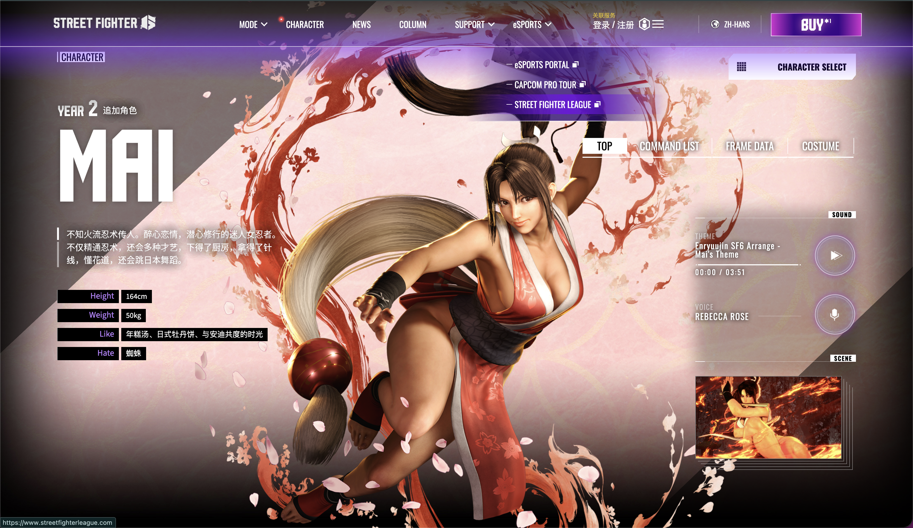

# 🌸 不知火舞（Mai Shiranui）：绚烂的不知火流继承者

### 一、 角色生涯简介：格斗界的红枫

不知火舞不仅是《饿狼传说》与《拳皇》系列的看板娘，更是格斗游戏史上最具代表性的女性角色之一。

- **名门之后**：她是“不知火流”忍术的继承者，师从祖父不知火半藏。
- **情迷安迪**：她那火辣的外表下，其实有一颗专一的心，一生都在追逐那个“木头脑袋”安迪·博加德。
- **街霸6联动**：此次跨界登场，舞保留了她经典的扇子与和服，但建模更加写实细腻。她的加入为《街霸6》带来了更偏向“拳皇式”的快节奏空战风格。

### 二、 玩法特点：华丽的空中掠夺者

舞是一个典型的**机动性牵制型（Zoner/Rushdown Hybrid）**  角色。

1. **扇子的绝对控制力**

   - **花蝶扇 (236P)** ：极佳的飞行道具，飞行速度快且轨迹稳定。配合《街霸6》的系统，舞可以利用花蝶扇在远处消磨对手斗气槽。
2. **恐怖的空中威胁**

   - **三角跳（墙壁跳跃）** ：舞是少数拥有三角跳的角色，这让她在版边极难被困住。
   - **鼯鼠之舞 (空中/地面 214P)** ：标志性的突进技，可以从各种刁钻的角度切入对手的防线。
3. **核心机制：华丽的派生（Follow-ups）**

   - 不同于隆的“一拳一脚”，舞的许多招式（如必杀技后的追加）需要大量的​**派生输入**。这让她的连招视觉效果极佳，但对玩家的输入节奏要求更高。
4. **核心缺陷**

   - **身板较脆**：一旦被隆或卢克这种重炮手确反，血量掉得非常快。
   - **对空压力**：虽然她空中很强，但地对空的稳定性略逊于升龙系角色，依赖精准的站立重击。

### 三、 常用连段（基于社区目前的黑话标准）

> **提示**：舞的连招中包含大量 `~`​ (派生) 和 `>` (目押)，需要注意节奏。
>
> 社区黑话、连招名词解释参考[从基础到实战：《街霸6》角色与连招进阶指南](./从基础到实战：《街霸6》角色与连招进阶指南.md)

- **基础确反（简易民工连）**

  - `5MP > 2MP ~ 236MK ~ 6K`
  - *解析：中拳目押蹲中拳，取消必杀技并完成派生踢击。*
- **中距离绿冲突袭**

  - `2MK ~ DRC > 5HP > 4HP ~ 214MP ~ 214P`
  - *解析：下中脚绿冲起手，利用 4HP 的特殊性能衔接必杀技。*
- **版边爆发（消耗资源型）**

  - `DI > 5HP ~ 214PP ~ 2P > 623KK > SA3`
  - *解析：利用 OD 版本的必杀技在版边制造高浮空，最后以超杀收尾。*

---

> ### 总结：格斗场上的华丽圆舞曲
>
> 如果你厌倦了隆那种“脚踏实地”的打法，渴望在屏幕中忽左忽右、用眼花缭乱的扇子和忍术戏耍对手，那么不知火舞就是你的本命。

‍

::: note
## 背景图

:::

‍
