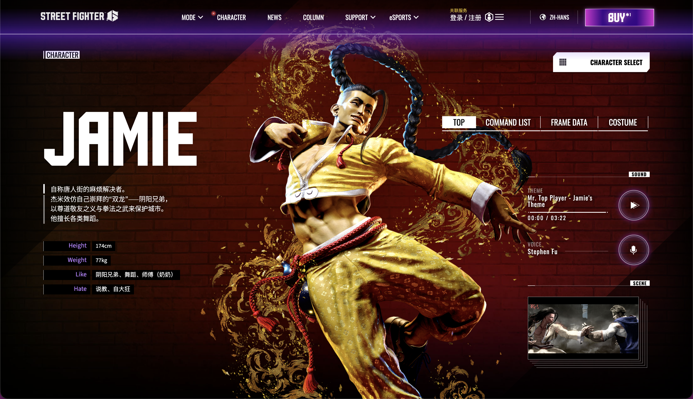

# 🍶 杰米（JAMIE）：霓虹下的醉拳舞者

### 一、 角色生涯简介：唐人街的守护者

杰米自称是唐人街的“麻烦解决者”。他极度崇拜《街霸》历史上的传奇双子**阴（Yun）和阳（Yang）** ，其格斗风格融合了醉拳和霹雳舞，极具视觉冲击力。

- **正义之心**：虽然看起来是个玩世不恭的街头少年，但他对社区的安宁有着极强的责任感，时刻准备用武术惩治地痞流氓。
- **药汤的力量**：杰米随身携带一个药瓶（据称是特制药汤），通过饮用药汤来解锁体内潜藏的气。随着“醉意等级”的提升，他的发型会散开，全身皮肤变红，招式也会变得愈发狂暴。

### 二、 玩法特点：刀尖上的成长逻辑

杰米是一个​**成长型压制角色（Level-up Rushdown）** 。

1. **核心机制：醉意等级（Drink Level）**

   - **22P（魔身）** ：杰米饮用药汤。
   - **质变过程**：

     - **0级**：性能垫底，缺乏核心招式。
     - **1级**：解锁派生招式，进攻性初显。
     - **2级**：解锁“爆破脚（236K）”，连段能力大增。
     - **4级（满级）** ：形态改变，解锁所有杀招，此时的杰米拥有全游戏顶级的进攻压制力。
2. **极强的连贯性**

   - 杰米的招式大多带有​**派生（Follow-up）** 。他可以在一套连招结束后，选择牺牲伤害来换取“喝一口”的机会，这让玩家必须不断在“伤害”与“成长”之间做权衡。
3. **多变的切入点**

   - 由于拥有类似霹雳舞的动作，杰米的下段攻击和中段攻击切换极快，配合绿冲会让对手防不胜防。
4. **核心缺陷**

   - **慢热**：0酒状态下的杰米非常弱势，如果开局被压制且找不到机会喝酒，会打得极其痛苦。

### 三、 常用连段（Jamie Combo List）

> **注意**：杰米的连招会根据**醉意等级**的变化而变化，以下为最通用的基础逻辑。
>
> 社区黑话、连招名词解释参考[从基础到实战：《街霸6》角色与连招进阶指南](./从基础到实战：《街霸6》角色与连招进阶指南.md)

#### 1. 基础进攻（侧重资源获取）

- **醉意等级获取连段（0级起步）**

  - `2LP , 2LP , 2LP ~ 236KK ~ 6P`
  - *解析：轻技点确认后，接派生动作。最后一下 6P 会让杰米自动喝一口药汤。*
- **目标连段确认**

  - `5LP > 5LK > 5MP ~ 22P`
  - *解析：杰米标志性的 TC（目标连段），击中后强制倒地并安全喝酒。*

#### 2. 中距离绿冲压制（2级以上）

- **下段起手爆发**

  - `2MK ~ DRC > 5HP > 2HP > 236KK`
  - *解析：利用 2MK 摸奖，转入重攻击连段，2级解锁的 236K 能够提供极高的伤害。*
- **空隙钻空连段**

  - `DR > 5MK , 2MP > 214MK`
  - *解析：5MK 的判定极好，绿冲后利用 2MP 的目押衔接必杀技。*

#### 3. 确反与大硬直惩罚

- **确反康高额回报**

  - `5HP PC , DR > 5HP > 2HP > 236KK ~ 6K`
  - *解析：5HP 确反康后可以衔接最沉重的打击，并继续通过派生动作提升醉意。*
- **板边狂舞**

  - `DI (板边撞墙) > 5HP > 623KK`
  - *解析：板边使用 OD 升龙脚（张弓腿）可以打出极高的浮空效果。*

#### 4. 终结斩杀（SA3 大爆发）

- **满级绝唱（4级状态）**

  - `5HK PC , 5HP , DRC > 2HP , DRC > 2HP > 236KK > 236236P (SA3)`
  - *解析：4级杰米的伤害极其惊人。在双重 DRC 的衔接下，SA3 甚至可以瞬间带走对手过半的血量。*

---

> ### 总结：先苦后甜的格斗艺术
>
> 玩杰米就像在经营一份事业。你需要顶住开局没有技能的压力，通过一次次精准的确认来完成“资本积累”。
>
> 当你终于披散长发、皮肤通红地站在对手面前时，攻守之势将彻底逆转。**杰米的魅力在于，他不仅是在格斗，更是在刀尖上跳一支最华丽的舞。**

‍

::: note
## 背景图

:::

‍
