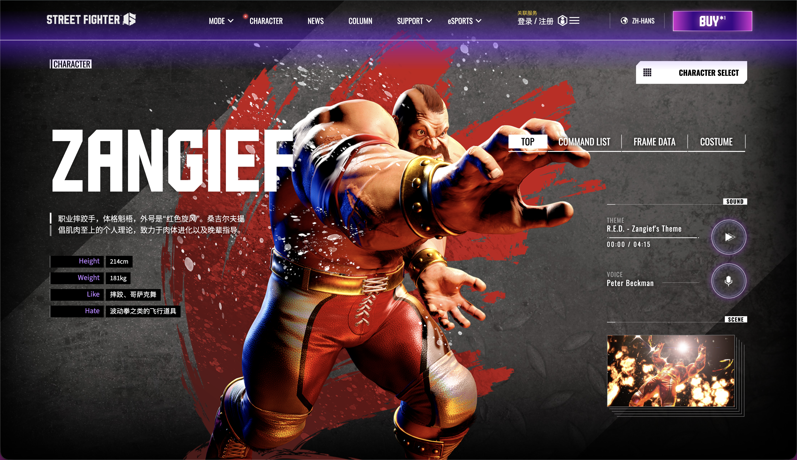

# 🏗️ 桑吉尔夫（Zangief）：钢铁般的赤色旋风

### 一、 角色生涯简介：为了祖国的肉体美

桑吉尔夫是格斗游戏史上最著名的​**投技角色（Grappler）** 。他参加格斗大赛的目的极其纯粹：展示俄罗斯民族伟大的肉体力量，并以此鼓舞祖国的民众。

- **钢铁之躯**：他曾为了磨炼意志与西伯利亚的棕熊搏斗，胸口的伤痕和腿部的抓痕都是他战斗的勋章。
- **街霸6现状**：在本作中，老桑不仅是一名斗士，还成为了一名导师。他依然保持着极致的肌肉量，不仅在摔跤场上纵横，还开始教授后辈们关于“力量”的真谛。

### 二、 玩法特点：一力降十会的“威慑力”

老桑是典型的**慢速力量型**角色，他的核心逻辑是： **“只要抓到你一次，你的这局游戏就结束了。”**

1. **投技的顶点：螺旋打桩机（SPD）**

   - **360P**：老桑的招牌动作。在《街霸6》中，即使是轻版的 SPD 也有着恐怖的抓取距离。它是全游戏最强的单发投技，能瞬间蒸发对手三分之一的血量。
2. **“霸体”与防御反击**

   - **双截拳 (PP)** ：经典对空与消波手段。
   - **西伯利亚急行 (63214K)** ：带霸体远距离突进抓取，专门惩罚那些不敢靠近、只想远程猥琐的对手。
3. **《街霸6》新机制：驱动系统的绝配**

   - **DR (绿冲)** ：对于机动性差的老桑来说，绿冲是他的命根子。绿冲后的 5MP 或 2RB 会让对手陷入极大的投打择心理压力。
4. **核心缺陷**

   - **笨重**：移动速度慢，容易被波升流角色牵制（Zoning）。
   - **资源依赖**：为了接近对手，老桑往往需要消耗大量斗气槽进行绿冲或招架。

### 三、 常用连段（Zangief Combo List）

> **注意**：老桑的连招不多，核心在于 **“确认”和“择（Mix-up）”** 。
>
> 社区黑话、连招名词解释参考[从基础到实战：《街霸6》角色与连招进阶指南](./从基础到实战：《街霸6》角色与连招进阶指南.md)

#### 1. 基础进攻（打击确认）

- **贴身轻技连段**

  - `2LP , 2LP > PP`
  - *解析：最基础的自保连段，2LP确认后接双截拳击退对方。*
- **核心中段压制**

  - `5MP , 5MP`
  - *解析：老桑的神级普通技，第一下点中后目押第二下，是后续所有资源投入的基础。*

#### 2. 驱动系统应用（绿冲起手）

- **绿冲强力摸奖**

  - `DR > 5MP , 2HP > 214MK`
  - *解析：绿冲5MP命中后，可以目押接2HP（波尔修斯之斧），最后用套路必杀收尾。*
- **绿冲投打择（心理战）**

  - `DR > 5LP ... (停顿) ... 360P`
  - *解析：这是老桑最恐怖的招式。绿冲5LP让对方陷入僵直，对方以为你要继续打，结果你直接一个SPD抓取。*

#### 3. 确反与大硬直惩罚

- **确反康爆发**

  - `5HP PC , DR > 2HP > 214MK`
  - *解析：利用5HP蓄力拍倒对手后的确反，伤害极高且能获得后续起身压制权。*
- **板边噩梦**

  - `DI (板边撞墙) > 2HP > 236PP`
  - *解析：在板边使用OD必杀技，最大化输出。*

#### 4. 终结斩杀（SA3 大爆发）

- **终极赤色旋风**

  - `5HP PC , DR > 5MP , 2HP > 720P (SA3)`
  - *解析：老桑的SA3是全游戏单发伤害最高的招式。只要连招能带入SA3，对手的血条就像纸糊的一样。*

---

> ### 总结：肌肉就是一切
>
> 玩老桑不需要像玩舞那样满屏幕乱跳，也不需要像隆那样精准对空。你需要的是**耐心**和​**一颗大心脏**。
>
> 你要像猎人一样慢慢逼近，观察对手在压力下的每一个破绽。当你使出那个华丽的 360 旋转投时，那一瞬间的快感是任何其他角色都无法提供的。**因为在老桑面前，任何精妙的战术都敌不过那一双钢铁般的大手。**

‍

::: note
## 背景图

:::
