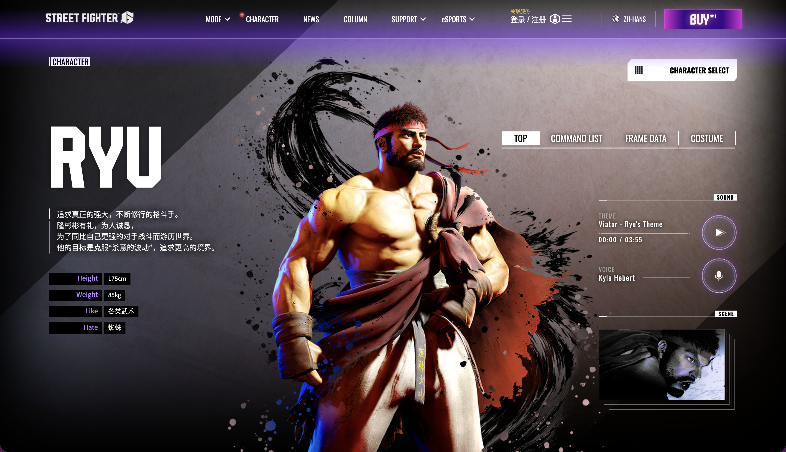

# 🥋 隆（Ryu）：孤高的求道者

### 1. 一、 角色生涯简介

隆自幼被师父**刚拳**收养，在朱雀城与同门师兄弟**肯（Ken）** 一同修习暗杀拳。不同于肯的豪迈与世俗化，隆的一生都在追求“真正的强者”之义。

- **初出茅庐：**  在初代《街霸》中，隆击败了泰拳王沙加特（Sagat），并在其胸口留下了标志性的巨大伤痕。
- **内心挣扎：**  他长期受体内“​**杀意之波动**”的困扰，这是他力量的来源，也是随时可能让他丧失理性的诅咒。在《街霸5》后期，隆终于克服了这股力量，达到了“虚无”的境界。
- **街霸6现状：**  步入中年的隆蓄起了胡须，披上了酷似师父刚拳的袈裟。他不再只是一个苦行僧，而是变得更加从容平和，展现出一种大师级的稳重。

---

### 2. 二、 玩法特点：万能型的“基石”

隆是格斗游戏中 **“波升流”** （Fireball & Uppercut）的鼻祖，他的招式设计是整个格斗游戏平衡性的标杆。

#### 2.1 1. 极致的平衡性（Standard）

- **万金油：**  隆拥有最完美的防御（升龙拳）和最经典的远程牵制（波动拳）。无论面对什么类型的对手，隆都有应对的手段。
- **上手容易，精通难：**  他的操作逻辑非常直观，适合新手入门，但要在高阶对局中取胜，极其考验玩家对距离的把控和反应速度。

#### 2.2 2. “波升”战术的顶点

- **波动拳 (236P)：**  用于控制空间，逼迫对手跳跃。
- **升龙拳 (623P)：**  最强对空手段，一旦对方受不了波动拳的牵制而起跳，迎接他们的就是无敌的升龙。

#### 2.3 3. 《街霸6》的特殊机制：电刃练气

- **强化属性：**  隆可以通过手动充能（22P）进入“电刃练气”状态。
- **爆发力：**  在电刃状态下，他的下一个波动拳或波掌垢将获得多段伤害和更高的硬直，这让他在《街霸6》中拥有了瞬间扭转战局的超高爆发伤害（尤其是配合 SA3 大招）。

#### 2.4 4. 核心缺陷

- **中规中矩：**  与肯（Ken）的快速突进或豪鬼（Akuma）的多变压制相比，隆的进攻手段较为“朴实”，缺乏花哨的派生招式，容易被对手预测。

### 3. 三、常用连段

连招名词解释参考[从基础到实战：《街霸6》角色与连招进阶指南](./从基础到实战：《街霸6》角色与连招进阶指南.md)

#### 3.1 1. 基础进攻（贴身/立回）

- **贴身轻技起手**

  - `2LP , 2LP , 2LP > 623HP / 214LK`
  - *解析：最稳健的点确认连段，最后根据距离选择升龙拳（伤害）或龙卷旋风脚（推边）。*
- **中距离绿冲压制**

  - `2MK ~ DRC > 5HP > 214HP , 214MK`
  - *解析：隆的核心突进手段，利用 2MK 摸奖后绿冲转入高伤害必杀技。*

#### 3.2 2. 远距离突袭（资源消耗）

- **中段/长距离摸奖**

  - `DR > 5LP , 2MP > 623HP`
  - *解析：绿冲后的 5LP 拥有极高有利帧，目押 2MP 后接升龙拳非常扎实。*
- **下段突袭**

  - `DR > 2LK , 5LK > 214MK`
  - *解析：针对对手站姿防守的偷袭连段。*

#### 3.3 3. 确反康专题（Punish Counter）

- **重攻击大确反**

  - `5HP > 214HP , DR > 5HP > 236HK`
  - *解析：针对大硬直招式的惩罚，利用绿冲延伸位移完成重版必杀。*
- **板边限定爆发**

  - `214PP , 4HP > 236HK , 623MP`
  - *解析：OD 龙卷起手造成的浮空，在板边配合 4HP 能打出极其华丽的追击。*

#### 3.4 4. 终结斩杀（Maximum Damage）

- **经典高伤配方**

  - `5HK PC , 5HP , DRC > 5HK , 2HP , DRC > 5HK , 2HP > 623HP > 236236HK`
  - *解析：隆的最高规格输出。通过两次绿冲取消（DRC）极限压榨伤害，最后以 SA3（真空波动拳）完美收尾。*

---

> **总结：**  玩隆就是在玩“格斗游戏的本质”是真正的帝王之证。如果你追求每一拳都打得扎实、靠意识完全碾压对手，那么隆就是你的终极选择。

‍

::: note
## 4. 背景图

:::

‍
