# UML建模（案例题）

## 1. 考点：类图与对象图

### 1.1 考察形式

- 填类名
- 填多重度
- 填关系

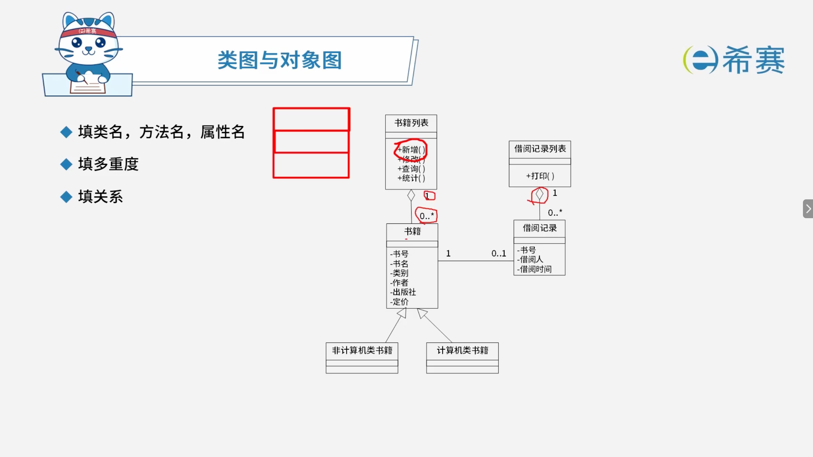

### 1.2 关系的表示方式

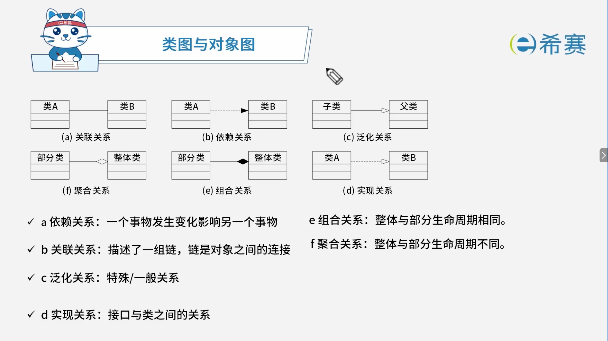

## 2. 考点：用例图

### 2.1 考察形式

- 参与者
- 用例名
- 关系
- 细化用例描述

### 2.2 关系的表示形式

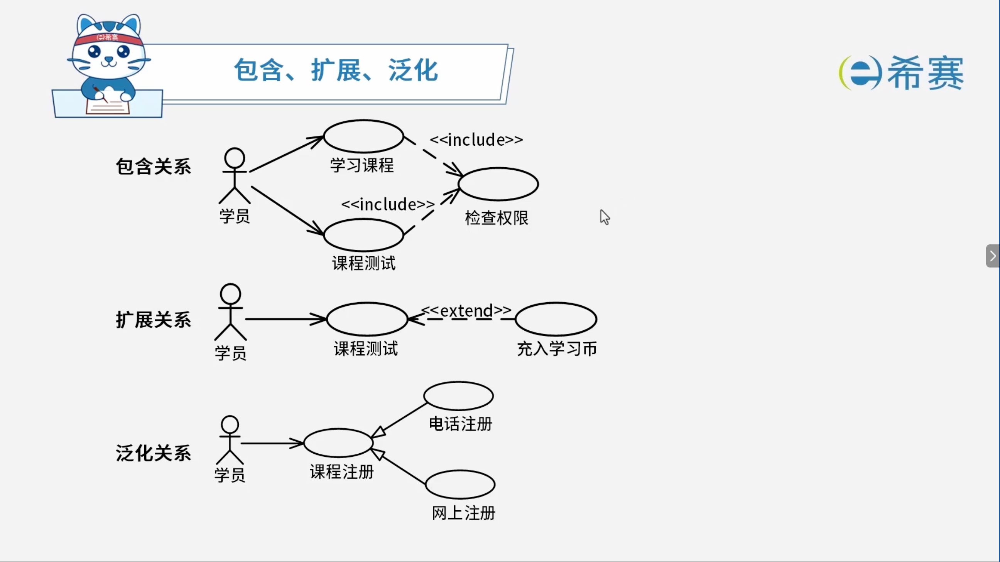

### 2.3 用例文档实例：自动售货机

- **参与者**：顾客。

#### 2.3.1 主要事件流

1. 顾客选择需要购买的饮料和数量，投入硬币。
2. 自动售货机检查顾客是否投入足够的硬币。
3. 自动售货机检查饮料储存中所选购的饮料是否足够。
4. 自动售货机推出饮料。
5. 自动售货机返回找零。

#### 2.3.2 备选事件流

- **2a**：若投入的硬币不足，则给出提示并退回到第 1 步。
- **3a**：若所选购的饮料数量不足，则给出提示并退回到第 1 步。

## 3. 考点：顺序图

### 3.1 考察形式

- 对象名
- 消息
- 生命周期

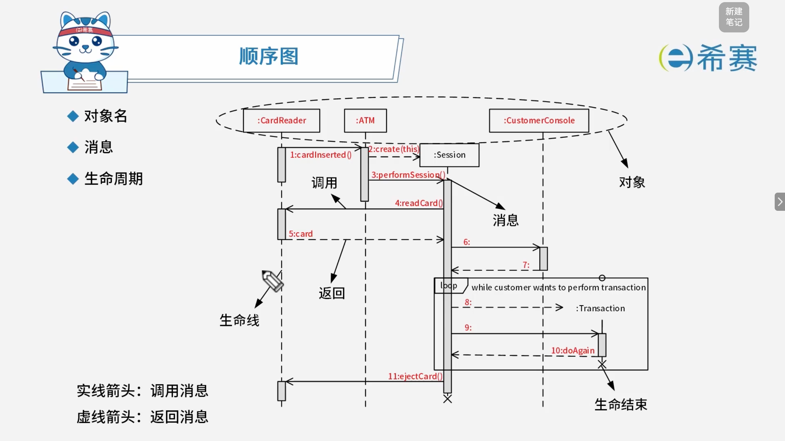

### 3.2 消息机制

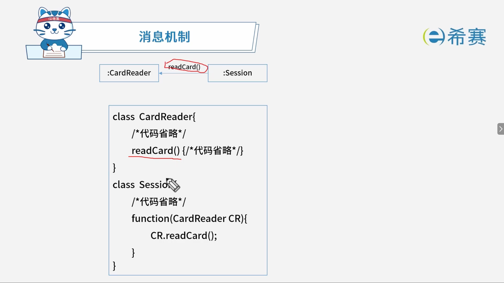

## 4. 考点：通信图

### 4.1 考察形式

- 对象名
- 消息

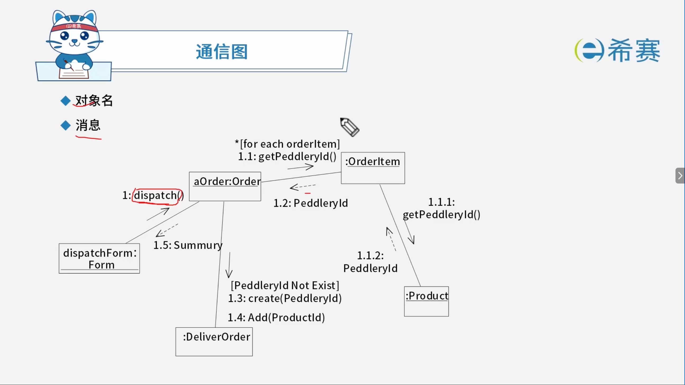

## 5. 考点：状态图

### 5.1 考察形式

- 状态名
- 触发事件、监护条件、动作

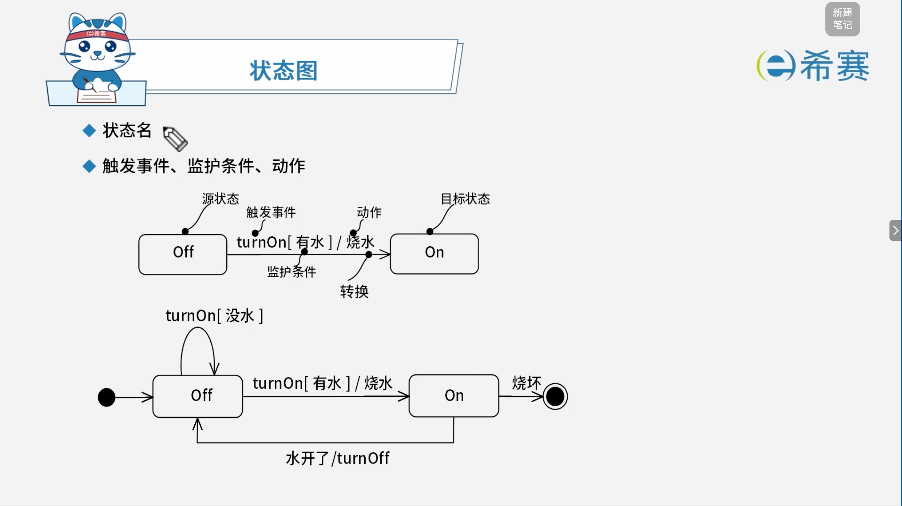

## 6. 考点：活动图

### 6.1 考察形式

- 活动名
- 开始、结束
- 并发分支、并发汇合
- 活动发起者

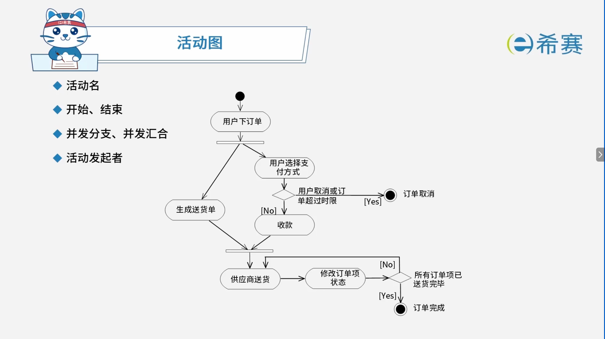

## 7. UML 图题型解题技巧

1. **常见 UML 图基础知识定期复习**：夯实基础，熟悉各类图的符号、关系及概念。
2. **“先看图，后做题”的做题步骤**：

   - 初步把题干、图、问题看完后，​**先仔细看图**。
   - 把图中的信息总结出来后，再去读题干、找其余问题答案。
   - **切忌**：千万不要在没有分析完图的情况下，就盲目去分析题干。

## 8. 实战训练

### 8.1 题目一

> 阅读下列说明和图，回答问题1至问题3，将解答填入答题纸的对应栏内。
>
>  **【说明】**
>
> 某出版社拟开发一个在线销售各种学术出版物的网上商店（ACShop），其主要的功能需求描述如下：
>
> 1. ACShop 在线销售的学术出版物包括论文、学术报告或讲座资料等。
> 2. ACShop 的客户分为两种：未注册客户和注册客户。
> 3. 未注册客户可以浏览或检索出版物，然后将出版物添加到购物车中。未注册客户进行注册操作之后，成为 ACShop 注册客户。
> 4. 注册客户登录之后，可将待购买的出版物添加到购物车中，并进行结账操作。结账操作的具体流程描述如下：  
>    ① 从预先填写的地址列表中选择一个作为本次交易的收货地址。如果没有地址信息，则可以添加新地址。
>
>    ② ​**选择付款方式**。ACShop 支持信用卡付款和银行转账两种方式。注册客户可以从预先填写的信用卡或银行账号中选择一个付款。若没有付款方式信息，则可以添加新付款方式。
>
>    ③ **确认提交购物车中待购买的出版物后，ACShop 会自动生成与之相对应的订单**。
> 5. **管理员**负责维护在线销售的**出版物目录**，包括添加新出版物或者更新在售出版物信息等操作。
>
> 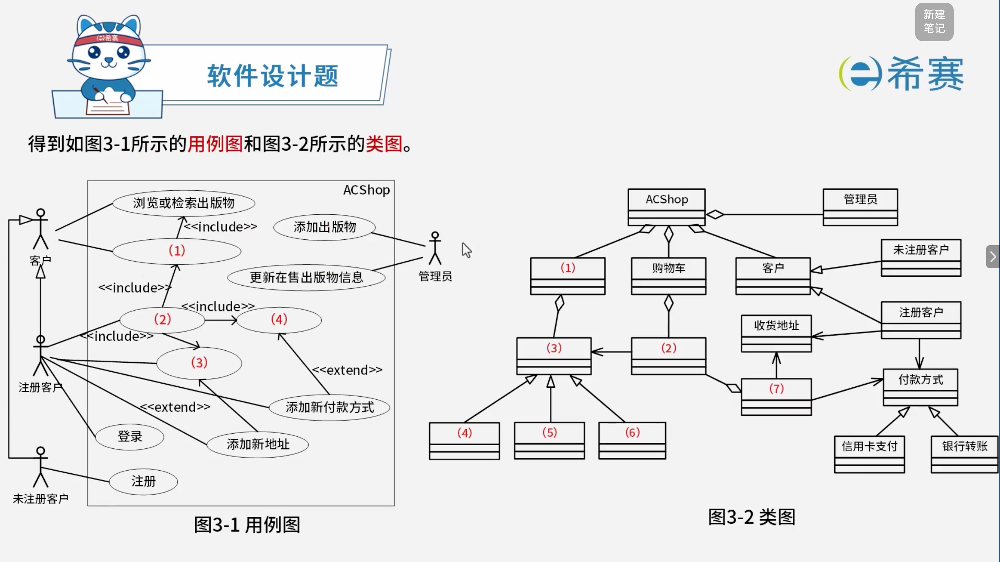
>
>  **【问题1】** （4分）
>
> 据说明中描述，给出图3-1中（1）～（4）所对应的用例名。
>
>  **【问题2】** （4分）
>
> 根据说明中的描述，分别说明用例“添加新地址”和“添加新付款方式”会在何种情况下由图3-1中的用例（3）和（4）扩展而来？
>
>  **【问题3】** （7分）
>
> 根据说明中的描述，给出图3-2中（1）～（7）所对应的类名。

【解析】

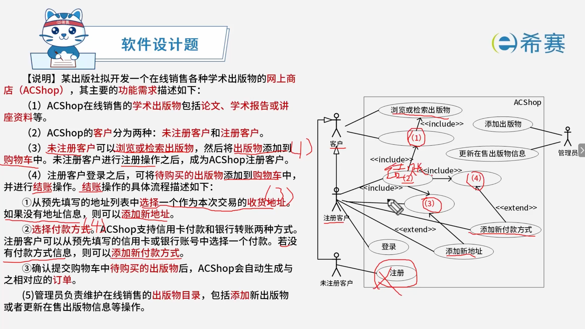

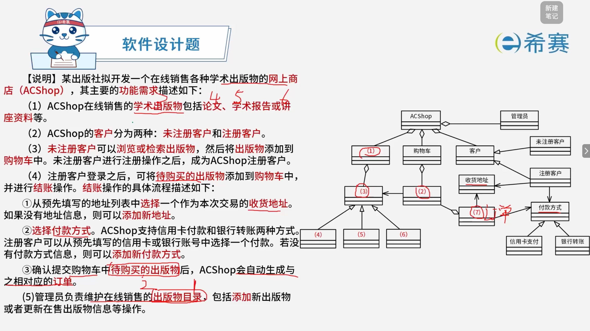

#### 8.1.1 正确答案

 **【问题1】**

（1）添加出版物到购物车  
（2）结账  
（3）选择收货地址  
（4）选择付款方式

 **【问题2】**

- 当选择收货地址时，没有地址信息，则使用扩展用例“添加新地址”来完成新地址的添加。
- 当选择付款方式时，没有付款方式信息，则使用扩展用例“添加新付款方式”来完成新付款方式的添加。

 **【问题3】**

（1）出版物目录  
（2）待购买的出版物  
（3）出版物  
（4）～（6）论文、学术报告、讲座资料  
（7）订单

### 8.2 题目二

> 阅读下列说明，回答问题1至问题3，将解答填入答题纸的对应栏内。
>
>  **【说明】**
>
> 某种出售罐装饮料的自动售货机（Vending Machine）的工作过程描述如：
>
> （1）顾客选择所需购买的饮料及数量。
>
> （2）顾客从投币口向自动售货机中投入硬币（该自动售货机只接收硬币）。硬币器收集投入的硬币并计算其对应的价值。如果投入的硬币不够或者所选购的饮料数量不足，则提示用户继续投入硬币或重新选择饮料及数量；如果所投入的硬币足够购买所需数量的这种饮料且饮料数量足够，则推出饮料，计算找零，顾客取走饮料和找回的硬币。
>
> （3）一次购买结束之后，将硬币器中的硬币移走（清空硬币器），等待下一次交易。自动售货机还设有一个退币按钮，用于退还顾客所投入的硬币。已经成功购买饮料的钱是不会被退回的。
>
> 现采用面向对象方法分析和设计该自动售货机的软件系统，得到如图3-1所示的用例图，其中，用例“购买饮料”的用例规约描述如下。
>
> **参与者**：顾客。
>
> **主要事件流**：
>
> 1. 顾客选择需要购买的饮料和数量，投入硬币；
> 2. 自动售货机检查顾客是否投入足够的硬币；
> 3. 自动售货机检查饮料储存仓中所选购的饮料是否足够；
> 4. 自动售货机推出饮料；
> 5. 自动售货机返回找零。
>
> **备选事件流**：
>
> - 2a. 若投入的硬币不足，则给出提示并退回到1；
> - 3a. 若所选购的饮料数量不足，则给出提示并退回到1。
>
> 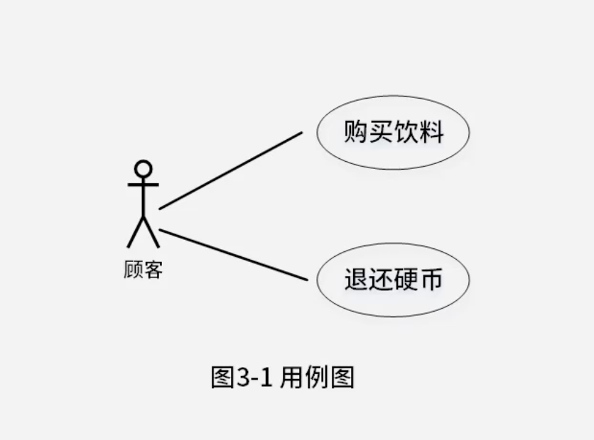
>
> 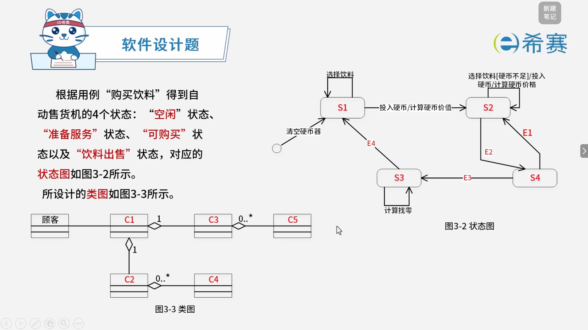
>
>  **【问题1】** （6分）
>
> 根据说明中的描述，使用说明中的术语，给出图3-2中的 S1～S4 所对应的状态名。
>
>  **【问题2】** （4分）
>
> 根据说明中的描述，使用说明中的术语，给出图3-2中的 E1～E4 所对应的事件名。
>
>  **【问题3】** （5分）
>
> 根据说明中的描述，使用说明中的术语，给出图3-3中 C1～C5 所对应的类名。

【解析】

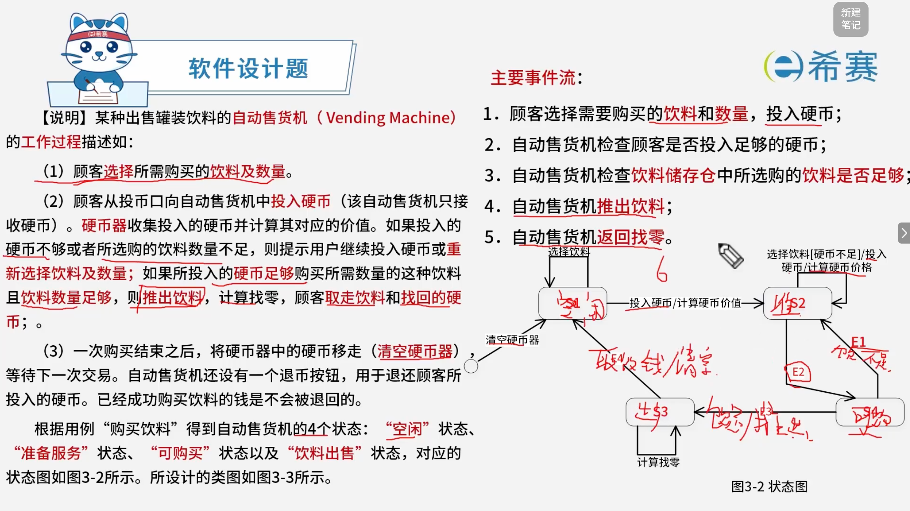

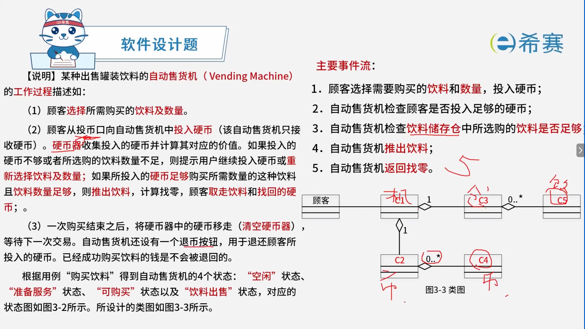

#### 8.2.1 正确答案

 **【问题1】**

S1：空闲，S2：准备服务，S3：饮料出售，S4：可购买。

 **【问题2】**

E1：饮料数量不足，E2：选择饮料[硬币数量足够]。

E3：饮料数量足够/推出饮料，E4：取走饮料/返回找零并清空硬币器。

 **【问题3】**

C1：自动售货机

C2：硬币器，C4：硬币。

C3：饮料储存仓，C5：饮料。

（C2\\C4组合与C3\\C5组合可互换位置）

### 8.3 题目三

> 阅读下列说明和图，回答问题1至问题3，将解答填入答题纸的对应栏内。
>
>  **【说明】**
>
> 某高校图书馆欲建设一个图书馆管理系统，目前已经完成了需求分析阶段的工作。功能需求均使用用例进行描述，其中用例“借书（Check Out Books）”的详细描述如下。
>
> **参与者**：读者（Patron）。
>
> **典型事件流**：
>
> 1. 输入读者ID；
> 2. 确认该读者能够借阅图书，并记录读者ID；
> 3. 输入所要借阅的图书ID；
> 4. 根据图书目录中的图书ID确认该书可以借阅，计算归还时间，生成借阅记录；
> 5. 通知读者图书归还时间。
>
> 重复步骤3\~5，直到读者结束借阅图书。
>
> **备选事件流**：
>
> - **2a. 若读者不能借阅图书，说明读者违反了图书馆的借书制度（例如，没有支付借书费用等）**
>
>   - ①告知读者不能借阅，并说明拒绝借阅的原因；
>   - ②本用例结束。
> - **4a. 读者要借阅的书无法外借**
>
>   - ①告知读者本书无法借阅；
>   - ②回到步骤3。
>
> **说明**：图书的归还时间与读者的身份有关。如果读者是教师，图书可以借阅一年；如果是学生，则只能借阅3个月。读者ID中包含读者身份信息。
>
> 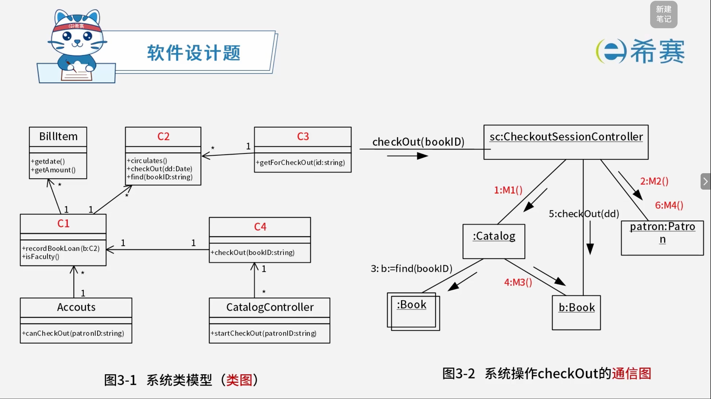
>
>  **【问题1】** （8分）
>
> 根据说明中的描述，以及图3-1和图3-2，给出图3-1中C1-C4处所对应的类名。（类名使用图3-1和图3-2中给出的英文词汇）。
>
>  **【问题2】** （4分）
>
> 根据说明中的描述，以及图3-1和图3-2，给出图3-2中M1-M4处所对应的方法名。（方法名使用图3-1和图3-2中给出的英文词汇）。
>
>  **【问题3】** （3分）
>
> 用例“借书”的备选事件流4a中，根据借书制度来判定读者能否借阅图书。若图书馆的借书制度会不断地扩充，并需要根据图书馆的实际运行情况来调整具体使用哪些制度。为满足这一要求，在原有类设计的基础上，可以采用何种设计模式？简要说明原因。

【解析】

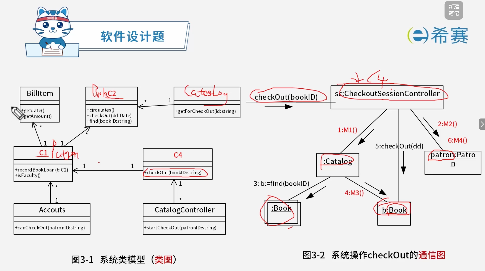

#### 8.3.1 正确答案

 **【问题1】** （8分）

- C1：Patron
- C2：Book
- C3：Catalog
- C4：CheckoutSessionController

 **【问题2】** （4分）

- M1：getForCheckOut
- M2：isFaculty
- M3：circulates
- M4：recordBookLoan

 **【问题3】** （3分）

应采用​**策略模式**。策略模式定义了一系列算法，并将每个算法封装起来，而且使它们可以相互替换。策略模式让算法独立于使用它们的客户而变化。适用于需要在不同情况下使用不同的策略（算法），或者策略还可能在未来用其他方式来实现。
