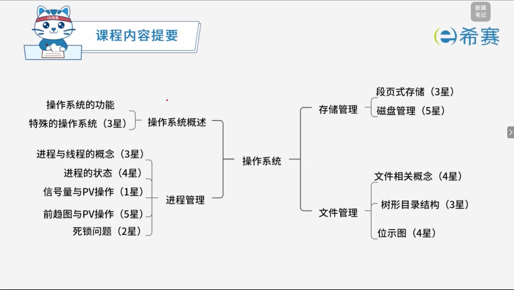
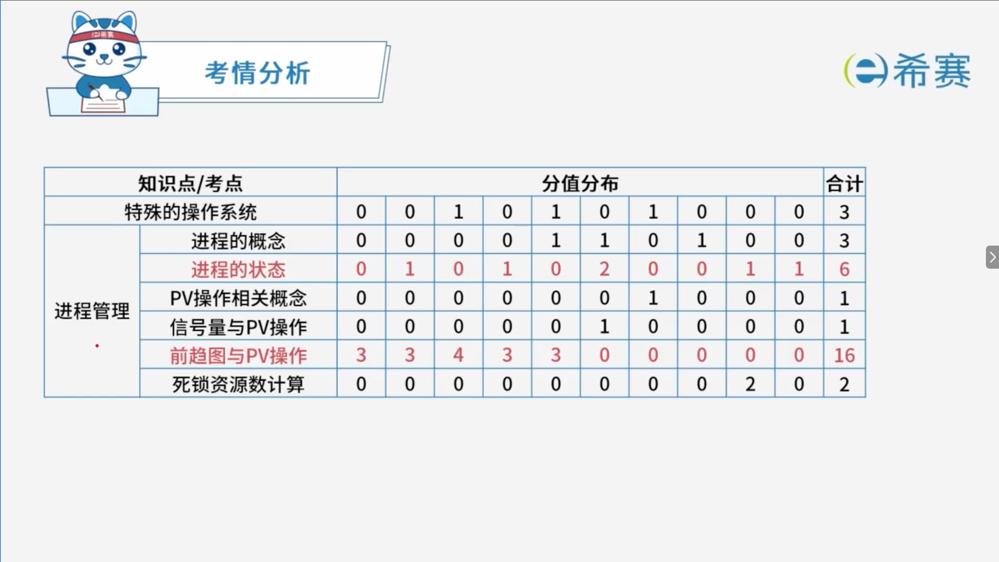
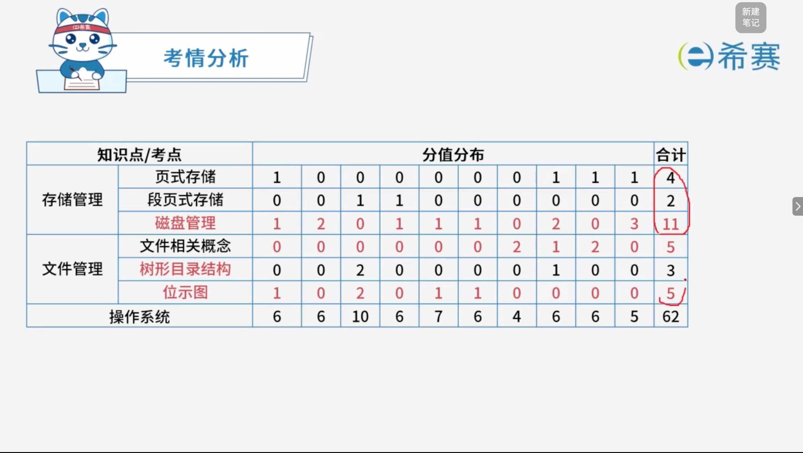

# 操作系统

## 学习目录

- [操作系统的功能](/软考/中级资格：软件设计师/操作系统/操作系统的功能)
- [特殊的操作系统](/软考/中级资格：软件设计师/操作系统/特殊的操作系统)
- [进程与线程的基本概念](/软考/中级资格：软件设计师/操作系统/进程与线程的基本概念)
- [进程的状态](/软考/中级资格：软件设计师/操作系统/进程的状态)
- [信号量与PV操作](/软考/中级资格：软件设计师/操作系统/信号量与PV操作)
- [前趋图与PV操作](/软考/中级资格：软件设计师/操作系统/前驱图与PV操作)
- [死锁问题](/软考/中级资格：软件设计师/操作系统/死锁问题)
- [进程资源图](/软考/中级资格：软件设计师/操作系统/进程资源图)
- [存储管理](/软考/中级资格：软件设计师/操作系统/存储管理)
- [磁盘管理](/软考/中级资格：软件设计师/操作系统/磁盘管理)
- [设备管理](/软考/中级资格：软件设计师/操作系统/设备管理)
- [文件管理](/软考/中级资格：软件设计师/操作系统/文件管理)
- [树形目录结构](/软考/中级资格：软件设计师/操作系统/树形目录结构)
- [索引文件结构](/软考/中级资格：软件设计师/操作系统/索引文件结构)
- [磁盘的位示图](/软考/中级资格：软件设计师/操作系统/磁盘的位示图)
- [文件权限](/软考/中级资格：软件设计师/操作系统/文件权限)

‍
