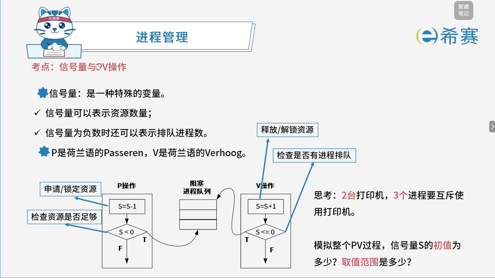
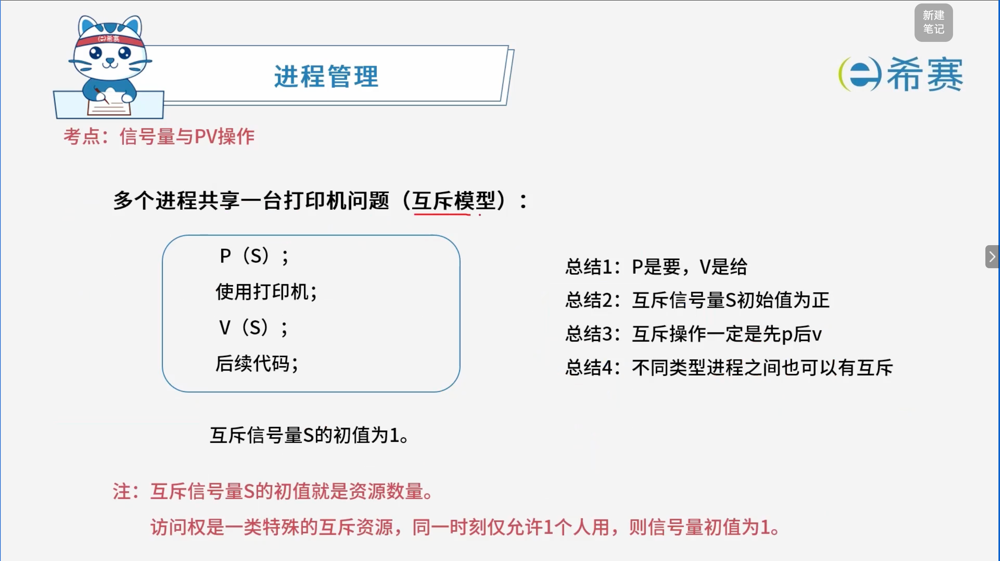
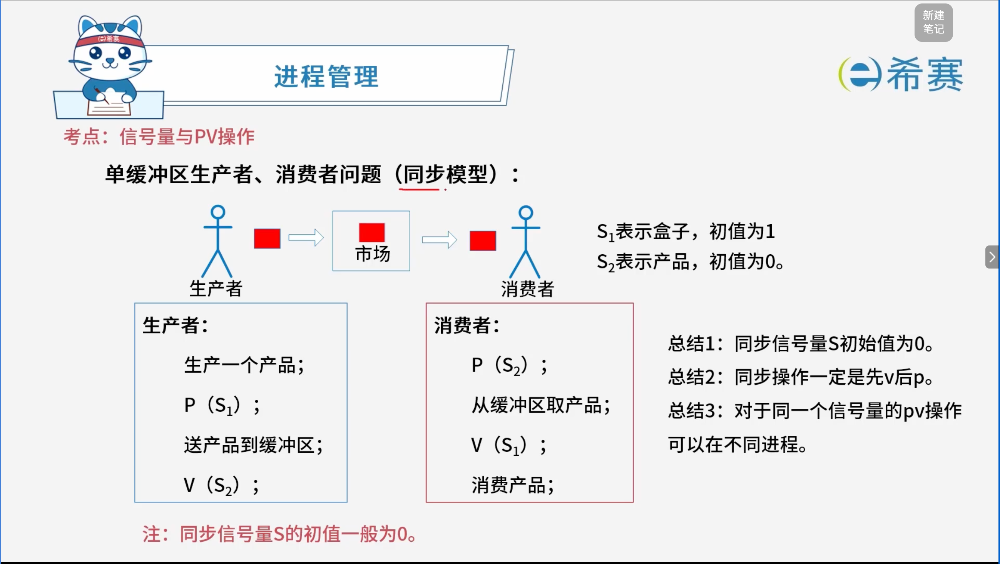

# 信号量与PV操作

## 1. 考点：基础概念

> P是荷兰语的Passeren（申请/锁定），V是荷兰语的Verhoog（释放/解锁）。

**答案：S的初值为2。取值范围为[-1,2]。** 

## 2. 考点：互斥模型

## 3. 考点：同步模型

## 4. 经典例题

### 4.1 题目一

> **题目】**
>
> 假设系统中有 $n$ 个进程共享 3 台扫描仪，并采用 PV 操作实现进程同步与互斥。若系统信号量 $S$ 的当前值为 $-1$，进程 $P_1$、$P_2$ 又分别执行了 1 次 $P(S)$ 操作，那么信号量 $S$ 的值应为（ ）。
>
>  **【选项】**
>
> - A、3
> - B、-3
> - C、1
> - D、-1

**解析：**

1. **明确初始条件**：

   - 信号量的初始值 $S = -1$。
2. **计算进程** **$P_1$** **执行** **$P(S)$** **后的值**：

   - $P_1$ 执行 1 次 $P(S)$ 操作，信号量值减 1：

     $$
     S = -1 - 1 = -2
     $$

- **计算进程** **$P_2$** **执行** **$P(S)$** **后的值**：

  - $P_2$ 又执行 1 次 $P(S)$ 操作，信号量值再次减 1：

    $$
    S = -2 - 1 = -3
    $$

经过两次连续的 $P(S)$ 操作后，信号量 $S$ 的计算结果为 $-3$。

**正确选项： B （-3）。** 

‍
