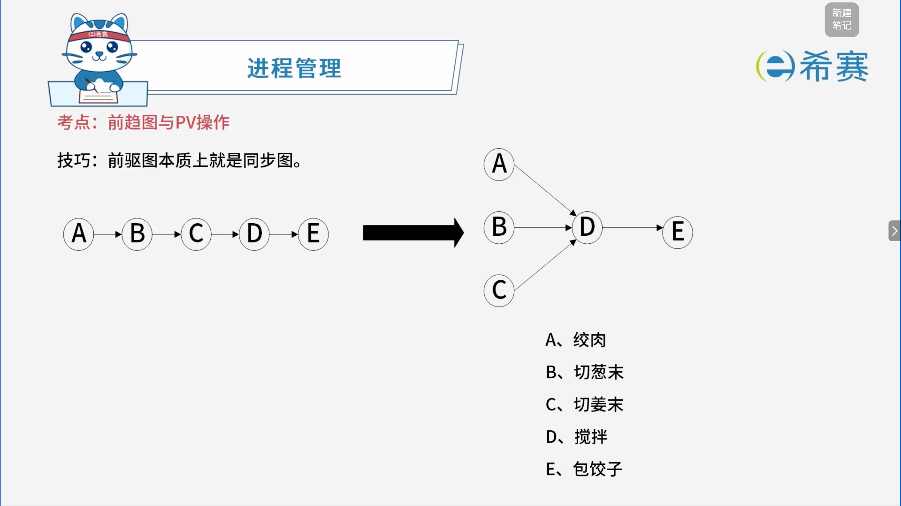
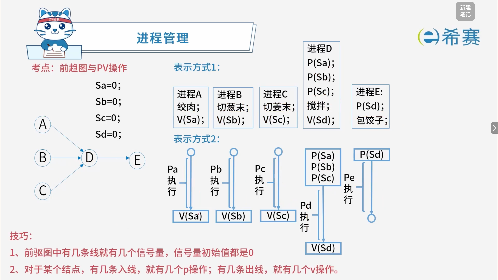
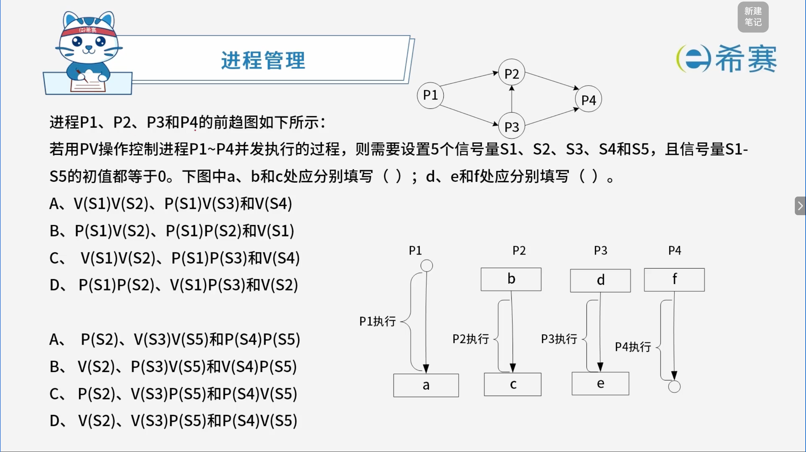

# 前驱图与PV操作

## 1. 考点：基础概念

> 前驱图本质上就是同步图。

## 2. 考点：执行过程

## 3. 经典例题

### 3.1 题目一

 **「解析」**

在解答软考中的 PV 操作同步问题时，核心准则为：​ **“一条有向边对应一个信号量，箭头的起点（前驱结束处）执行** **$V$** **操作（释放），箭头的终点（后继开始处）执行** **$P$** **操作（等待）”** 。

**第一空解析（对应选项 C）**

- **分析** **$P1$** **的出口（对应框** ​**​`a`​**​ **）** ：

  - $P1$ 执行完后，分别指向 $P2$ 和 $P3$（两条边）。因此，$P1$ 结束时需要同时释放两个信号，即执行 ​**$V(S1)V(S2)$**。
- **分析** **$P2$** **的入口（对应框** ​**​`b`​**​ **）** ：

  - $P2$ 需要等待来自 $P1$ 的信号，因此需要执行 ​**$P(S1)$**。
- **综合匹配**：

  - 选项 C 提供的组合 ​`V(S1)V(S2)、P(S1)P(S3)和V(S4)` 完全符合 $P1$ 分支并发及整体前驱图的逻辑闭环。

**第二空解析（对应选项 A）**

- **分析** **$P4$** **的入口（多路汇聚）** ：

  - $P4$ 前面汇聚了两条边（一条来自 $P2$，一条来自 $P3$）。因此，$P4$ 在开始执行前必须同时等待这两个前驱发出的信号，即需要执行两个 $P$ 操作，形式为 ​**$P(...)P(...)$**。
- **综合匹配**：

  - 选项 A 提供的组合 ​`P(S2)、V(S3)V(S5)和P(S4)P(S5)` 中包含了对汇聚点 $P4$ 的双重等待（如 $P(S4)P(S5)$），能够严密控制多个前驱全部执行完毕后才唤醒 $P4$。

**正确答案：C、A。** 

‍
