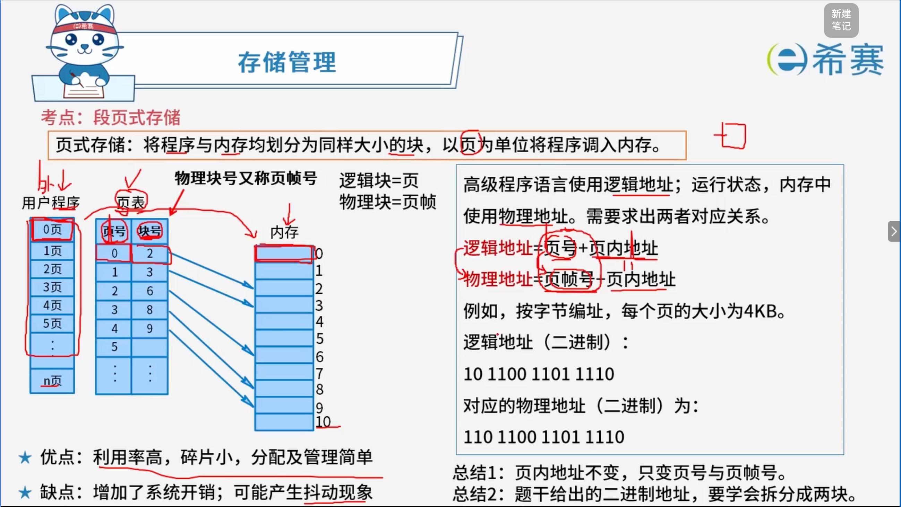
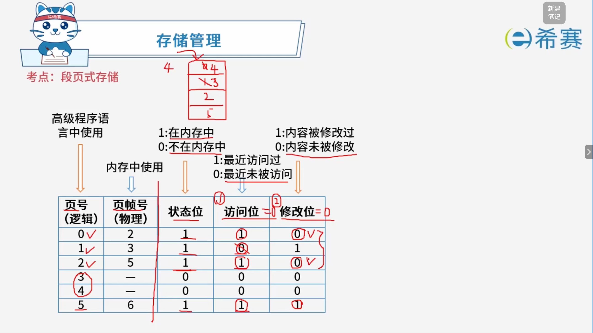
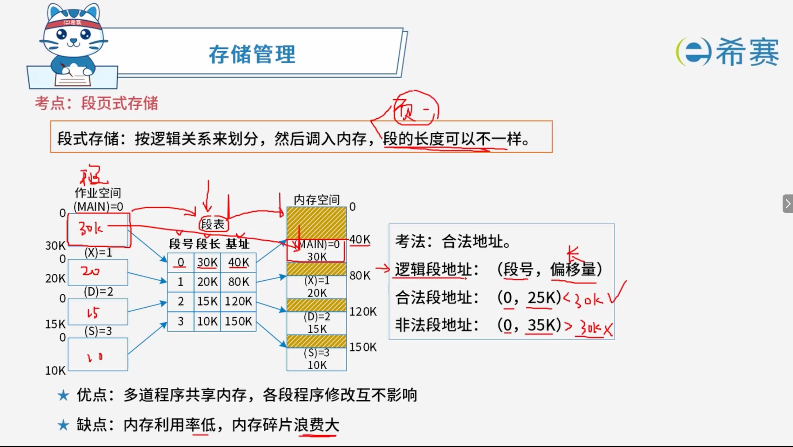
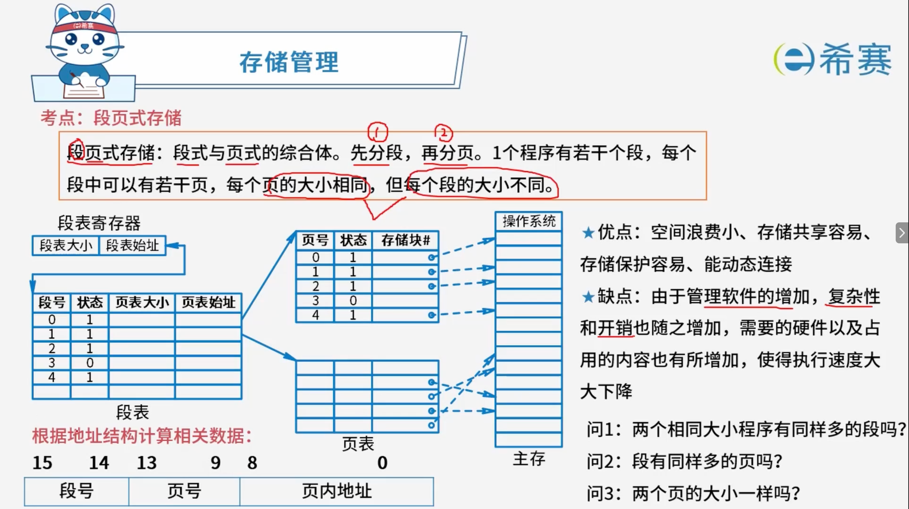
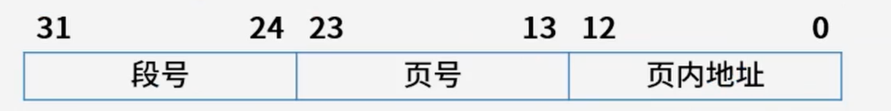

# 存储管理

## 1. 考点：页式存储

## 2. 考点：淘汰页

> 规则：优先淘汰未被访问的，其次淘汰未被修改的

## 3. 考点：段式存储

## 4. 考点：段页式存储

答1:相同大小的程序不一定有同样多的段。

答2:不同大小的段页不一样，因为页的大小都是一样的，但是段的大小不一样。

答3:两个页的大小一样。

## 5. 经典例题

### 5.1 题目一

> **题目：** 某计算机系统页面大小为 4K，进程的页面变换表如所示。若进程的逻辑地址为 2D16H，该地址经过变换后，其物理地址应为（ **C** ）。
>
> A、2048H
>
> B、4096H
>
> C、4D16H
>
> D、6D16H
>
> |**页号**|**物理块号**|
> | ---| ---|
> |0|1|
> |1|3|
> |2|4|
> |3|6|

**题目解析**

1. **确定页面大小与地址结构**：

   - 页面大小为 $4\text{K} = 4096 \text{ B} = 2^{12} \text{ B}$。
   - 这意味着低 12 位（即十六进制下的后 3 位，因为 $12 \text{ bit} = 3 \text{ 位十六进制}$）表示​**页内地址（偏移量）** ​，高位部分表示​**页号**。
2. **分析逻辑地址**：

   - 给定的逻辑地址为 ​`2D16H`。
   - 后 3 位 ​`D16H`​ 为页内偏移量，高位 ​`2H`​ 对应​**页号 2**。
3. **查找物理块号**：

   - 查阅页面变换表，页号 ​`2`​ 对应的​**物理块号为** ​**​`4`​**。
4. **计算物理地址**：

   - 将逻辑地址中的页号部分 ​`2`​ 替换为对应的物理块号 ​`4`​，即可直接拼出物理地址为 ​**​`4D16H`​**（或者用物理块号 $4 \times 4096 + \text{偏移量 D16H}$ 计算得出）。

**正确答案：C、4D16H。** 

### 5.2 题目二

> **题目：** 进程 P 有 5 个页面，页号为 0\~4，页面变换表及状态位、访问位和修改位的含义如下图所示，若系统给进程 P 分配了 3 个存储块，当访问的页面 3 不在内存时，应该淘汰表中页号为（ **A** ）的页面。
>
> A、0
>
> B、1
>
> C、2
>
> D、4
>
> |**页号**|**页帧号**|**状态位**|**访问位**|**修改位**|
> | ---| ----| ---| ---| ---|
> |0|8|1|1|0|
> |1|-|0|0|0|
> |2|3|1|1|1|
> |3|-|0|0|0|
> |4|13|1|1|1|

**解析：**

1. **确定在内存的页面范围**：

   - 根据题目要求，被淘汰的页面首先必须在内存中（即状态位为 1 的页面）。
   - 查表可知，当前在内存中的页面有：​**页号 0、页号 2、页号 4**。
2. **应用页面置换算法（改进型 Clock 置换准则）** ：

   - **第一步**：优先淘汰访问位为 0 的页面。此时在内存中的 0、2、4 号页面的访问位均为 1，无法直接区分。
   - **第二步**：进一步淘汰修改位为 0 的页面。

     - 0 号页面的修改位为 **0**
     - 2 号页面的修改位为 **1**
     - 4 号页面的修改位为 **1**
   - 综合来看，**页号 0** 的访问位虽然为 1，但其修改位为 0，符合优先淘汰的条件（属于最近未被修改的页面）。

**正确答案**A、0。

### 5.3 题目二

> **题目：** 设某进程的段表如下所示，逻辑地址（ **B** ）可以转换为对应的物理地址。
>
> |**段号**|**基地址**|**段长**|
> | ---| ------| ------|
> |0|1598|600|
> |1|486|50|
> |2|90|100|
> |3|1327|2988|
> |4|1952|960|
>
> A、(0, 1597) 、(1, 30) 和 (3, 1390)
>
> B、(0, 128) 、(1, 30) 和 (3, 1390)
>
> C、(0, 1597) 、(2, 98) 和 (3, 1390)
>
> D、(0, 128) 、(2, 98) 和 (4, 1066)

**解析：**

在分段存储管理中，逻辑地址通常表示为 $(s, d)$ 的形式，其中 $s$ 为段号，$d$ 为段内地址（偏移量）。要使逻辑地址能够正确转换为对应的物理地址，​**段内偏移量** **$d$** **必须小于该段的段长**（即 $0 \le d < \text{段长}$），否则会发生越界中断。

逐项检查各个选项中的逻辑地址：

- **段 0**​（段长 \= 600）：

  - 偏移量 ​`128`​ \< 600（​**合法**）
  - 偏移量 ​`1597`​ ≥ 600（​**越界/非法**）
- **段 1**​（段长 \= 50）：

  - 偏移量 ​`30`​ \< 50（​**合法**）
- **段 2**​（段长 \= 100）：

  - 偏移量 ​`98`​ \< 100（​**合法**）
- **段 3**​（段长 \= 2988）：

  - 偏移量 ​`1390`​ \< 2988（​**合法**）
- **段 4**​（段长 \= 960）：

  - 偏移量 ​`1066`​ ≥ 960（​**越界/非法**）

综合来看，包含的三组逻辑地址均为合法的是 ​`(0, 128)、(1, 30) 和 (3, 1390)`。

**正确答案：B、(0, 128) 、(1, 30) 和 (3, 1390)。** 

### 5.4 题目三

> **题目：** 假设段页式存储管理系统中的地址结构如下图所示，则系统（ **B** ）。
>
> 
>
> A、最多可有 256 个段，每个段的大小均为 2048 个页，页的大小为 8K
>
> B、最多可有 256 个段，每个段最大允许有 2048 个页，页的大小为 8K
>
> C、最多可有 512 个段，每个段的大小均为 1024 个页，页的大小为 4K
>
> D、最多可有 512 个段，每个段最大允许有 1024 个页，页的大小为 4K

**解析：**

1. **分析段号所占位数与段数**：

   - 段号占从第 24 位到第 31 位，共 $31 - 24 + 1 = 8$ 位。
   - 因此，最多可以有 $2^8 = 256$ 个段。排除选项 C 和 D。
2. **分析页内地址所占位数与页的大小**：

   - 页内地址占从第 0 位到第 12 位，共 $12 - 0 + 1 = 13$ 位。
   - 页的大小为 $2^{13} \text{ B} = 2^3 \times 2^{10} \text{ B} = 8 \times 1\text{KB} = 8\text{K}$。
3. **分析页号所占位数与每个段的页数**：

   - 页号占从第 13 位到第 23 位，共 $23 - 13 + 1 = 11$ 位。
   - 每个段最多允许有 $2^{11} = 2048$ 个页。
   - 注意：在段页式管理中，段的长度是可变的（以页为单位分配），“2048个页”是该段地址结构所能允许的​**最大上限**（即最大允许有 2048 个页），而不是固定大小。

**正确答案：B、最多可有 256 个段，每个段最大允许有 2048 个页，页的大小为 8K。**
