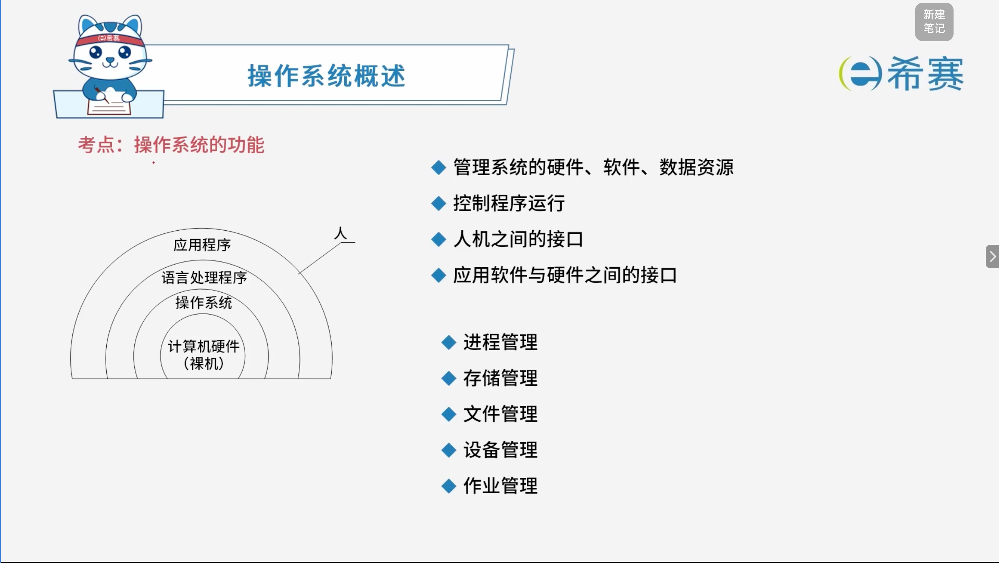
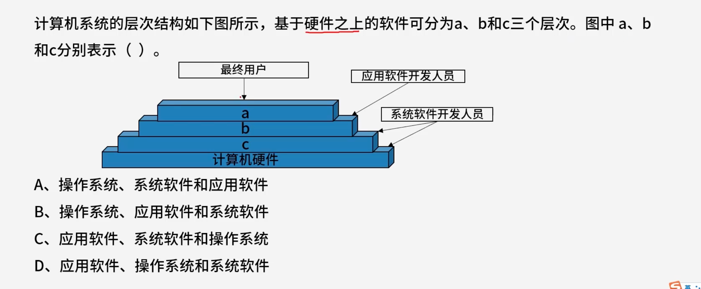

# 操作系统的功能

## 1. 考点：操作系统的功能

- **操作系统的核心职责：**

  - 管理系统的硬件、软件、数据资源
  - 控制程序运行
  - 提供人机之间的接口
  - 提供应用软件与硬件之间的接口
- **系统的层次结构（从内到外）：**

  - 计算机硬件（裸机）
  - 操作系统
  - 语言处理程序
  - 应用程序
- **操作系统的五大管理功能：**

  - 进程管理
  - 存储管理
  - 文件管理
  - 设备管理
  - ~~作业管理（考试基本不考）~~

## 2. 经典例题

## 3. 题目一

> **题目：**
>
> 

解析：

**层级分析：**

- **$a$** **层**：面向最终用户，位于最外层，供最终用户直接使用，因此 $a$ 表示​**应用软件**。
- **$b$** **层**：面向应用软件开发人员，介于应用软件与底层之间，为应用软件的开发和运行提供支持，因此 $b$ 表示​**系统软件**。
- **$c$** **层**：面向系统软件开发人员，直接贴近计算机硬件，负责管理硬件资源并控制程序运行，因此 $c$ 表示**操作系统**。

**正确答案：C。**
