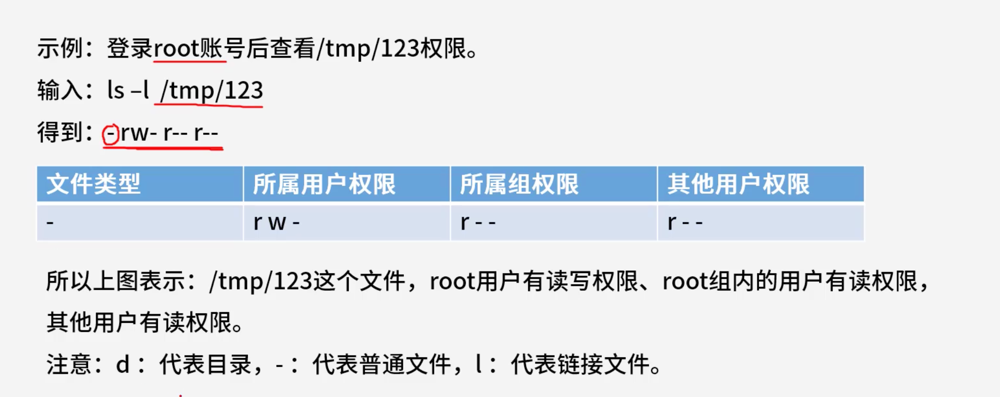
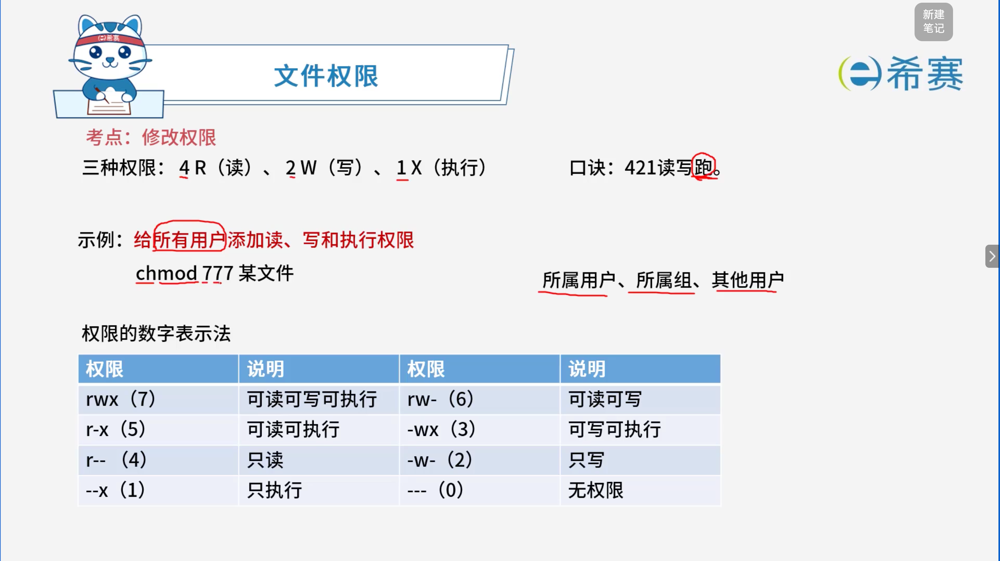

# 文件权限

## 1. 考点：基础概念

- **三种基本权限：**

  - `r`​（Read，读）：权值为 **4**
  - `w`​（Write，写）：权值为 **2**
  - `x`​（eXecute，执行）：权值为 **1**
- **三种用户角色：**

  1. **所属用户（User，u）** ：文件的创建者/所有者。
  2. **所属组（Group，g）** ：文件所属用户组内的其他用户。
  3. **其他用户（Others，o）** ：既不是属主也不在属组内的系统其他用户。

### 1.1 **权限查看命令与输出格式**

- **命令示例：**  登录系统后查看 ​`/tmp/123` 的权限：
- **输出示例：**  ​`-rw-r--r--`
- **字段拆解与含义：**

  - **第 1 位（文件类型）：**

    - `-`：代表普通文件
    - `d`：代表目录（Directory）
    - `l`：代表链接文件（Link）
  - **第 2\~4 位（所属用户权限）：**  如 ​`rw-`（表示有读、写权限，无执行权限）
  - **第 5\~7 位（所属组权限）：**  如 ​`r--`（表示只有读权限，无写和执行权限）
  - **第 8\~10 位（其他用户权限）：**  如 ​`r--`（表示只有读权限，无写和执行权限）

### 1.2 **实例解析**

> 

以 ​`ls -l /tmp/123`​ 得到 ​`-rw-r--r--` 为例：

- **文件类型**​：普通文件（​`-`）
- **所属用户权限**​：​`rw-`（拥有读、写权限）
- **所属组权限**​：​`r--`（拥有读权限）
- **其他用户权限**​：​`r--`（拥有读权限）

## 2. 考点：修改权限

> 

### 2.1 **基础口诀与权值**

- **三种权限及权值：**

  - `r`​（读）\= **4**
  - `w`​（写）\= **2**
  - `x`​（执行）\= **1**
- **记忆口诀：**  ​ **“421 读写跑”** （跑即执行 x）
- **三种用户角色顺序：**  ​**所属用户**​、​**所属组**​、​**其他用户**（数字表示法中分别对应百位、十位、个位）。

### 2.2 **权限修改示例**

- **示例需求：**  给所有用户添加读、写和执行权限。
- **命令：**   
  Bash

  ```
  chmod 777 某文件
  ```

   *(注：* ​*​`7`​*​ *表示* ​*​`4+2+1`​*​ *，即拥有读、写、执行全部权限；三个* ​*​`7`​*​ *分别代表所属用户、所属组、其他用户)*

### 2.3 **权限的数字表示法对照表**

将每种角色的三位权限（如 ​`rwx`​）相加（​`r=4, w=2, x=1`），可以组合出以下数字表示法：

|**字符权限**|**数字权值**|**说明**|**字符权限**|**数字权值**|**说明**|
| ------| --| -------------------| ------| --| -------------------|
|**​`rwx`​**| **(7)**|可读可写可执行|**​`rw-`​** | **(6)**|可读可写 (​`4+2`)|
|**​`r-x`​**| **(5)**|可读可执行 (​`4+1`)| **​`-wx`​**| **(3)**|可写可执行 (​`2+1`)|
|**​`r--`​** | **(4)**|只读| **​`-w-`​** | **(2)**|只写|
| **​`--x`​**| **(1)**|只执行| **​`---`​** | **(0)**|无权限|
