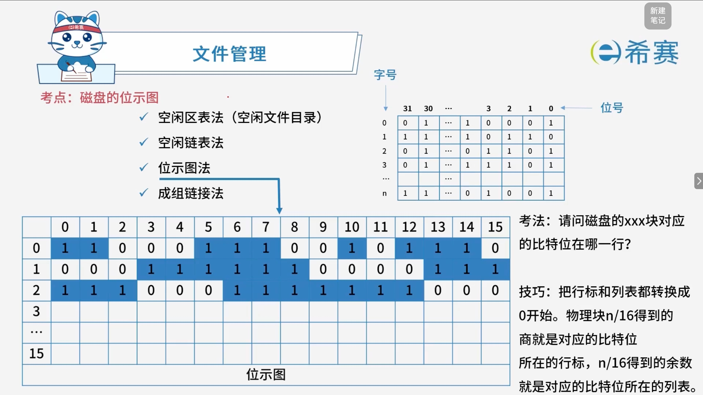

# 磁盘的位示图

## 1. 考点：常用空闲空间管理方法

> 排序号是从左往右排号，从0号开始排。

## 2. 经典例题

### 2.1 题目一

> **题目：** 某文件管理系统在磁盘上建立了位示图（bitmap），记录磁盘的使用情况。若磁盘上物理块的编号依次为：$0$、$1$、$2$、$\dots$；系统中的字长为 $32$ 位，位示图中字的编号依次为：$0$、$1$、$2$、$\dots$，每个字中的一个二进制位对应文件存储器上的一个物理块，取值 $0$ 和 $1$ 分别表示物理块是空闲或占用。假设操作系统将 $2053$ 号物理块分配给某文件，那么该物理块的使用情况在位示图中编号为（ **C** ）的字中描述。
>
> - **A.**  $32$
> - **B.**  $33$
> - **C.**  $64$
> - **D.**  $65$

**详细解析：**

1. **核心原理与规则：**

   - **字长与容量**：系统中的字长为 $32$ 位，意味着**每个字可以表示** **$32$** **个物理块**的使用情况。
   - **编号起点**​：物理块号和字的编号均**从** **$0$** **开始**计算。
2. **计算过程：**

   - 目标物理块号为 ​**$2053$**。因为编号从 $0$ 开始，第 $2053$ 号物理块实际上是处于整个存储空间的**第** **$2054$** **个**物理块（前 $2053$ 个物理块的编号为 $0 \sim 2052$）。
   - 求它落在第几个字中，需通过除以字长并**向下取整**来计算字号：

     $$
     \text{字号} = \left\lfloor \frac{\text{物理块号}}{\text{字长}} \right\rfloor = \left\lfloor \frac{2053}{32} \right\rfloor
     $$

   *. 计算结果：

   $$
   rac{2053}{32} = 64.15625
   $$

   $$
   \lfloor 64.15625 \rfloor = 64
   $$

- **结果验证：**

  - 前 $64$ 个字（编号从 $0$ 到 $63$）总共包含的二进制位（物理块数）为：

    $$
    64 \times 32 = 2048 \text{ 个物理块}
    $$

  对应的物理块编号范围是 ​**$0 \sim 2047$**。

  - 随后的物理块从 $2048$ 开始：

    - **编号为** **$64$** **的字**（即第 $65$ 个字）负责管理从第 $2048$ 到第 $2079$ 号的物理块。
    - 因此，**$2053$** **号物理块**落在**编号为** **$64$** **的字**中（在该字中的具体位偏移量为 $2053 \pmod{32} = 5$，即第 $5$ 位）。

**正确答案：C。** 

‍
