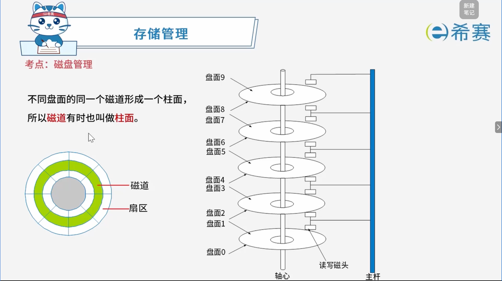
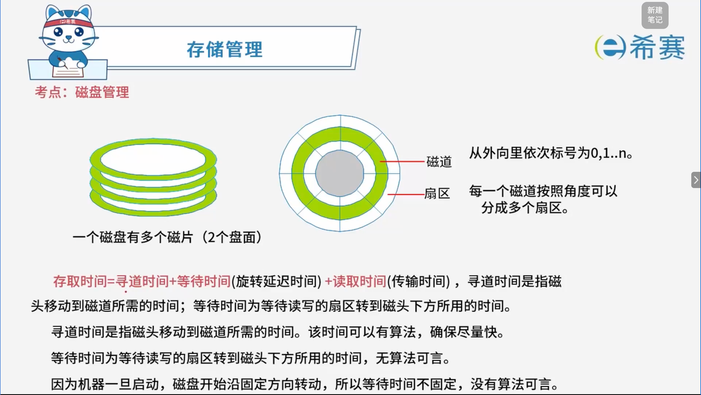
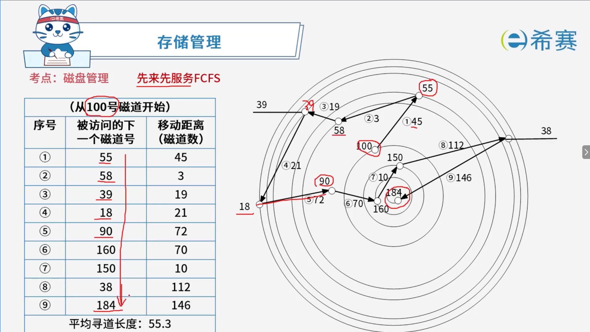
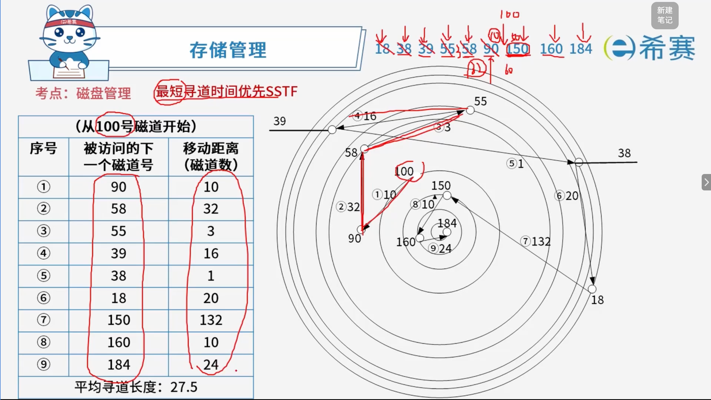

# 磁盘管理

## 1. 考点：磁盘的结构

## 2. 考点：磁盘的存取时间

## 3. 考点：移臂调度算法

> - 磁盘调度分移臂调度和旋转调度两类，​**先进行移臂调度（找磁道），然后再进行旋转调度（找扇区）** 。
> - 由于访问磁盘最耗寻道时间，因此磁盘调度目标是使磁盘平均寻道时间最少。

### 3.1 **常见算法：**

- **先来先服务（FCFS）**
- **最短寻道时间优先（SSTF）**
- **扫描算法（SCAN）**
- **循环扫描（CSCAN）算法**

> **注意：**  先来先服务和最短寻道时间优先随时会改变移动臂的方向。

## 4. 考点：FCFS算法

## 5. 考点：SSTF算法

## 6. 真题实战

### 6.1 题目一

> **题目：** 某磁盘磁头从一个磁道移至另一个磁道需要 10ms。文件在磁盘上非连续存放，逻辑上相邻数据块的平均移动距离为 10 个磁道，每块的旋转延迟时间及传输时间分别为 100ms 和 2ms，则读取一个 100 块的文件需要（ **D** ）ms时间。
>
> A、10200 B、11000 C、11200 D、20200

**解析：**

读取一个 100 块的文件，每一块（包括第一块）都需要经过​**寻道时间**​、**旋转延迟**和​**传输时间**。

1. **单块平均耗时：**

   - **平均寻道时间** \= 平均移动磁道数 $\times$ 每个磁道移动时间 \= $10 \times 10\text{ ms} = 100\text{ ms}$
   - **旋转延迟时间** \= $100\text{ ms}$
   - **传输时间** \= $2\text{ ms}$
   - **读取单个块的总时间** \= $100\text{ ms} + 100\text{ ms} + 2\text{ ms} = 202\text{ ms}$
2. **总耗时计算：**

   - 读取 100 个块的总时间 \= $100 \times 202\text{ ms} = 20200\text{ ms}$

**正确答案为 D。** 

### 6.2 题目二

> **题目：** 假设磁盘臂位于 **15号柱面** 上，进程的请求序列如下表所示，如果采用**最短移臂调度算法**（SSTF），那么系统的响应序列应为（ **B** ）。
>
> |**请求序列**|**柱面号**|**磁头号**|**扇区号**|
> | ----| ----| ----| ----|
> |①|12|8|9|
> |②|19|6|5|
> |③|23|9|6|
> |④|19|10|5|
> |⑤|12|8|4|
> |⑥|28|3|10|
>
> - **选项：**
>
>   - A、① ② ③ ④ ⑤ ⑥
>   - **B、⑤ ① ② ④ ③ ⑥**
>   - C、② ③ ④ ⑤ ① ⑥
>   - D、④ ② ③ ⑤ ① ⑥

 **「解析」** 

初始磁头位置：$15$ **号柱面**。

**当前磁头在 15：**

- 各请求到 15 的距离：

  - ①(12)：$|12 - 15| = 3$
  - ②(19)：$|19 - 15| = 4$
  - ③(23)：$|23 - 15| = 8$
  - ④(19)：$|19 - 15| = 4$
  - ⑤(12)：$|12 - 15| = 3$
  - ⑥(28)：$|28 - 15| = 13$
- 最小距离为 3，对应请求 **⑤**（柱面 12）和 **①**（柱面 12）。根据选项特征（以 ⑤ 开头），我们先服务 **⑤**。

2. **当前磁头移动到 12（已服务 ⑤）：**

   - 剩余请求到 12 的距离：

     - ①(12)：$|12 - 12| = 0$
     - ②(19)：$|19 - 12| = 7$
     - ③(23)：$|23 - 12| = 11$
     - ④(19)：$|19 - 12| = 7$
     - ⑥(28)：$|28 - 12| = 16$
   - 最小距离为 0，服务 **①**（柱面 12）。
3. **当前磁头停留在 12（已服务 ①）：**

   - 剩余请求到 12 的距离：

     - ②(19)：$|19 - 12| = 7$
     - ③(23)：$|23 - 12| = 11$
     - ④(19)：$|19 - 12| = 7$
     - ⑥(28)：$|28 - 12| = 16$
   - 最小距离为 7，对应 ② 和 ④。按原请求序列顺序，先服务 **②**（柱面 19）。
4. **当前磁头移动到 19（已服务 ②）：**

   - 剩余请求到 19 的距离：

     - ③(23)：$|23 - 19| = 4$
     - ④(19)：$|19 - 19| = 0$
     - ⑥(28)：$|28 - 19| = 9$
   - 最小距离为 0，服务 **④**（柱面 19）。
5. **当前磁头停留在 19（已服务 ④）：**

   - 剩余请求到 19 的距离：

     - ③(23)：$|23 - 19| = 4$
     - ⑥(28)：$|28 - 19| = 9$
   - 最小距离为 4，服务 **③**（柱面 23）。
6. **当前磁头移动到 23（已服务 ③）：**

   - 剩余请求：

     - ⑥(28)：$|28 - 23| = 5$
   - 最后服务 **⑥**（柱面 28）。

---

**正确答案选 B。** 

‍
