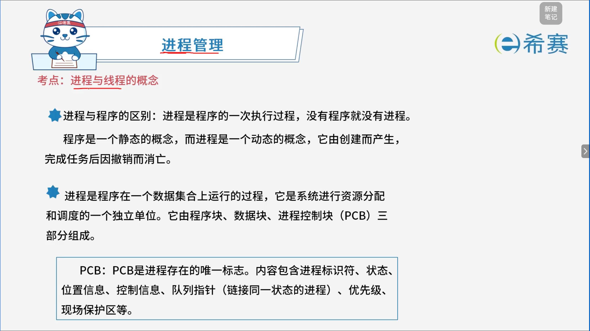
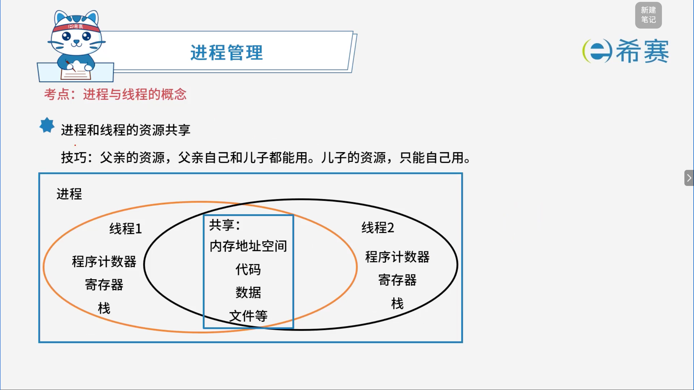

# 进程与线程的基本概念

## 1. 考点：进程与程序

- **进程与程序的区别：**  进程是程序的一次执行过程，没有程序就没有进程。程序是一个静态的概念，而进程是一个动态的概念，它由创建而产生，完成任务后因撤销而消亡。
- **进程的定义与组成：**  进程是程序在一个数据集上运行的过程，它是系统进行资源分配和调度的一个独立单位。它由程序块、数据块、进程控制块（PCB）三部分组成。
- **PCB（进程控制块）：**  PCB是进程存在的唯一标志。内容包含进程标识符、状态、位置信息、控制信息、队列指针（链接同一状态的进程）、优先级、现场保护区等。

## 2. 考点：进程与线程的资源共享

> 线程是由进程创建的，线程是cpu调度的基本单位。

## 3. 经典例题

### 3.1 题目一

> 题目： 在支持多线程的操作系统中，假设进程P创建了t1、t2、t3线程，那么（ **C** ）。
>
> - A、该进程的代码段不能被t1、t2、t3共享
> - B、该进程的全局变量只能被共享
> - C、该进程中t1、t2、t3的栈指针不能被共享
> - D、该进程中t1的栈指针可以被t2、t3共享

**解析：**

- **A选项错误**：同一进程中的所有线程（如t1、t2、t3）共享进程的内存地址空间，包括代码段、数据段和全局变量，因此代码段是可以被共享的。
- **B选项表述不严谨/错误**：全局变量属于进程的共享资源，可被同一进程下的所有线程共同访问和修改，但B选项的说法不够全面或表述方式不准确。
- **C选项正确**：线程拥有自己独立的栈（栈指针/寄存器上下文），用来保存局部变量和函数调用信息，因此不同线程（t1、t2、t3）的栈指针是各自独立的，不能被共享。
- **D选项错误**：栈指针属于线程私有资源，t1的栈指针不能被t2和t3共享

**答案： C、该进程中t1、t2、t3的栈指针不能被共享。** 

‍
