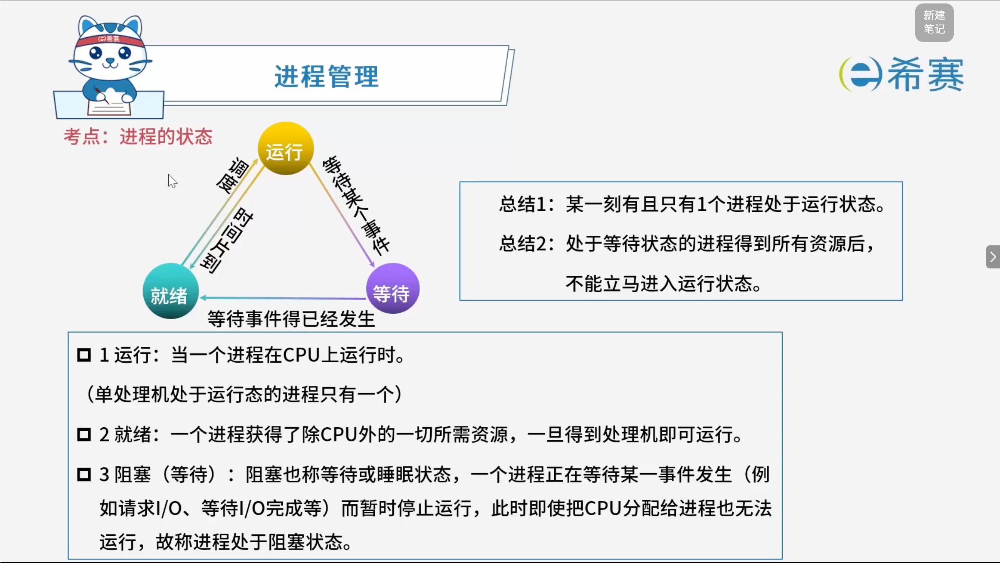
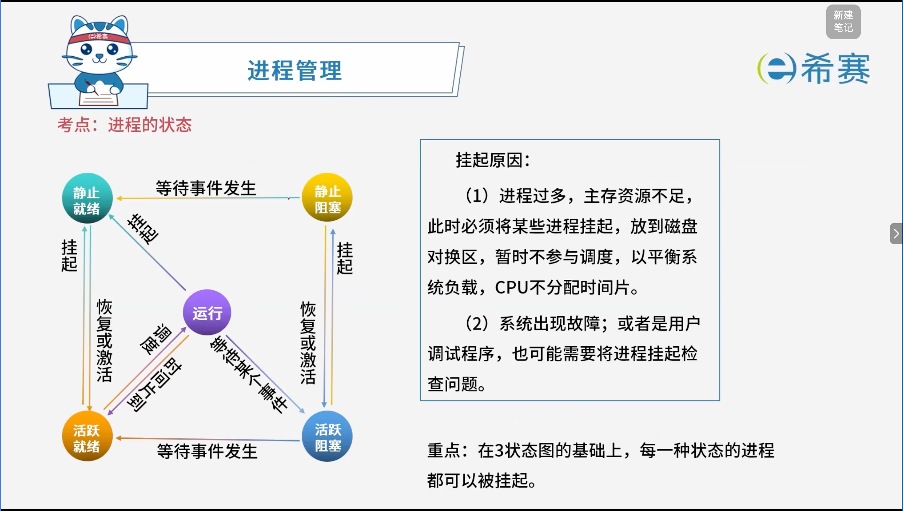

# 进程的状态

## 1. 考点：进程的状态



## 2. 考点：进程的状态（续）



## 3. 经典例题

### 3.1 题目一

> **【题目】**
>
> 在单处理机系统中，采用先来先服务调度算法。系统中有4个进程 $P_1$、$P_2$、$P_3$、$P_4$（假设进程按此顺序到达），其中 $P_1$ 为运行状态，$P_2$ 为就绪状态，$P_3$ 和 $P_4$ 为等待状态，且 $P_3$ 等待打印机，$P_4$ 等待扫描仪。若 $P_1$（ ），则 $P_1$、$P_2$、$P_3$ 和 $P_4$ 的状态应分别为（ ）。
>
>  **【选项】**
>
> - **第一空（事件）：**
>
>   - A、时间片到
>   - B、释放了扫描仪
>   - C、释放了打印机
>   - D、已完成
> - **第二空（状态）：**
>
>   - A、等待、就绪、等待和等待
>   - B、运行、就绪、运行和等待
>   - C、就绪、运行、等待和等待
>   - D、就绪、就绪、等待和运行

**解析：**

初始状态：

```
P1：运行
P2：就绪
P3：等待打印机
P4：等待扫描仪
```

如果 ​**P1 时间片到**：

1. P1 的时间片用完，暂时不能继续占用 CPU，因此由“运行”转为“就绪”；
2. 就绪队列中已有 P2，按照先来先服务，P2 获得 CPU，转为“运行”；
3. P3 仍在等待打印机；
4. P4 仍在等待扫描仪。

所以状态变为：

```
P1：就绪
P2：运行
P3：等待
P4：等待
```

对应第二空选 ​**C**，因此答案为：

> **A、C**

补充：严格来说，传统 FCFS 通常是非抢占式，不强调时间片；但按照本题选项和出题意图，显然是把“时间片到”作为 P1 被调度切换的条件。

**正确答案：A、C。** 

‍
