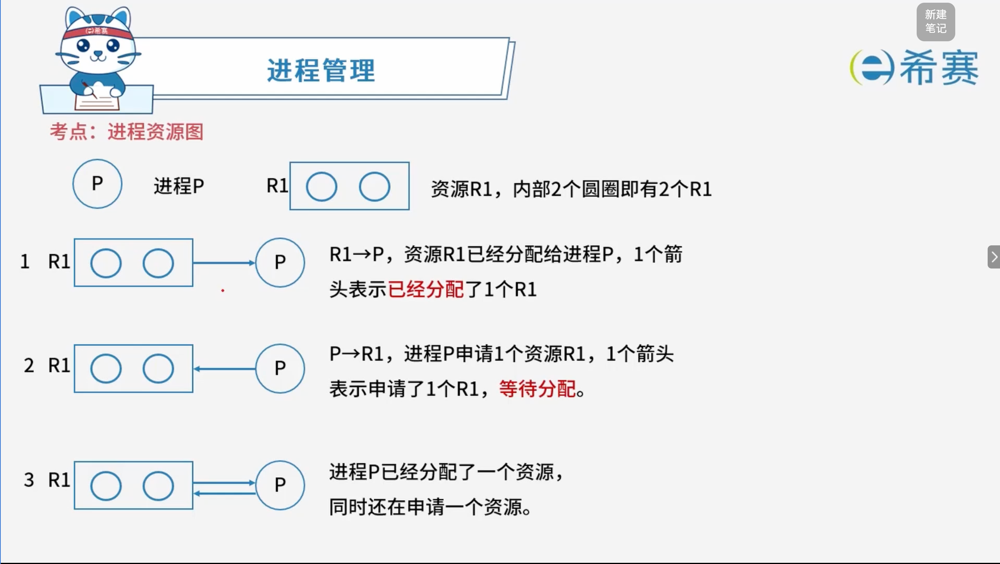
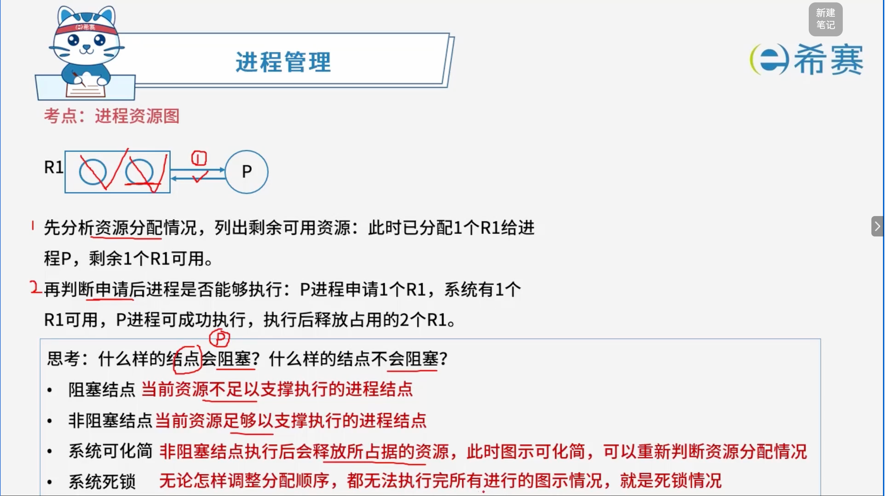
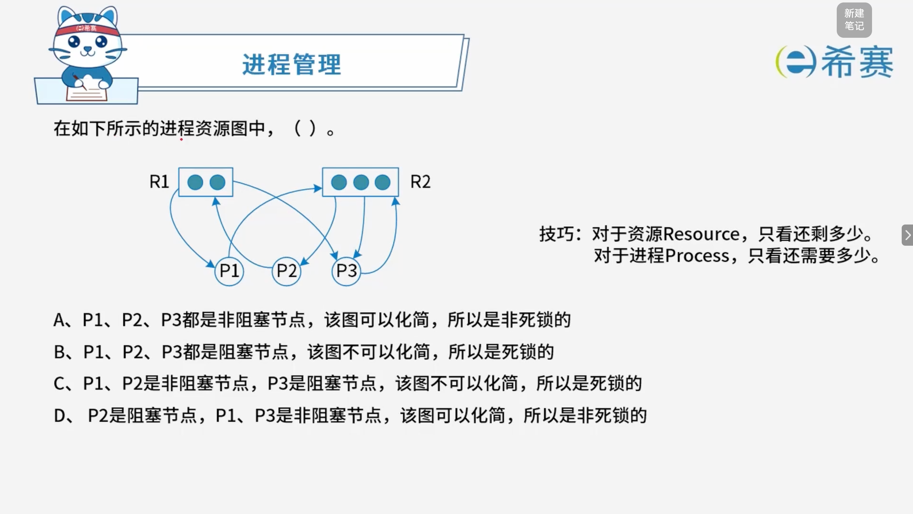

# 进程资源图

## 1. 考点：进程资源图

## 2. 考点：进程资源图详细分析

## 3. 经典例题

### 3.1 题目一

> **题目：**
>
> 

 **「解析」**

观察题目中的进程资源图：

1. **统计资源的总量与当前剩余量**：

   - **$R_1$**：总共有 2 个实例。图中显示 $P_1$ 占用 1 个、$P_3$ 占用 1 个。此时系统​**剩余可用** **$R_1 = 0$**。
   - **$R_2$**：总共有 3 个实例。图中显示 $P_2$ 占用 1 个、$P_3$ 占用 2 个。此时系统​**剩余可用** **$R_2 = 0$**。
2. **分析各进程的申请与阻塞状态**：

   - **进程** **$P_1$**：

     - 从图中看出，$P_1$ 指向 $R_2$（表示 $P_1$ 申请 1 个 $R_2$）。
     - 当前系统剩余 $R_2 = 0$，无法满足 $P_1$ 的需求。
     - *但是*，如果按化简顺序观察：我们先看 $P_3$ 释放资源的可能性？不对，看谁能被满足——
     - 重新审视图中的连线：

       - $R_1$ 有 2 个圆点（实例），分别被 $P_1$ 和 $P_3$ 持有。
       - $R_2$ 有 3 个圆点（实例），分别被 $P_2$（1个）和 $P_3$（2个）持有。
       - 进程的请求边（从进程指向资源）：

         - $P_1 \rightarrow R_2$：$P_1$ 需要 1 个 $R_2$。
         - $P_2 \rightarrow R_1$：$P_2$ 需要 1 个 $R_1$。
         - $P_3 \rightarrow R_2$：$P_3$ 需要 1 个 $R_2$。
   - **逐一检验各节点是否为非阻塞节点**：

     - **检查** **$P_1$**：$P_1$ 需要 1 个 $R_2$。当前系统可用的 $R_2$ 实例数为 0（因为总共 3 个全被 $P_2$ 和 $P_3$ 占了），所以 $P_1$ 暂时无法满足？等等，看资源分配：$R_2$ 总共 3 个，其中 $P_2$ 占 1 个，$P_3$ 占 2 个，所以系统剩余 $R_2$ 可用数为 0。因此 $P_1$ 申请 1 个 $R_2$ 无法满足，$P_1$ 是​**阻塞节点**？
     - 让我们反向看D选项的结论（$P_2$ 是阻塞节点，$P_1$、$P_3$ 是非阻塞节点，该图可以化简，所以是非死锁的）：

       - 如果 $P_1$ 和 $P_3$ 是​**非阻塞节点**，说明它们当前申请的资源可以被满足。
       - 例如：$P_3$ 占有了 $R_1$ 的 1 个和 $R_2$ 的 2 个，它若能顺利执行，会释放 $R_1$（1个）和 $R_2$（2个）。
       - 释放后，系统空闲出 $R_1 = 1$、$R_2 = 2$。
       - 此时这些空闲资源可以满足 $P_1$（需要 1 个 $R_2$）和 $P_2$（需要 1 个 $R_1$）。
       - 因此，​**$P_1$** **和** **$P_3$** **是非阻塞节点**（或者可以率先推进），而 ​**$P_2$** **是阻塞节点**（或在初期因缺乏 $R_1$ 暂时无法直接满足，需等待其他进程释放）。
       - 随着 $P_1$ 或 $P_3$ 的执行完毕释放资源，图可以被**顺利化简**。

**正确答案：D。** 

‍
