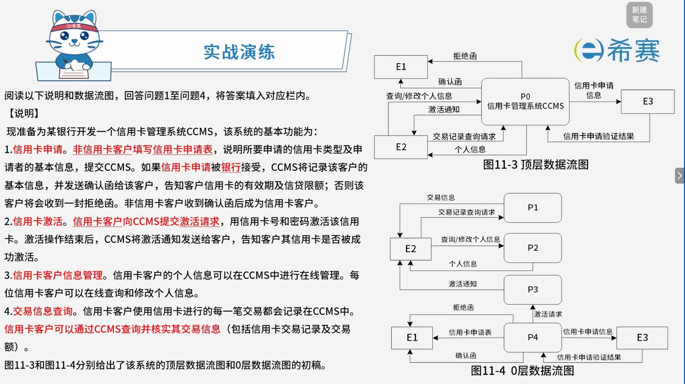
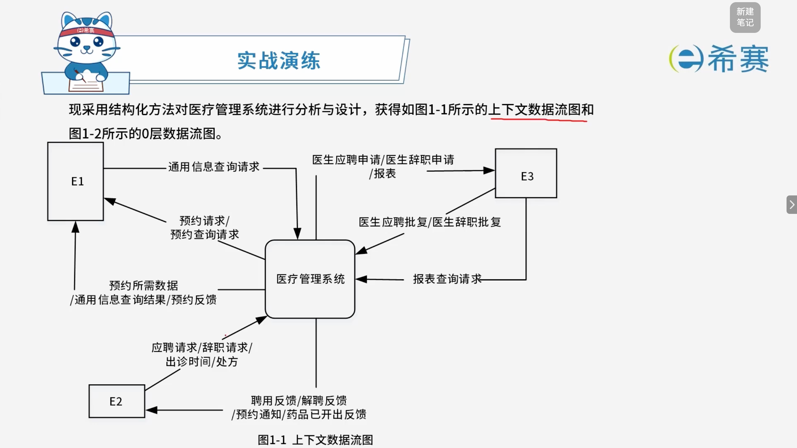
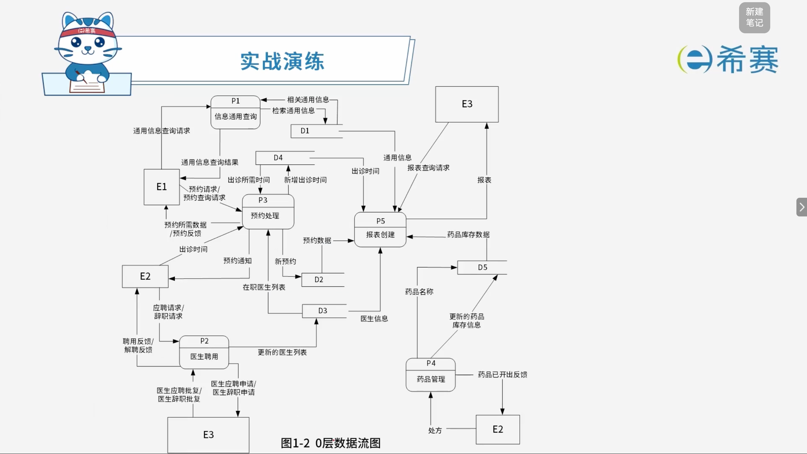

# 实战演练

## 1. 题目一

### 1.1 题目

> 
>
>  **【问题1】** （3分）
>
> 根据【说明】，将图11-3中的E1～E3填充完整。
>
>  **【问题2】** （3分）
>
> 图11-3中缺少三条数据流，根据【说明】，分别指出这三条数据流的起点和终点。（注：数据流的起点和终点均采用图中的符号和描述）
>
>  **【问题3】** （5分）
>
> 图11-4中有两条数据流是错误的，请指出这两条数据流的名称，并改正。（注：数据流的起点和终点均采用图中的符号和描述）
>
>  **【问题4】** （4分）
>
> 根据【说明】，将图11-4中P1～P4的处理名称填充完整。
>
> - **核心总结**：
>
>   - **问题1**：补充外部实体，从人物角色、组织机构、外部系统中找。
>   - **问题2**：补充缺失数据流，依据数据平衡原则和题目说明匹配。
>   - **问题3**：找出错误数据流并改正，注意父图与子图平衡、加工输入输出是否合理。
>   - **问题4**：补充加工名，找“动词+名词”结构。

### 1.2 问题1

> 根据【说明】，将图11-3中的E1～E3填充完整。

**答案：** E1:非信用卡客户；E2:信用卡客户；E3:银行。

### 1.3 问题2

> 图11-3中缺少三条数据流，根据【说明】，分别指出这三条数据流的起点和终点。（注：数据流的起点和终点均采用图中的符号和描述）

**答案：**​$E_1 \to P_0 : \text{信用卡申请表}$；$E_2 \to P_0 : \text{激活请求}$；$E_2 \gets P_0 : \text{交易信息}$。

### 1.4 问题3

> 图11-4中有两条数据流是错误的，请指出这两条数据流的名称，并改正。（注：数据流的起点和终点均采用图中的符号和描述

**答案：**

- 错误的数据流：

  - $E_1 \gets P_4 : \text{信用卡申请表}$
  - $P_3 \gets P_4 : \text{激活请求}$
- 修改正确：

  - $E_1 \to P_4 : \text{信用卡申请表}$
  - $E_2 \to P_3 : \text{激活请求}$

### 1.5 问题4

> 根据【说明】，将图11-4中P1～P4的处理名称填充完整。

**答案：** P4:信用卡申请；P3：信用卡激活；P2:信用卡客户信息管理；P1:交易信息查询。

## 2. 题目二

### 2.1 题目

> 阅读下列说明，回答问题1至问题4，将答案填入对应栏内。
>
>  **【说明】**
>
> 某医疗护理机构为老年人或有护理需求者提供专业护理，现欲开发一基于Web的医疗管理系统，以改善医疗护理效率。该系统的主要功能如下：
>
> 1. **通用信息查询**。客户提交通用信息查询请求，查询通用信息表，返回查询结果。
> 2. **医生聘用**。医生提出应聘/辞职申请，交由主管进行聘用/解聘审批，更新医生表，并给医生反馈聘用/解聘结果；删除解聘医生的出诊安排。
> 3. **预约处理**。医生安排出诊时间，存入医生出诊时间表；根据客户提交的预约查询请求，查询在职医生及其出诊时间等预约所需数据并返回；创建预约，提交预约请求，在预约表中新增预约记录，更新所约医生出诊时间并给医生发送预约通知；给客户反馈预约结果。
> 4. **药品管理**。医生提交处方，根据药品名称从药品数据中查询相关药品库存信息，开出药品，更新对应药品的库存以及预约表中的治疗信息；给医生发送“药品已开出”反馈。
> 5. **报表创建**。根据主管提交的报表查询请求（报表类型和时间段），从预约数据、通用信息、药品库存数据、医生以及医生出诊时间中进行查询，生成报表返回给主管。
>
> 
>
> 
>
>  **【问题1】** （3分）
>
> 使用说明中的词语，给出图1-1中的实体E1～E3的名称。
>
>  **【问题2】** （5分）
>
> 使用说明中的词语，给出图1-2中的数据存储D1～D5的名称。
>
>  **【问题3】** （4分）
>
> 使用说明和图中术语，补充图1-2中缺失的数据流及其起点和终点。
>
>  **【问题4】** （3分）
>
> 使用说明中的词语，说明“预约处理”可以分解为哪些子加工，并说明建模图1-1和图1-2是如何保持数据流图平衡。
>
> **核心总结**：
>
> - 系统主要功能：通用信息查询、医生聘用、预约处理、药品管理、报表创建。
> - 补充实体时关注：客户、医生、主管等人物角色。
> - 补充数据存储时关注：通用信息表、医生表、医生出诊时间表、预约表、药品数据等。
> - 补充加工名时关注：查询、聘用、审批、预约、开出药品、生成报表等“动词+名词”结构。

### 2.2 问题1

> 使用说明中的词语，给出图1-1中的实体E1～E3的名称。

**答案：** E1:客户；E2:医生；E3:主管。

### 2.3 问题2

> 使用说明中的词语，给出图1-2中的数据存储D1～D5的名称。

**答案：** D1:通用信息表；D2:预约表；D3:医生表；D4:医生出诊时间表；D5:药品库存表。

#### 2.3.1 问题3

> 使用说明和图中术语，补充图1-2中缺失的数据流及其起点和终点。

**答案：**

- $P_4 \to D_2 : \text{更新预约表中的治疗信息}$
- $P_3 \to D_4 : \text{更新所约医生出诊时间}$
- $P_2 \to D_4 : \text{删除解聘医生的出诊安排}$
- $P_4 \gets D_5 : \text{相关药品信息}$

### 2.4 问题4

> 使用说明中的词语，说明“预约处理”可以分解为哪些子加工，并说明建模图1-1和图1-2是如何保持数据流图平衡。

**正确答案**：

-  **“预约处理”可以分解为**：安排出诊、预约查询、创建预约、预约反馈。
- **如何保持数据流图平衡**：

  - 即保持父图与子图之间的平衡：父图中某个加工的输入输出数据流必须与其子图的输入输出数据流在数量上和名字上相同。
  - 父图的一个输入（或输出）数据流对应于子图中几个输入（或输出）数据流，而子图中组成的这些数据流的数据项全体正好是父图中的这一个数据流。

‍
