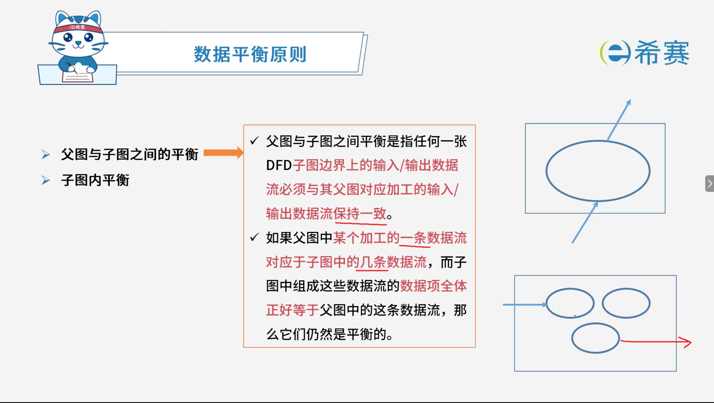
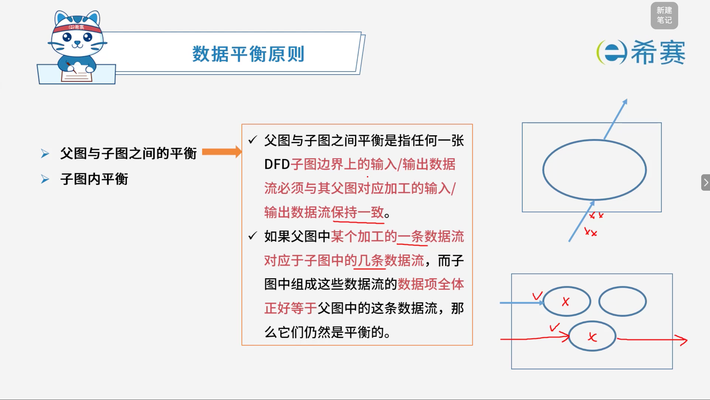
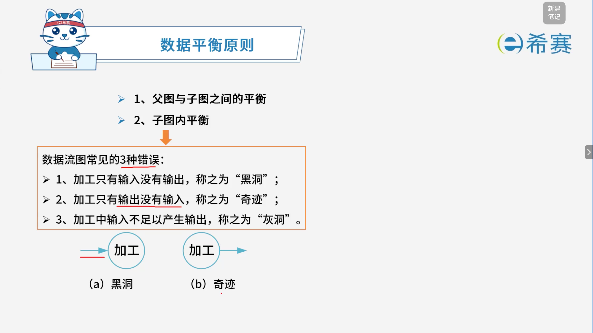

# 数据平衡原则

## 1. 考点：父图与子图之间的平衡

- 父图与子图之间平衡是指任何一张 DFD 子图边界上的输入/输出数据流必须与其父图对应加工的输入/输出数据流保持一致。

- 如果父图中某个加工的一条数据流对应于子图中的几条数据流，而子图中组成这些数据流的数据项全体正好等于父图中的这条数据流，那么它们仍然是平衡的。

## 2. 考点：子图内平衡

- **黑洞**：加工只有输入没有输出。
- **奇迹**：加工只有输出没有输入。
- **灰洞**：加工中输入不足以产生输出。

‍
