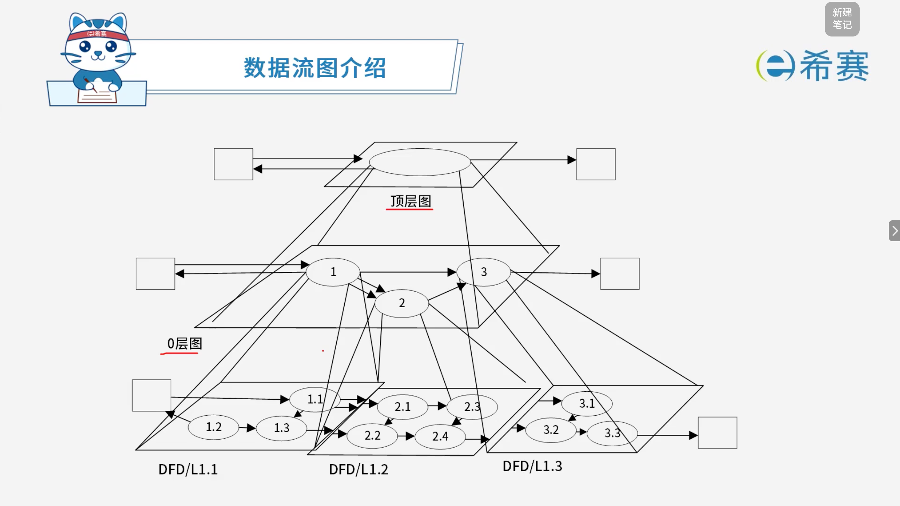
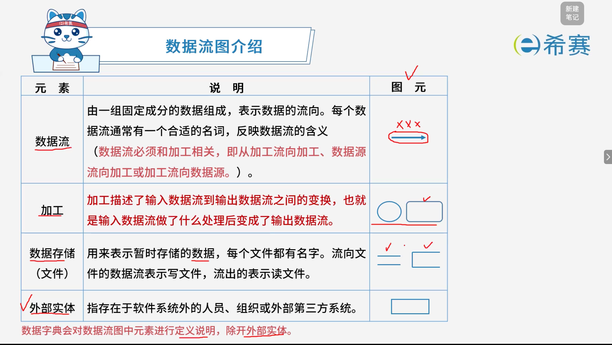
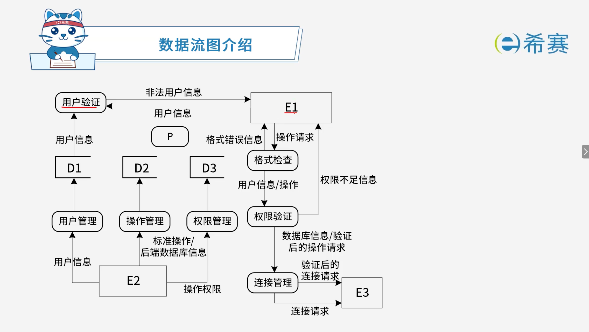
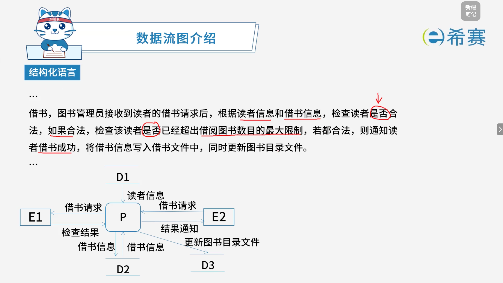
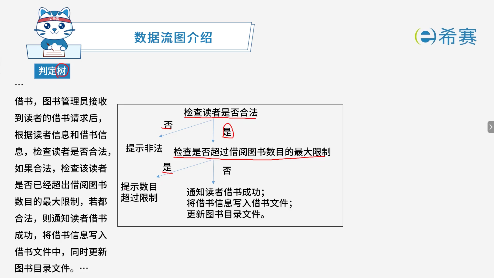

# 数据流图的基本概念

## 1. 考点：数据流图介绍



### 1.1 元素说明



|元素|说明|图元|
| ----| ------------------------------------------------------------------------------------------------------------------------------------------------------------------------| -------|
|**数据流**|由一组固定成分的数据组成，表示数据的流向。每个数据流通常有一个合适的名词，反映数据流的含义。<br />（数据流必须和加工相关，即从加工流向加工、数据源流向加工或加工流向数据源。）|→|
|**加工**|加工描述了输入数据流到输出数据流之间的变换，也就是输入数据流做了什么处理后变成了输出数据流。|○ / ▭|
|**数据存储（文件）**|用来表示暂时存储的数据，每个文件都有名字。流向文件的数据流表示写文件，流出的表示读文件。|═ / ▭|
|**外部实体**|指存在于软件系统外的人员、组织或外部第三方系统。|▭|

- **核心总结**：

  - **数据字典**会对数据流图中元素进行定义说明，​**除开外部实体**。
  - 数据流必须和**加工**相关，不能是数据源与数据存储之间的直接流动。
  - **加工**描述输入到输出的变换，**数据存储**用于暂存数据，**外部实体**在系统之外。

### 1.2 数据流图实例



### 1.3 数据流图（DFD）数据定义符号与规则总结

在定义数据流或数据存储的组成结构时，通常采用一套规范的符号来描述数据的构成。以下是核心符号及其含义与举例：

|**符号（LaTeX 符号）**|**含义**|**举例说明（公式）**|**解释**|
| --| -------------------| --| ------------------------------------|
|$=$|被定义为|$\text{机票} = \text{姓名} + \text{日期} + \text{航班号}$|表示左边的项由右边的各项组合构成。|
|$+$|与（连接）|$x = a + b$|表示 $x$ 由 $a$ **和** $b$ 共同组成。|
|$\text{“}\dots\text{”}$|基本数据元素|$\text{航班号} = \text{“Y7100”}\dots\text{“Y8100”}$|双引号内的内容为不可再分的基本数据。|
|$\dots$|连接符|$x = 1\dots9$|表示 $x$ 的取值范围在连续区间（$1 \sim 9$）内。|
|$[\dots]$|或（选择）|$\text{终点} = [\text{长沙} \mid \text{上海} \mid \text{北京}]$|表示变量可以是方括号内选项中的**任意一个**。|
|$\{\dots\}$|重复（零个或多个）|$x = \{a\}$|表示 $a$ 在 $x$ 中可以出现 **0 次或多次**。|
|${}_{m}\{\dots\}_{n}$|重复（限定上下限）|$x = {}_{2}\{a\}_{5}$|表示 $a$ 在 $x$ 中最少出现 **2 次**，最多出现 **5 次**。|
|$(\dots)$|可选（0 次或 1 次）|$x = (a)$|表示 $a$ 属于可选部分，**可以出现，也可以不出现**。|

💡 **综合应用举例**

1. **组合定义：**

   - $\text{机票} = \text{姓名} + \text{日期} + \text{航班号} + \text{起点} + \text{终点} + \text{费用}$

2. **基本元素与连接符：**

   - $\text{航班号} = \text{“Y7100”}\dots\text{“Y8100”}$

3. **选择（或）：**

   - **$\text{终点} = [\text{长沙} \mid \text{上海} \mid \text{北京} \mid \text{西安}]$**

#### 1.3.1 实例讲解

> **【问题】** （4 分）
>
> 根据说明中术语，给出图 1-1 中数据流“客户信息”、“房源信息”的组成。
>
> 【**说明】**
>
> 1. **房源采集与管理**​。系统自动采集外部网站的潜在房源信息，保存为潜在房源。由经纪人联系确认的潜在房源变为房源，并添加出售/出租房源的客户。由经纪人或者客户登记的出售/出租房源，系统将其保存为房源。<span data-type="text" style="color: var(--b3-inline-style-20260919141719-mj1gtog-color, #ff0000);">房源信息包括基本情况、配套设施、交易类型、委托方式、业主等</span>。经纪人可以对房源进行更新等管理操作。
> 2. **客户管理**​。求租/求购客户进行注册、更新，推送客户需求给经纪人，或由经纪人对求租/求购客户进行登记、更新。<span data-type="text" style="color: var(--b3-inline-style-20260919141719-mj1gtog-color, #ff0000);">客户信息包括身份证号、姓名、手机号、需求情况、委托方式等</span>。
> 3. **房源推荐**。根据客户的需求情况（求购/求租需求情况以及出售/出租房源信息），向已登录的客户推荐房源。

**解析】**

- **正确答案**：

  - $\text{客户信息} = \text{身份证号} + \text{姓名} + \text{手机号} + \text{需求情况} + \text{委托方式等}$。
  - $\text{房源信息} = \text{基本情况} + \text{配套设施} + \text{交易类型} + \text{委托方式} + \text{业主等}$。
- **解析说明**：

  - 题干明确给出了“客户信息包括身份证号、姓名、手机号、需求情况、委托方式等”，因此客户信息的组成为：身份证号、姓名、手机号、需求情况、委托方式。
  - 题干明确给出了“房源信息包括基本情况、配套设施、交易类型、委托方式、业主等”，因此房源信息的组成为：基本情况、配套设施、交易类型、委托方式、业主。

### 1.4 加工逻辑描述方法

常用的加工逻辑描述方法有**结构化语言、判定表和判定树** 3 种。

#### 1.4.1 **结构化语言**

结构化语言是一种介于自然语言和形式化语言之间的​**半形式化语言**，是自然语言的一个受限子集。

- **外层**​：用来描述控制结构，采用**顺序、选择和重复** 3 种基本结构。

  - **顺序结构**：一组祈使语句、选择语句、重复语句的顺序排列。
  - **选择结构**​：一般用 ​`IF-THEN-ELSE-ENDIF`​、​`CASE-OF-ENDCASE` 等关键词。
  - **重复结构**​：一般用 ​`DO-WHILE-ENDDO`​、​`REPEAT-UNTIL` 等关键词。
- **内层**​：一般采用​**祈使语句的自然语言短语**，使用数据字典中的名词和有限的自定义词，其动词含义要具体，尽量不用形容词和副词来修饰，还可使用一些简单的算法运算和逻辑运算符号。

##### 1.4.1.1 实例讲解

> 

 **【解析】**

借书，图书管理员接收到读者的借书请求后，根据读者信息和借书信息，检查读者是否合法，如果合法，检查该读者是否已经超出借阅图书数目的最大限制，若都合法，则通知读者借书成功，将借书信息写入借书文件中，同时更新图书目录文件。

**结构化语言描述：**

```Plaintext
WHILE(接收借书请求)
DO{
    查询读者信息 AND 查询借书信息;
    IF(读者信息合法)
        THEN{
            IF(是否超出借阅图书数目的最大限制)
                THEN ;
                ELSE{
                    通知读者借书成功;
                    借书信息写入借书文件;
                    更新图书目录文件;
                }
            ENDIF
        }
    ENDIF
}ENDDO
```

#### 1.4.2 判定表

|条件|1|2|3|
| :---------------------------------------------------| :--------------------------------| :--------------------------------| :---------------------------------|
|检查读者信息|F|T|T|
|检查借阅图书数目|-|F|T|
|**动作**|**1**|**2**|**3**|
|通知读者借书成功|||√|
|借书信息写入借书文件|||√|
|更新图书目录文件|||√|

- **核心总结**：

  - **判定表**用于描述加工逻辑，适合处理**多条件组合**的情况。
  - 上半部分列出​**条件**​，下半部分列出​**动作**。
  - 每一列代表一条规则，用 T/F 表示条件取值，用 √ 表示执行对应动作。
  - 本题中只有第 3 列（读者信息合法且未超出借阅限制）才触发“通知借书成功、写入借书文件、更新图书目录文件”三个动作。

#### 1.4.3 判定树


