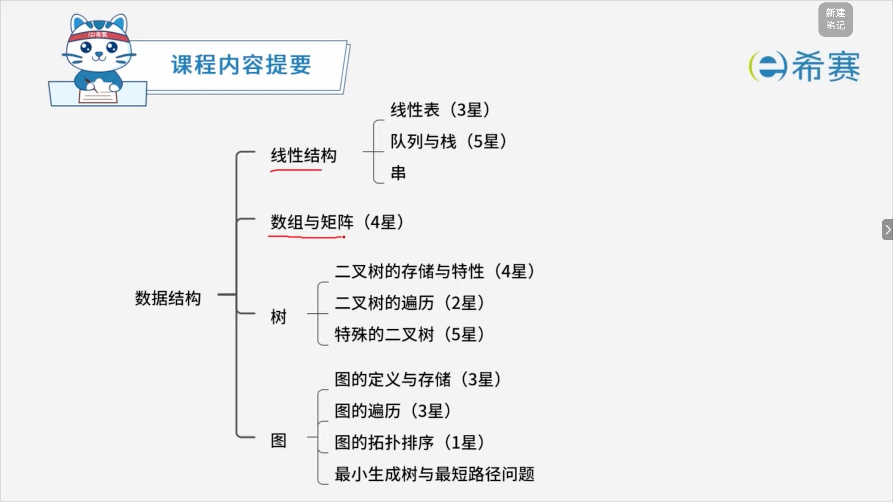
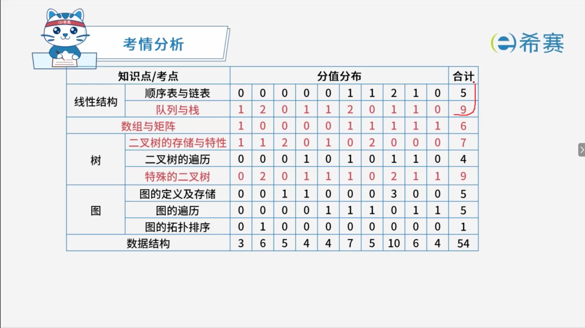

# 数据结构

## 1. 知识点分布

## 2. 历年考察分布

‍

## 学习目录

- [线性表](./线性表.md)
- [队列与栈](./队列与栈.md)
- [串](./串.md)
- [数组与矩阵](./数组与矩阵.md)
- [二叉树的存储与特性](./二叉树的存储与特性.md)
- [二叉树的遍历](./二叉树的遍历.md)
- [二叉排序树](./二叉排序树.md)
- [哈夫曼树](./哈夫曼树.md)
- [图的定义与存储](./图的定义与存储.md)
- [图的遍历](./图的遍历.md)
- [图的拓扑排序](./图的拓扑排序.md)
- [图的最小生成树与最短路径](./图的最小生成树与最短路径.md)
