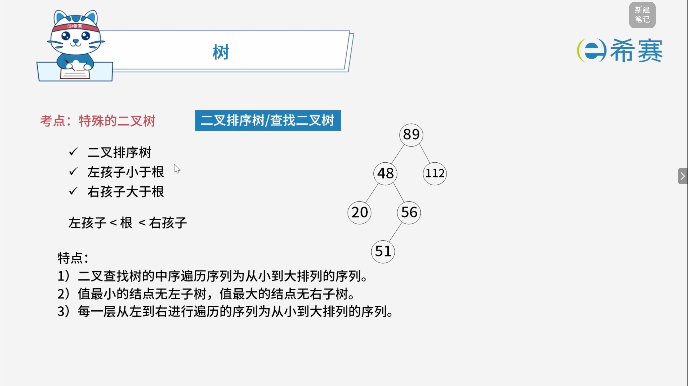
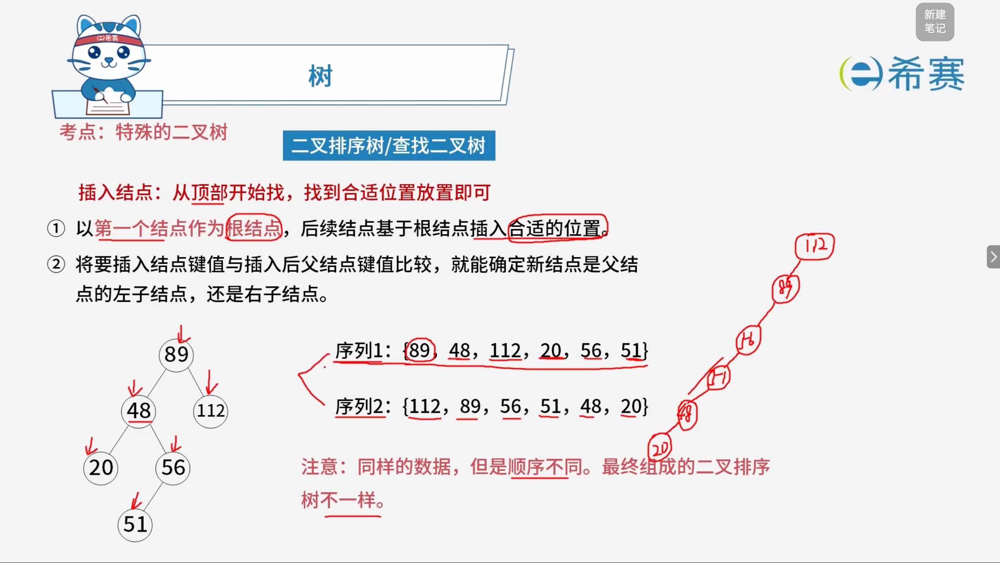
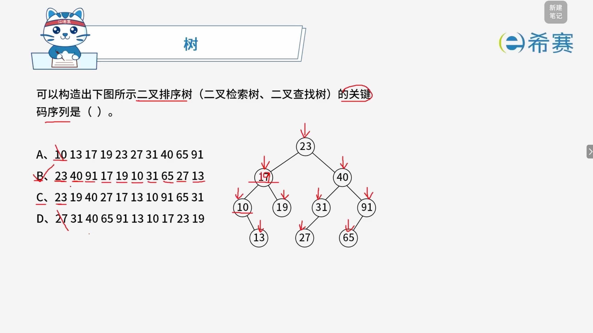

# 二叉排序树

## 1. 考点：查找二叉树的特点

### 1.1 核心定义与性质

- **二叉排序树（Binary Sort Tree, BST）** ：又称二叉查找树。它或者是一棵空树，或者是具有下列性质的二叉树：

  1. 若左子树不空，则​**左子树上所有结点的值均小于它的根结点的值**。
  2. 若右子树不空，则​**右子树上所有结点的值均大于它的根结点的值**。
  3. 它的左、右子树也分别为二叉排序树。

  - **大小关系口诀**：$\text{左孩子} < \text{根} < \text{右孩子}$

### 1.2 三大核心特点

1. **中序遍历单调性**​：二叉查找树的​**中序遍历序列为一个从小到大排列的有序序列**。
2. **极值结点位置**：

   - 树中值最小的结点（最左下结点）​**无左子树**。
   - 树中值最大的结点（最右下结点）​**无右子树**。
3. **层序遍历特征**：虽然可以通过特定顺序建树，但需注意“每一层从左到右进行遍历的序列为从小到大排列的序列”通常仅在满足完全二叉排序树等特殊平衡结构时成立（一般情况下层序不一定完全单调，主要核心判定依据为中序有序）。

## 2. 考点：查找二叉树的插入

## 3. 经典例题

### 3.1 题目一

> 

#### 3.1.1 **解题总纲：二叉排序树（BST）的核心性质**

1. **左小右大**：对于树中任意一个节点，其左子树所有节点的值都小于它，右子树所有节点的值都大于它。
2. **插入顺序决定树形**​：关键码序列中​**第一个被插入的数，一定是整棵树的根节点**。后续数值按照“左小右大”的规则，依次找到空位挂载。
3. **根节点是突破口**​：序列的第一个数 \= 树的根。

---

#### 3.1.2 **观察图中的树，提取三个关键信息**

我们先仔细观察题目图片里给出的那棵树（目标树）：

- **根节点**​：​`23`（位于最顶端，红色箭头指着它）
- **左子树分布**​：根 23 的左侧，依次挂着 ​`17 → 19、10` 等节点。
- **右子树分布**​：根 23 的右侧，依次挂着 ​`40 → 31、91` 等节点。
- **叶子节点**​：图中的叶子节点（没有孩子的节点）是 ​`13、27、65、19`（注意：19 在图里没有子节点，也是叶子）。

> **核心突破口：整棵树的根节点是 23。**   
> 这意味着，在正确选项的关键码序列中，​**第一个数必须是 23**。因为插入的第一个数会成为整棵树的根，后续插入的数只能成为它的子孙，无法改变根节点的位置。

---

#### 3.1.3 **逐一排除选项**

##### 3.1.3.1  **❌选项 A：10 13 17 19 23 27 31 40 65 91**

- **观察第一个数**​：序列的第一个数是 ​`10`。
- **问题**：如果第一个插入的是 10，那么整棵树的根就会是 10。但图中的树根是 23。
- **进一步观察**​：A 选项是一个从小到大排列的​**升序序列**。按升序插入，每个新节点都会比前面的节点大，只能一路向右挂载，最终会退化成一条向右倾斜的“单支树”（形似链表），与图中枝繁叶茂的树形完全不符。
- **结论**：直接排除 A。

---

##### 3.1.3.2  **❌ 选项 D：27 31 40 65 91 13 10 17 23 19**

- **观察第一个数**​：序列的第一个数是 ​`27`。
- **问题**：如果第一个插入的是 27，那么整棵树的根就会是 27。但图中的树根是 23。
- **结论**：直接排除 D。

---

##### 3.1.3.3  **❌ 选项 C：23 19 40 27 17 13 10 91 65 31**

- **观察第一个数**​：序列的第一个数是 ​`23`，与图中的根节点吻合。先保留。
- **模拟插入过程（重点观察叶子节点 27 和 31 的位置）** ：

  1. 插入 23（根）✅
  2. 插入 19（\< 23，成为 23 的左孩子）✅
  3. 插入 40（\> 23，成为 23 的右孩子）✅
  4. 插入 27（\< 40，往左走，成为 ​**40 的左孩子**）
  5. 插入 17（\< 23，\< 19，成为 ​**19 的左孩子**）
  6. 插入 13（\< 19，\< 17，成为 ​**17 的左孩子**）
  7. 插入 10（\< 17，\< 13，成为 ​**13 的左孩子**）
  8. 插入 91（\> 40，成为 ​**40 的右孩子**）
  9. 插入 65（\< 91，成为 ​**91 的左孩子**）
  10. 插入 31（\< 40，往左走，遇到 27；31 \> 27，往右走，成为 ​**27 的右孩子**）
- **发现问题**​：按照 C 选项的插入过程，​`27`​ 是 ​`40`​ 的左孩子，而 ​`31`​ 是 ​`27` 的右孩子。
- **对比目标树**​：在图中的目标树里，​`40`​ 的左孩子是 ​`31`​，​`31`​ 的左孩子才是 ​`27`​。  
  **位置矛盾！**
- **结论**：排除 C。

---

##### 3.1.3.4  **✅ 选项 B：23 40 91 17 19 10 31 65 27 13**

- **观察第一个数**​：第一个数是 ​`23`，与目标树根节点吻合。✅
- **模拟插入过程（详细对照图中每个节点的位置）** ：

  1. 插入 23（根）✅
  2. 插入 40（\> 23，成为 23 的​**右孩子**）✅
  3. 插入 91（\> 23，\> 40，成为 40 的​**右孩子**）✅
  4. 插入 17（\< 23，成为 23 的​**左孩子**）✅
  5. 插入 19（\< 23，\> 17，成为 17 的​**右孩子**）✅
  6. 插入 10（\< 23，\< 17，成为 17 的​**左孩子**）✅
  7. 插入 31（\< 40，成为 40 的​**左孩子**）✅
  8. 插入 65（\< 91，成为 91 的​**左孩子**）✅
  9. 插入 27（\< 31，成为 31 的​**左孩子**）✅
  10. 插入 13（\< 17，\> 10，成为 10 的​**右孩子**）✅
- **验证结果**：每一个节点的挂载位置，都与图中目标树完全一致。
- **结论**：B 选项正确。

---

#### 3.1.4 **总结快速判断口诀**

|步骤|检查点|操作方法|
| ------| --------| ----------------------------------------------------------|
|1|**看序列首元素**|必须等于图中的根节点（本题为 23），直接排除 A、D|
|2|**看叶子节点的位置**|观察图中特殊叶子（如本题的 27、31、65、13）的挂载路径|
|3|**模拟插入**|按“左小右大”走一遍，看路径是否和图中一致，不一致就排除|

**本题最终答案：B**（图中标注 C 为答案是有误的，请以推导过程为准）。

### 3.2 题目二

> **题目：** 以下关于二叉排序树（或二叉查找树、二叉搜索树）的叙述中，正确的是（ ）。
>
> - A. 对二叉排序树进行先序、中序和后序遍历，都得到结点关键字的有序序列
> - B. 含有 $n$ 个结点的二叉排序树高度为 $\lfloor \log_2 n \rfloor + 1$
> - C. 从根到任意一个叶子结点的路径上，结点的关键字呈现有序排列的特点
> - D. 从左到右排列同层次的结点，其关键字呈现有序排列的特点

#### 3.2.1 选项逐一解析

1. **选项 A 分析（错误）** ：

   - 只有对二叉排序树进行**中序遍历**才能得到从小到大的有序序列，先序和后序遍历通常无法直接得到有序序列。
2. **选项 B 分析（错误）** ：

   - 只有​**平衡二叉树**（如 AVL 树）在含有 $n$ 个结点时高度才严格为 $\lfloor \log_2 n \rfloor + 1$。普通的二叉排序树可能会退化成单支树（类似于链表），其高度最大可达到 $n$。
3. **选项 C 分析（正确）** ：

   - 根据二叉排序树的性质（左子树所有结点小于根，右子树所有结点大于根），当我们从根结点走到任意一个叶子结点时，每向下走一层，都是在根据目标值与当前结点的大小关系进行分支选择。因此，从根到任意叶子结点的路径上，结点的关键字大小关系呈现出明确的**二分查找/有序比较**特点。
4. **选项 D 分析（错误）** ：

   - 二叉排序树的同层结点从左到右并没有必然的大小顺序保证（层序序列不具备全局有序性）。

**正确答案**：**C. 从根到任意一个叶子结点的路径上，结点的关键字呈现有序排列的特点。** 

### 3.3 题目三

> **题目：** 以下关于二叉排序树（或二叉查找树、二叉搜索树）的叙述中，正确的是（ **D** ）。
>
> - **A.**  对二叉排序树进行先序、中序和后序遍历，都得到结点关键字的有序序列
> - **B.**  含有 n*n* 个结点的二叉排序树高度为 ⌊log⁡2n⌋+1⌊log2​*n*⌋+1
> - **C.**  从根到任意一个叶子结点的路径上，结点的关键字呈现有序排列的特点
> - **D.**  从左到右排列同层次的结点，其关键字呈现有序排列的特点

【**详细解析】**

1.  **❌ 选项 A 解析**

**错误。**  二叉排序树有一个非常核心的性质：**对二叉排序树进行中序遍历，可以得到一个递增的有序序列。**   
但是，先序遍历和后序遍历**不能**得到有序序列。

- 先序遍历的顺序是“根-左-右”，根节点会先被访问，而根节点的值通常位于中间，所以不是有序的。

- 后序遍历的顺序是“左-右-根”，根节点最后被访问，同样不是有序的。
- 只有**中序遍历（左-根-右）** 才符合“左小右大”的规则，从而输出递增序列。

2.  **❌ 选项 B 解析**

**错误。**  含有 n*n* 个结点的二叉排序树，其高度​**不固定**，取决于树的形态。

- 最理想情况（平衡状态）：高度为 ⌊log⁡2n⌋+1⌊log2​*n*⌋+1。
- 最坏情况（退化成单支树/斜树）：高度为 n*n*。
- 选项 B 把“最好情况”当成了“必然情况”，所以是错误的。

3.  **❌ 选项 C 解析**

**错误。**  从根到任意一个叶子结点的路径上，结点的关键字**不一定**是有序排列的。

- 举个例子：根节点是 23，左孩子是 17，右孩子是 40。
- 路径 23 → 17 是递减的，但路径 23 → 40 是递增的。
- 再比如：根 23，右孩子 40，40 的左孩子 31。路径是 23 → 40 → 31，关键字先增后减，并不是有序的。
- 所以这个说法不成立。

4.  **✅ 选项 D 解析**

**正确。**  这是二叉排序树的一个重要性质：**在二叉排序树中，从左到右排列同一层次的结点，其关键字呈现有序（递增）排列的特点。**

- 为什么？因为同一层次的节点，从左到右的排列顺序，正好对应了中序遍历中这些节点被访问的先后顺序。
- 而中序遍历是有序的，所以同层次从左到右自然也是有序的。
- 例如：根节点 23，第二层是 17（左）和 40（右），从左到右是 17, 40，递增有序。第三层是 10, 19, 31, 91，从左到右是 10, 19, 31, 91，也是递增有序的。

**正确答案：D。**
