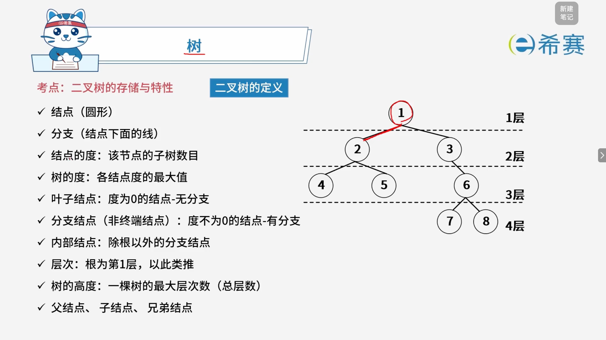
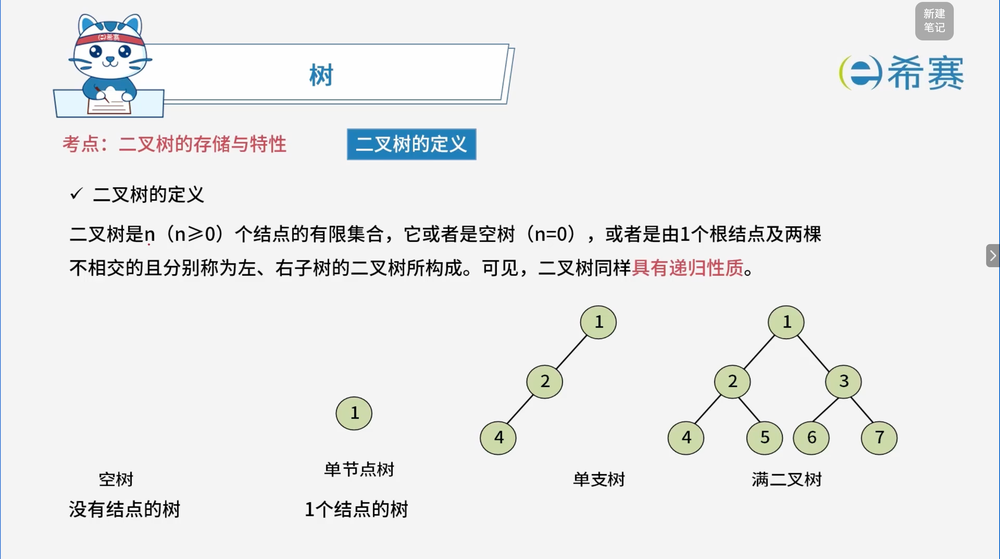
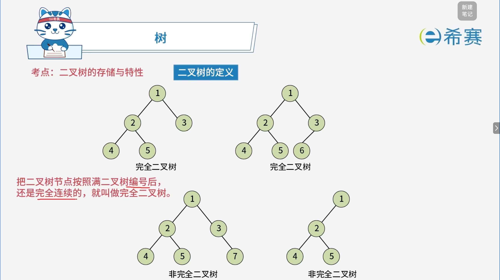
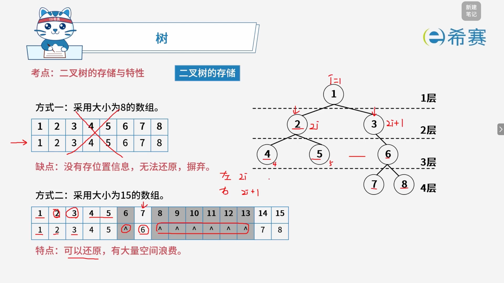
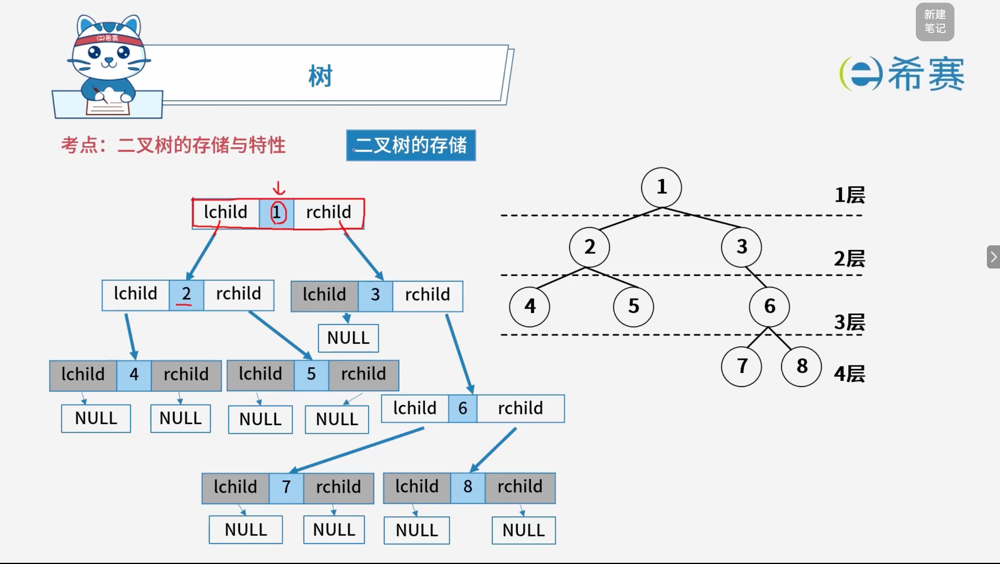
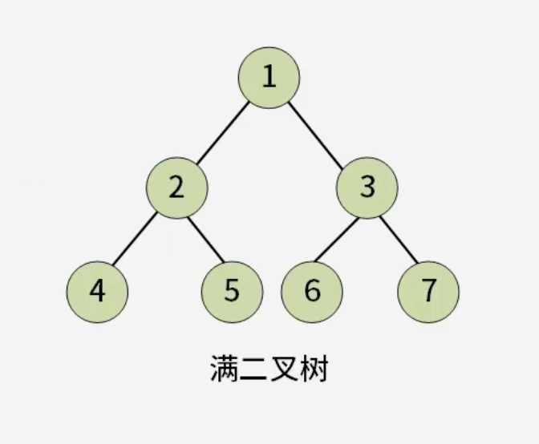
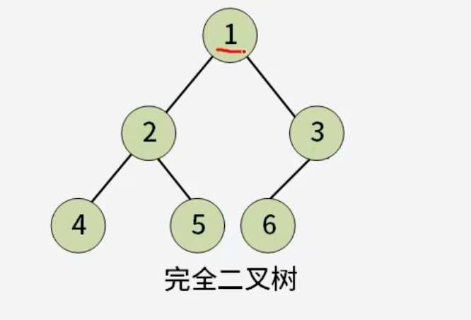
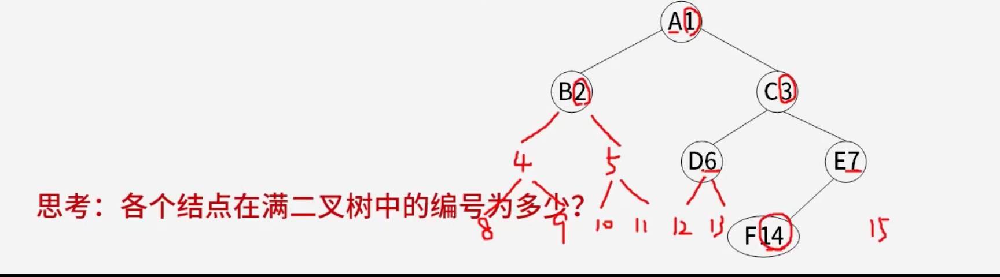
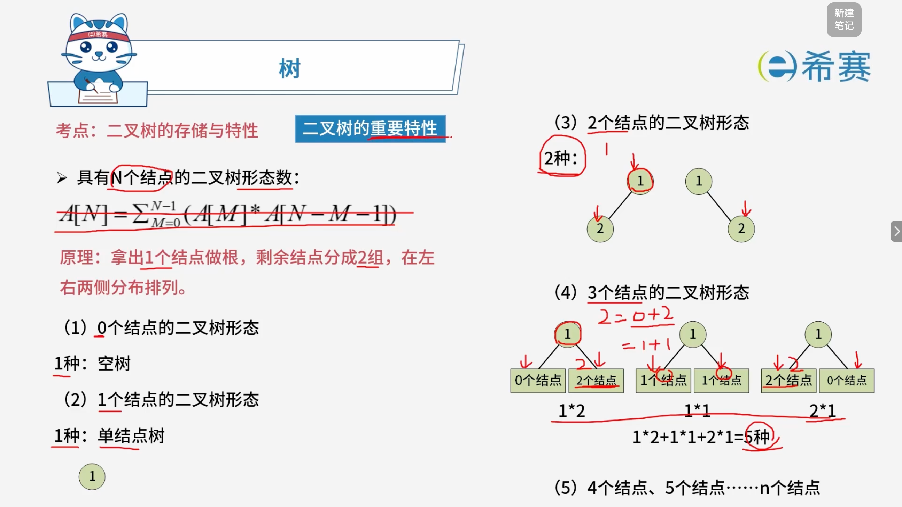
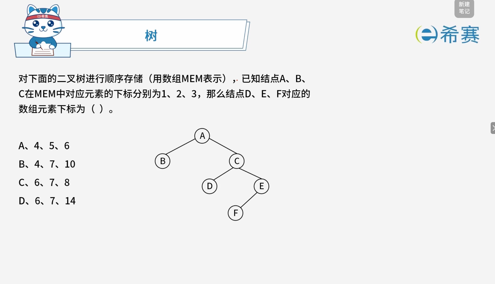

# 二叉树的存储与特性

## 1. 考点：树的基本组成元素

|**术语分类**|**核心概念与定义**|**补充说明 / 图示理解**|
| --| --------------------------------------------------------------------------------------------------------| ----------------------------------------------------------------------------------|
|**基础元素**|•​**结点**：图中的圆圈，表示数据元素。  •​**分支**：结点之间的连线。|整个树结构由结点和分支构成。|
|**度 (Degree)**|•​**结点的度**：该结点的子树数目。  •​**树的度**：各结点度的最大值。|• 比如根结点有2个孩子，其度为2。  • 整棵树中度最大的那个结点的度即为树的度。|
|**结点类型**|•​**叶子结点**：度为$0$的结点（无分支）。  •​**分支结点（非终端结点）** ：度不为$0$的结点（有分支）。  •​**内部结点**：除根结点以外的分支结点。|• 叶子结点相当于“末端”。  • 内部结点既不是根，也不是叶子。|
|**层次与高度**|•​**层次**：根结点为第$1$层，往下依次类推。  •​**树的高度（深度）** ：一棵树的最大层次数（总层数）。|• 如图所示，该树共有$4$层，因此其高度为$4$。|
|**相对关系**|•​**父结点、子结点、兄弟结点**：描述结点之间的上下级与同级关系。|树形结构特有的亲缘关系描述。|

## 2. 考点：二叉树的定义

### 2.1 二叉树的定义

- 二叉树是 $n$ ($n \ge 0$) 个结点的有限集合。
- 它或者是**空树** ($n = 0$)，或者是自由一个**根结点**及两棵不相交的、分别称为**左子树**和**右子树**的二叉树所组成。
- **核心性质**​：二叉树具有明显的​**递归性质**（即子树本身也是二叉树）。
- **注意事项**：二叉树的度最大为 $2$，且结点的左右子树是有序的、不能颠倒。

### 2.2 二叉树的常见形态

- **空树**：没有任何结点的树（$n = 0$）。
- **单节点树**：只包含 $1$ 个结点的树。
- **单支树**：每个分支结点都只有左子树或只有右子树的树（形态类似于链表）。
- **一般形态 / 满二叉树**：具有根结点以及完整的左右子树分支结构。

#### 2.2.1 完全二叉树的定义

- **核心概念**​：把二叉树节点按照满二叉树的顺序进行编号后，如果所有节点的编号是​**完全连续的**（即中间没有任何空缺），就叫做完全二叉树。
- **直观理解**：

  - 叶子节点只能出现在最下两层。
  - 最下层的叶子节点必须​**集中在该层的左侧**，连续排列。
  - 倒数第二层的右侧可以不饱满，但如果右侧有节点，其左侧必须是全满的。

#### 2.2.2 完全二叉树与非完全二叉树辨析

- **完全二叉树特征**：

  - 节点从上到下、从左到右依次紧凑排列，编号连续无中断（例如节点编号依次为 $1, 2, 3, 4, 5$ 或 $1, 2, 3, 4, 5, 6$）。
- **非完全二叉树特征**：

  - 节点排列出现断层或跳跃（例如左边未排满，右边却出现了较大编号如 $7$，或者底层叶子节点在左边有空缺的情况下右边出现节点）。

## 3. 考点：二叉树的存储

### 3.1 数组存储

### 3.2 链式存储

## 4. 考点：二叉树的重要特性

### 4.1 核心定理与性质

- **性质 1（每层最大结点数）** ：在二叉树的第 $i$ 层上最多有 $2^{i-1}$ 个结点（其中 $i \ge 1$）。
- **性质 2（整树最大结点数）** ：深度为 $k$ 的二叉树最多有 $2^k - 1$ 个结点（其中 $k \ge 1$）。

### 4.2 完全二叉树的顺序存储编号与节点性质

> 如果对一棵有 $n$ 个结点的**完全二叉树**的结点按层序进行编号（从第 $1$ 层到 $\lfloor \log_2 n \rfloor + 1$ 层，每层从左到右依次编号 $1$ 到 $n$），则对任一结点 $i$（$1 \le i \le n$），具有以下重要性质：

#### 4.2.1 双亲与孩子节点编号计算规则

1. **父结点关系**：

   - 如果 $i = 1$，则结点 $i$ 无父结点，它是二叉树的根。
   - 如果 $i > 1$，则其父结点编号为 $\lfloor i / 2 \rfloor$（向下取整）。
2. **左孩子关系**：

   - 如果 $2i > n$，则结点 $i$ 为叶子结点，​**无左子结点**。
   - 否则，其左子结点的编号为 ​**$2i$**。
3. **右孩子关系**：

   - 如果 $2i + 1 > n$，则结点 $i$ ​**无右子结点**。
   - 否则，其右子结点的编号为 **$2i + 1$**。

#### 4.2.2 思考题解析（右侧非完全/特定编号树的识别）

- **核心思路**：如果树中的节点未按常规完全二叉树的紧凑层序编号，可以通过其父子关系公式（左孩子 $2i$、右孩子 $2i+1$、父节点 $\lfloor i / 2 \rfloor$）反推其在标准满二叉树/完全二叉树中对应的正确层序编号。

### 4.3 二叉树的节点度数与性质定理 ($n_0 = n_2 + 1$)

对任何一棵二叉树，如果其叶子结点数为 $n_0$，度为 $2$ 的结点数为 $n_2$，则恒有关系：

$$
n_0 = n_2 + 1
$$

#### 4.3.1 核心符号定义

- $n_0$：度为 $0$ 的结点数（即叶子结点数）。
- $n_1$：度为 $1$ 的结点数。
- $n_2$：度为 $2$ 的结点数。
- 推广到一般树：$n_k$ 表示度为 $k$ 的结点数。

#### 4.3.2 双向推导过程

1. **视角一：从根向叶子伸展（计算总分支数）**

   - 根据度的定义，度为 $k$ 的结点会伸出 $k$ 个分支。
   - 因此，整棵树的总分支数（边数）可以通过所有结点的度数加权求和得出：

     $$
     \text{分支数} = \sum_{i=0}^{k} (i \times n_i) = n_0 \times 0 + n_1 \times 1 + n_2 \times 2 + \dots + n_k \times k
     $$

- **视角二：从叶子向根回溯（利用父子连线关系）**

  - 在树形结构中，​**每个结点都会通过恰好** **$1$** **根分支与其父结点相连**​，唯一的例外是​**根结点**（根结点没有父结点，没有向上的连线）。
  - 因此，总分支数等于“结点总数减去根结点”，即：

    $$
    \text{分支数} = \text{结点总数} - 1 = (n_0 + n_1 + n_2 + \dots + n_k) - 1
    $$
- **联立方程与二叉树化简**

  - 将两种方式算出的总分支数联立：

    $$
    (n_0 + n_1 + n_2 + \dots + n_k) - 1 = n_0 \times 0 + n_1 \times 1 + n_2 \times 2 + \dots + n_k \times k
    $$
  - 对于**二叉树**而言，最大的度不超过 $2$（即 $n_3 = n_4 = \dots = 0$），代入上式得：

    $$
    (n_0 + n_1 + n_2) - 1 = n_0 \times 0 + n_1 \times 1 + n_2 \times 2
    $$

  $$
  n_0 + n_1 + n_2 - 1 = n_1 + 2n_2
  $$
- 两边同时消去 $n_1$：

  $$
  n_0 + n_2 - 1 = 2n_2 \implies n_0 = n_2 + 1
  $$

#### 4.3.3 重要解题技巧

- **通用规律**：对于任何非空树（无论是否为二叉树），$\text{结点的数量} = \text{分支数量} + 1$。

### 4.4 具有 $N$ 个结点的二叉树形态数

#### 4.4.1 核心公式与递推原理

- **形态数递推公式**：

  $$
  A[N] = \sum_{M=0}^{N-1} (A[M] \times A[N-M-1])
  $$

 *(注：该公式本质上即为卡特兰数 / Catalan Number 的应用)*

- **核心原理**：  
  从 $N$ 个结点中抽出 $1$ 个结点作为​**根结点**，剩余的 $N-1$ 个结点被分配到左右两侧子树中。设左子树有 $M$ 个结点，则右子树就有 $N-M-1$ 个结点。左右子树形态数的乘积之和即为总形态数。

#### 4.4.2 具体实例推导

- **(1)**  **$0$** **个结点的二叉树形态数**：

  - **$1$** **种**：空树 ($A[0] = 1$)。
- **(2)**  **$1$** **个结点的二叉树形态数**：

  - **$1$** **种**：单结点树 ($A[1] = 1$)。
- **(3)**  **$2$** **个结点的二叉树形态数**：

  - **$2$** **种**：根带左孩子或根带右孩子 ($A[2] = 2$)。
- **(4)**  **$3$** **个结点的二叉树形态数**：

  - **$5$** **种**：

    $$
    A[3] = A[0]A[2] + A[1]A[1] + A[2]A[0]
    $$

  $$
  A[3] = (1 \times 2) + (1 \times 1) + (2 \times 1) = 5 \text{ 种}
  $$

## 5. 经典例题

### 5.1 题目一

> 

**解析：**

 **【题目分析】**

- **已知条件**：

  - 对该二叉树进行顺序存储（用数组 ​`MEM` 表示）。
  - 结点 A、B、C 在 ​`MEM` 中对应元素的下标分别为 $1$、$2$、$3$。
  - 根据完全二叉树的层序编号性质：若某结点的编号为 $i$，则其​**左孩子编号为** **$2i$**​，​**右孩子编号为** **$2i + 1$**。
- **目标**​：求结点 D、E、F 在数组 ​`MEM` 中对应的下标。

 **【推导过程】**

1. **确定已知结点的编号映射关系**：

   - 根结点 **A** 的下标为 $i = 1$。
   - **B** 是 A 的左孩子，其下标应为 $2 \times 1 = 2$（符合题意）。
   - **C** 是 A 的右孩子，其下标应为 $2 \times 1 + 1 = 3$（符合题意）。
2. **顺藤摸瓜求 D 和 E 的下标**：

   - 结点 **C** 的下标为 $i = 3$。
   - 观察图可知，D 是 C 的左孩子，因此其下标为：

     $$
     2 \times 3 = 6
     $$

   *. E 是 C 的右孩子，因此其下标为：

   $$
   \times 3 + 1 = 7
   $$

- **顺藤摸瓜求 F 的下标**：

  - 结点 **E** 的下标为 $i = 7$。
  - 观察图可知，F 是 E 的左孩子（注意图结构：F 连在 E 的左下方），因此其下标为：

    $$
    2 \times 7 = 14
    $$

 **【结果验证与选项匹配】**

- 结点 **D** 的下标 \= $6$
- 结点 **E** 的下标 \= $7$
- 结点 **F** 的下标 \= $14$

对应选项为 ​**D**（$6$、$7$、$14$）。

### 5.2 题目二

> **题目：** 设某二叉树采用二叉链表表示（即结点的两个指针分别指示左、右孩子）。当该二叉树包含 $k$ 个结点时，其二叉链表结点中必有（ **C** ）个空的孩子指针。
>
> - A. $k - 1$
> - B. $k$
> - C. $k + 1$
> - D. $2k$

 **【解析】**

1. **计算总指针数**：

   - 二叉树采用二叉链表存储时，每个结点都包含两个指针域（左孩子指针和右孩子指针）。
   - 当树中包含 $k$ 个结点时，**指针域总数**为：

     $$
     \text{总指针数} = 2k
     $$

- **计算非空指针数（有效孩子指针）** ：

  - 在树形结构中，除了根结点没有父结点外，其余每个结点都由其父结点的某一个孩子指针指向。
  - 因此，指向子结点的非空指针数量恰好等于树中的​**分支数（边数）** 。
  - 对于有 $k$ 个结点的树，分支数恒等于 ​**$k - 1$**。
- **计算空指针数（叶子或单支结点的空链域）** ：

  - 空指针数等于“总指针数”减去“非空指针数”：

    $$
    \text{空指针数} = 2k - (k - 1) = 2k - k + 1 = k + 1
    $$

**正确答案：C.**  **$k+1$** **。** 

### 5.3 题目三

> **题目：** 具有 3 个结点的二叉树有 5 种，可推测出具有 4 个结点的二叉树有（ **C** ）种。
>
> - A. 10
> - B. 11
> - C. 14
> - D. 15

 **【解析：卡特兰数（Catalan Number）应用】**

1. 核心公式

具有 $N$ 个结点的二叉树形态数 $A[N]$ 满足递推公式：

$$
A[N] = \sum_{M=0}^{N-1} (A[M] \times A[N-M-1])
$$

2. 逐步推导 $A[4]$

已知前几项形态数：

- $A[0] = 1$ （空树）
- $A[1] = 1$ （1个结点）
- $A[2] = 2$ （2个结点）
- $A[3] = 5$ （3个结点）

当 $N = 4$ 时，代入求和公式展开计算：

$$
A[4] = A[0]A[3] + A[1]A[2] + A[2]A[1] + A[3]A[0]
$$

$$
A[4] = (1 \times 5) + (1 \times 2) + (2 \times 1) + (5 \times 1)
$$

$$
A[4] = 5 + 2 + 2 + 5 = 14 \text{ 种}
$$

**正确答案：C. 14。** 

### 5.4 题目四

> **题目：** 已知树 T 的度为 4，且度为 4 的结点数为 7 个、度为 3 的结点数为 5 个、度为 2 的结点数为 8 个、度为 1 的结点数为 10 个，那么 T 的叶子结点个数为（ **C** ）。（注：树中结点个数称为结点的度，结点的度中的最大值称为树的度。）
>
> - A. 30
> - B. 35
> - C. 40
> - D. 49

 **【考点与解析：一般树的度数性质定理】**

#### 5.4.1 核心公式

对于任何一棵树，总分支数（边数）可以通过以下两种方式计算并建立等式：

1. **从结点的度出发（加权求和）** ：

   $$
   \text{分支数} = \sum_{i=1}^{k} (i \times n_i) = n_1 \times 1 + n_2 \times 2 + n_3 \times 3 + \dots + n_k \times k
   $$

- **从树的结构特征出发（结点总数减 1）** ：

  $$
  \text{分支数} = \text{结点总数} - 1 = (n_0 + n_1 + n_2 + n_3 + \dots + n_k) - 1
  $$

将两端联立即可得到通用公式：

$$
n_0 + n_1 + n_2 + \dots + n_k - 1 = 1 \cdot n_1 + 2 \cdot n_2 + 3 \cdot n_3 + \dots + k \cdot n_k
$$

化简后消去 $n_1$，得到叶子结点数 $n_0$ 的直接计算公式：

$$
n_0 = 1 + 1n_2 + 2n_3 + 3n_4 + \dots + (k-1)n_k
$$

#### 5.4.2 代入数据计算 $n_0$

已知树的度为 4，各度数的结点数量分别为：

- $n_4 = 7$ （度为 4 的结点数）
- $n_3 = 5$ （度为 3 的结点数）
- $n_2 = 8$ （度为 2 的结点数）
- $n_1 = 10$ （度为 1 的结点数）
- $n_0 = ?$ （叶子结点数，即度为 0 的结点数）

代入化简后的公式：

$$
\begin{aligned}
& n_0 = 1 + n_2 + 2n_3 + 3n_4 \\
& n_0 = 1 + (1 \times 8) + (2 \times 5) + (3 \times 7) \\
& n_0 = 1 + 8 + 10 + 21 \\
& n_0 = 40
\end{aligned}
$$

**正确答案：C. 40。**
