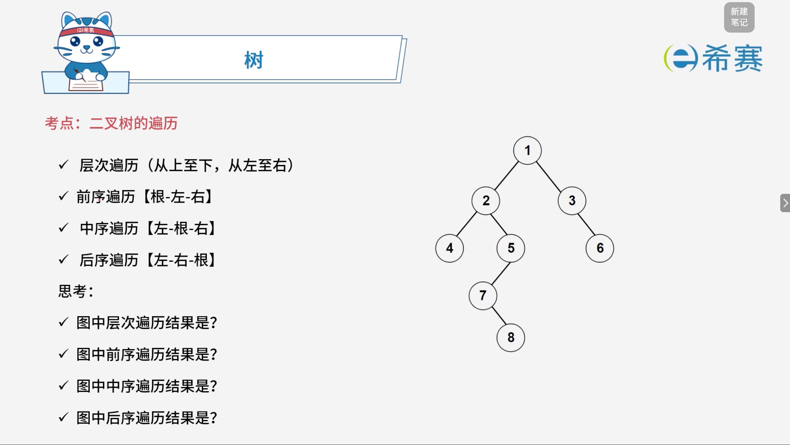
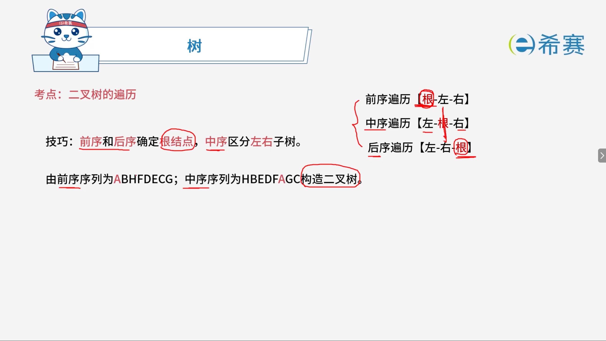
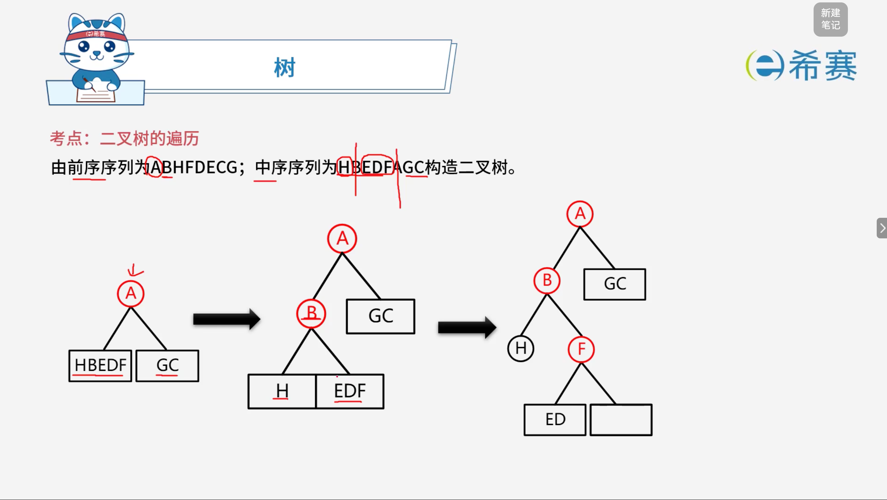
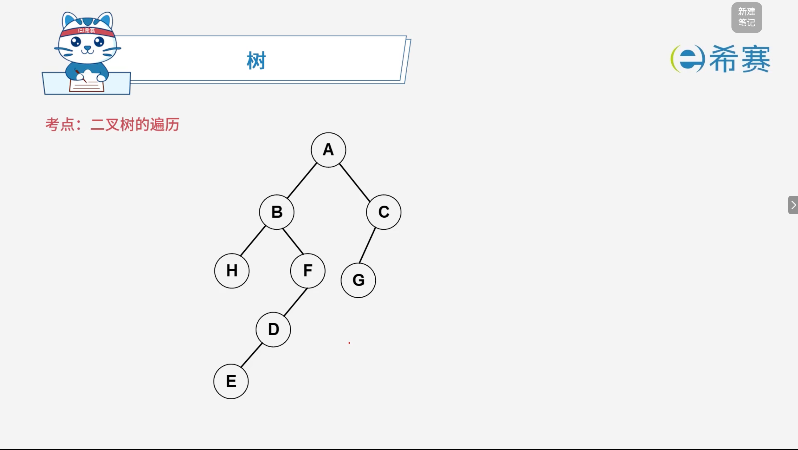

# 二叉树的遍历

## 1. 考点：二叉树的遍历方式

### 1.1 二叉树的四种核心遍历方式

- **层次遍历**：从上至下，从左至右逐层访问。
- **前序遍历**：【根 - 左 - 右】（先访问根节点，再遍历左子树，最后遍历右子树）。
- **中序遍历**：【左 - 根 - 右】（先遍历左子树，再访问根节点，最后遍历右子树）。
- **后序遍历**：【左 - 右 - 根】（先遍历左子树，再遍历右子树，最后访问根节点）。



### 1.2 图示二叉树的各项遍历结果求解

结合图中给出的二叉树结构，各遍历序列结果如下：

1. **图中层次遍历结果**：

   - 顺序：从上到下、从左到右依次访问各层节点。
   - 结果：**1, 2, 3, 4, 5, 6, 7, 8**
2. **图中的前序遍历结果【根 - 左 - 右】** ：

   - 递归访问顺序：根(1) -\> 左子树(2, 4, 5, 7, 8) -\> 右子树(3, 6)。
   - 结果：**1, 2, 4, 5, 7, 8, 3, 6**
3. **图中的中序遍历结果【左 - 根 - 右】** ：

   - 递归访问顺序：左子树(4, 2, 7, 8, 5) -\> 根(1) -\> 右子树(3, 6)。
   - 结果：**4, 2, 7, 8, 5, 1, 3, 6**
4. **图中的后序遍历结果【左 - 右 - 根】** ：

   - 递归访问顺序：左子树(4, 8, 7, 5, 2) -\> 右子树(6, 3) -\> 根(1)。
   - 结果：**4, 8, 7, 5, 2, 6, 3, 1**

## 2. 考点：根据遍历序列构造二叉树

#### 2.0.1 核心解题技巧

- **前序遍历（根 - 左 - 右）和后序遍历（左 - 右 - 根）** ​：用于​**确定根结点**。
- **中序遍历（左 - 根 - 右）** ：用于**区分左右子树**（根结点左边的所有元素属于左子树，右边的所有元素属于右子树）。



#### 2.0.2 实例演练：由前序与中序序列构造二叉树

- **已知序列**：

  - 前序序列：​`ABHFDECG`
  - 中序序列：​`HBEDFAGC`

##### 2.0.2.1 逐步推导过程



1. **确定根结点**：

   - 前序遍历的第一个元素永远是根结点，因此整棵树的根结点为 ​**A**。
2. **在中序序列中划分左右子树**：

   - 在中序序列 ​`HBEDFAGC`​ 中找到根结点 ​`A`​ 的位置：​`H B E D F A G C`。
   - `A`​ 左侧的元素 ​`H B E D F`​ 属于 ​**左子树**。
   - `A`​ 右侧的元素 ​`G C`​ 属于 ​**右子树**。
3. **递归处理左子树**：

   - 左子树的中序序列为：​`H B E D F`
   - 对应的左子树前序序列为：​`B H F D E`​（对照前序整体顺序：根 ​`A` 之后紧跟的 5 个元素）。
   - 对左子树 ​`B H F D E` 重复上述步骤：

     - 前序第一个元素 ​`B` 为左子树的根。
     - 在中序 ​`H B E D F`​ 中以 ​`B`​ 为界：左边 ​`H`​ 为 ​`B`​ 的左子树，右边 ​`E D F`​ 为 ​`B` 的右子树。
     - 继续对 ​`E D F`​（中序）与 ​`H F D`（前序）进行递归细分，最终可完整还原整棵二叉树的拓扑结构。



## 3. 经典例题

### 3.1 题目一

> **题目：** 某二叉树的中序、先序遍历序列分别为 $\{20, 30, 10, 50, 40\}$、$\{10, 20, 30, 40, 50\}$，则该二叉树的后序遍历序列为（ **C** ）。
>
> - A. $50, 40, 30, 20, 10$
> - B. $30, 20, 10, 50, 40$
> - C. $30, 20, 50, 40, 10$
> - D. $20, 30, 10, 40, 50$

 **【推导过程】**

1. **确定根结点**：

   - 先序遍历的第一个元素永远是根结点，因此整棵树的根结点为 ​**10**。
2. **在中序序列中划分左右子树**：

   - 中序序列为：​`20, 30, 10, 50, 40`
   - 以根 ​`10`​ 为界，左侧 ​`20, 30`​ 为左子树，右侧 ​`50, 40` 为右子树。
3. **递归构建左右子树**：

   - **左子树**（包含结点 20, 30）：

     - 在先序序列 ​`10, 20, 30, 40, 50`​ 中，紧跟在 10 后面属于左子树部分的先序序列是 ​`20, 30`。
     - 结合先序 ​`20, 30`​ 和中序 ​`20, 30`​ 可知，​`20`​ 是根，​`30`​ 是其右孩子（或无左孩子）。通过仔细对应可知：​`20`​ 为根，其右子树为 ​`30`。
   - **右子树**（包含结点 50, 40）：

     - 对应的先序部分为 ​`40, 50`​，中序部分为 ​`50, 40`。
     - 先序第一个元素 ​`40`​ 为右子树的根，中序中 ​`50`​ 在 ​`40`​ 左侧，说明 ​`50`​ 是 ​`40` 的左孩子。

```plaintext
       10
      /  \
    20    40
      \   /
      30 50
```

 **「求后序遍历序列【左 - 右 - 根】」**

按照后序遍历规则对上述树进行遍历：

- 访问左子树：​`20 -> 30`​ 的后序为 ​`30, 20`（根的右子树先访问，再访问根本身：左为空，右为30，根为20 $\rightarrow$ 30, 20）。
- 访问右子树：​`40`​ 的左孩子为 ​`50`​，右为空，根为 ​`40` $\rightarrow$ ​`50, 40`。
- 最后访问根结点 ​`10`。
- **最终后序序列**：​`30, 20, 50, 40, 10`

**正确答案**<span data-type="text" style="background-color: var(--b3-inline-builtin-success-background-color, var(--b3-card-success-background)); color: var(--b3-inline-builtin-success-color, var(--b3-card-success-color));">：</span>**C. 30, 20, 50, 40, 10。** 

‍
