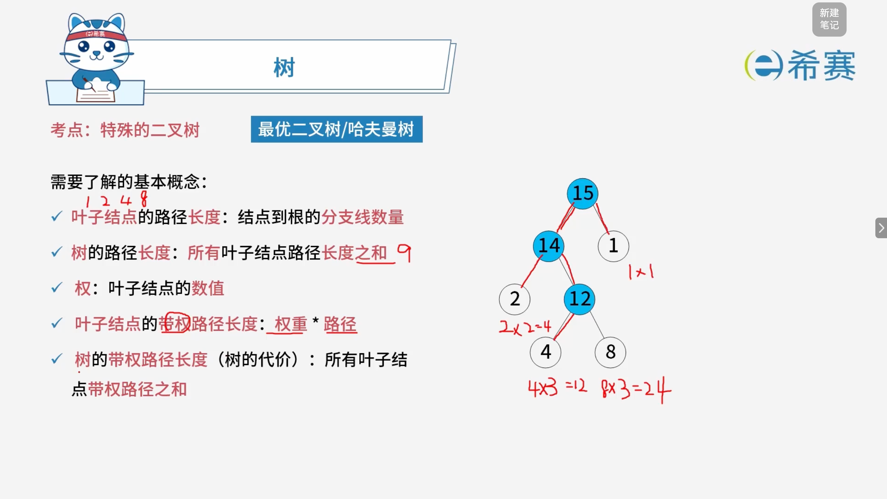
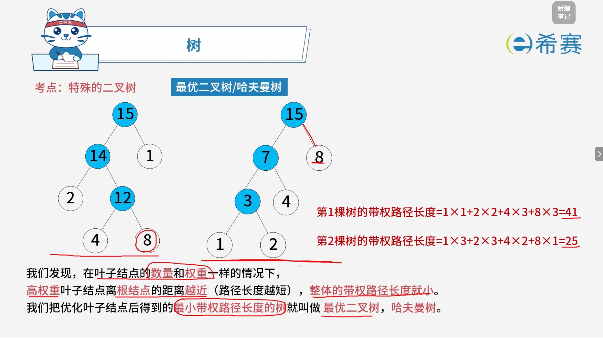
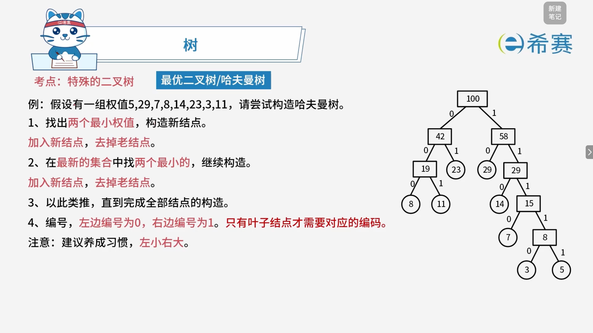
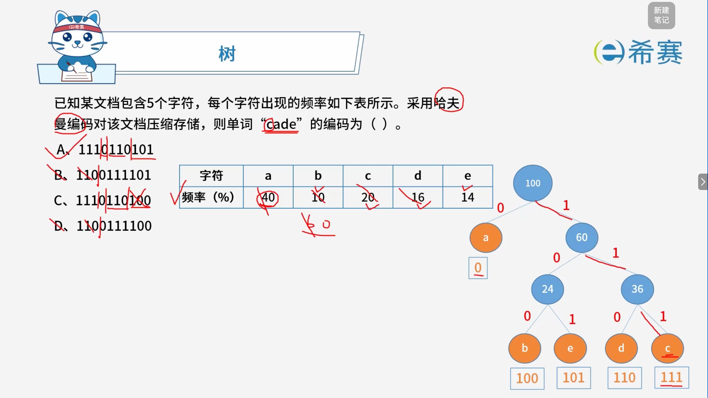

# 哈夫曼树

## 1. 考点：最优二叉树基本概念

### 1.1 需要了解的基本概念

- **叶子结点的路径长度**​：从根结点到该叶子结点之间的​**分支线数量**（即层数减 1，若根结点算第 0 层）。
- **树的路径长度**​：所有**叶子结点**路径长度之和。
- **权（Weight）** ：叶子结点的数值（代表该结点的重要程度或出现频率）。
- **叶子结点的带权路径长度**​：该结点的 ​**权重** **$\times$** **路径长度**。
- **树的带权路径长度（WPL，树的代价）** ​：所有**叶子结点**带权路径长度之和：

  $$
  \text{WPL} = \sum_{i=1}^{n} (w_i \times l_i)
  $$

 *(其中* *$w_i$* *为叶子结点的权值，*​*$l_i$* *为该叶子结点到根的路径长度)*



### 1.2 图示实例拆解（WPL 计算演练）

观察右侧给出的哈夫曼树结构，其叶子结点为 ​`2`​、​`4`​、​`8`​、​`1`​（注意：图中带圈的 15、14、12 是非叶子结点的权值，计算 WPL 时​**只计算叶子结点**）：

1. 叶子结点 ​`2`​ 到根 ​`15`​ 的路径长度为 2，其带权路径长度 \= $2 \times 2 = 4$
2. 叶子结点 ​`4`​ 到根 ​`15`​ 的路径长度为 3，其带权路径长度 \= $4 \ = 12$
3. 叶子结点 ​`8`​ 到根 ​`15`​ 的路径长度为 3，其带权路径长度 \= $8 \times 3 = 24$
4. 叶子结点 ​`1`​ 到根 ​`15`​ 的路径长度为 1，其带权路径长度 \= $1 \times 1 = 1$

整棵树的带权路径长度 $\text{WPL} = 4 + 12 + 24 + 1 = 41$。

## 2. 考点：哈夫曼树的定义



### 2.1 哈夫曼树的核心规律与优化思想

观察图中给出的两棵叶子结点权值完全相同（均为 $1, 2, 4, 8$）的二叉树：

- **左侧树的 WPL 计算**：

  $$
  \text{WPL} = (8 \times 3) + (4 \times 3) + (2 \times 2) + (1 \times 1) = 24 + 12 + 4 + 1 = 41
  $$
- **右侧树的 WPL 计算**：

  $$
  \text{WPL} = (8 \times 1) + (4 \times 2) + (3 \times 3) + (1 \times 3) = 8 + 8 + 9 + 3 = 28
  $$

### 2.2 核心结论

- **基本规律**​：在叶子结点数量和权重完全一样的情况下，​**高权重叶子结点离根结点的距离越近（路径长度越短），整体的带权路径长度（WPL）就越小**。
- **最优二叉树定义**​：把带权路径长度最小的树叫做​**最优二叉树**​，也称​**哈夫曼树（Huffman Tree）** 。

## 3. 经典例题

### 3.1 题目一

> 

#### 3.1.1 **初始状态（无编码）**

text

```
(3)  (5)  (7)  (8)  (11)  (14)  (23)  (29)
```

---

#### 3.1.2 解析：

##### 3.1.2.1 **第一步：合并 3 和 5，生成新节点 8**

text

```
        [8]
       /   \
      0     1
     /       \
   (3)       (5)

当前集合： (7)  (8)  (11)  (14)  (23)  (29)  [8]
```

---

##### 3.1.2.2 **第二步：合并 7 和 8(新)，生成新节点 15**

text

```
        [15]
       /    \
      0      1
     /        \
   (7)       [8]
            /   \
           0     1
          /       \
        (3)       (5)

当前集合： (8)  (11)  (14)  (23)  (29)  [15]
```

---

##### 3.1.2.3 **第三步：合并 8 和 11，生成新节点 19**

text

```
        [19]
       /    \
      0      1
     /        \
   (8)       (11)

当前集合： (14)  (23)  (29)  [15]  [19]
```

---

##### 3.1.2.4 **第四步：合并 14 和 15，生成新节点 29(右)**

text

```
        [29]
       /    \
      0      1
     /        \
  (14)       [15]
            /    \
           0      1
          /        \
        (7)       [8]
                 /   \
                0     1
               /       \
             (3)       (5)

当前集合： (23)  (29)  [19]  [29]
```

---

##### 3.1.2.5 **第五步：合并 19 和 23，生成新节点 42**

text

```
        [42]
       /    \
      0      1
     /        \
  [19]       (23)
  /   \
 0     1
/       \
(8)    (11)

当前集合： (29)  [29]  [42]
```

---

##### 3.1.2.6 **第六步：合并 29 和 29(右)，生成新节点 58**

text

```
        [58]
       /    \
      0      1
     /        \
  (29)      [29]
            /    \
           0      1
          /        \
       (14)       [15]
                 /    \
                0      1
               /        \
             (7)       [8]
                      /   \
                     0     1
                    /       \
                  (3)       (5)

当前集合： [42]  [58]
```

---

##### 3.1.2.7 **第七步（最终）：合并 42 和 58，生成根节点 100**

这是最终的完整哈夫曼树，我直接把**每个叶子节点的完整编码**标注在叶子上：

text

```
                       [100]
                      /     \
                     0       1
                    /         \
                [42]           [58]
               /    \         /    \
              0      1       0      1
             /        \     /        \
          [19]       (23) (29)      [29]
         /    \      ↑    ↑        /    \
        0      1    01    10      0      1
       /        \                /        \
     (8)      (11)            (14)       [15]
      ↑        ↑               ↑        /    \
     000      001             1100     0      1
                                       /        \
                                     (7)       [8]
                                      ↑        /   \
                                     11010    0     1
                                             /       \
                                           (3)       (5)
                                            ↑         ↑
                                          110110   110111
```

---

#### 3.1.3  **📋 叶子节点编码汇总表**

把上图中所有原始叶子节点（圆形节点）的编码提取出来，按数值从小到大排列：

|权值|完整路径|哈夫曼编码|
| ------| --------------------| ------------|
|**3**|右→右→右→左→左|`110110`|
|**5**|右→右→右→左→右|`110111`|
|**7**|右→右→左→右→左|`11010`|
|**8**|左→左→左|`000`|
|**11**|左→左→右|`001`|
|**14**|右→右→左→左|`1100`|
|**23**|左→右|`01`|
|**29**|右→左|`10`|

### 3.2 题目二

> 

**正确答案：A。**
