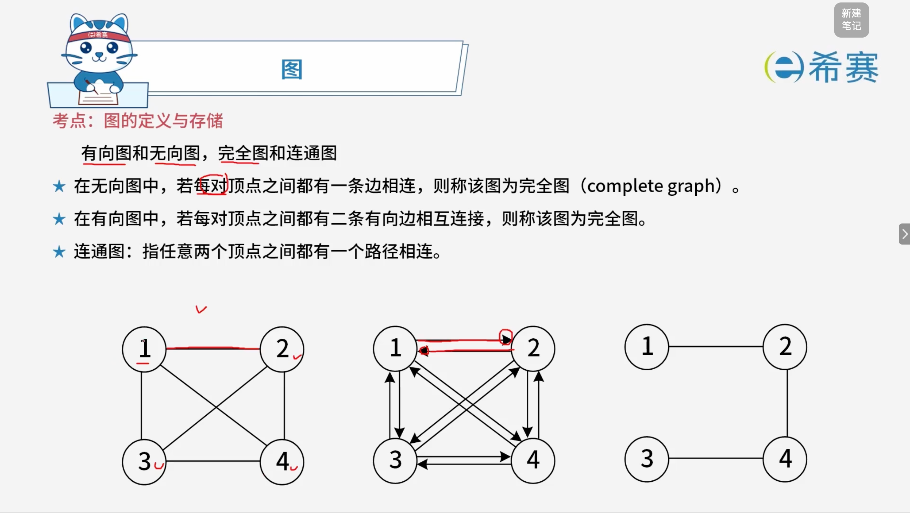
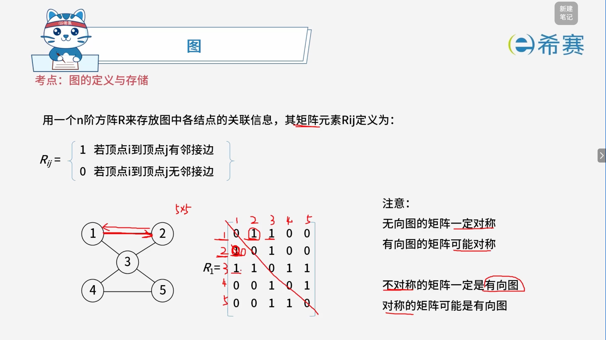
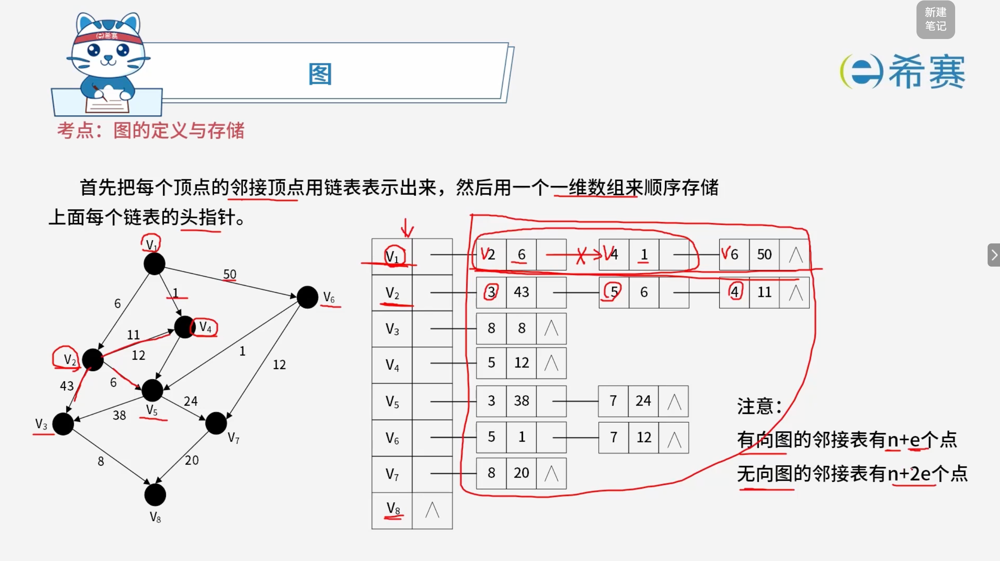
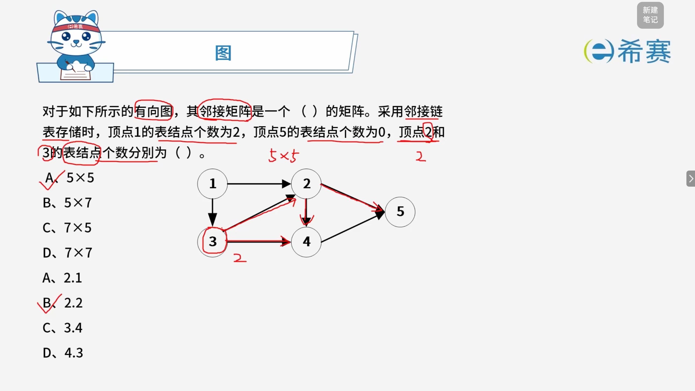

# 图的定义与存储

## 1. 考点：图的定义

## 2. 考点：数组存储

## 3. 考点：链表存储

## 4. 经典例题

### 4.1 题目一

> **题目：** 某简单无向连通图 $G$ 的顶点数为 $n$，则图 $G$ 最少和最多分别有（ ）条边。
>
> - A. $n, n^2/2$
> - B. $n - 1, n*(n-1)/2$
> - C. $n, n*(n-1)/2$
> - D. $n - 1, n^2/2$

 **【解析】**

 **【最少边数（连通图的下界）】**

- **原理**：要使一个含有 $n$ 个顶点的无向图保持**连通**且边数​**最少**，图不能有回路（即必须是一棵树，称为生成树）。
- **公式推导**：包含 $n$ 个结点的树有且仅有 **$n - 1$** 条边。如果边数少于 $n - 1$，图必然会分裂为多个连通分量（不连通）。

 **【最多边数（简单图的上界）】**

- **原理**​：题目限定为​**简单图**​（无自环、无重边）且为​**无向图**​。要使边数达到​**最多**​，意味着任意两个不同的顶点之间都必须有一条边相连（即构成**完全无向图** $K_n$）。
- **公式推导**：$n$ 个顶点中任意选择 2 个顶点进行连边的组合数为：

  $$
  \text{最多边数} = C_n^2 = \frac{n(n-1)}{2}
  $$

**正确答案：B.**  **$n - 1, n(n-1)/2\$** **。** 

### 4.2 题目二

‍
