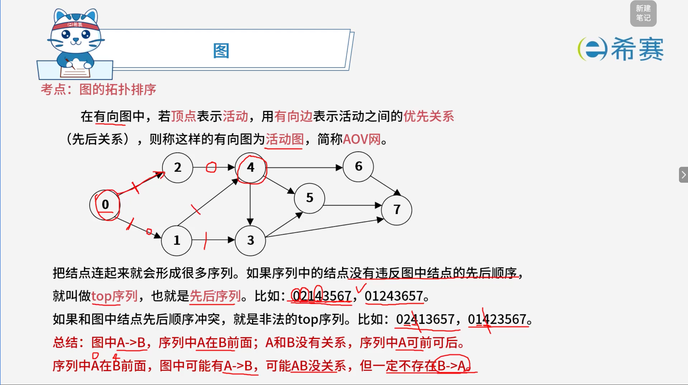
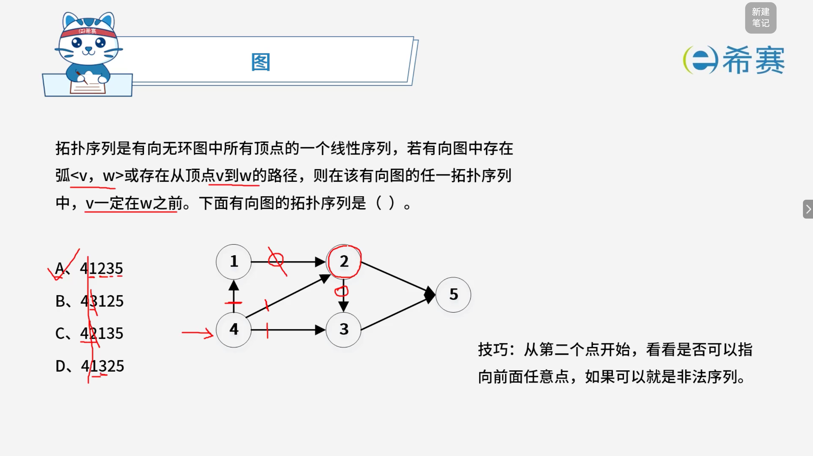

# 图的拓扑排序

## 1. 考点：基本概念

## 2. 经典例题

### 2.1 题目一

### 2.2 题目二

> **题目：** 对有向图 $G$ 进行拓扑排序得到的拓扑序列中，顶点 $V_i$ 在顶点 $V_j$ 之前，则说明 $G$ 中（ **B** ）。
>
> - A. 不一定存在有向弧 $<V_i, V_j>$
> - B. 一定不存在有向弧 $<V_i, V_j>$
> - C. 必定存在从 $V_i$ 到 $V_j$ 的路径
> - D. 必定存在从 $V_j$ 到 $V_i$ 的路径

 **【解析：拓扑排序的性质】**

1. **拓扑排序的基本定义**：

   - 拓扑排序是对有向无环图（DAG）的顶点的一种排序，它使得若图中存在一条从顶点 $V_i$ 到 $V_j$ 的有向路径（或有向边 $<V_i, V_j>$），则在拓扑序列中顶点 $V_i$ 必然在顶点 $V_j$ 之前。
2. **前后顺序的逻辑推导**：

   - **逆否命题与充分性辨析**：如果 $V_i$ 在拓扑序列中排在 $V_j$ 之前，这**并不意味着**它们之间必须直接有一条边 $<V_i, V_j>$（即选项 A、B 讨论的直接有向弧并不必然成立，中间可能隔着其他过渡顶点）。
   - 但是，它绝对保证了​**图中有从** **$V_i$** **到** **$V_j$** **的有向路径**（可能是一条边，也可能是多条边首尾相连构成的路径），否则在拓扑排序的入度减减过程中，$V_j$ 不可能排在 $V_i$ 后面。

**正确答案：B。** 

‍
