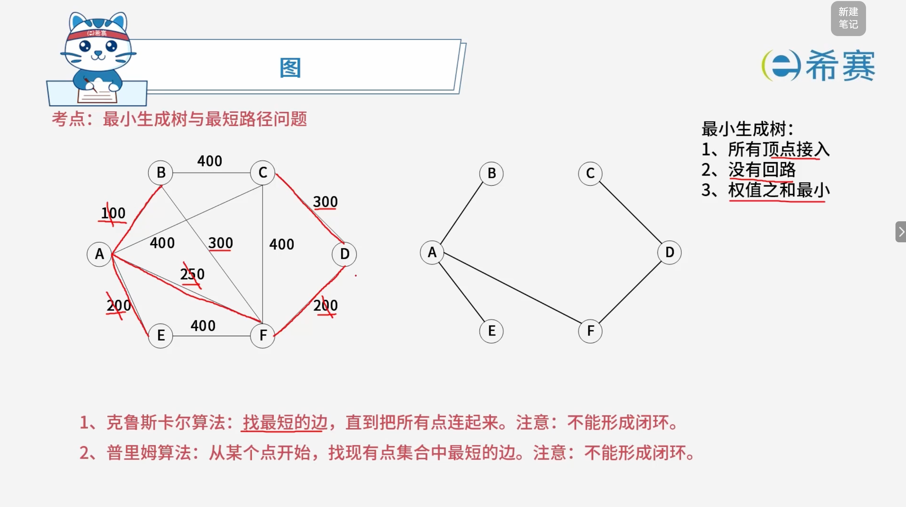
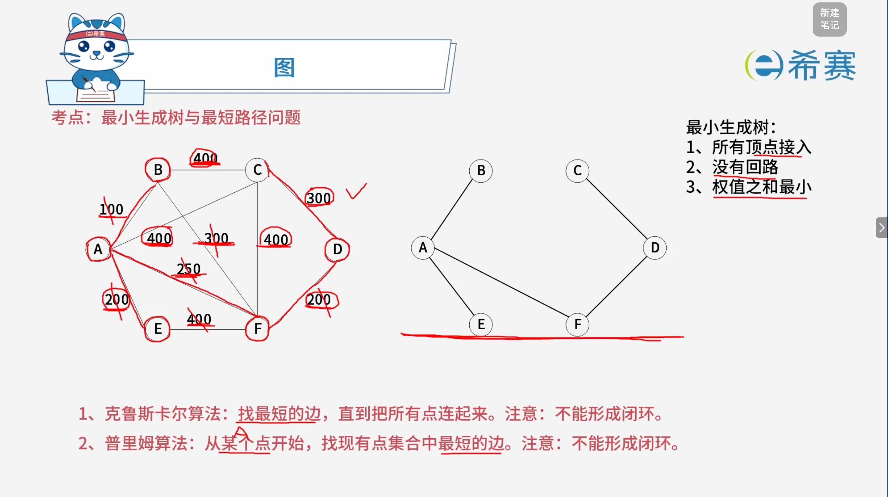
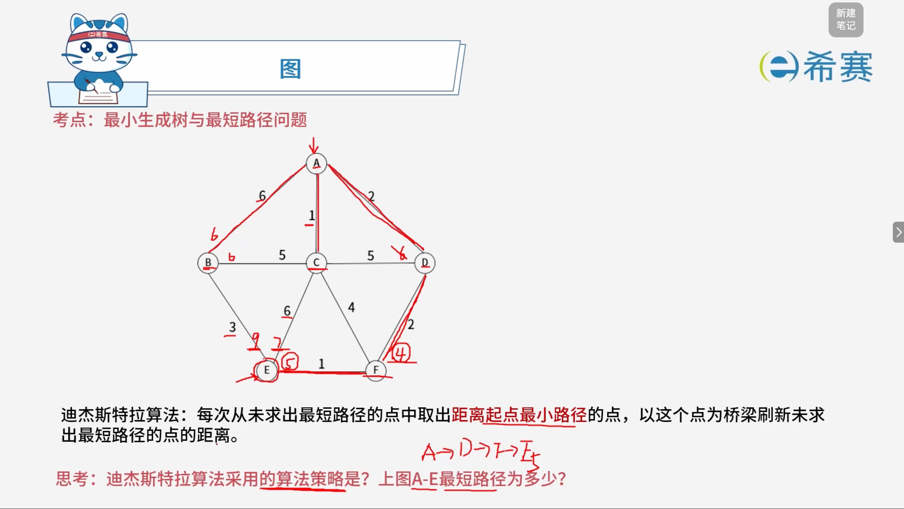

# 图的最小生成树与最短路径

## 1. 考点：最小生成树：克鲁斯卡尔算法

## 2. 考点：最小生成树：普里姆算法

## 3. 考点：最短路径：底杰斯特拉算法

### 3.1 **思考1：迪杰斯特拉算法采用的算法策略是？**

**答案：贪心算法（Greedy Algorithm）。**

**解析：**   
如图所示，迪杰斯特拉（Dijkstra）算法的核心思想是：“每次从未求出最短路径的点中，取出距离起点最小路径的点，以这个点为桥梁刷新未求出最短路径的点的距离。”  
这种在每一步选择中都采取当前状态下最好（即距离起点最近）的选择，从而希望导致结果是全局最优的策略，正是**贪心算法**的典型特征。

---

### 3.2 **思考2：求上图中 A-E 的最短路径**

**结论：**   
A-E 的最短路径为：​**A → D → F → E**​（或反向 E → F → D → A）  
路径的总长度为：**5**

**详细推导过程（基于迪杰斯特拉算法，从 E 出发）：**

图中已知的各边权重如下：

- E-B \= 3，E-C \= 6，E-F \= 1
- F-C \= 4，F-D \= 2
- D-C \= 5，D-A \= 2
- C-A \= 1，C-B \= 5
- A-B \= 6

**步骤 1：初始化**  
从起点 E 出发，E 到各相邻节点的直接距离为：

- E 到 F：1
- E 到 B：3
- E 到 C：6
- E 到 A、D：暂不可直达（视为无穷大 ∞∞）
- **当前距离 E 最近的点是 F（距离为 1）。**  确定 E→F 的最短路径为 ​**1**。

**步骤 2：以 F 为桥梁，刷新距离**  
从 E 经过 F（距离 1）再出发：

- 到 D：1 + 2 \= 3（比原来的 ∞∞ 小，更新为 3）
- 到 C：1 + 4 \= 5（比原来的 6 小，更新为 5）
- 到 A、B：暂无更优路径，不更新。
- **此时未确定点中，距离 E 最近的是 B 和 D（距离都是 3）。**  我们优先选择 D（因为 D 通往 A 的路径更直接）。确定 E→D 的最短路径为 ​**3**（路径为 E→F→D）。

**步骤 3：以 D 为桥梁，刷新距离**  
从 E 经过 D（距离 3）再出发：

- 到 A：3 + 2 \= 5（比原来的 ∞∞ 小，更新为 5）
- 到 C：3 + 5 \= 8（比之前更新的 5 大，不更新）
- **此时未确定点中，距离 E 最近的是 B（距离为 3）。**  确定 E→B 的最短路径为 ​**3**（直达）。

**步骤 4：以 B 为桥梁，刷新距离**  
从 E 经过 B（距离 3）再出发：

- 到 C：3 + 5 \= 8（比之前更新的 5 大，不更新）
- 到 A：3 + 6 \= 9（比之前更新的 5 大，不更新）
- **此时未确定点中，距离 E 最近的是 C（距离为 5）和 A（距离为 5）。**  我们先处理 C。

**步骤 5：以 C 为桥梁，刷新距离**  
从 E 经过 C（距离 5）再出发：

- 到 A：5 + 1 \= 6（比之前更新的 5 大，不更新）
- **最后剩下 A。**  确定 E→A 的最短路径为 ​**5**。

**步骤 6：最终结果与逆推路径**  
确定 E→A 的最短路径长度为 ​**5**。  
现在我们从 A 逆向推导（回溯）这条路径是怎么来的：

- A 的距离 5 是由谁更新的？是​**从 D 点**​（距离 3）加上边 D-A（权重 2）得到的：3 + 2 \= 5。
- D 的距离 3 是由谁更新的？是​**从 F 点**​（距离 1）加上边 F-D（权重 2）得到的：1 + 2 \= 3。
- F 的距离 1 是由谁更新的？是**起点 E** 直接到达的：E-F（权重 1）。

所以，​**从 E 到 A 的最短路径是：E → F → D → A**​，总长度为 ​**1 + 2 + 2 \= 5**​。  
反过来，题目问的 A 到 E 的最短路径就是：​**A → D → F → E**。
