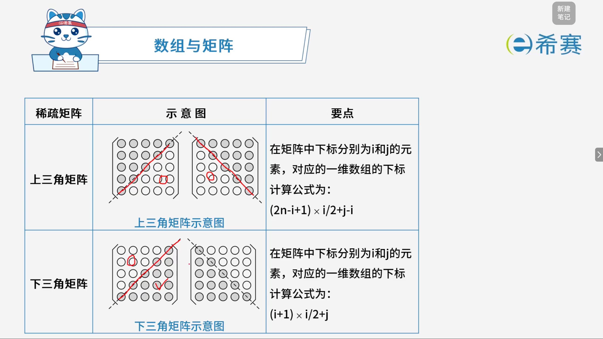
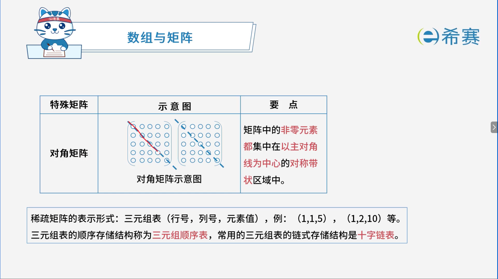
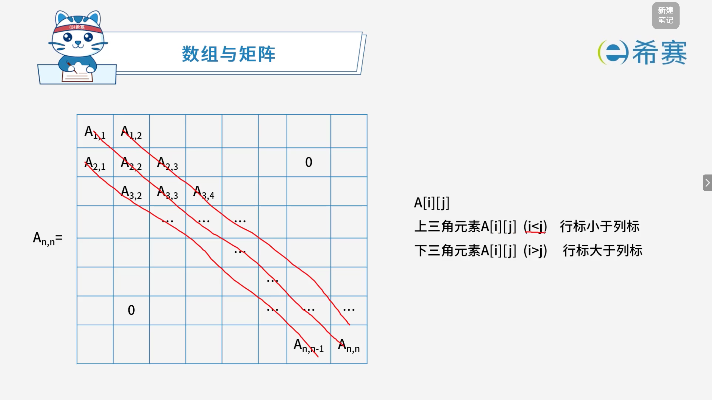
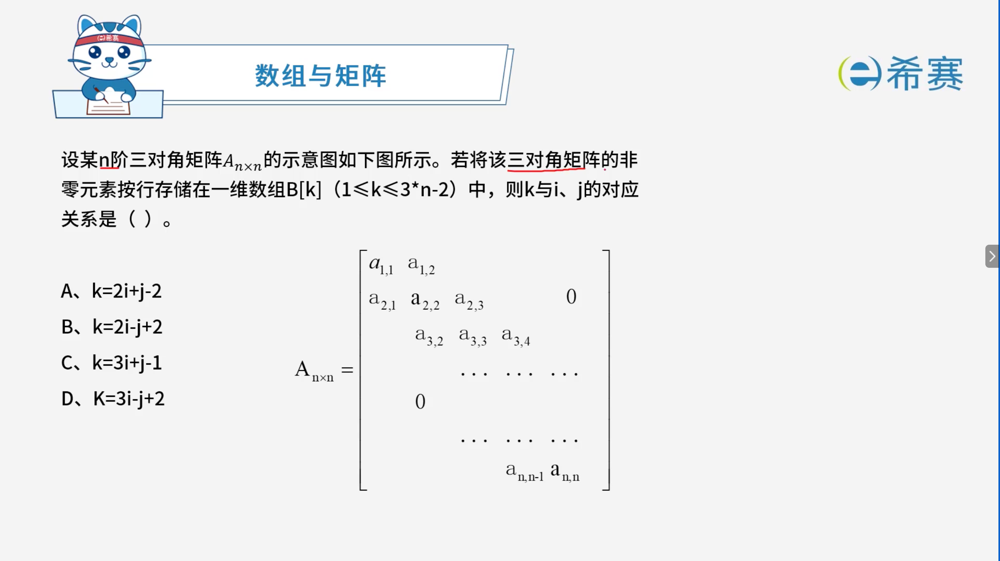

# 数组与矩阵

## 1. 考点：数组与矩阵的存储地址计算

### 1.1 基本概念

- **下标规则**：在计算机中，数组的下标一般从 **$0$** 开始计算。
- **符号说明**：

  - $a$：数组的起始内存地址（基地址）。
  - $\text{len}$：单个元素所占用的字节数（存储长度）。

### 1.2 一维数组的存储地址

- 对于一维数组 $a[n]$，元素 $a[i]$ 的存储地址计算公式为：

  $$
  \text{Loc}(a[i]) = a + i \times \text{len}
  $$

### 1.3 二维数组的存储地址

对于二维数组 $a[m][n]$（其中 $m$ 为行数，$n$ 为列数），由于计算机内存是线性的（一维的），因此二维数组在内存中存储时必须将其展开为一维线性排列。主要有两种存储方式：

- **按行存储（Row-Major Order）** ：先存第一行，再存第二行 $\dots$ 以此类推。元素 $a[i][j]$ 的存储地址计算公式为：

  $$
  \text{Loc}(a[i][j]) = a + (i \times n + j) \times \text{len}
  $$

 *(解释：前面完整的有* *$i$* *行，每行有* *$n$* *个元素；当前行已经走了* *$j$* *个元素。)*

- **按列存储（Column-Major Order）** ：先存第一列，再存第二列 $\dots$ 以此类推。元素 $a[i][j]$ 的存储地址计算公式为：

  $$
  \text{Loc}(a[i][j]) = a + (j \times m + i) \times \text{len}
  $$

 *(解释：前面完整的有* *$j$* *列，每列有* *$m$* *个元素；当前列已经走了* *$i$* *个元素。）*

总结

|**数组类型**|**存储方式**|**地址计算公式**|**参数说明**|
| --| ----------------| --| ---------------------------------------------------------------------------------------------------------------------------|
|**一维数组**​**$a[n]$**|线性连续存储|$\text{Loc}(a[i]) = a + i \times \text{len}$|•$a$：数组起始基地址  •$i$：元素下标（从$0$开始）  •$\text{len}$：单个元素占用的字节数|
|**二维数组**​**$a[m][n]$**|**按行存储**(Row-Major)|$\text{Loc}(a[i][j]) = a + (i \times n + j) \times \text{len}$|•$m$：总行数，$n$：总列数  •$i$：当前行下标，$j$：当前列下标  • 公式含义：先跳过前面完整的$i$行（每行$n$个），再加上当前行的$j$个偏移量|
|**二维数组**​**$a[m][n]$**|**按列存储**(Column-Major)|$\text{Loc}(a[i][j]) = a + (j \times m + i) \times \text{len}$|•$m$：总行数，$n$：总列数  •$i$：当前行下标，$j$：当前列下标  • 公式含义：先跳过前面完整的$j$列（每列$m$个），再加上当前列的$i$个偏移量|

## 2. 考点：稀疏矩阵

在计算机中，若矩阵中许多元素的值相同或为零，为了节省存储空间，通常会对矩阵进行**压缩存储**——只存非零元素或有效数据。常见的特殊矩阵包括对称矩阵、上/下三角矩阵和对角矩阵等。

### 2.1 下三角矩阵 (Lower Triangular Matrix)

- **定义**​：主对角线**上方**的元素（不包括对角线）全部为常数 $c$（通常为 $0$）的方阵。
- **压缩策略**：只需按行优先顺序存放主节点及下三角部分的元素（共 $\frac{n(n+1)}{2}$ 个元素），常数 $c$ 可以不存或只存一份。
- **一维数组下标计算公式**（假设行标 $i$、列标 $j$ 均从 $0$ 开始，矩阵为 $n \times n$）：

  $$
  \text{Index} = \frac{(i + 1) \times i}{2} + j
  $$

 *(解释：前面完整的有* *$i$* *行，第* *$k$* *行有* *$k+1$* *个元素，总共前面的元素个数为* *$1 + 2 + \dots + i = \frac{i(i+1)}{2}$*​ *；在当前第* *$i$* *行中，已经走过了* *$j$* *列，加上当前元素即可)*

### 2.2 上三角矩阵 (Upper Triangular Matrix)

- **定义**​：主对角线**下方**的元素（不包括对角线）全部为常数 $c$（通常为 $0$）的方阵。
- **压缩策略**：只需按行优先顺序存放主对角线及上三角部分的元素。
- **一维数组下标计算公式**（假设行标 $i$、列标 $j$ 均从 $0$ 开始）：

  $$
  \text{Index} = \frac{(2n - i + 1) \times i}{2} + j - i
  $$

 *(解释：前面完整的有* *$i$* *行，第* *$0$* *行有* *$n$* *个元素，第* *$1$* *行有* *$n-1$* *个元素……第* *$i-1$* *行有* *$n-i+1$* *个元素。通过等差数列求和得到前面所有行的元素总数，再加上当前行中从第* *$i$* *列到第* *$j$* *列的偏移量)*

### 2.3 对角矩阵 (Diagonal Matrix / 帯状矩阵)

- **定义**​：矩阵中的​**非零元素都集中在以主对角线为中心的对称带状区域中**。
- **特点**：除了主对角线及其相邻的少数几条对角线之外，其余元素全部为零。

### 2.4 稀疏矩阵的表示形式 (Sparse Matrix)

当矩阵中绝大多数元素为零时，为了不浪费大量空间存储零值，通常采用以下形式进行压缩存储：

- **三元组表 (Triple Table)** ：

  - 每个非零元素用一个三元组表示：​ **​`(行号, 列号, 元素值)`​** 。
  - 例如：​`(1, 1, 5)`​、​`(1, 2, 10)` 等。
- **存储结构**：

  - **三元组顺序表**：采用顺序存储结构（如一维数组）来依次存放各个非零元素的三元组。
  - **十字链表 (Cross Linked List)** ​：三元组表的​**链式存储结构**，适用于非零元素个数和位置经常发生变化的稀疏矩阵，方便进行行列双向的链式遍历与修改。

### 2.5 总结

|**矩阵类型**|**有效存储区域**|**压缩后总元素个数**|**元素 a[i][j] 的一维数组下标公式 (从 0 开始)**|
| --| ------------------------------| ----| ----------------------------------------------------------------------------|
|**下三角矩阵**|主对角线及下方|$\frac{n(n+1)}{2}$|$\frac{i(i+1)}{2} + j$|
|**上三角矩阵**|主对角线及上方|$\frac{n(n+1)}{2}$|$\frac{(2n - i + 1)i}{2} + j - i$|
|**对角矩阵（以三对角矩阵为例）**|主对角线及其两侧各一条对角线|$3n - 2$|以按行存放为主，非零元素满足$\vert{}i - j\vert{} \le 1$，具体下标公式通常按行或按对角线条数计算偏移量|

## 3. 考点：常考类型

## 4. 经典例题

### 4.1 题目一

> **题目：** 已知 $5$ 行 $5$ 列的二维数组 $a$ 中的各元素占两个字节，求元素 $a[2][3]$ 按行优先存储的存储地址。（假设数组首地址为基地址 $a$）

#### 4.1.1 详细解析与计算过程

1. **提取已知条件：**

   - 数组规模：$5$ 行 $5$ 列，即总行数 $m = 5$，总列数 $n = 5$。
   - 目标元素：$a[2][3]$，即行下标 $i = 2$，列下标 $j = 3$（下标均从 $0$ 开始）。
   - 元素大小：每个元素占 $\text{len} = 2$ 个字节。
   - 存储方式：​**按行优先存储**（Row-Major Order）。
2. **套用按行存储的地址计算公式：**

   $$
   \text{Loc}(a[i][j]) = a + (i \times n + j) \times \text{len}
   $$

- **代入数据计算：**

  - 前面完整行和当前行已走过的元素总数（偏移量）为：

    $$
    i \times n + j = 2 \times 5 + 3 = 10 + 3 = 13 \text{（个元素）}
    $$
  - 结合图中的口诀（行标准：行标 $\times$ 总列数 $+$ 列标）：

    前面经过了第 $0$ 行和第 $1$ 行（共 $2$ 行，每行 $5$ 个元素，计 $10$ 个），再加上第 $2$ 行已经走过的第 $0\text{、}1\text{、}2$ 列（共 $3$ 个元素），总共间隔了 $13$ 个元素。
  - 计算总字节偏移量并得出最终地址：

    $$
    \text{Loc}(a[2][3]) = a + 13 \times 2 = a + 26
    $$

#### 4.1.2 总结与答案

- **元素** **$a[2][3]$** **前面的元素个数：**  $13$ 个
- **存储地址表达式：**  **$a + 26$** （如果以字节为单位计算偏移量）

### 4.2 题目二

> **题目：** 二维数组 $a[1..N, 1..N]$ 可以按行存储或按列存储。对于数组元素 $a[i, j]$ ($1 \le i, j \le N$)，当（ ）时，在按行和按列两种存储方式下，其偏移量相同。
>
> - A. $i \neq j$
> - B. $i = j$
> - C. $i > j$
> - D. $i < j$

**详细解析：** 

1. **明确下标范围：**

   - 本题中二维数组的下标从 **$1$** **到** **$N$** 开始计算（即总行数为 $N$，总列数为 $N$）。
2. **推导下标从** **$1$** **开始时的存储偏移量公式：**

   - **按行存储（Row-Major）** ：前面有 $i-1$ 行（每行 $N$ 个元素），当前行已经过了 $j-1$ 个元素。因此元素 $a[i][j]$ 前面的元素个数（偏移量）为：

     $$
     \text{Offset}_{\text{row}} = (i - 1) \times N + (j - 1)
     $$

   *. ​**按列存储（Column-Major）** ：前面有 $j-1$ 列（每列 $N$ 个元素），当前列已经过了 $i-1$ 个元素。因此元素 $a[i][j]$ 前面的元素个数（偏移量）为：

   $$
   ext{Offset}_{\text{col}} = (j - 1) \times N + (i - 1)
   $$

- **令两者相等进行求解：**   
  要使两种存储方式下的偏移量相同，即 $\text{Offset}_{\text{row}} = \text{Offset}_{\text{col}}$：

  $$
  (i - 1)N + (j - 1) = (j - 1)N + (i - 1)
  $$

移项整理得：

$$
(i - 1)N - (j - 1)N = (i - 1) - (j - 1)
$$

$$
(i - j)(N - 1) = i - j
$$

$$
(i - j)(N - 1) - (i - j) = 0
$$

$$
(i - j)(N - 2) = 0
$$

- 因为矩阵的维数 $N$ 通常大于 $2$（即 $N-2 \neq 0$），所以要使等式恒成立，必须满足：

  $$
  i - j = 0 \implies i = j
  $$
- **结论：**   
  当 $i = j$ 时（即位于矩阵的**主对角线**上的元素），无论按行存储还是按列存储，其计算出的偏移量完全相同。因此正确选项为 ​**B**。

**正确答案：B。** 

### 4.3 题目三

> 

#### 4.3.1 矩阵结构分析

以三对角矩阵为例，非零元素仅分布在**主对角线** ($i = j$) 以及​**上下两条紧邻的次对角线**（$i = j - 1$ 和 $i = j + 1$) 上。

- **各行非零元素分布规律**（假设下标从 $1$ 开始）：

  - **第** **$1$** **行**：有 $2$ 个非零元素（$a_{1,1}, a_{1,2}$）。
  - **第** **$2$** **到** **$n-1$** **行**：每行有 $3$ 个非零元素（$a_{i,i-1}, a_{i,i}, a_{i,i+1}$）。
  - **第** **$n$** **行**：有 $2$ 个非零元素（$a_{n,n-1}, a_{n,n}$）。

#### 4.3.2 “按行优先”存储位置公式推导

假设采用一维数组 $B[k]$ 存储，且数组下标从 **$k = 1$** 开始。

- **核心求和思路**：

  $$
  k = (\text{前 } i-1 \text{ 行的非零元素总数}) + (\text{当前第 } i \text{ 行中在 } a_{i,j} \text{ 前面的非零元素个数}) + 1
  $$
- **步骤一：计算前** **$i-1$** **行的非零元素总数**

  - 第 $1$ 行有 $2$ 个元素。
  - 第 $2$ 到 $i-1$ 行共 $(i - 2)$ 行，每行 $3$ 个元素。
  - **前** **$i-1$** **行总数**：

    $$
    2 + 3 \times (i - 2) = 2 + 3i - 6 = 3i - 4
    $$
- **步骤二：计算当前第** **$i$** **行中** **$a_{i,j}$** **前面的元素个数**  
  三对角矩阵中第 $i$ 行的合法列下标只能是 $j \in \{i-1, i, i+1\}$：

  - 若 $j = i-1$（本行第 $1$ 个元素），前面有 **$0$** 个元素。
  - 若 $j = i$（本行第 $2$ 个元素），前面有 **$1$** 个元素。
  - 若 $j = i+1$（本行第 $3$ 个元素），前面有 **$2$** 个元素。
- **步骤三：归纳通项公式**  
  将上述关系用列标 $j$ 统一表达为：**$j - i + 1$**

  - 当 $j = i-1$ 时：$(i-1) - i + 1 = 0$
  - 当 $j = i$ 时：$i - i + 1 = 1$
  - 当 $j = i+1$ 时：$(i+1) - i + 1 = 2$
  - 故第 $i$ 行中 $a_{i,j}$ 前面的元素个数为：​**$j - i + 1$**。
- **步骤四：组合求解总体下标** **$k$**

  $$
  k = (3i - 4) + (j - i + 1) + 1
  $$

$$
k = 3i - 4 + j - i + 2
$$

$$
k = 2i + j - 2
$$

#### 4.3.3 实例验证

代入具体坐标进行检验：

- 对于 **$a_{1,1}$** ($i=1, j=1$)：$k = 2(1) + 1 - 2 = 1$ $\rightarrow$ 对应 $B[1]$ （正确）
- 对于 **$a_{1,2}$** ($i=1, j=2$)：$k = 2(1) + 2 - 2 = 2$ $\rightarrow$ 对应 $B[2]$ （正确）
- 对于 **$a_{2,1}$** ($i=2, j=1$)：$k = 2(2) + 1 - 2 = 3$ $\rightarrow$ 对应 $B[3]$ （正确）
- 对于 **$a_{2,2}$** ($i=2, j=2$)：$k = 2(2) + 2 - 2 = 4$ $\rightarrow$ 对应 $B[4]$ （正确）

**正确答案：A。** 

‍
