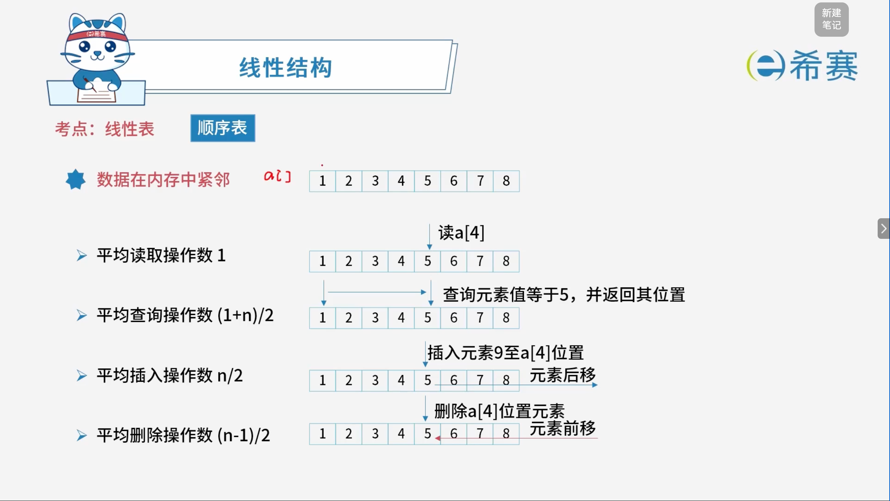
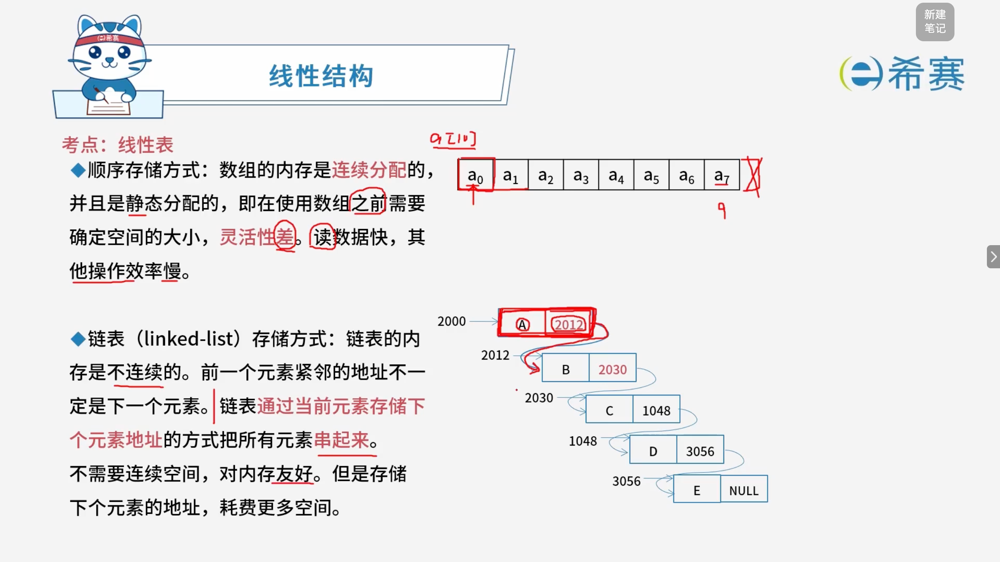
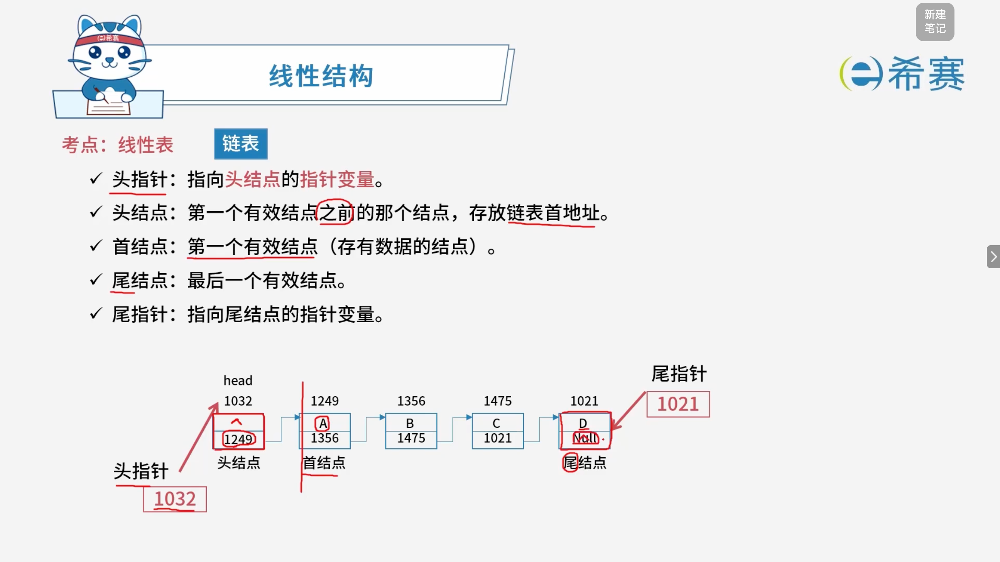
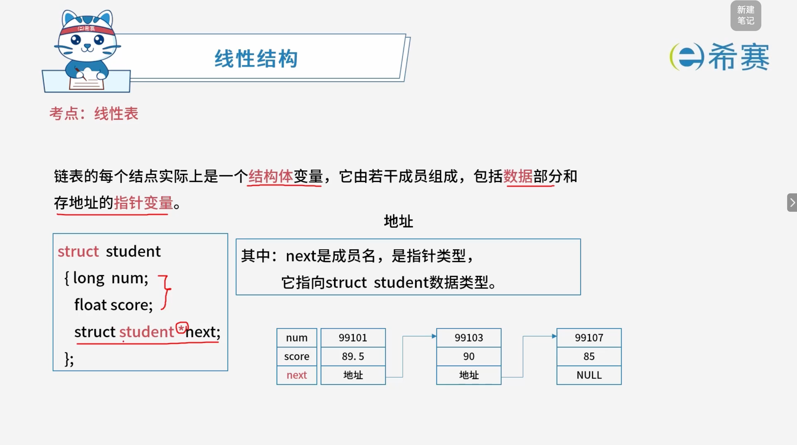
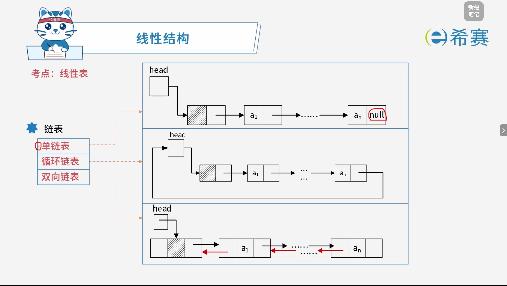
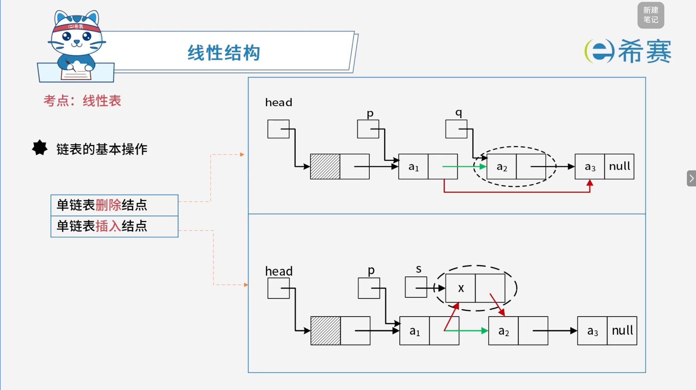
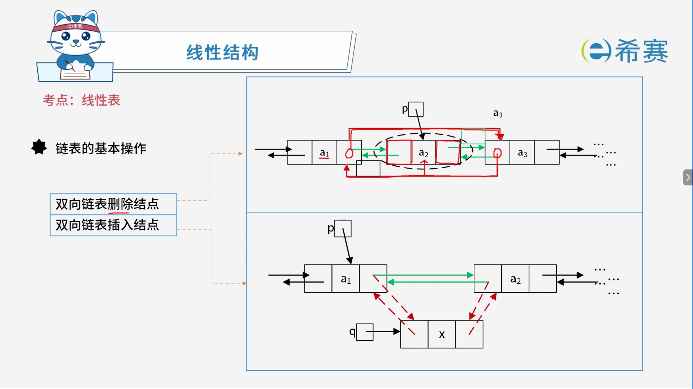

# 线性表

## 1. 考点：顺序表基本操作的平均操作数与时间复杂度分析

## 2. 平均读取操作数（按位查找）

- **操作描述**：读取 $a[i]$，即获取第 $i$ 个位置的元素。
- **计算原理**：因为顺序表在内存中是连续存放的，只要知道第一个元素的内存地址（基地址），加上偏移量就能立刻算出第 $i$ 个元素的地址。即：

  $$
  \text{地址} = \text{基地址} + i \times \text{单个元素大小}
  $$
- **结论**：这是一次简单的数学计算，不需要遍历或移动元素。无论 $i$ 是多少，只需要 $1$ 次操作。所以平均操作数是 $1$，时间复杂度为 $O(1)$，也叫随机存取。

### 2.1 平均查询操作数（按值查找）

- **操作描述**：查询元素值等于 $5$，并返回其位置。这叫按值查找。
- **计算原理**：因为不知道值在哪里，只能从头到尾（或者从尾到头）一个一个比对。

  - 如果要找的值在第 $1$ 个位置，需要比较 $1$ 次。
  - 如果要找的值在第 $2$ 个位置，需要比较 $2$ 次。
  - $$
    \dots
    $$
  - 如果要找的值在第 $n$ 个位置，需要比较 $n$ 次。
- **求平均**：假设查找每个位置的概率是相等的（都是 $\frac{1}{n}$），那么平均比较次数就是比较次数的总和除以 $n$。

  - 总次数 $= 1 + 2 + 3 + \dots + n = \frac{n(n+1)}{2}$ （等差数列求和）
  - 平均次数 $= \frac{\frac{n(n+1)}{2}}{n} = \frac{n+1}{2}$
- **结论**：平均需要比较 $\frac{n+1}{2}$ 次。时间复杂度为 $O(n)$。

### 2.2 平均插入操作数

- **操作描述**：在长度为 $n$ 的顺序表中插入一个新元素。
- **计算原理**：插入元素时，为了保持连续性，插入位置后面的元素都要往后挪一位（元素后移）。

  - 如果插在表尾（第 $n+1$ 个位置），不需要移动任何元素，移动次数为 $0$。
  - 如果插在表头（第 $1$ 个位置），原来 $n$ 个元素全部要后移，移动次数为 $n$。
  - 如果插在第 $i$ 个位置，需要移动 $n - i + 1$ 个元素。
- **求平均**：假设插入到 $n+1$ 个位置（包括表尾）的概率相等，都是 $\frac{1}{n+1}$。

  - 总移动次数 $= 0 + 1 + 2 + \dots + n = \frac{n(n+1)}{2}$
  - 平均移动次数 $= \frac{\frac{n(n+1)}{2}}{n+1} = \frac{n}{2}$
- **结论**：平均需要移动一半的元素，即 $\frac{n}{2}$ 次。时间复杂度为 $O(n)$。

### 2.3 平均删除操作数

- **操作描述**：删除顺序表中某个位置的元素。
- **计算原理**：删除元素后，为了填补空缺，删除位置后面的元素都要往前挪一位（元素前移）。

  - 如果删除表尾（第 $n$ 个位置），不需要移动任何元素，移动次数为 $0$。
  - 如果删除表头（第 $1$ 个位置），剩下的 $n-1$ 个元素全部要前移，移动次数为 $n-1$。
  - 如果删除第 $i$ 个位置，需要移动 $n - i$ 个元素。
- **求平均**：假设删除每个位置的概率相等，都是 $\frac{1}{n}$。

  - 总移动次数 $= 0 + 1 + 2 + \dots + (n-1) = \frac{n(n-1)}{2}$
  - 平均移动次数 $= \frac{\frac{n(n-1)}{2}}{n} = \frac{n-1}{2}$
- **结论**：平均需要移动约一半的元素，即 $\frac{n-1}{2}$ 次。时间复杂度为 $O(n)$。

### 2.4 总结表格

|**操作类型**|**平均操作数 / 移动次数**|**时间复杂度**|**操作本质**|
| --| --| --| ------------------------------|
|**读取操作（按位查找）**|$1$|$O(1)$|内存地址直接计算（随机存取）|
|**查询操作（按值查找）**|$\frac{n+1}{2}$|$O(n)$|从头到尾依次比对|
|**插入操作**|$\frac{n}{2}$|$O(n)$|插入位置之后的元素后移|
|**删除操作**|$\frac{n-1}{2}$|$O(n)$|删除位置之后的元素前移|

## 3. 考点：顺序表的存储方式

### 3.1 **顺序存储 vs 链式存储 核心对比表**

|对比维度|顺序存储（顺序表 / 数组）|链式存储（链表）|
| ----------| ------------------------------------------| -------------------------------------------------|
|**内存分配**|**连续分配**（紧挨着）|**不连续分配**（哪里有空位放哪里）|
|**空间大小**|**静态分配**（使用前需确定大小，容易溢出或浪费）|**动态分配**（随用随取，按需分配，对内存友好）|
|**额外空间开销**|无（只存数据）|**有**（需要额外存储指针/地址，耗费更多空间）|
|**读取（按位置）**|**快**​（O(1)*O*(1)，直接算地址）|**慢**​（O(n)*O*(*n*)，必须从头顺藤摸瓜找）|
|**插入 / 删除**|**慢**​（O(n)*O*(*n*)，需要移动大量元素）|**快**​（O(1)*O*(1)，只需修改指针指向，不用移动数据）|
|**灵活性**|**差**（大小固定，扩容麻烦）|**好**（大小随时可变）|
|**图中示例**|`a[0]`​到​`a[7]`连续存放|A(2000) -\> B(2012) -\> C(2030)...|

## 4. 考点：链表的详细结构

### 4.1 链表的基础概念

|概念名称|定义说明|图中对应实例|
| ----------| ----------------------------------------------------------------------------------------| ----------------------------------------|
|**头指针**|指向**头结点**的指针变量。它是链表的入口。|图中左侧红色箭头标注的​`head`​（值为​`1032`）|
|**头结点**|第一个有效结点**之前**的那个结点，存放链表首地址。通常不存有效数据（或存链表长度等辅助信息）。|地址为​`1032`​的结点（其指针域存​`1249`）|
|**首结点**|第一个**有效**结点（存有数据的结点）。|地址为​`1249`​的结点（数据域为​`A`）|
|**尾结点**|最后一个有效结点。|地址为​`1021`​的结点（数据域为​`D`）|
|**尾指针**|指向**尾结点**的指针变量。|图中右侧红色箭头标注的指针（值为​`1021`）|

### 4.2 常见考点

|序号|图中原文（核心考点）|通俗解释与重点提示|
| ------| ----------------------| -----------------------------------------------------------------------------------|
|**①**|**n个结点离散分布，彼此通过指针相联系。**| **（物理结构）** 结点在内存里是随机的、不连续的。能串起来全靠每个结点里的“指针（next）”。 👉*考点：与顺序表“连续存储”形成鲜明对比。*|
|**②**|**除头结点和尾结点外，每个结点只有一个前驱和一个后继。头结点没有前驱，尾结点没有后继。**| **（逻辑结构）** 这是单链表的基本特性（线性结构）。 👉*考点：头结点的前驱是NULL（它前边没别人），尾结点的后继是NULL（它后边没别人）。*|
|**③**|**头结点并不存放有效数据，只存放链表首地址。其头结点的数据类型和首结点类型一样。**| **（数据域）** 头结点就是个“占位符/哨兵”，它的数据域通常是空的（或存链表长度等辅助信息）。 👉*考点：重要！虽然头结点数据域空着，但它作为一个节点，所占的*​***内存结构***​*必须和后续存数据的首结点一模一样，这样代码才能统一处理。*|
|**④**|**加头结点的目的是方便对链表的操作，比如在链表头部进行结点的删除、插入。**| **（为什么要加头结点？）** 这是最核心的​**设计目的**。 👉*考点：如果没有头结点，在第一个位置（表头）插入或删除时，必须修改头指针*​*​`head`​*​*本身；有了头结点，头指针永远指向头结点，任何位置的插入/删除都在“头结点之后”进行，代码逻辑无需分情况讨论，大大简化。*|

### 4.3 举例

---

### 4.4  **💡 补充记忆小贴士：**

- **物理不连续，逻辑连续。**  （离散分布，指针相连）
- **头结点的“专一”：**  只指路（存首地址），不存数据。
- **头结点的“万能”：**  为了让第一个位置的插删和其他位置一样，不用改头指针，只需改指针域。

## 5. 考点：常见的几种链表方式

### 5.1 链表的基本操作

## 6. 考点：顺序存储对比链式存储

<table>
<colgroup><col /><col /><col /><col /></colgroup><thead><tr>
<th>**性能类别**</th>
<th>**具体项目**</th>
<th>**顺序存储**</th>
<th>**链式存储**</th>
</tr>
</thead><tbody>
<tr>
<td rowspan="2" colspan="1">**空间性能**</td>
<td>存储密度</td>
<td>$=1$，更优</td>
<td>$<1$</td>
</tr>
<tr>
<td>容量分配</td>
<td>事先确定</td>
<td>动态改变，更优</td>
</tr>
<tr>
<td colspan="1" rowspan="4">**时间性能**</td>
<td>读运算</td>
<td>$O(1)$，更优</td>
<td>$O(n)$，最好情况为$1$，最坏情况为$n$</td>
</tr>
<tr>
<td>查找运算</td>
<td>$O(n)$</td>
<td>$O(n)$</td>
</tr>
<tr>
<td>插入运算</td>
<td>$O(n)$，最好情况为$0$，最坏情况为$n$</td>
<td>$O(1)$，更优</td>
</tr>
<tr>
<td>删除运算</td>
<td>$O(n)$</td>
<td>$O(1)$，更优</td>
</tr>
</tbody>
</table>
## 7. 经典例题

### 7.1 题目一

> **题目：** 设有一个包含 $n$ 个元素的有序线性表。在等概率情况下删除其中的一个元素，若采用顺序存储结构，则平均需要移动（ **B** ）个元素；若采用单链表存储结构，则平均需要移动（ **A** ）个元素。
>
> - 第一空选项：
>
>   - A. $1$
>   - B. $\frac{n-1}{2}$
>   - C. $\log n$
>   - D. $n$
> - 第二空选项：
>
>   - A. $0$
>   - B. $1$
>   - C. $\frac{n-1}{2}$
>   - D. $\frac{n}{2}$

解析：

1. **顺序存储结构（顺序表）：**

   - 在顺序表中删除一个元素时，为了保持元素的连续性，被删除位置之后的元素都需要往前挪一位（前移）。
   - 若删除表尾元素（第 $n$ 个位置），移动次数为 $0$；若删除表头元素（第 $1$ 个位置），移动次数为 $n-1$。
   - 假设删除每个位置的概率相等（均为 $\frac{1}{n}$），则平均移动的元素个数为：

     $$
     \frac{0 + 1 + 2 + \dots + (n-1)}{n} = \frac{\frac{n(n-1)}{2}}{n} = \frac{n-1}{2}
     $$

- **链式存储结构（单链表）：**

  - 链表是通过节点中的指针域（​`next` 指针）来链接各元素的，物理存储空间不要求连续。
  - 当删除某个节点时，只需改变其前驱节点的指针指向，使其跳过被删除的节点即可。整个过程​**不需要移动任何数据元素**，只需修改指针。
  - 因此，平均需要移动的元素个数为 $0$。

**正确答案：顺序存储结构： B.**  **$\frac{n-1}{2}$** **、单链表存储结构： A.**  **$0$** **。** 

‍
