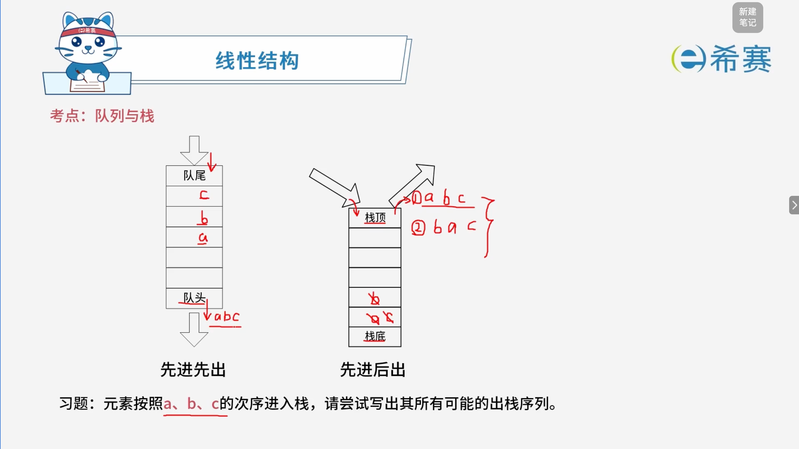
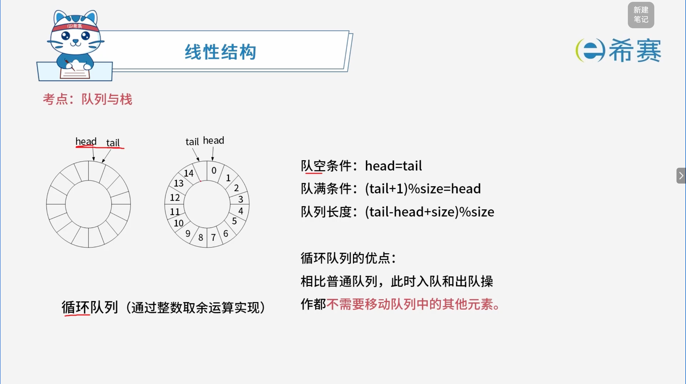

# 队列与栈

## 1. 考点：队列与栈的基本特点

## 2. 考点：循环队列

### 2.1 基本概念

- **循环队列**​：通过数组实现并通过**整数取余运算**来实现首尾相连的环形队列，从而解决普通队列假溢出问题。
- **最大优点**​：相比普通队列，入队和出队操作都​**不需要移动队列中的其他元素**。

### 2.2 核心公式与条件（假设队列总容量为 ​`size`）

- **队空条件**：

  $$
  \text{head} = \text{tail}
  $$
- **队满条件**：

  $$
  (\text{tail} + 1) \% \text{size} = \text{head}
  $$

 *(注：通常会浪费一个存储单元来区分队空和队满)*

- **队列长度计算公式**：

  $$
  (\text{tail} - \text{head} + \text{size}) \% \text{size}
  $$

## 3. 经典例题

### 3.1 题目一

> **题目：** 设有栈 $S$ 和队列 $Q$ 初始状态为空，数据元素序列 $a, b, c, d, e, f$ 依次通过栈 $S$，且多个元素从 $S$ 出栈后立即进入队列 $Q$，若出队的序列是 $b, d, f, e, c, a$，则 $S$ 中的元素最多时，栈底到栈顶的元素依次为（ **C** ）。
>
> - **A.**  $a, b, c$
> - **B.**  $a, c, d$
> - **C.**  $a, c, e, f$
> - **D.**  $a, d, f, e$

**详细解析：**

1. **明确队列的进出规律：**

   - 队列 $Q$ 是先进先出（FIFO）的。既然题目给出的最终出队序列是 $b, d, f, e, c, a$，说明元素进入队列 $Q$ 的顺序必然也是 ​**$b, d, f, e, c, a$**。
   - 因为元素是从栈 $S$ 出栈后**立即**进入队列 $Q$ 的，所以元素从栈 $S$ **出栈的顺序**也必须是：​**$b \rightarrow d \rightarrow f \rightarrow e \rightarrow c \rightarrow a$**。
2. **模拟进栈与出栈过程：**   
   我们要按照上述出栈顺序，配合输入序列 $a, b, c, d, e, f$ 来推导栈 $S$ 的变化状态：

   - **目标 1：先出栈** **$b$**

     - 必须先将 $a$ 入栈，再将 $b$ 入栈。
     - 此时栈 $S$（栈底到栈顶）：$[a, b]$
     - **出栈** **$b$**（进入队列 $Q$）。此时栈 $S$ 剩：$[a]$
   - **目标 2：接着出栈** **$d$**

     - 必须先将 $c$ 入栈，再将 $d$ 入栈。
     - 入栈 $c$ 后，栈 $S$：$[a, c]$
     - 入栈 $d$ 后，栈 $S$：$[a, c, d]$
     - **出栈** **$d$**（进入队列 $Q$）。此时栈 $S$ 剩：$[a, c]$
   - **目标 3：接着出栈** **$f$**

     - 必须先将 $e$ 入栈，再将 $f$ 入栈。
     - 入栈 $e$ 后，栈 $S$：$[a, c, e]$
     - 入栈 $f$ 后，栈 $S$：$[a, c, e, f]$ （​**此时栈中元素最多，共** **$4$** **个**）
     - **出栈** **$f$**（进入队列 $Q$）。此时栈 $S$ 剩：$[a, c, e]$
   - **后续出栈（验证）：**

     - 依次出栈 $e$ $\rightarrow$ 栈 $S$ 剩：$[a, c]$
     - 依次出栈 $c$ $\rightarrow$ 栈 $S$ 剩：$[a]$
     - 依次出栈 $a$ $\rightarrow$ 栈 $S$ 为空。

**正确答案：C.**  **$a, c, e, f$** **。** 

### 3.2 题目二

> **题目：** 双端队列是指在队列的两个端口都可以加入和删除元素，如下图所示。现在要求元素进队列和出队列必须在同一端口，即从 A 端进队的元素必须从 A 端出，从 B 端进队的元素必须从 B 端出。则对于 4 个元素的序列 $a, b, c, d$，若要求前 2 个元素（$a, b$）从 A 端口按次序全部进入队列，后两个元素（$c, d$）从 B 端口按次序全部进入队列，则**不可能得到**的出列序列是（ **A** ）。
>
> - **A.**  $d, a, b, c$
> - **B.**  $d, c, b, a$
> - **C.**  $b, a, d, c$
> - **D.**  $b, d, c, a$

**详细解析：** 

1. **理解题目规则（等效模型）：**

   - 元素 $a, b$ 从 A 端进，也必须从 A 端出 —— 这相当于一个​**独立的栈** **$S_A$**（只能对 $a, b$ 进行进栈和出栈操作）。
   - 元素 $c, d$ 从 B 端进，也必须从 B 端出 —— 这相当于另一个​**独立的栈** **$S_B$**（只能对 $c, d$ 进行进栈和出栈操作）。
   - 因此，整个结构被拆分成了两个互不干涉的独立栈：**栈** **$S_A$**​ **（管理** **$a, b$**​ **）**  和 ​**栈** **$S_B$**​ **（管理** **$c, d$**​ **）** 。
2. **分析两个栈的内部出栈规律：**

   - 对于 ​**栈** **$S_A$**（元素 $a, b$ 依次入栈）：其合法的出栈顺序只能是 ​**$b, a$**。
   - 对于 ​**栈** **$S_B$**（元素 $c, d$ 依次入栈）：其合法的出栈顺序只能是 ​**$d, c$**。
   - **核心约束**​：最终的全局出栈序列，必须是这两个独立子序列交织（归并）的结果，但​**绝对不能破坏各自内部原有的相对先后顺序**（即 $a$ 必须在 $b$ 之后出栈，$c$ 必须在 $d$ 之后出栈）。
3. **逐项验证选项：**

   - **选项 A：**​**$d, a, b, c$**

     - 检查 $a$ 和 $b$ 的相对顺序：在序列中 $a$ 在 $b$ 前面（$a$ 先出栈，$b$ 后出栈），这**违背**了栈 $S_A$ 必须先出 $b$ 再出 $a$ 的原则。因此该序列​**不可能得到**（正确答案）。
   - **选项 B：**​**$d, c, b, a$**

     - $c, d$ 的顺序是 $d$ 在 $c$ 前（符合 $S_B$）；$a, b$ 的顺序是 $b$ 在 $a$ 前（符合 $S_A$）。合法。
   - **选项 C：**​**$b, a, d, c$**

     - $a, b$ 的顺序是 $b$ 在 $a$ 前（符合 $S_A$）；$c, d$ 的顺序是 $d$ 在 $c$ 前（符合 $S_B$）。合法。
   - **选项 D：**​**$b, d, c, a$**

     - $a, b$ 的相对顺序中 $b$ 先出；$c, d$ 的相对顺序中 $d$ 先出。合法。

**正确答案：A.**  **$d, a, b, c$** **。** 

‍
