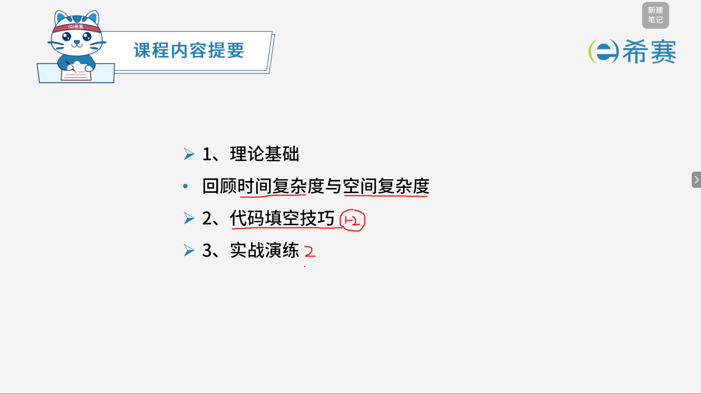

# 数据结构与算法应用

## 1. 知识点分布

## 2. 学习内容摘要

### 2.1 理论基础

#### 2.1.1 时间复杂与空间复杂度

   空间复杂度是指对一个算法在运行过程中临时占用存储空间大小的度量。一个算法的空间复杂度只考虑在运行过程中为局部变量分配的存储空间的大小。

时间复杂度是指程序运行从开始到结束所需要的时间。通常分析时间复杂度的方法是从算法中选取一种对于所研究的问题来说是基本运算的操作，以该操作重复执行的次数作为算法的时间度量。

常见的对算法执行所需时间的度量：$O(1) < O(\log_2 n) < O(n) < O(n\log_2 n) < O(n^2) < O(n^3) < O(2^n)$

## 学习目录

- [代码填空技巧](./代码填空技巧.md)
- [简答题实战演练](./简答题实战演练.md)
