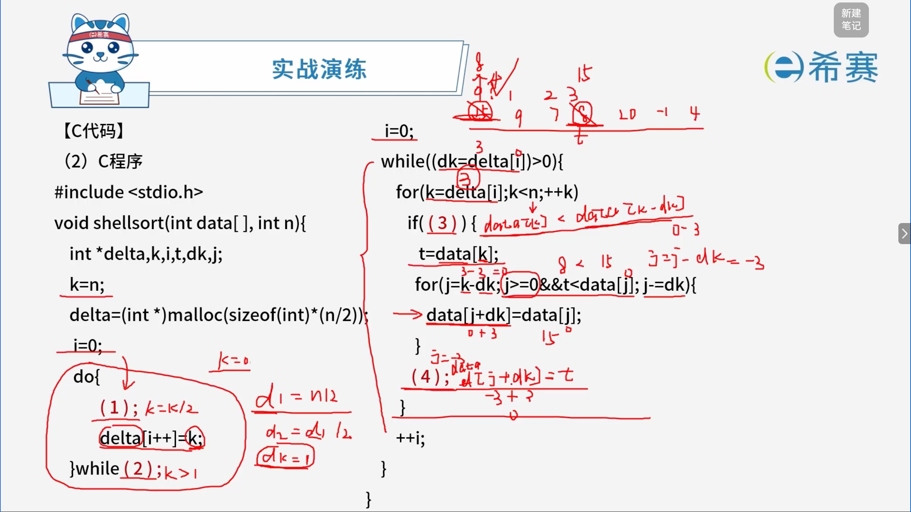

# 简答题实战演练

## 1. 题目一

阅读下列说明和C代码，回答问题1至问题3，将解答写在答题纸的对应栏内。

 **【说明】**

   希尔排序算法又称最小增量排序算法，其基本思想：

- **步骤1**：构造一个步长序列 $\text{delta}_1$、$\text{delta}_2 \dots \text{delta}_k$，其中 $\text{delta}_1 = n/2$，后面的每个 $\text{delta}$ 是前一个的 $1/2$，$\text{delta}_k = 1$。
- **步骤2**：根据步长序列、进行 $k$ 趟排序。
- **步骤3**：对第 $i$ 趟排序，根据对应的步长 $\text{delta}$，将等步长位置元素分组，对同一组内元素在原位置上进行直接插入排序。

 **【C代码】**

下面是算法的C语言实现。

(1) 常量和变量说明

- `data`​：待排序数组 ​`data`，长度为 $n$，待排序数据记录在 ​`data[0]`​、​`data[1]`、$\dots$、​`data[n-1]` 中。
- `n`​：数组 ​`data` 中的元素个数。
- `delta`：步长数组。

(2) C程序

```C
#include <stdio.h>

void shellsort(int data[ ], int n){
    int *delta,k,i,t,dk,j;
    k=n;
    delta=(int *)malloc(sizeof(int)*(n/2));
    i=0;
    do{
        (1);
        delta[i++]=k;
    }while (2);
    
    i=0;
    while((dk=delta[i])>0){
        for(k=delta[i];k<n;++k)
            if((3)){
                t=data[k];
                for(j=k-dk; j>=0&&t<data[j]; j-=dk){
                    data[j+dk]=data[j];
                }
                (4);
            }
            ++i;
    }
}
```



-  **【问题1】（8分）**   
  根据说明和 C 代码，填充 C 代码中的空 (1) \~ (4)。

**答案：（1）：k = k/2（2）：k > 1（3）：data[k] < data[k-dk]（4）：data[j+dk] = t**

-  **【问题2】（4分）**   
  根据说明和 C 代码，该算法的时间复杂度 (5) $O(n^2)$（小于、等于或大于）。该算法是否稳定 (6) （是或否）。

**答案：（5）：小于（6）：否**

-  **【问题3】（3分）**   
  对数组 $(15\text{、}9\text{、}7\text{、}8\text{、}20\text{、}-1\text{、}4)$ 用希尔排序方法进行排序，经过第一趟排序后得到的数组为 (7)。

**答案：（7）：（4、9、-1、8、20、7、15）** 

## 2. 题目二

阅读下列说明和 C 代码，回答问题 1 至问题 3，将解答写在答题纸的对应栏内。

 **【说明】**

   $n$-皇后问题是在 $n$ 行 $n$ 列的棋盘上放置 $n$ 个皇后，使得皇后彼此之间不受攻击，其规则是任意两个皇后不在同一行、同一列和相同的对角线上。

拟采用以下思路解决 $n$-皇后问题：第 $i$ 个皇后放在第 $i$ 行。从第一个皇后开始，对每个皇后，从其对应行（第 $i$ 个皇后对应第 $i$ 行）的第一列开始尝试放置，若可以放置，确定该位置，考虑下一个皇后；若与之前的皇后冲突，则考虑下一列；若超出最后一列，则重新确定上一个ơ皇后的位置。重复该过程，直到找到所有的放置方案。

【C 代码】

下面是算法的 C 语言实现。

(1) 常量和变量说明

- `pos`​：一维数组，​`pos[i]` 表示第 $i$ 个皇后放置在第 $i$ 行的具体位置（列）。
- `count`：统计放置方案数。
- `i, j, k`：变量。
- `N`：皇后数。

(2) C 程序

```C
#include <stdio.h>
#include <math.h>
#define N 4

/* 判断第k个皇后目前放置位置是否与前面的皇后冲突 */
int isplace(int pos[], int k) {
    int i;
    for(i=1; i<k; i++) {
        if( (1) || fabs(i-k) == fabs(pos[i] - pos[k])) {
            return 0;
        }
    }
    return 1;
}


int main() {
    int i,j,count=1;
    int pos[N+1];
    //初始化位置
    for(i=1; i<=N; i++) {
        pos[i]=0;
    }
    (2) ;
    while(j>=1) {
        pos[j]=pos[j]+1;
        /*尝试摆放第j个皇后*/
        while(pos[j]<=N&& (3) ){
            pos[j]=pos[j]+1; 
        }
        /*得到一个摆放方案*/
        if(pos[j]<=N&&j== N) {
            printf("方案%d: ",count++);
            for(i=1; i<=N; i++){
                printf("%d ",pos[i]);
            }
            printf("\n");
        } /*考虑下一个皇后*/
        if(pos[j]<=N&& (4) ){
            j=j+1;
        } else{/*返回考虑上一个皇后*/
            pos[j]=0;
            (5) ;
        } 
    }
    return 1; 
}
```

【问题1】（10分）

- 根据以上说明和 C 代码，填充 C 代码中的空 (1) ~ (5)。

**答案：（1）：pos[i] == pos[k]（2）：j=1（3）：!isplace(pos, j)（4）：j < N（5）：j = j-1**

【问题2】（2分）

- 根据以上说明和 C 代码，算法采用了 (6) 设计策略。

**答案：（6）：回溯法**

【问题3】（3分）

- 上述 C 代码的输出为：(7)。

**答案：（7）：** 

**方案1: 2 4 1 3**

**方案2: 3 1 4 2**

‍
