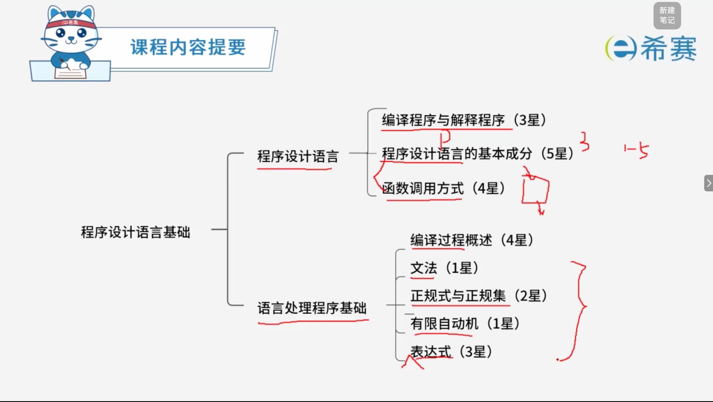
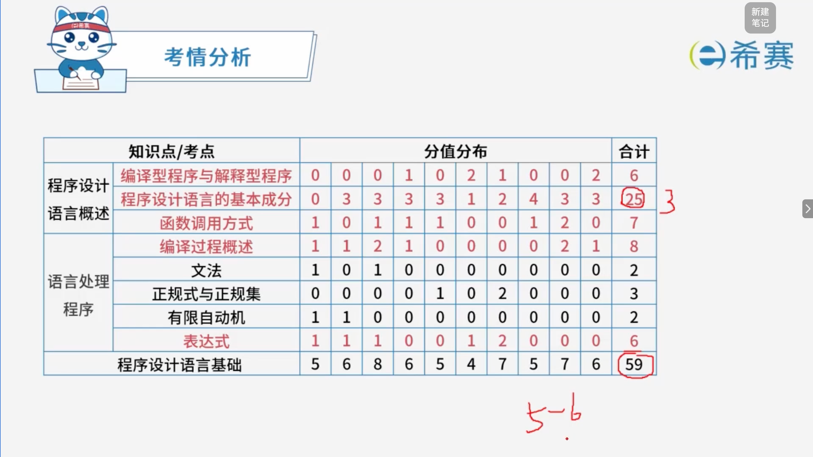

# 程序设计语言

## 1. 知识点分布

## 2. 历年考试分布

## 学习目录

- [编译程序与解释程序](./编译程序与解释程序.md)
- [常见程序设计语言的特点](./常见程序设计语言的特点.md)
- [程序设计语言的基本成分](./程序设计语言的基本成分.md)
- [函数调用](./函数调用.md)
- [编译过程概述](./编译过程概述.md)
- [文法](./文法.md)
- [正规式与正规集](./正规式与正规集.md)
- [有限自动机](./有限自动机.md)
- [后缀表达式](./后缀表达式.md)
