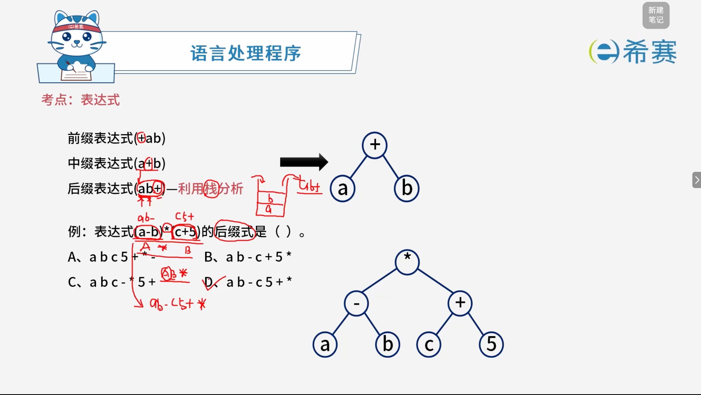

# 后缀表达式

## 1. 考点：转化规则

## 2. 经典例题

### 2.1 题目一

> **题目：**
>
> 表达式采用逆波兰式表示时，利用（ ）进行求值。
>
> **选项：**
>
> A、栈
>
> B、队列
>
> C、符号表
>
> D、散列表

**解析：**

逆波兰式（后缀表达式）求值时，从左到右扫描表达式：

1. 遇到操作数就压入栈中；
2. 遇到运算符就从栈顶弹出两个操作数进行计算，再将结果压回栈中；
3. 扫描结束后，栈中剩下的唯一元素即为最终结果。

因此利用的是**栈**（先进后出）的特性，选 A。

**正确答案：A。**
