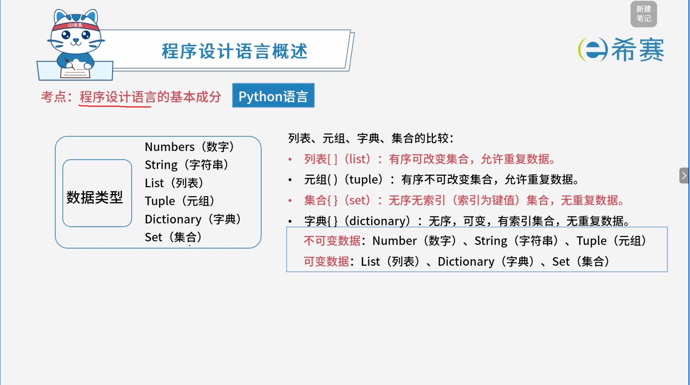
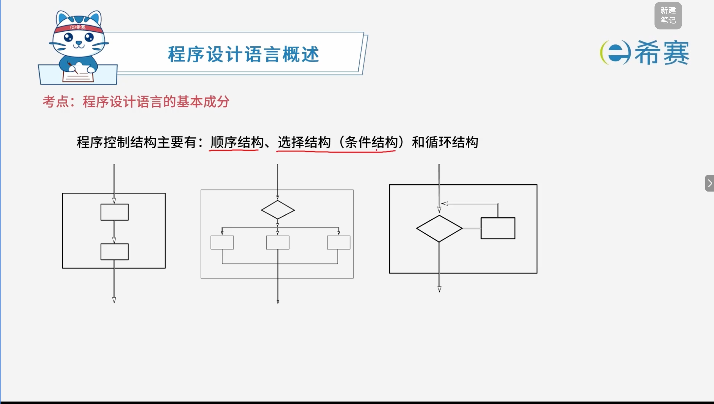

# 程序设计语言的基本成分

## 1. 考点：Python语言的数据类型

## 2. 考点：Python语言的运算

**运算（运算符分类）**

- **算术运算符**

  - `+`​（加）、​`-`​（减）、​`*`​（乘）、​`/`（除）
  - `//`​（整除）、​`%`​（取余/模）、​`**`（幂运算）
- **关系（比较）运算符**

  - `>`​（大于）、​`<`​（小于）、​`==`（等于）
  - `>=`​（大于等于）、​`<=`​（小于等于）、​`!=`（不等于）
- **逻辑运算符**

  - `and`​（与）、​`or`​（或）、​`not`（非）
- **赋值运算符**

  - `=`（赋值）
  - `+=`​、​`-=`​、​`*=`​、​`/=`​、​`//=`​、​`%=`​、​`**=`（复合赋值）
- **位运算符**

  - `&`​（按位与）、​`|`​（按位或）、​`^`​（按位异或）、​`~`（按位取反）
  - `<<`​（左移）、​`>>`（右移）
- **成员运算符**

  - `in`​（在其中）、​`not in`（不在其中）
- **身份运算符**

  - `is`​、​`not is`（比较对象的内存地址是否相同）
- **集合运算符**

  - 交集：​`&`
  - 并集：​`|`
  - 对称差集（异或）：​`^`
  - 差集：​`-`
- **列表/序列运算符**

  - `+`：相当于拼接列表
  - `*`：相当于倍数、重复
  - `in`​ / ​`not in`：成员判断
  - `is`​ / ​`not is`：身份判断（内存地址）

‍

## 3. 考点：程序控制结构

## 4. 经典例题

### 4.1 题目一

> **题目：** 通用高级程序设计语言中，结构化程序设计的三个基本控制结构分别是顺序结构、（ **A** ）和循环结构。
>
> A、选择
>
> B、递归
>
> C、推
>
> D、函数

**解析：**

- 结构化程序设计的三种基本控制结构是：​**顺序结构**​、​**选择结构**​（又称分支结构）和​**循环结构**。这三种基本结构足以表达出各种复杂的算法。
- 选项 B（递归）、C（递推）、D（函数）不属于结构化程序设计的“三大基本控制结构”。

**正确答案：A。** 

### 4.2 题目三

> **题目：** 在Python语言中，（ **C** ）是一种可变的、有序的序列结构，其中元素可以重复。
>
> A、元组(tuple)
>
> B、字符串(str)
>
> C、列表(list)
>
> D、集合(set)

**解析：**

- **列表 (list)** ​：是一种**可变**的、**有序**的序列结构，且支持元素​**重复**。
- **元组 (tuple)** ​：是有序的、元素可重复的，但它是**不可变**的数据类型。
- **字符串 (str)** ​：是有序的、元素可重复的字符序列，但它是**不可变**的数据类型。
- **集合 (set)** ​：是可变的，但它是**无序**的，且其中的元素是**不可重复**的（具有唯一性）。

**正确答案：C。** 

‍
