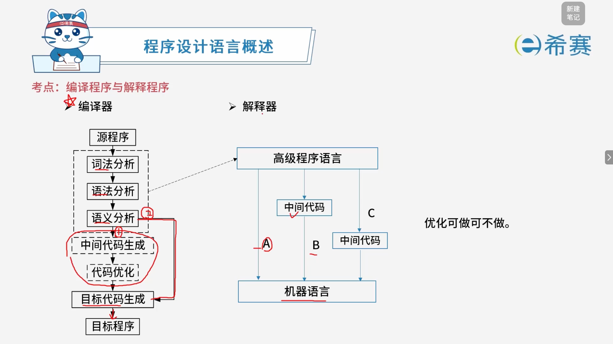

# 编译程序与解释程序

## 1. 考点：编译程序与解释程序对比

### 1.1 共同点

- 高级程序语言
- 包含词法分析、语法分析、语义分析过程

### 1.2 不同点

|比较维度|编译型语言 (如 C)|解释型语言 (如 Python)|
| :---------| :---------------------| :-----------------------|
|**翻译程序**|编译器|解释器|
|**是否生成目标代码**|生成目标代码|不生成目标代码|
|**目标程序执行**|目标程序直接执行|边解释边执行|
|**翻译程序参与**|编译器不参与执行|解释器参与执行|
|**执行效率**|执行效率高|执行效率低|
|**灵活性与可移植性**|灵活性差，可移植性差|灵活性好，可移植性强|

### 1.3 总结

- **编译：**  得到目标代码，直接执行。
- **解释：**  得到中间代码，边解释边执行。

## 2. 考点：执行过程

## 3. 经典例题

### 3.1 题目一

> **题目：** 编译器与解释器是程序语言翻译的两种基本形态，以下关于**编译器**工作方式及特点的叙述中，正确的是（ **D** ）。
>
> A、边翻译边执行，用户程序运行效率低且可移植性差  
> B、先翻译后执行，用户程序运行效率高且可移植性好  
> C、边翻译边执行，用户程序运行效率低但可移植性好  
> D、先翻译后执行，用户程序运行效率高但可移植性差

**解析：**

1. **工作方式：**  编译器采用的是 **“先翻译后执行”** 的方式（即生成目标代码后直接执行），而解释器才是“边解释边执行”。因此排除 A 和 C。
2. **运行效率与可移植性：**  编译型语言由于生成了独立的目标代码，**执行效率高**；但由于目标代码通常与特定硬件或操作系统平台绑定，其**灵活性差、可移植性较差**（对比之下，解释型语言由于依赖解释器，可移植性更强）。因此正确选项为 D。

**正确答案： D。** 

‍
